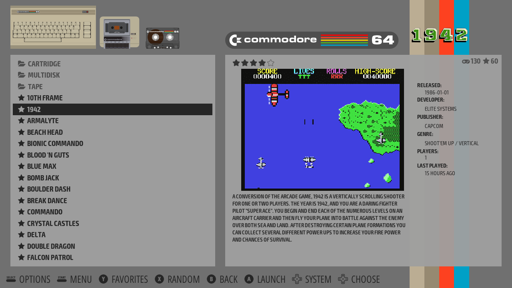
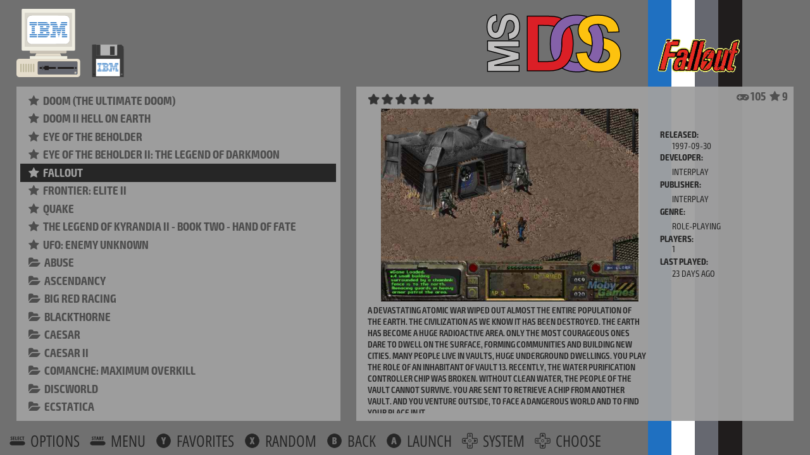
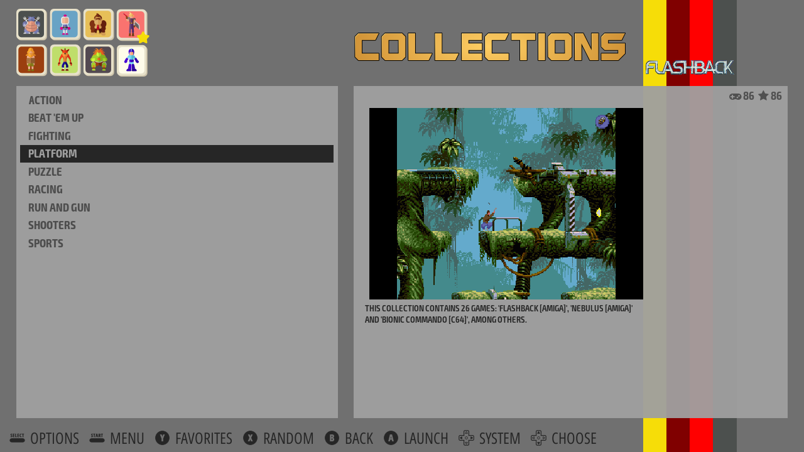
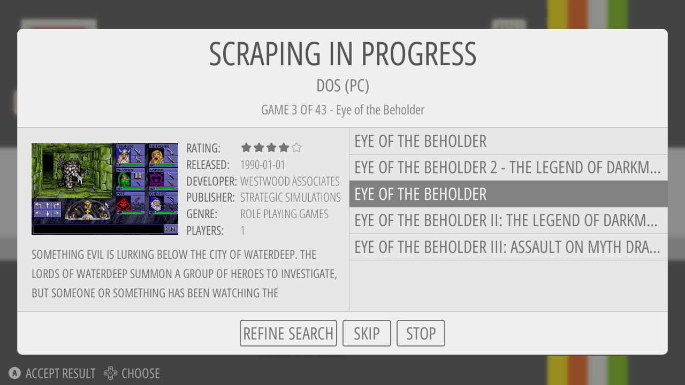
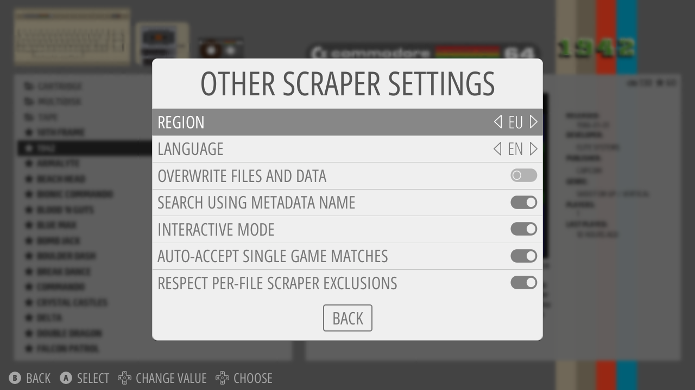
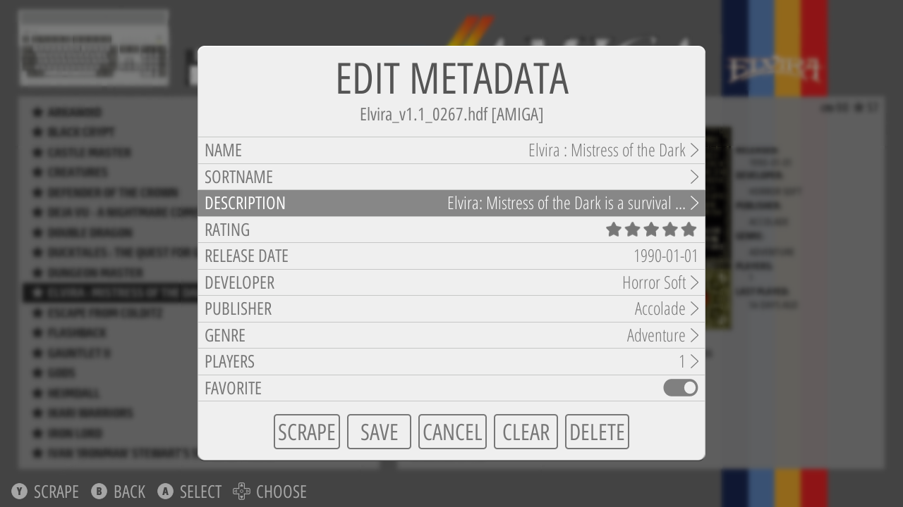
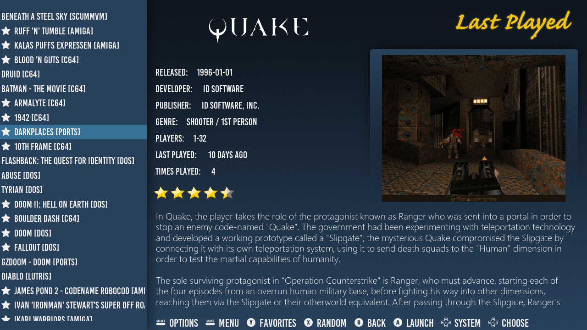
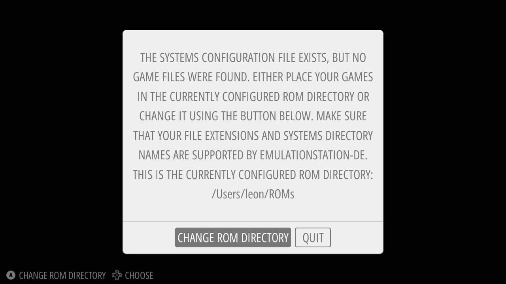

EmulationStation Desktop Edition (ES-DE)
========================================

EmulationStation Desktop Edition is a cross-platform graphical front-end for emulators with controller and keyboard navigation.

As the name implies, this software is intended to be used on desktop computers. There is no support planned for Android or iOS or for any other closed software ecosystems.

Although there are multiple forks of EmulationStation in existence, the goal of this edition is to make the software as easy as possible to install and use as a standalone application, and to suppport the major desktop operating systems, i.e. Unix/Linux, macOS and Windows. Since it's intended to be used as a desktop application rather than as the primary interface for the computer, there are no plans to provide system administration utilities or control of emulator settings from within ES-DE.

The current version 1.0 has been tested on the following operating systems (all for the x86 architecture):

* Ubuntu 20.04
* Ubuntu 20.10 *
* Linux Mint 20
* Manjaro
* Fedora 33 Workstation
* FreeBSD 12.2
* NetBSD 9.1
* OpenBSD 6.8 (limited testing only)
* macOS 11 "Big Sur" (limited testing only)
* macOS 10.15 "Catalina" (limited testing only)
* macOS 10.11 "El Capitan"
* Windows 10
* Windows 8.1

***)** For Ubuntu 20.10, the included VLC version 3.0.11.1-2 is broken so ES-DE will crash when attempting to play videos. This can be fixed by manually replacing the file /lib/x86_64-linux-gnu/libvlccore.so.9.0.0 with the corresponding file from version 3.0.9.2-1 from Ubuntu 20.04. Make sure that the /lib/x86_64-linux-gnu/libvlccore.so.9 symlink points to this file as well. Hopefully this issue will soon be patched so that this manual workaround is not required.

At the moment Raspberry Pi is not supported, but this is planned for future releases. It may still be possible to compile and run ES-DE on this device, but as of v1.0 it's not actively used during development and therefore not tested.

FreeBSD, NetBSD and OpenBSD are only partially supported. Although the application should work correctly on these operating systems, there is no plan to distribute installation packages as it wouldn't make much sense. The goal is rather to have ES-DE added to the ports/package collections of these systems.

The software comes preconfigured for use primarily with [RetroArch](https://www.retroarch.com), although this can be changed as all emulator settings are fully configurable, even on a per-game basis.

A comprehensive theme set, **rbsimple-DE** (which is based on Recalbox Multi from the [Recalbox](https://www.recalbox.com) community) is bundled with the application.

Check out the [User Guide](USERGUIDE.md) for how to quickly get the application up and running. (It will also show how to use some of its more advanced features.)

### Contributing:

If you would like to contribute to the development of ES-DE, then that's great! Please read how to participate [here](CONTRIBUTING.md). (You can also read about planned future features there).

Other information
=================

[NEWS.md](NEWS.md) contains information about the current release as well as previous releases. This covers the features, improvements and bug fixes.

[INSTALL.md](INSTALL.md) provides details on how to build the application from source code, and also discusses some more advanced configuration topics.

[CREDITS.md](CREDITS.md) is an attempt to credit the individuals and projects which made this application possible.

[THEMES.md](THEMES.md) is a guide on how theming works which is useful for those who would like to develop a new theme, or perhaps customize an existing theme.

Some feature highlights
=======================

Here are some highlights of what EmulationStation Desktop Edition provides, displayed using the default theme set rbsimple-DE. There are of course many more features available, please refer to the [User Guide](USERGUIDE.md) for a comprehensive overview of all options and functionality.

_The 'System view', which is the default starting point for the application, it's here that you browse through your game systems._

_The 'Gamelist view', it's here that you browse the games for a specific system. Note the support for mixing files and folders, and as well that favorite games are marked with stars. There is a game counter to the upper right, displaying the total number of games and the number of favorite games for this system._

_Another example of the gamelist view, displaying advanced folder support. You can scrape folders for game info and game media, sort folders as you would files, mark them as favorites etc. In this example ES-DE has been configured to sort favorite games above non-favorites._

_Games can be grouped into your own custom collections, in this example they're defined as game genres but you can name them anything you like. All gamelist views including the custom collections support both game images or game videos. By default the rbsimple-DE theme will display the game image for a short moment before starting to play the game video._

_This is a view of the built-in scraper which downloads game info and game media from either [screenscraper.fr](https://screenscraper.fr) or [thegamesdb.net](https://thegamesdb.net). It's possible to scrape a single game, or to run the multi-scraper which can scrape a complete game system or even your entire collection._

_There are many settings for the scraper including options to define which type of info and media to download. The above screenshot shows only a portion of all these settings._

_In addition to the scraper there is a fully-featured metadata editor that can be used to modify information on a per-game basis. Here you can also toggle some additional flags which the scraper does not set, such as if the game is a favorite, or if you have completed it. Some of these flags can then be filtered in the gamelist view, letting you for instance only list games that you have not played through._

_There are four types of built-in screensavers available, including a slideshow and the video screensaver showed in action above. These screensavers start after a configurable number of minutes of inactivity, and randomly display game media that you have previously scraped. If the corresponding option has been enabled, you can jump to the game from the screensaver, or even start it directly. There is shader support in ES-DE to render scanlines and screen blur on top of the videos (for the slideshow, scanline rendering is provided)._

_ES-DE is fully themeable, so if you prefer another look than what the default theme rbsimple-DE gives you, it's possible to apply another theme set. In the example above a modified version of the [Fundamental](https://github.com/G-rila/es-theme-fundamental) theme is used. Be aware though that although ES-DE is backwards compatible with older EmulationStation themes, some newer features which are specific to ES-DE will not work, at least not until the theme authors update their themes._

_A lot of effort has been spent on trying to make ES-DE easy to setup and use. The above screenshot shows the dialog if starting the application without any game files present in the default ROM directory. Also, ES-DE ships with a very comprehensive game systems configuration file that is automatically installed upon first startup. Note though that the emulator setup is outside the scope of what ES-DE does, and as RetroArch is mostly used, please refer to their [web site](https://www.retroarch.com) for more information about that part of the configuration._