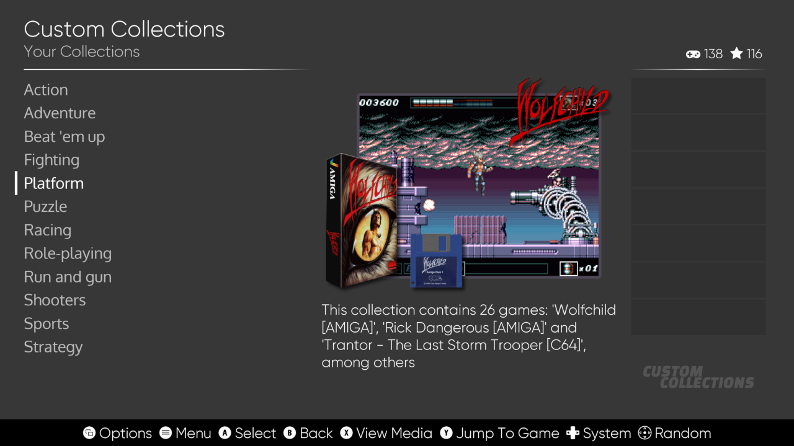
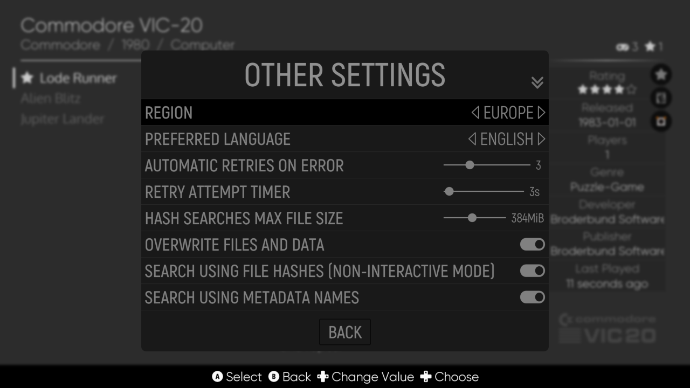

# ES-DE Frontend

ES-DE (EmulationStation Desktop Edition) is a frontend for browsing and launching games from your multi-platform collection.

It's officially supported on Linux, macOS, Windows and Android but can also be used on Haiku and the Raspberry Pi if you build it yourself from source code. There is also an ES-DE package in the FreeBSD ports collection.

Website:\
https://es-de.org

Patreon:\
https://www.patreon.com/es_de

YouTube:\
https://www.youtube.com/@ES-DE_Frontend

Discord:\
https://discord.gg/42jqqNcHf9

The goal of this project is to make a high quality frontend that is easy to use, requires minimal setup and configuration, looks nice, and is available across a wide range of operating systems.

It comes preconfigured for use with a large selection of emulators, game engines, game managers and gaming services. It can also run locally installed games and applications. It's fully customizable, so you can easily expand it with support for additional systems and applications.

You can find the complete list of supported game systems in the [User guide](USERGUIDE.md#supported-game-systems).

There are many high-quality themes that can be installed using the built-in theme downloader. You can also find the web version of the themes list here: \
https://gitlab.com/es-de/themes/themes-list

## Download

Visit https://es-de.org to download the latest ES-DE release or go to the [package registry](https://gitlab.com/es-de/emulationstation-de/-/packages) where you can also find a number of previous releases.

The Android port of ES-DE is a paid app, which you can get on [Patreon](https://www.patreon.com/es_de), the [Samsung Galaxy Store](https://galaxystore.samsung.com/detail/org.es_de.frontend.galaxy) and [Huawei AppGallery](https://appgallery.huawei.com/#/app/C111315115).

If you're using a Raspberry Pi or if you run Haiku, then you need to compile from source code as no prebuilt packages are provided for these platforms. A detailed build guide is available in [INSTALL.md](INSTALL.md).

If your run FreeBSD then ES-DE is available as an [official port](https://www.freshports.org/emulators/es-de).

## Additional information

[FAQ.md](FAQ.md) -  Frequently Asked Questions

[USERGUIDE.md](USERGUIDE.md) / [USERGUIDE-DEV.md](USERGUIDE-DEV.md) - Comprehensive guide and reference for all application settings

[INSTALL.md](INSTALL.md) / [INSTALL-DEV.md](INSTALL-DEV.md) - Building from source code and advanced configuration topics

[THEMES.md](THEMES.md) / [THEMES-DEV.md](THEMES-DEV.md) - Guide and reference for theme development

[CHANGELOG.md](CHANGELOG.md) - Detailed list of changes for all past releases and the in-development version

[ROADMAP.md](ROADMAP.md) - List of major features planned to be added in the future

[CREDITS.md](CREDITS.md) - An attempt to credit the individuals and projects which made ES-DE possible

## Some feature highlights

Here are some highlights, displayed using the default Linear theme.

_The **System view**, which is the default starting point for the application, it's here that you browse through your game systems._

_The **Gamelist view**, it's here that you browse the actual games per system._

_Another example of the gamelist view, displaying advanced folder support. You can scrape folders for game info and game media, sort folders as you would files, mark them as favorites etc._

_Games can be grouped into your own custom collections, in this example they're defined as genres._

_This is a view of the built-in scraper which downloads game info and game media from either [screenscraper.fr](https://screenscraper.fr) or [thegamesdb.net](https://thegamesdb.net). It's possible to scrape a single game, or to run the multi-scraper which can scrape a complete game system or even your entire collection._

_There are many settings for the scraper including options to define which type of info and media to download. The above screenshot shows only a portion of these settings._

_In addition to the scraper there is a fully-featured metadata editor that can be used to modify information on a per-game basis._

_There are four built-in screensavers, including a slideshow and a video screensaver that display random games from your collection._

_ES-DE is fully themeable, in case you prefer another look than what the default theme Linear offers. The screenshot above shows the Slate theme that is also bundled with the application._
