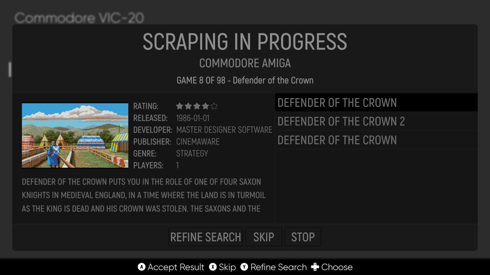

# EmulationStation Desktop Edition (ES-DE)

EmulationStation Desktop Edition is a frontend for browsing and launching games from your multi-platform game collection.

Web site:\
[https://es-de.org](https://es-de.org)

YouTube channel with installation instruction videos:\
[https://www.youtube.com/channel/UCosLuC9yIMQPKFBJXgDpvVQ](https://www.youtube.com/channel/UCosLuC9yIMQPKFBJXgDpvVQ)

Discord server:\
[https://discord.gg/EVVX4DqWAP](https://discord.gg/EVVX4DqWAP)

Reddit (r/EmulationStation_DE):\
[https://www.reddit.com/r/EmulationStation_DE](https://www.reddit.com/r/EmulationStation_DE)

Although there are multiple forks of EmulationStation in existence, the goal of this edition is to make the software as easy as possible to install and use as a standalone application, and to support the major desktop operating systems, i.e. Windows, macOS and Unix/Linux. Since it's intended to be used as a desktop application rather than as the primary interface for the computer, there are no plans to provide system administration utilities or control over emulator settings from within ES-DE.

The software comes preconfigured for use primarily with [RetroArch](https://www.retroarch.com), although this can be changed as all emulator settings are fully configurable, even on a per-game basis.

Two comprehensive theme sets, **slate-DE** (rbsimple-DE in the 1.x releases) and **modern-DE** are bundled with the application.

The following operating systems have been tested (all for the x86 architecture unless otherwise stated):

* Windows 11, 10 and 8.1
* macOS 10.14 "Mojave" to 12 "Monterey" (M1 and Intel)
* macOS 10.11 "El Capitan" (legacy release)
* Ubuntu 20.04 to 22.04
* Linux Mint 20
* Manjaro 21
* Fedora 36 Workstation
* SteamOS 3.0
* elementary OS 6
* Raspberry Pi OS 10 and 11 (armv7l and aarch64)
* FreeBSD 13.0
* NetBSD 9.1
* OpenBSD 6.8

### Download

The latest version is 1.2.5 (released 2022-06-22)

| Package              | Operating systems                                       | Architecture | Download link  |
| :------------------- | :------------------------------------------------------ | :----------- | :------------- |
| Windows installer    | Windows 11, 10 and 8.1                                  | x64 (x86)    | [EmulationStation-DE-1.2.5-x64.exe](https://gitlab.com/es-de/emulationstation-de/-/package_files/43629076/download)|
| Windows portable     | Windows 11, 10 and 8.1                                  | x64 (x86)    | [EmulationStation-DE-1.2.5-x64_Portable.zip](https://gitlab.com/es-de/emulationstation-de/-/package_files/43629152/download)|
| macOS DMG installer  | macOS 10.14 "Mojave" to 12 "Monterey"                   | x64 (x86)    | [EmulationStation-DE-1.2.5-x64.dmg](https://gitlab.com/es-de/emulationstation-de/-/package_files/43628986/download)|
| macOS DMG installer  | macOS 11 "Big Sur" to 12 "Monterey"                     | arm64 (M1)   | [EmulationStation-DE-1.2.5-arm64.dmg](https://gitlab.com/es-de/emulationstation-de/-/package_files/43628796/download)|
| Debian DEB package   | Ubuntu 20.04 to 22.04, Linux Mint 20, possibly others   | x64 (x86)    | [emulationstation-de-1.2.5-x64.deb](https://gitlab.com/es-de/emulationstation-de/-/package_files/43628864/download)|
| Fedora RPM package   | Fedora Workstation 36, possibly others                  | x64 (x86)    | [emulationstation-de-1.2.5-x64.rpm](https://gitlab.com/es-de/emulationstation-de/-/package_files/43629241/download)|
| Arch User Repository | Arch Linux, Manjaro, possibly others                    | x64 (x86)    | [https://aur.archlinux.org/packages/emulationstation-de](https://aur.archlinux.org/packages/emulationstation-de)|
| Linux AppImage       | Most Linux distributions                                | x64 (x86)    | [EmulationStation-DE-x64.AppImage](https://gitlab.com/es-de/emulationstation-de/-/package_files/43629326/download)|
| Linux AppImage       | Current Linux distributions with libc 2.35 or later     | x64 (x86)    | [EmulationStation-DE-x64_Current.AppImage](https://gitlab.com/es-de/emulationstation-de/-/package_files/43629473/download)|
| Linux AppImage       | Steam Deck / SteamOS 3.0 specific                       | x64 (x86)    | [EmulationStation-DE-x64_SteamDeck.AppImage](https://gitlab.com/es-de/emulationstation-de/-/package_files/43629521/download)|
| Debian DEB package   | Raspberry Pi OS (Raspian)                               | ARM 32-bit   | [emulationstation-de-1.2.5-armv7l.deb](https://gitlab.com/es-de/emulationstation-de/-/package_files/43628838/download)|
| Debian DEB package   | Raspberry Pi OS (Raspian)                               | ARM 64-bit   | [emulationstation-de-1.2.5-aarch64.deb](https://gitlab.com/es-de/emulationstation-de/-/package_files/43628725/download)|

Version 1.2.0 (released 2021-12-28) will be the last legacy release for macOS

| Package              | Operating systems                                       | Architecture | Download link  |
| :------------------- | :------------------------------------------------------ | :----------- | :------------- |
| macOS DMG installer  | Legacy macOS 10.11 "El Capitan" to 10.13 "High Sierra"  | x64 (x86)    | [EmulationStation-DE-1.2.0-x64_legacy.dmg](https://gitlab.com/es-de/emulationstation-de/-/package_files/25023954/download)|

All previous releases can be downloaded from [here](https://gitlab.com/es-de/emulationstation-de/-/packages).

The _current_ version of the Linux AppImage ships with newer libraries and better controller support but requires distributions with libc 2.34 or later to work.

If using FreeBSD, NetBSD or OpenBSD you will need to build ES-DE from source code for the time being, as explained in [INSTALL.md](INSTALL.md).

Please refer to [CHANGELOG.md](CHANGELOG.md) for more information about the releases, including known issues.

### Contributing

If you would like to contribute to the development of ES-DE, then that's great! Please read how to participate [here](CONTRIBUTING.md) where you can also read about planned future releases and features.

# Additional information

[FAQ.md](FAQ.md) covers a number of Frequently Asked Questions and is recommended reading before diving into the other documents listed below.

[USERGUIDE.md](USERGUIDE.md) is a comprehensive guide on how to use ES-DE and it also contains a complete reference to all application settings.

[CHANGELOG.md](CHANGELOG.md) contains information about the current release as well as previous releases. This covers the features, improvements, bug fixes and known issues.

[INSTALL.md](INSTALL.md) provides details on how to build the application from source code, and also discusses some more advanced configuration topics.

[CREDITS.md](CREDITS.md) is an attempt to credit the individuals and projects which made ES-DE possible.

[THEMES.md](THEMES.md) is a guide on how theming works which is useful for those who would like to develop a new theme, or perhaps customize an existing theme.

# Some feature highlights

Here are some highlights of what ES-DE provides, displayed using the default theme set slate-DE. There are of course many more features available, as covered in the  [User guide](USERGUIDE.md).

_The **System view**, which is the default starting point for the application, it's here that you browse through your game systems._

_The **Gamelist view**, it's here that you browse the actual games per system. Note the support for mixing files and folders, and as well that a few badges are displayed indicating that the selected game is a favorite, that it's suitable for children and that it's controlled using a joystick. There is a game counter to the upper right as well, displaying the total number of games and the number of favorite games for this system._

_Another example of the gamelist view, displaying advanced folder support. You can scrape folders for game info and game media, sort folders as you would files, mark them as favorites etc. In this example ES-DE has been configured to sort favorite games above non-favorites._

_Games can be grouped into your own custom collections, in this example they're defined as game genres but you can name them anything you like. All gamelist views including the custom collections support both game images or game videos. By default the slate-DE theme will display the game image for a short moment before starting to play the video._

_This is a view of the built-in scraper which downloads game info and game media from either [screenscraper.fr](https://screenscraper.fr) or [thegamesdb.net](https://thegamesdb.net). It's possible to scrape a single game, or to run the multi-scraper which can scrape a complete game system or even your entire collection._

_There are many settings for the scraper including options to define which type of info and media to download. The above screenshot shows only a portion of these settings._

_In addition to the scraper there is a fully-featured metadata editor that can be used to modify information on a per-game basis. Here you can also toggle some additional flags which the scraper does not set, such as if the game is a favorite or if you have completed it. Most of these flags can also be filtered in the gamelist view, letting you for instance only display games that you have not played through._

_There are four types of built-in screensavers available, including a slideshow and the video screensaver shown in action above. These screensavers start after a configurable number of minutes of inactivity, and randomly display game media that you have previously scraped. If the corresponding option has been enabled, you can jump to the game from the screensaver, or even launch it directly. There is shader support in ES-DE to render scanlines and screen blur on top of the videos (for the slideshow screensaver, scanline rendering is provided)._

_ES-DE is fully themeable, so if you prefer another look than what the default theme slate-DE offers, it's possible to apply another theme set. The image above is of the modern-DE theme that is also bundled with the application. Note that although ES-DE is backward compatible with older RetroPie EmulationStation themes, some newer features which are specific to ES-DE will not work, at least not until the theme authors update their themes._

_A lot of effort has been spent on making ES-DE easy to setup and use. The above screenshot shows the dialog if starting the application without any game files present in the default ROM directory. ES-DE also ships with a comprehensive game systems configuration file, so unless you really want to customize your setup, you should not need to tinker with the configuration._