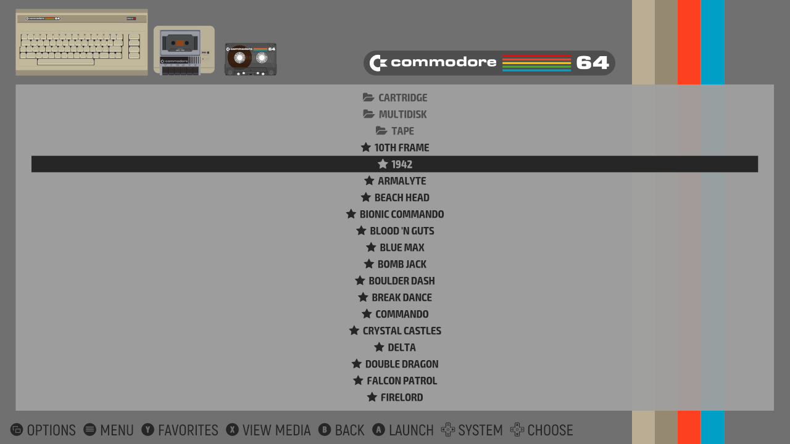
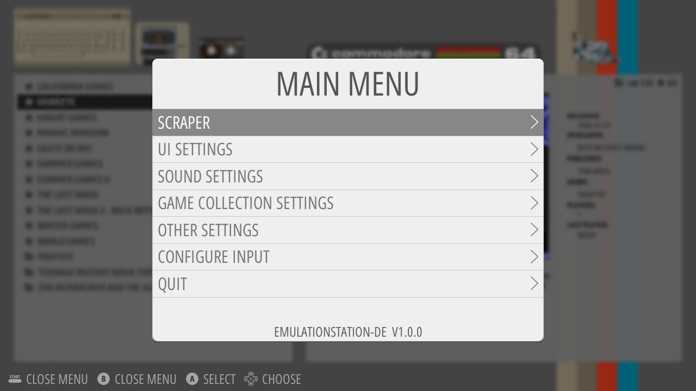
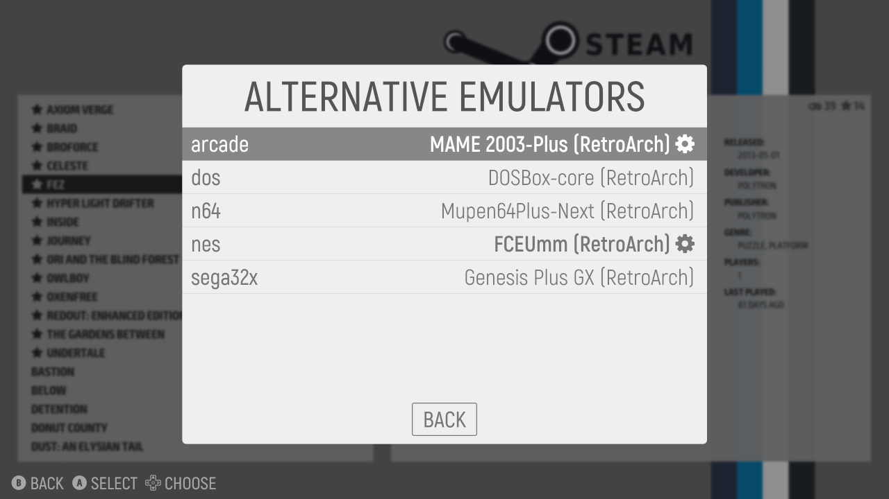
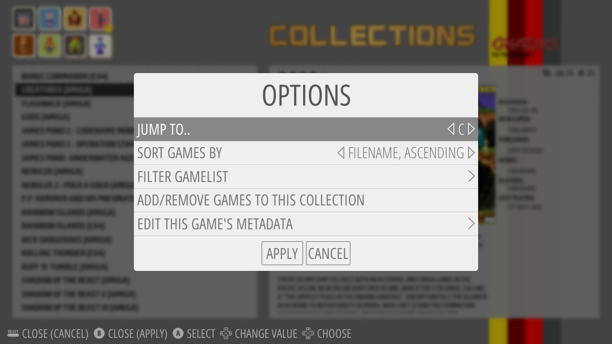
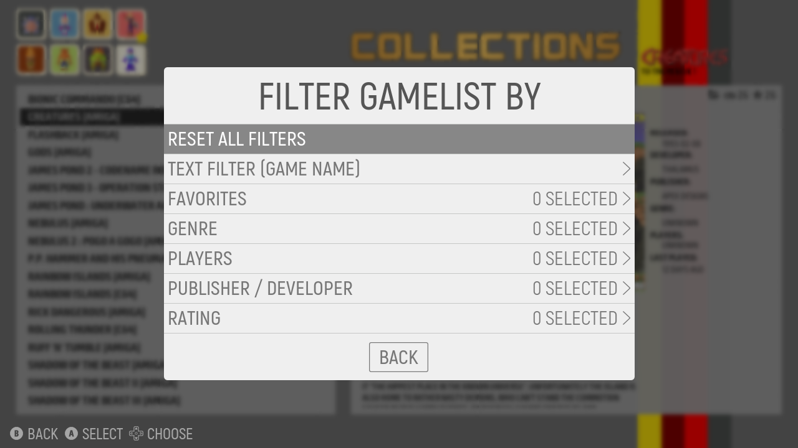
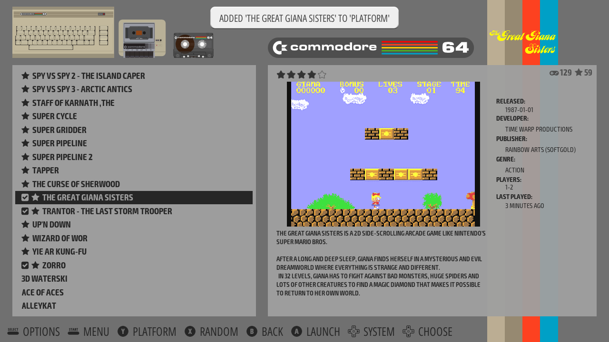

# EmulationStation Desktop Edition (ES-DE) v1.2 (development version) - User guide

This document is intended as a quick start guide and as a reference for the application settings and general functionality. For details on how to build ES-DE from source code and to perform more advanced configuration, please refer to [INSTALL-DEV.md](INSTALL-DEV.md).

This version of the user guide is only relevant for the current ES-DE development version, if you are using the latest stable release, refer to [USERGUIDE.md](USERGUIDE.md) instead.

Table of contents:

[[_TOC_]]

## Quick start guide

If you just want to get started as quickly as possible, simply follow these steps:

1) Install ES-DE
2) Start the application and press the _Create directories_ button to generate the ROMs directory structure
3) Put your game ROMs in the directories created by the previous step, or see [here](USERGUIDE-DEV.md#supported-game-systems) for additional details
4) Install [RetroArch](https://www.retroarch.com)
5) Start RetroArch and install the required emulator cores
6) Start ES-DE, scrape game media for your collection and play some games!

You can always close the application immediately by using the keyboard, by default the exit key is mapped to F4 but it can be changed to Alt + F4, Alt + Q or Command Q using the _Exit button combo_ menu option.

For additional details, read on below.

There are also installation videos available at the ES-DE YouTube channel:\
[https://www.youtube.com/channel/UCosLuC9yIMQPKFBJXgDpvVQ](https://www.youtube.com/channel/UCosLuC9yIMQPKFBJXgDpvVQ)


## Installation and first startup

To install ES-DE, just download the package or installer from [https://es-de.org](https://es-de.org) and follow the brief instructions below.

The following operating systems have been tested (all for the x86 architecture unless otherwise stated):

* Ubuntu 20.04 to 21.04
* Linux Mint 20
* Manjaro 21
* Fedora 33 Workstation
* FreeBSD 12.2
* NetBSD 9.1
* OpenBSD 6.8
* macOS 10.14 "Mojave" to 11 "Big Sur" (ARM via Rosetta 2 is supported)
* macOS 10.11 "El Capitan" (v1.0 release only)
* Windows 10
* Windows 8.1

**Note:** If using a Mac with an ARM CPU (e.g. M1) you need to install the x86 version of RetroArch and any other emulators, or you won't be able to launch any games. This will be fixed whenever a native macOS ARM build of ES-DE is released.

The installation procedure is just covered briefly here and may differ a bit for your specific operating system, so in case of problems refer to your system documentation.

**Installing a Linux .deb package**

The .deb package is intended for Linux distributions based on Debian, such as Ubuntu, Linux Mint etc. Your distribution should include a graphical package installer, but if you prefer to use the command line, run the following which will install ES-DE and resolve any dependencies:

```
sudo apt install ./emulationstation-de-1.0.0-x64.deb
```

**Installing a Linux .rpm package**

On Fedora you can use the graphical package installer or run this command, either method should automatically resolve the dependencies:

```
sudo dnf install ./emulationstation-de-1.0.0-x64.rpm
```

**Installing on macOS and Windows**

There's not really much to say about these operating systems, just install ES-DE as you would any other application. On maCOS it's via the .dmg drag-and-drop installer, and on Windows via the normal application installer.

**On first application startup**

Upon first startup, ES-DE will create its `~/.emulationstation` home directory.

On Unix this means /home/\<username\>/.emulationstation/, on macOS /Users/\<username\>/.emulationstation/ and on Windows C:\Users\\<username\>\\.emulationstation\

**Note:** As of ES-DE v1.1 there is no internationalization support, which means that the application will always require the physical rather than the localized path to your home directory. For instance on macOS configured for the Swedish language /Users/myusername will be the physical path but /Användare/myusername is the localized path that is actually shown in the user interface. The same is true on Windows where the directories would be C:\Users\myusername and C:\Användare\myusername respectively. If attempting to enter the localized path for any directory-related setting, ES-DE will not be able to find it. But it's always possible to use the tilde `~` symbol when referring to your home directory, which ES-DE will expand to the physical location regardless of what language you have configured for your operating system. If you're using an English-localized system, this whole point is irrelevant as the physical and localized paths are then identical.

It's also possible to override the home directory path using the --home command line option, but this is normally required only for very special situations so we can safely ignore that option for now.

Also on first startup the configuration file `es_settings.xml` will be generated in the ES-DE home directory, containing all the application settings at their default values. Following this, a file named `es_systems.xml` will be loaded from the resources directory (which is part of the ES-DE installation). This file contains the game system definitions including which emulator to use per platform. For some systems there are also alternative emulators defined which can be applied system-wide or per game. How that works is explained later in this guide. The systems configuration file can also be customized, as described in the next section.

There's an application log file created in the ES-DE home directory named `es_log.txt`, please refer to this in case of any issues as it should hopefully provide information on what went wrong. Starting ES-DE with the --debug flag provides even more detailed information.

After ES-DE finds at least one game file, it will populate that game system and the application will start. If there are no game files, a dialog will be shown explaining that you need to install your game files into your ROMs directory. You will also be given a choice to change that ROMs directory path if you don't want to use the default one. As well you have the option to generate the complete game systems directory structure based on information in es_systems.xml.

When generating the directory structure, a file named systeminfo.txt will be created in each game system folder which will provide you with some information about the system. Here's an example for the _gc_ system as seen on macOS:
```
System name:
gc

Full system name:
Nintendo GameCube

Supported file extensions:
.gcm .GCM .iso .ISO .wbfs .WBFS .ciso .CISO .gcz .GCZ .elf .ELF .dol .DOL .dff .DFF .tgc .TGC .wad .WAD .7z .7Z .zip .ZIP

Launch command:
%EMULATOR_RETROARCH% -L %CORE_RETROARCH%/dolphin_libretro.dylib %ROM%

Platform (for scraping):
gc

Theme folder:
gc
```

The primary use of this file is to see which RetroArch core the system needs, which you will have to install manually from inside the RetroArch user interface. Also the supported file extensions can be quite useful to know.

In addition to this, a file named systems.txt will be created in the root of the ROMs directory which shows the mapping between the directory names and the full system names.

For example:

```
gc: Nintendo GameCube
genesis: Sega Genesis
gx4000: Amstrad GX4000
```

Note that neither the systeminfo.txt files or the systems.txt file are needed to run ES-DE, they're only generated as a convenience to help with the setup.

There will be a lot of directories created if using the es_systems.xml file bundled with the installation, so it may be a good idea to remove the ones you don't need. It's recommended to move them to another location to be able to use them later if more systems should be added. For example a directory named _DISABLED could be created inside the ROMs folder (i.e. ~/ROMs/_DISABLED) and all game system directories you don't need could be moved there. Doing this reduces the application startup time as ES-DE would otherwise need to scan for game files for all these systems.


_This is the dialog shown if no game files were found. It lets you configure the ROM directory if you don't want to use the default one, and you can also generate the game systems directory structure. Note that the directory is the physical path, and that your operating system may present this as a localized path if you are using a language other than English._


## Customizing the systems configuration file

The `es_systems.xml` file is located in the ES-DE resources directory which is part of the application installation. As such this file is not intended to be modified directly. If a customized file is needed, this should instead be placed in the `custom_systems` folder in the ES-DE home directory, i.e. `~/.emulationstation/custom_systems/es_systems.xml`. You can find information on the file structure and how to adapt the configuration in the [INSTALL-DEV.md](INSTALL-DEV.md#es_systemsxml) document.


## Migrating from other EmulationStation forks

**IMPORTANT!!! IMPORTANT!!! IMPORTANT!!!**

ES-DE is designed to be backward compatible to a certain degree, that is, it should be able to read data from other/previous EmulationStation versions such as the RetroPie fork. But the opposite is not true and it's a one-way ticket for your gamelist.xml files and your custom collection files when migrating to ES-DE as they will be modified in ways that previous ES versions will see as data loss. For instance ES-DE does not use image tags inside the gamelist.xml files to find game media but instead matches the media to the names of the game/ROM files. So it will not save any such tags back to the gamelist files during updates, effectively removing the display of the game media if the files are opened in another ES fork.

Due to this, always make backups of at least the following directories before testing ES-DE for the first time:

```
~/.emulationstation/gameslists/
~/.emulationstation/collections/
```


## Running on high resolution displays

ES-DE fully supports high resolution displays such as 4K, 6K, 1440p, ultrawide monitors etc. But some emulators such as RetroArch will also run using the same resolution which may cause performance problems on slower machines or when using resource intensive shaders. Although some emulator cores will have options to set their internal resolution, they still need to be scaled up to the screen resolution. On Unix it's possible to start ES-DE with the `--resolution` option to set a lower screen resolution (this will also affect the emulators) but this is not really recommended as it's highly dependent on well-written graphics drivers for proper behavior.

A better approach is to use the custom event scripts functionality to set a temporary resolution upon launching a game that will be reverted when returning to ES-DE. Such a setup is detailed in [INSTALL-DEV.md](INSTALL-DEV.md#custom-event-scripts) for Unix, but should hopefully be possible to implement similarly on macOS and Windows.


## Input device configuration

ES-DE automatically configures the keyboard and any connected controllers using default button mappings, and normally no additional setup is required. But if you would like to apply custom button mappings for your devices, you can run the `Configure keyboard and controllers` tool from the `Input device settings` entry on the main menu.

You can also force a run of this tool directly on startup via the command line argument `--force-input-config`.

The actual procedure to map the inputs should be self-explanatory, just follow the on-screen instructions. But note that custom button mappings will not change the help prompts.

Any custom configuration is applied per unique device ID (GUID). So if two identical controllers are used with ES-DE, both will have the same configuration applied. If connecting controllers of the same type but of different revisions, the GUID may differ and therefore the custom configuration would need to be applied to each device individually.

If you have issues with your input configuration, as a last resort you can reset all the mappings by deleting or renaming the file ~/.emulationstation/es_input.xml.

If you experience double button presses with your DualShock 4 controller on macOS, please read about the workaround for this issue in the [Known issues](CHANGELOG.md#known-issues) section of the changelog.


## System view (main screen)

When starting ES-DE with the default settings, you will see the System view first. From here you can navigate your game systems and enter their respective gamelists.

Depending on the theme, the system navigation carousel can be either horizontal or vertical. The default theme rbsimple-DE provides horizontal navigation, i.e. you browse your systems by scrolling left or right.

The game systems are sorted by their full names, as defined in the es_systems.xml file.


_The **System view** is the default starting point for the application, it's here that you browse through your game systems._


## Gamelist view

The gamelist view is where you browse and start your games, and it's where you will spend most of your time using ES-DE.

Upon startup with the default settings, ES-DE is set to the gamelist view style **Automatic**. In this mode the application will look for any game media files (videos and images) and set the view style accordingly. If at least one image is found for any game, the view style **Detailed** will be shown, and if at least one video file is found, the view style **Video** will be selected (superceding the Detailed style). If no game media files are found for a system, the simple **Basic** view style will be selected. This automatic selection is applied per game system.

Note that the Video view style requires that the theme supports it. If not, the Detailed style will be selected instead. The default theme rbsimple-DE supports both of these view styles.

It's possible to manually set a specific gamelist view style in the UI settings entry of the main menu, but this is applied globally regardless of what media files are available per game system. The manual setting also overrides the theme-supported view styles which has the potential of making ES-DE very ugly indeed if the theme does not support the selected view style.

In addition to the styles just described, there is a **Grid** view style as well, but as of ES-DE version 1.1 this is highly experimental and its use is not recommended. Future versions may update this style to a more useful state or it may be removed entirely.

If the theme supports it, there's a gamelist information field displayed in the gamelist view, showing the number of games for the system (total and favorites) as well as a folder icon if a folder has been entered. When applying any filters to the gamelist, the game counter is replaced with the amount of games filtered, as in 'filtered / total games', e.g. '19 / 77'. If there are game entries in the filter result that are marked not to be counted as games, the number of such files will be indicated as 'filtered + filtered non-games / total games', for example '23 + 4 / 77' indicating 23 normal games, 4 non-games out of a total of 77. Due to this approach it's theoretically possible that the combined filtered game amount exceeds the number of counted games in the collection, for instance '69 + 11 / 77'. This is not considered a bug and is so by design. This gamelist information field functionality is specific to EmulationStation Desktop Edition so older themes will not support this.


_The **Gamelist view** is where you browse the games for a specific system._


_Here's an example of what the Basic view style looks like. Needless to say, ES-DE is not intended to be used like this. After scraping some game media for the system, the view style will automatically change to Detailed or Video (assuming the Automatic view style option has been selected)._


## UI modes

ES-DE supports three separate modes, **Full**, **Kiosk** and **Kid**.

These modes mandate the functionalty provided by the application in the following way:

* Full - This is the default mode which enables all functionality.
* Kiosk - The main menu will be severely restricted, only displaying the entry to change the audio volume. The game options menu will be restricted as well, removing the metadata editor and the ability to modify custom game collections. And finally the ability to flag or unflag games as favorites will be removed. Apart from this all games will be playable.
* Kid - Only games marked as being suitable for children will be displayed (this flag is set manually per game using the metadata editor). Additionally, the game options menu is disabled, as well as the screensaver controls and the ability to flag and unflag games as favorites. There is also a separate option available to enable or disable the main menu when in Kid mode, see **Enable menu in kid mode** for additional information.

There is an unlock code available to revert to the Full mode from the Kiosk or Kid mode, as is described when changing this setting from the main menu. By default the button sequence is **Up, Up, Down, Down, Left, Right, Left, Right, B, A** (or equivalent buttons if an Xbox controller is not used). Either the keyboard or a controller can be used to input the passkey sequence, but it can't be entered when a menu is open.

The application can also be forced into any of the three modes via the command line options `--force-full`, `--force-kiosk` and `--force-kid`. This is only temporary until the restart of the application, unless the settings menu is entered and the setting is saved to the configuration file (this assumes that the main menu is available in the selected UI mode of course).


## Help system

There is a help system available throughout the application that provides an overview of the possible actions and buttons that can be used. But some general actions are never shown, such as the ability to quick jump in gamelists, menus and text input fields using the shoulder and trigger buttons. It's also possible to disable the help system using a menu option for a somewhat cleaner look.


_The help system is displayed at the bottom of the screen, showing the various actions currently available._


## General navigation

The built-in help system will provide a contextual summary of the available navigation options, but here's still a general overview. These are the buttons mappings automatically applied by ES-DE, but they can be customized using the input configurator as described earlier in this document. It's not an exhaustive list, but it covers most situations. The button names are based on the Xbox 360 controller as that is the naming convention used by the SDL library which handles the controller input in ES-DE.

The default keyboard mappings are shown in brackets.

**Up and down**\
_(Arrow up / Arrow down)_

Navigate up and down in gamelists, between systems in the system view (if the theme has a vertical carousel) and in menus.

**Left and right**\
_(Arrow left / Arrow right)_

Navigate between gamelists (if the _Quick system select_ option has been enabled), between systems in the system view (if the theme has a horizontal carousel) and between media files in the media viewer. If the _Enable screensaver controls_ option has been enabled, either button also randomly selects a new game when using the Video or Slideshow screensavers.

**Start button**\
_(Escape)_

Opens and closes the main menu.

**Back button**\
_(F1)_

Opens and closes the game options menu in the gamelist view, or toggles the screensaver in the system view (if the _Enable screensaver controls_ setting is enabled).

**Left and right shoulder buttons**\
_(Page up / Page down)_

Provides quick jumping in gamelists and menus, jumps 10 games in the gamelists and 6 entries in the menus. Also jumps forward in text edit dialogs.

**Left and right trigger buttons**\
_(Home / End)_

Jumps to the first and last entry of the gamelists, menus and text edit dialogs.

**Left and right thumbstick click**\
_(F2 / F3)_

Jumps to a random game or system depending on whether pressed when in the system view or gamelist view. Only available if the _Enable random system or game button_ option has been enabled.

**A button**\
_(Enter)_

Opens gamelists from the system view, launches games, selects menu entries etc.

**B button**\
_(Back key)_

Back button, self explanatory.

**X button**\
_(Delete)_

Starts the game media viewer (which is accessible from the gamelist views). Used by some other minor functions as explained by the help system and/or this guide.

**Y button**\
_(Insert on Unix and Windows, F13 on macOS)_

Marks games as favorites in the gamelist view (if the _Enable toggle favorites button_ option has been enabled). Used by some other minor functions as explained by the help system and/or this guide.

**F4 (keyboard only)** _Could alternatively be Alt + F4, Alt + Q or Command + Q_

Quits the application. This key combination can be changed using the _Exit button combo_ menu option described later in this document.

## Getting your games into ES-DE

For most systems this is straightforward, just put your game files into the folder corresponding to the platform name (these names can be found at the [end](USERGUIDE-DEV.md#supported-game-systems) of this guide.)

But for some systems a more elaborate setup is required, and we will attempt to cover such situations in this guide as well.

### Single game file installation

Let's start with the simple scenario of a single ROM file per game, which is the case for the majority of platforms. In this example we're setting up ES-DE to play Nintendo Entertainment System games.

The supported file extensions are listed in [unix/es_systems.xml](resources/systems/unix/es_systems.xml), [macos/es_systems.xml](resources/systems/macos/es_systems.xml) and [windows/es_systems.xml](resources/systems/windows/es_systems.xml) but if you generated the game system directories on first application startup, there will be a file named systeminfo.txt in each game system directory that includes the list of supported file extensions.

Here is the snippet from the unix/es_systems.xml file:

```
<system>
    <name>nes</name>
    <fullname>Nintendo Entertainment System</fullname>
    <path>%ROMPATH%/nes</path>
    <extension>.nes .NES .unf .UNF .unif .UNIF .7z .7Z .zip .ZIP</extension>
    <command label="Nestopia UE (RetroArch)">%EMULATOR_RETROARCH% -L %CORE_RETROARCH%/nestopia_libretro.so %ROM%</command>
    <command label="FCEUmm (RetroArch)">%EMULATOR_RETROARCH% -L %CORE_RETROARCH%/fceumm_libretro.so %ROM%</command>
    <command label="Mesen (RetroArch)">%EMULATOR_RETROARCH% -L %CORE_RETROARCH%/mesen_libretro.so %ROM%</command>
    <command label="QuickNES (RetroArch)">%EMULATOR_RETROARCH% -L %CORE_RETROARCH%/quicknes_libretro.so %ROM%</command>
    <platform>nes</platform>
    <theme>nes</theme>
</system>
```

The ROM files must named using one of the supported file extensions, or ES-DE won't find them.

It's highly recommended to use filenames that are corresponding to the full name of the game, otherwise you will need to manually feed the scraper the game name when scraping which is very tedious.

**Note:** Symlinks are supported for both ROM directories and individual game files, but make sure to not symlink between files within the same system directory or there may be undefined application behavior when scraping, launching games etc.

The default game directory folder is ~/ROMs. On Unix this defaults to /home/\<username\>/ROMs, on macOS /Users/\<username\>/ROMs and on Windows C:\Users\\<username\>\ROMs\. If the --home command line option was used to start ES-DE, the tilde `~` symbol will resolve to whatever directory was passed as an argument to this option.

If ES-DE can't find any game files during startup, an error message will be displayed with the option to change the ROM directory path.

Assuming the default ROM directory is used, we need to create a directory corresponding to the \<path\> tag in es_systems.xml, in this example it's `nes`.

This would look something like the following:

```
/home/myusername/ROMs/nes     # On Unix
/Users/myusername/ROMs/nes    # On macOS
C:\Users\myusername\ROMs\nes  # On Windows
```

Then simply copy your game ROMs into this folder, and you should end up with something like this (example for Unix):

```
~/ROMs/nes/Legend of Zelda, the.zip
~/ROMs/nes/Metal Gear.zip
~/ROMs/nes/Super Mario Bros. 3.zip
```

**Note:** These directories are case sensitive on Unix, so creating a directory named `Nes` instead of `nes` won't work.

That's it, start ES-DE and the NES game system should be populated. You can now scrape information and media for the games, and assuming you've setup RetroArch correctly with the Nestopia UE core, you can launch the games. If you instead prefer to use any of the three alternative emulators listed above (FCEUmm, Mesen or QuickNES) you can install one of these cores instead and change your emulator preference using the _Alternative emulators_ interface in the _Other settings_ menu. Note that alternative emulators are only available for some game systems.

### Multiple game files installation

For some systems, there are sometimes (or always) multiple gamefiles per game. Such an example would be the Commodore 64 when multidisk games are being played. For such instances, simply group the files inside folders.

The platform name for the Commodore 64 is `c64`, so the following structure would be a possible approach:

```
~/ROMs/c64/Cartridge
~/ROMs/c64/Tape
~/ROMs/c64/Disk
~/ROMs/c64/Multidisk
~/ROMs/c64/Multidisk/Last Ninja 2/LNINJA2A.D64
~/ROMs/c64/Multidisk/Last Ninja 2/LNINJA2B.D64
~/ROMs/c64/Multidisk/Last Ninja 2/Last Ninja 2.m3u
~/ROMs/c64/Multidisk/Pirates/PIRAT-E0.d64
~/ROMs/c64/Multidisk/Pirates/PIRAT-E1.d64
~/ROMs/c64/Multidisk/Pirates/PIRAT-E2.d64
~/ROMs/c64/Multidisk/Pirates/Pirates!.m3u
```

It's highly recommended to create `.m3u` playlist files for multi-disk images as this normally automates disk swapping in the emulator. It's then this .m3u file that should be selected for launching the game.

The .m3u file simply contains a list of the game files, for example in the case of Last Ninja 2.m3u:

```
LNINJA2A.D64
LNINJA2B.D64
```

It's of course also possible to skip this type of directory structure and put all the games in the root folder, but then there will be multiple entries for the same game which is not so tidy. Another approach would be to put all the files in the root folder and then hide the game files, showing only the .m3u playlist files. ES-DE is flexible so do whatever makes most sense for the situation.

When setting up games in this fashion, it's recommended to scrape the directory in addition to the .m3u file as it looks nicer to see the metadata for the games also when browsing the folders. ES fully supports scraping folders, although some metadata is not included for folders for logical reasons. If you only scrape the folders and not the actual game files, it may look somehow ok when browsing, but when a game is part of a collection, the metadata will be missing there. This includes the **Last played** and **All games** collections for instance. Also note that while it's possible to mark a folder as a favorite, it will never be part of a collection, such as **Favorites**.

It's also recommended to use the metadata editor to set the flags **Exclude from game counter** and **Exclude from automatic scraper** for the actual game files so that they are not counted for the game statistics display and not scraped when running the multi-scraper. If you don't want to hide the individual game files but still want a cleaner look, it's also possible to set the flag **Hide metadata fields** for the game files.

### Special game installation considerations

Not all systems are as simple as described above, or there may be multiple ways to do the configuration. Specifics for such systems will be covered here. Consider this a work in progress as there are many platforms supported by ES-DE.

#### Arcade and Neo Geo

For all the supported MAME variants as well as Final Burn Alpha/FinalBurn Neo and Neo Geo, single file archives should be used. But these should retain the MAME names as filenames since ES-DE ships with MAME lookup tables, meaning the MAME names are expanded to the full game names.

For instance `topgunnr.7z` will be expanded to `Top Gunner`.

This is required by the TheGamesDB scraper where the expanded file names are used for game searches. (Screenscraper natively supports searches using the MAME names). It's also quite nice to have the gamelist populated with the expanded game names even before any scraping has taken place.

#### Nintendo Switch

The emulator for Nintendo Switch is Yuzu, which is distributed as a Snap package, Flatpak package or AppImage on Linux and as a regular installer on Windows. At the moment there is unfortunately no macOS release of this emulator and it's unclear if it can run on BSD Unix.

If installed as a Snap or Flatpak package or if built from source code, ES-DE should be able to easily locate the emulator binary.

But if using the AppImage it's a bit more complicated as there is no real standardized directory for storing these images.

What ES-DE will do is to look for _yuzu.AppImage_ in the system PATH as well as in the following locations:

```
~/Applications/yuzu.AppImage
~/.local/bin/yuzu.AppImage
~/bin/yuzu.AppImage
```

When downloading the AppImage from [https://yuzu-emu.org](https://yuzu-emu.org) it will be named something like `yuzu-20210621-45d9504ea.AppImage`, just rename this to yuzu.AppImage and everything should work correctly.

Note that the name is case sensitive, so _yuzu.appimage_ will not be found by ES-DE.

For Windows, ES-DE will look for _yuzu.exe_ in the system Path as well as in the default installation directory `~\AppData\Local\yuzu\yuzu-windows-msvc\`

Apart from the potential difficulty in locating the emulator binary, there are some special configuration steps required for the emulator, refer to the Yuzu website for more information about this.

#### Commodore Amiga

There are multiple ways to run Amiga games, but the recommended approach is to use WHDLoad. The best way is to use hard disk images in `.hdf` or `.hdz` format, meaning there will be a single file per game. This makes it just as easy to play Amiga games as any console with game ROMs.

An alternative would be to use `.adf` images as not all games may be available with WHDLoad support. For this, you can either put single-disk images in the root folder or in a dedicated adf directory, or multiple-disk games in separate folders. It's highly recommended to create `.m3u` playlist files for multi-disk images as described earlier.

Here's an example of what the file structure could look like:

```
~/ROMs/amiga/Multidisk/ZakMcKracken/ZakMcKracken (Disk 1 of 2).adf
~/ROMs/amiga/Multidisk/ZakMcKracken/ZakMcKracken (Disk 2 of 2).adf
~/ROMs/amiga/Multidisk/ZakMcKracken/ZakMcKracken.m3u
~/ROMs/amiga/Robbeary.adf
~/ROMs/amiga/Dungeon Master.hdf
```

Advanced topics such as the need for the Amiga Kickstart ROMs to run Amiga games is beyond the scope of this guide, but the following page is recommended for reading more about how this setup can be achieved:

[https://github.com/libretro/libretro-uae/blob/master/README.md](https://github.com/libretro/libretro-uae/blob/master/README.md)

#### DOS / PC

The DOS (and PC) platform uses the DOSBox emulator and the recommended approach here is to keep the directory structure intact, just as if running the game on a real DOS computer. So this means one folder per game in ES-DE. It's also recommended to set the metadata field **Count as game** to off for all files but the actual file used to launch the game, i.e. the binary or the .bat batch file. This is done so that the game counter correctly reflects the number of games you have installed. It's also possible to mark files and subdirectories as hidden to avoid seeing them in ES-DE. Both of these fields can be set using the metadata editor.

Apart from this, DOS games should work the same as any other system. The game folders can be scraped so that it looks nice when browsing the list of games, but make sure to also scrape the files used to launch the games or otherwise the entries in the collections **Last played**, **Favorites** and **All games** as well as any custom collections will miss the game metadata and game media. If you don't have these collections activated, then this can of course be skipped.

#### Ports

Ports are not really executed using emulators, but are rather applications running natively on the operating system. The easiest way to handle these is to add a simple shell script or batch file where you can customize the exact launch parameters for the game.

It's of course possible to add these as single files to the root folder, but normally it's recommended to setup a separate folder per game as there may be more than a single file available per game. You very often want to have easy access to the game setup utility for instance.

Here's an example for setting up Chocolate-Doom, GZDoom and DarkPlaces on Unix:

```
~/ROMs/ports/Chocolate-Doom/chocolate-doom.sh
~/ROMs/ports/Chocolate-Doom/chocolate-doom-setup.sh
~/ROMs/ports/GZDoom/gzdoom.sh
~/ROMs/ports/DarkPlaces/darkplaces.sh
```

chocolate-doom.sh:

```
#!/bin/bash
chocolate-doom
```

chocolate-doom-setup.sh:

```
#!/bin/bash
chocolate-doom-setup
```

gzdoom.sh:

```
#!/bin/bash
GZ_dir=/home/myusername/Games/Ports/GZDoom

gzdoom -iwad /home/myusername/Games/Ports/GameData/Doom/doom.wad -config $GZ_dir/gzdoom.ini -savedir $GZ_dir/Savegames \
-file $GZ_dir/Mods/DoomMetalVol4_44100.wad \
-file $GZ_dir/Mods/brutalv21.pk3 \
-file $GZ_dir/Mods/DHTP-2019_11_17.pk3
```

darkplaces.sh:

```
#!/bin/bash
darkplaces -basedir ~/Games/Ports/GameData/Quake
```

You don't need to set execution permissions for these scripts, ES-DE will run them anyway.

#### Lutris

Lutris runs only on Unix so it's only present as a placeholder in the es_systems.xml files for macOS and Windows.

These games are executed via the Lutris binary (well it's actually a Python script) and you simply create a shell script per game inside the lutris system directory.

Add the game information to each shell script using the syntax `lutris lutris:rungame/<game name>`

You can see the list of installed games by running this command:
```
lutris --list-games
```

Here's an example for adding Diablo and Fallout:

```
~/ROMs/lutris/Diablo.sh
~/ROMs/lutris/Fallout.sh
```

Diablo.sh:

```
lutris lutris:rungame/diablo
```

Fallout.sh:

```
lutris lutris:rungame/fallout
```

You don't need to set execution permissions for these scripts, ES-DE will run them anyway.

As an alternative, you can add the Lutris games to the Ports game system, if you prefer to not separate them. The instructions above are identical in this case except that the shell scripts should be located inside the `ports` directory rather than inside the `lutris` directory.

#### Steam

**Note:** Launching Steam games currently has some limitations such as missing error messages when a game fails to start as well as missing game output logging. ES-DE also needs to keep running in the background when launching Steam games, which has some minor side effects.

As for the setup, it's recommended to place shell scripts/batch files directly in the steam system directory, with the filenames of these scripts corresponding to the game names.

Add the game information to each shell script using the syntax `<steam binary> steam://rungameid/<game ID>`

Here's an example for the game Broforce, first on Unix with the filename `Broforce.sh`:

```
steam steam://rungameid/274190
```

And on macOS with the filename `Broforce.sh`:
```
/Applications/Steam.app/Contents/MacOS/steam_osx steam://rungameid/274190
```

And finally on Windows with the filename `Broforce.bat`:
```
"c:\Program Files (x86)\Steam\steam.exe" steam://rungameid/26800
```

The game ID can be found by going to [https://store.steampowered.com](https://store.steampowered.com) and searching for a game. The Broforce example would have an URL such as this:

https://store.steampowered.com/app/274190/Broforce

On Linux it's very easy to find all your game ID's by looking in the desktop entries.

```
grep steam ~/.local/share/applications/*desktop | grep rungameid
/home/myusername/.local/share/applications/Broforce.desktop:Exec=steam steam://rungameid/274190
/home/myusername/.local/share/applications/FEZ.desktop:Exec=steam steam://rungameid/224760
/home/myusername/.local/share/applications/INSIDE.desktop:Exec=steam steam://rungameid/304430
/home/myusername/.local/share/applications/Subnautica.desktop:Exec=steam steam://rungameid/264710
```

This of course assumes that you have menu entries setup for your Steam games.


## RetroArch setup

ES-DE is a game browsing frontend and does not provide any emulation by itself. It does however come preconfigured for use with emulators as setup in the `es_systems.xml` file. By default it's primarily setup for use with [RetroArch](https://www.retroarch.com) but this can be modified if needed. If you're interested in customizing your es_systems.xml file, please refer to the [INSTALL-DEV.md](INSTALL-DEV.md#es_systemsxml) document which goes into details on the structure of this file and more advanced configuration topics in general.

Installation and configuration of RetroArch and other emulators is beyond the scope of this guide, but many good resources can be found online on how to do this.

Keep in mind that ES-DE will not install any RetroArch cores, you need to do this manually from within the RetroArch user interface.

A general recommendation regarding installation on Linux is to try to avoid the RetroArch releases included in the OS repositories as they're usually quite limited with regards to the number of available cores, and they're usually older versions. Instead go for either the Snap, Flatpak or AppImage distributions or build from source.

The default es_systems.xml file is paired with a file named es_find_rules.xml which tries to find the emulators and cores using some predefined rules. For Windows this should normally just work, and for macOS too as long as RetroArch is installed at the default location /Applications/RetroArch.app. For Unix/Linux there is one exception that is problematic which is AppImages as there is no real standardized directory for storing these images. ES-DE will look for the RetroArch AppImage in the following locations in addition to searching the PATH variable:

```
~/Applications/RetroArch-Linux-x86_64.AppImage
~/.local/bin/RetroArch-Linux-x86_64.AppImage
~/bin/RetroArch-Linux-x86_64.AppImage
```

In any instance, ES-DE will display an error notification if attempting to launch a game where the emulator binary is not found. Likewise it will notify if the defined emulator core is not installed. The es_log.txt file will also provide additional details.


## Scraping

Scraping means downloading metadata and game media files (images and videos) for the games in your collections.

ES-DE supports the two scrapers [ScreenScraper.fr](https://www.screenscraper.fr) and [TheGamesDB.net](https://thegamesdb.net). In general TheGamesDB supports less formats and less systems, but in some areas such PC gaming, the quality is better and sometimes ScreenScraper is missing some specific information such as release dates where TheGamesDB may be able to fill in the gaps.

Here's an overview of what's supported when using these scrapers:

| Media type or option     | ScreenScraper | TheGamesDB |
| :----------------------- | :-----------: | :--------: |
| Region (EU/JP/US/WOR)    | Yes           | No         |
| Multi-language           | Yes           | No         |
| Game names               | Yes           | Yes        |
| Ratings                  | Yes           | No         |
| Other game metadata      | Yes           | Yes        |
| Videos                   | Yes           | No         |
| Screenshots              | Yes           | Yes        |
| Box covers (2D)          | Yes           | Yes        |
| Marquees/wheels          | Yes           | Yes        |
| 3D boxes                 | Yes           | No         |

The category **Other game metadata** includes Description, Release date, Developer, Publisher, Genre and Players.

The **Multi-language** support includes translated game genres and game descriptions for a number of languages.

There are two approaches to scraping, either for a single game from the metadata editor, or for many games and systems using the multi-scraper.


_Here's an example of the multi-scraper running in interactive mode, asking the user to make a selection from the multiple matching games returned by the scraper service._

### Single-game scraper

The single-game scraper is launched from the metadata editor. You navigate to a game, open the game options menu, choose **Edit this game's metadata** and then select the **Scrape** button.

### Multi-scraper

The multi-scraper is accessed from the main menu by entering the **Scraper** menu and then selecting the **Start** button.

### Scraping process

The process of scraping games is basically identical between the single-game scraper and the multi-scraper. You're presented with the returned scraper results, and you're able to refine the search if the scraper could not find your game. Sometimes small changes like adding or removing a colon or a minus sign can yield better results. Note that the searching is handled entirely by the scraper service, ES-DE just presents the results returned from the service.

By default, ES-DE will search using the metadata name of the game. If no name has been defined via scraping or manually using the metadata editor, this name will correspond to the physical file name minus all text inside either normal brackets `()` or square brackets `[]`. So for example the physical filename `Mygame (U) [v2].zip` will be stripped to simply `Mygame` when performing the scraping.

By disabling the option **Search using metadata name**, the physical file name will be used even if there is a scraped or manually entered name for the game.

There is however an exception to this for arcade games (MAME and Neo Geo) when using the TheGamesDB scraper. As this service does not support searches using the short MAME names, these will be expanded to the full game names via a lookup in the MAME name database supplied with the ES-DE installation. But if using ScreenScraper the _Search using metadata name_ option is always respected as this service fully support scraping based on the short MAME names.

Apart from this, hopefully the scraping process should be self-explanatory.

### Manually copying game media files

If you already have a library of game media (images and videos) you can manually copy these files into ES-DE.

The default media directory is `~/.emulationstation/downloaded_media/<game system>/<media type>`

For example on Unix:
```
/home/myusername/.emulationstation/downloaded_media/c64/screenshots/
```

For example on macOS:

```
/Users/myusername/.emulationstation/downloaded_media/c64/screenshots/
```

For example on Windows:

```
C:\Users\Myusername\.emulationstation\downloaded_media\c64\screenshots\
```

The media directories per game system are:

* 3dboxes
* covers
* marquees
* miximages
* screenshots
* videos

The miximages are generated by ES-DE. Normally that takes place automatically when scraping, but in this example of manually copying existing media files, the miximage offline generator should be used instead. This tool can generate the miximages for the complete game collection in one go. How that works is explained elsewhere in this guide.

The media files must correspond exactly to the game files. For example the following game:

```
~/ROMs/c64/Multidisk/Last Ninja 2/Last Ninja 2.m3u
```

Must have corresponding filenames for its media files in this fashion:

```
~/.emulationstation/downloaded_media/c64/screenshots/Multidisk/Last Ninja 2/Last Ninja 2.jpg
~/.emulationstation/downloaded_media/c64/videos/Multidisk/Last Ninja 2/Last Ninja 2.mp4
```

For images .jpg and .png file extensions are supported and for videos .avi, .mkv, .mov, .mp4 and .wmv are supported.

Remember that on Unix filenames are case sensitive, and as well the file extensions must be in lower case, such as .png instead of .PNG or .Png or the file won't be found.

It's possible to change the game media directory location from within ES-DE, for this see the option **Game media directory**.


## Main menu

This menu can be accessed from both the system view and gamelist view. It contains the scraper, application settings and various tools such as the input configurator and the miximage generator. Settings are saved when navigating back from any menu screen, assuming at least one setting was changed. Pressing the application exit key (F4 by default) will also save any pending changes.


_The ES-DE main menu._

Following is a breakdown of the main menu entries.

### Scraper

Contains the various options for the scraper, which is used to download metadata, images and videos for your games.


_Some of the scraper settings._

**Scrape from**

Scraper service selection, currently ScreenScraper.fr and TheGamesDB.net are supported.

**Scrape these games**

Criteria for what games to include. It can be set to _All games, Favorite games, No metadata, No game image, No game video_ or _Folders only_.

**Scrape these systems**

A selection of which systems to scrape for. It's possible to automatically scrape several or all systems in one go.

#### Account settings

Setup of ScreenScraper account.

**Use this account for ScreenScraper**

Whether to use the account that has been configured. If this is disabled, the username and password setup on this screen will be ignored during scraping. This can be useful if you have scraping issues and want to check whether it's related to your account or if it's a general problem. Note that screenscraper.fr does not seem to return a proper error message regarding incorrect username and password, but starting ES-DE with the --debug flag will indicate in the log file whether the username was included in the server response.

**ScreenScraper username**

Username as registered on screenscraper.fr.

**ScreenScraper password**

The password as registered on screenscraper.fr. This is masked using asterisks on the screen, and the password input field will be blank when attempting to update an existing password. This is by design and not a bug. Be aware that the es_settings.xml file contains the password in clear text.

#### Content settings

Describes the content types to include in the scraping.

**Scrape game names**

Whether to scrape the names of the games. This does not affect the actual files on the filesystem and the game name is primarily used for appearance and sorting purposes. The downloaded media files are matched against the physical game files on the filesystem, and not against this metadata. See the comments under _Overwrite files and data_ below to understand some additional implications regarding game names.

**Scrape ratings** _(ScreenScraper only)_

Downloads game ratings.

**Scrape other metadata**

This includes the game description, release date, developer, publisher, genre and the number of players.

**Scrape videos** _(ScreenScraper only)_

Videos of actual gameplay.

**Scrape screenshot images**

Screenshot images of actual gameplay.

**Scrape box cover images**

Cover art.

**Scrape marquee (wheel) images**

Logotype for the game.

**Scrape 3D box images** _(ScreenScraper only)_

These are primarily used for generating miximages.

#### Miximage settings

These are the settings for the miximage generator, which can either be run from the scraper (single-game scraper or multi-scraper) or from the offline generator. The miximage combines the screenshot, marquee and box images to make a composite picture that is displayed in the gamelist view. There are various settings for the generator.

**Miximage resolution**

It's possible to select betweeen the 1280x960, 1920x1440 and 640x480 resolutions for the generated miximages. It's normally recommended to use the default option 1280x960 which gives good image quality without slowing down ES-DE too much. But for very weak machines, 640x480 may be a better option. The 1920x1440 resolution is normally not recommended as it brings little quality improvements over 1280x960 and slows down the gamelist browsing.

**Screenshot scaling method**

The _sharp_ scaling method uses nearest-neighbor interpolation which retains sharp pixels and looks better for most low-resolution retro games. The _smooth_ scaling method uses the Lanczos algorithm and produces smoother pixels. This may look better on some more modern games at higher resolutions. If unsure, use the _sharp_ method.

**Generate miximages when scraping**

Enables or disables the miximage generator when scraping. Applies to both the single-game scraper and the multi-scraper.

**Overwrite miximages (scraper/offline generator)**

Controls whether miximages should be overwritten or not. Note that the scraper setting _Overwrite files and data_ does not affect the miximages.

**Remove letterboxes from screenshots**

With this option enabled, any horizontal pure black areas at the top and bottom of the screenshots are automatically cropped.

**Remove pillarboxes from screenshots**

With this option enabled, any vertical pure black areas at the left and right sides of the screenshots are automatically cropped.

**Incude marquee image**

Whether to include the marquee (wheel) image in the composite miximage.

**Incude box image**

Whether to include the box image in the composite miximage. If a 3D box exists for the game, this will be used.

**Use cover image if 3D box is missing**

Whether to use the 2D box cover as fallback if the 3D box image is missing for the game.

**Offline generator**

This is not a setting, but instead a GUI to generate miximages offline without going via the scraper. This tool uses the same game system selections as the scraper, so you need to select at least one system on the scraper menu before attempting to run it. All the miximage settings are applied in the same way as when generating images via the scraper. The prerequisite is that at least a screenshot exists for each game. If there is no screenshot, or if the screenshot is unreadable for some reason, the generation for that specific game will fail. There is statistics shown in the tool displaying the number of generated, overwritten, skipped and failed images. Any error message is also shown on screen as well as being saved to the es_log.txt file.

#### Other settings

Various scraping settings.

**Region** _(ScreenScraper only)_

The region to scrape for. This affects game names, game media and release dates. Possible options are Europe, Japan, USA and World.

**Preferred language** _(ScreenScraper only)_

Multiple languages are supported by ScreenScraper, and this affects translations of game genres and game descriptions. As the option name implies this is the preferred language only as not all games have had their metadata translated. Unfortunately some less used languages have quite few games translated, but hopefully this will improve over time as there's an ongoing community effort to make more translations. If the preferred language is not available for a game, ES-DE will fall back to using the English metadata.

**Overwrite files and data**

Affects both overwriting of metadata as well as actual game media files on the filesystem. Even with this option disabled, metadata entries which are set to their default values will of course be populated by the scraper. In other words, this option only affects overwriting of previously scraped data. Game names are considered as set to their default values if either corresponding to the physical game file on disk minus the extension (e.g. the entry _Commando_ if the file is named _Commando.zip_), or for arcade games if corresponding to the MAME names as defined in the bundled mamenames.xml. Note that this setting does not affect generated miximages, that is instead controlled by the setting _Overwrite miximages (scraper/offline generator)_ found in the miximage settings menu.

**Halt on invalid media files**

With this setting enabled, if any media files returned by the scraper seem to be invalid, the scraping is halted and an error message is presented where it's possible to retry or cancel the scraping of the specific game. In the case of multi-scraping it's also possible to skip the game and proceed to the next one in the queue. With this setting disabled, all media files will always be accepted and saved to disk. As of ES-DE v1.1 the file verification is quite basic and future versions will improve on this by using file checksums and other file integrity checks.

**Search using metadata names**

By default ES-DE will perform scraper searches based on the game name that has been manually set in the metadata editor, or that has been previously scraped. If you prefer to search using the physical file name regardless of such data being available, then disable this option. Note that when using TheGamesDB as scraper service for arcade games (MAME and Neo Geo), the short MAME name will always be expanded to the full game name as this scraper service does not support searches using short MAME names.

**Interactive mode** _(Multi-scraper only)_

If turned off, the scraping will be fully automatic and will not stop on multiple results or when no matching game was found.

**Auto-accept single game matches** _(Multi-scraper only)_

Used in conjunction with interactive mode, to not having to confirm searches where a single result is returned from the scraper service.

**Respect per-file scraper exclusions** _(Multi-scraper only)_

It's possible to set a flag per game file or folder using the metadata editor to indicate that it should be excluded from the multi-scraper. This setting makes it possible to override that restriction and scrape all entries anyway.

**Exclude folders recursively** _(Multi-scraper only)_

If this setting is enabled and a folder has its flag set to be excluded from the scraper, then the entire folder contents are skipped when running the multi-scraper.

**Scrape actual folders** _(Multi-scraper only)_

Enabling this option causes folders themselves to be included by the scraper. This is useful for DOS games or any multi-disk games where there is a folder for each individual game.

**Auto-retry on peer verification errors** _(ScreenScraper only)_

ScreenScraper sometimes has issues with its TLS certificates which causes searches to randomly fail. It's normally resolved within a few days, but in the meanwhile activating this setting will have the scraper automatically make up to eight additional attempts when this error occurs. That is normally enough to complete the search, but if not, just press 'Retry' in the error dialog and ES-DE will try eight more times. This setting applies to both the single-game scraper and the multi-scraper. The following error notification dialog and corresponding es_log.txt entry is displayed when this error occurs: "Error downloading thumbnail: SSL peer certificate or SSH remote key was not OK".

### UI settings

Various settings that affect the user interface.

**Gamelist on startup**

If set to _None_, the system view will be displayed. Any other value will jump to that game system automatically on startup.

**Gamelist view style**

Sets the view style to _Automatic, Basic, Detailed, Video_ or _Grid_. See the description [above](USERGUIDE-DEV.md#gamelist-view) in this document for more information regarding view styles.

**Transition style**

Transition animation when navigating between the views. Can be set to _Slide, Fade_ or _Instant_.

**Theme set**

The theme to use. Defaults to rbsimple-DE, the theme shipped with ES-DE.

**UI mode**

Sets the user interface mode for the application to _Full, Kiosk_ or _Kid_. See the description [above](USERGUIDE-DEV.md#ui-modes) in this document for additional information.

**Default sort order**

The order in which to sort your gamelists. This can be overriden per game system using the game options menu, but that override will only be persistent during the application session. The _System_ sorting can not be selected here as it's only applicable to collection systems.

**Menu opening effect**

Animation to play when opening the main menu or the game options menu. Also sets the animation for the game launch screen. Can be set to _Scale-up_ or _None_.

**Launch screen duration**

This configures for how long to display the game launch screen when starting a game. The options are _Normal_, _Brief_, _Long_ and _Disabled_. If set to _Disabled_, a simple notification popup will be displayed instead.

**Media viewer settings**

Submenu containing all the settings for the media viewer. These are described in detail below.

**Screensaver settings**

Submenu containing all the settings for the screensaver. These are described in detailed below.

**Blur background when menu is open** _(OpenGL renderer only)_

This option will blur the background behind the menu slightly. Normally this can be left enabled, but if you have a really slow GPU, disabling this option may make the application feel a bit more responsive.

**Display pillarboxes for gamelist videos**

With this option enabled, there are black pillarboxes (and to a lesser extent letterboxes) displayed around videos with non-standard aspect ratios. This will probably be most commonly used for vertical arcade shooters, or for game systems that has a screen in portrait orientation. For wider than normal videos, letterboxes are added, but this is quite rare compared to videos in portrait orientation. This option looks good with some theme sets such as rbsimple-DE, but on others it may be more visually pleasing to disable it. On less wide displays such as those in 4:3 aspect ratio this option should probably be disabled as it may otherwise add quite excessive letterboxing.

**Render scanlines for gamelist videos** _(OpenGL renderer only)_

Whether to use a shader to render scanlines for videos in the gamelist view. The effect is usually pretty subtle as the video is normally renderered in a limited size in the GUI and the scanlines are sized relative to the video window size.

**Sort folders on top of gamelists**

Whether to place all folders on top of the gamelists. If enabled the folders will not be part of the quick selector index, meaning they can no longer be quick-jumped to. That is, unless there are only folders in the gamelist in which case the folders will be handled like files.

**Sort favorite games above non-favorites**

Whether to sort your favorite games above your other games in the gamelists.

**Add star markings to favorite games**

With this setting enabled, there is a star symbol added at the beginning of the game name in the gamelist views. It's strongly recommended to keep this setting enabled if the option to sort favorite games above non-favorites has been enabled. If not, favorite games would be sorted on top of the gamelist with no visual indication that they are favorites, which would be quite confusing.

**Use plain ASCII for special gamelist characters**

There are some special characters in ES-DE such as the favorites star, the folder icon and the tickmark (seen when editing custom collections) that are displayed using symbols from the bundled Font Awesome. This normally looks perfectly fine, but on some specific theme sets with very pixelated fonts such as [es-themes-snes-mini](https://github.com/ruckage/es-theme-snes-mini) and [es-themes-workbench](https://github.com/ehettervik/es-theme-workbench) these symbols look terrible. For such themes, this option is available, which will use plain ASCII characters instead of the Font Awesome symbols. For the favorites an asterisk `*` will be used, for folders a hash sign `#` will be used and for the tickmark an exclamation mark `!` will be used. This only applies to the gamelist view, in all other places in the application the Font Awesome symbols are retained. Make sure to disable this option if not using such a pixelated theme as it looks equally terrible to enable this option on themes where it's not supposed to be used.

**Enable quick list scrolling overlay**

With this option enabled, there will be an overlay displayed when scrolling the gamelists quickly, i.e. when holding down the _Up_, _Down_, _Left shoulder_ or _Right shoulder_ buttons for some time. The overlay will darken the background slightly and display the first two characters of the game names. If the game is a favorite and the setting to sort favorites above non-favorites has been enabled, a star will be shown instead.

**Enable toggle favorites button**

This setting enables the _Y_ button for quickly toggling a game as favorite. Although this may be convenient at times, it's also quite easy to accidentally remove a favorite tagging of a game when using the application more casually. As such it could sometimes make sense to disable this functionality. It's of course still possible to mark a game as favorite using the metadata editor when this setting is disabled. The option does not affect the use of the _Y_ button to add or remove games when editing custom collections.

**Enable random system or game button**

This enables or disables the ability to jump to a random system or game. It's mapped to the thumbstick click button, either the left or right thumbstick will work. The help prompts will also visually indicate whether this option is enabled or not.

**Enable gamelist filters**

Activating or deactivating the ability to filter your gamelists. This can normally be left enabled.

**Enable quick system select**

If enabled, it's possible to navigate between gamelists using the _Left_ and _Right_ buttons without having to first go back to the System view.

**Display on-screen help**

Activates or deactivates the built-in help system that provides contextual information regarding button usage.

**Play videos immediately (override theme)**

Some themes (including rbsimple-DE) display the game images briefly before playing the game videos. This setting forces the videos to be played immediately, regardless of the configuration in the theme. Note though that if there is a video available for a game, but no images, the video will always start to play immediately no matter the theme configuration or whether this settings has been enabled or not.

#### Media viewer settings

Settings for the media viewer that is accessible from the gamelist views.

**Keep videos running when viewing images**

With this option enabled, the video will continue to run when viewing the images for the game. If disabling this setting, the video will stop immediately when browsing to the first image, and it will restart when navigating back to the video.

**Stretch videos to screen resolution**

This will fill the entire screen surface but will probably break the aspect ratio of the video.

**Render scanlines for videos** _(OpenGL renderer only)_

Whether to use a shader to render scanlines for the videos. Be aware that this is quite demanding for the GPU.

**Render blur for videos** _(OpenGL renderer only)_

Whether to use a shader to render a slight horizontal blur which somewhat simulates a well-used CRT monitor. Be aware that this is quite demanding for the GPU.

**Render scanlines for screenshots** _(OpenGL renderer only)_

Whether to use a shader to render scanlines for the screenshot images.

#### Screensaver settings

Settings for the built-in screensaver.

**Start screensaver after (minutes)**

After how many minutes to start the screensaver. If set to 0 minutes, the timer will be deactivated and the screensaver will never start automatically. It's however still possible to start the screensaver manually in this case, assuming the _Enable screensaver controls_ setting is enabled. While any menu is open, the screensaver will not start regardless of how this timer setting is configured.

**Screensaver type**

The screensaven type to use; _Dim_, _Black_, _Slideshow_ or _Video_.

**Enable screensaver controls**

This enables the ability to start the screensaver manually using the _Back_ button from the system view, but also while the screensaver is running to jump to a new random game using the _Left_ and _Right_ buttons, to launch the game currently shown using the _A_ button and to jump to the game in its gamelist using the _Y_ button. If this setting is disabled, any key or button press will stop the screensaver.

#### Slideshow screensaver settings

Options specific to the slideshow screensaver.

**Swap images after (seconds)**

For how long to display images before changing to the next game. Allowed range is between 2 and 120 seconds in 2-second increments. The default value is 10 seconds.

**Stretch images to screen resolution**

This will fill the entire screen surface but will probably break the aspect ratio of the image.

**Display game info overlay**

This will display an overlay in the upper left corner, showing the game name and the game system name. A star following the game name indicates that it's flagged as a favorite.

**Render scanlines** _(OpenGL renderer only)_

Whether to use a shader to render scanlines for the images.

**Use custom images**

Using this option, it's possible to use custom images instead of random images from the game library. As is the case with the rest of ES-DE, the supported file formats are JPG and PNG.

**Custom image directory recursive search**

Whether to search the custom image directory recursively.

**Custom image directory**

The directory for the custom images. The tilde `~` symbol can be used which will expand to the user home directory. It's also possible to use the %ESPATH% and %ROMPATH% variables which will set the directory relative to the ES-DE binary directory or the ROMs directory.

#### Video screensaver settings

Options specific to the video screensaver.

**Swap videos after (seconds)**

For how long to play videos before changing to the next game. Allowed range is between 0 and 120 seconds in 2-second increments. If set to 0 (which is the default value), the next game will be selected after the entire video has finished playing.

**Stretch videos to screen resolution**

This will fill the entire screen surface but will probably break the aspect ratio of the video.

**Display game info overlay**

This will display an overlay in the upper left corner, showing the game name and the game system name. A star following the game name indicates that it's flagged as a favorite.

**Render scanlines** _(OpenGL renderer only)_

Whether to use a shader to render scanlines for the videos. Be aware that this is quite demanding for the GPU.

**Render blur** _(OpenGL renderer only)_

Whether to use a shader to render a slight horizontal blur which somewhat simulates a well-used CRT monitor. Be aware that this is quite demanding for the GPU.


### Sound settings

Various sound settings.

**System volume** _(Linux and Windows only)_

As the name implies, this sets the overall system volume and not the volume specifically for ES-DE. The volume change is applied when leaving the sound settings menu and not immediately when moving the slider.

**Navigation sounds volume**

Sets the volume for the navigation sounds.

**Video player volume**

Sets the volume for the video player. This applies to the gamelist view, the media viewer and the video screensaver.

**Play audio for videos in the gamelist view**

With this turned off, audio won't play for videos in the gamelists.

**Play audio for media viewer videos**

With this turned off, audio won't play for videos displayed using the media viewer.

**Play audio for screensaver videos**

With this turned off, audio won't play for videos when using the video screensaver.

**Enable navigation sounds**

Enable or disable navigation sounds throughout the application. Sounds are played when browsing systems and lists, starting games, adding and removing games as favorites etc. The sounds can be customized per theme, but if the theme does not support navigation sounds, ES-DE will fall back to its built-in sounds.


### Input device settings

Settings related to the input devices, i.e. the keyboard and controllers.

**Controller type**

This setting gives the ability to choose between the controller types _Xbox, Xbox 360, PlayStation 4, PlayStation 5_ and _SNES_ (Super Nintendo). Doing so alters the help icons and help text as well as the icons and text for the input device configurator. The setting is only cosmetic and does not change the controller behavior or the controller button mappings.

**Only accept input from first controller**

If enabling this option, only the first controller detected during startup will send its input to ES-DE. This is a good way to limit potential chaos with mutliple users fighting over which games to start. Disconnecting and reconnecting controllers while ES-DE is running may change what is considered the first controller. This setting does not affect the emulators in any way, it's only applied to ES-DE.

**Configure keyboard and controllers**

This tool provides configuration of button mappings for the keyboard and controllers, as explained [here](USERGUIDE.md#input-device-configuration). Normally this is not required as ES-DE automatically configures all input devices, but button customizations may be useful in some special situations. Be aware that custom button mappings will not change the help icons or help text.


### Game collection settings

Handles collections, which are assembled using games present in the game systems. See the [collections](USERGUIDE-DEV.md#game-collections) section below in this document for more information.

**Finish editing _'COLLECTION NAME'_ collection** _(Entry only visible when editing a custom collection)_

Self explanatory.

**Automatic game collections**

This lets you enable or disable the automatic game collections _All games, Favorites_ and _Last played_.

**Custom game collections**

This lets you enable or disable your own custom game collections.

**Create new custom collection from theme** _(Entry only visible if the ability is provided by the theme set)_

If the theme set in use provides themes for custom collections, then this entry can be selected. For example, there could be themes for _"Fighting games"_ or _"Driving games"_ etc. The default rbsimple-DE theme set does not provide such themes for custom collections and in general it's not recommended to use this approach, as is explained [later](USERGUIDE-DEV.md#custom-collections) in this guide.

**Create new custom collection**

This lets you create a completely custom collection with a name of your choice.

**Delete custom collection**

This permanently deletes a custom collection, including its configuration file on the file system. A list of available collections is shown, and a confirmation dialog is displayed before performing the actual deletion. Only one collection at a time can be deleted.

**Sort favorites on top for custom collections**

Whether to sort your favorite games above your other games. This is disabled by default, as for collections you probably want to be able to mix all games regardless of whether they are favorites or not.

**Display star markings for custom collections**

With this option enabled, there is a star marking added to each favorite game name. It works identically to the setting _Add star markings to favorite games_ under the _UI settings_ menu but is applied specifically to custom collections. It's disabled by default.

**Group unthemed custom collections**

With this enabled, if you have created custom collections and there is no theme support for the names you've selected, the collections will be grouped in a general collection system which is correctly themed. It's strongly recommended to keep this option enabled as otherwise your collections would be completely unthemed which doesn't make much sense. This option is provided mostly for testing and theme development purposes.

**Show system names in collections**

Enables the system name to be shown in square brackets after the game name, for example _CONTRA [NES]_ or _DOOM [DOS]_. This is applied to both automatic and custom collections. It's recommended to keep this option enabled.

### Other settings

These are mostly technical settings.

**Alternative emulators**

Using this interface it's possible to select alternative emulators to use per game system, which requires that these alternatives have been defined in the es_systems.xml file. Note that only systems that you have currently populated will be listed. To change to an alternative emulator, you simply select a system from the list and choose which alternative to use from the presented options. If you select an alternative emulator and later remove its corresponding entry from the es_systems.xml file, an error message will be shown on application startup telling you to review your invalid emulator selection. Games will still launch, but the default emulator will be used in this case. How to clear an invalid entry should be self-explanatory once you access the interface. It's also possible to set alternative emulators per game using the metadata editor. If this is done, it will take precedence and override the system-wide emulator selection for the specific game.


_The alternative emulators interface._

**Game media directory**

This setting defines the directory for the game media, i.e. game images and videos. The default location is _~/.emulationstation/downloaded_media_

**VRAM limit**

The amount of video RAM to use for the application. Defaults to 256 MiB (80 MiB on the Raspberry Pi) which works fine most of the time when running at 1080p resolution and with a moderate amount of game systems. If running at 4K resolution or similar and with lots of game systems enabled, it's recommended to increase this number to 512 MiB or possibly more to avoid stuttering transition animations caused by unloading and loading of textures from the cache. Enabling the GPU statistics overlay gives some indications regarding the amount of texture memory currently used by ES-DE, which is helpful to determine a reasonable value for this option. The allowed range for the settings is 80 to 1024 MiB. If you try to set it lower or higher than this by passing such values as command line parameters or by editing the es_settings.xml file manually, ES-DE will log a warning and automatically adjust the value within the allowable range.

**Display/monitor index (requires restart)**

This option sets the display to use for ES-DE for multi-monitor setups. The possible values are the monitor index numbers 1, 2, 3 or 4. If a value is set here for a display that does not actually exist, then ES-DE will set it to 1 upon startup. Index 1 is the primary display for the computer. It's also possible to override the setting by passing the --display command line argument. Doing so will also overwrite the display index setting in es_settings.xml. The Display/monitor index option only changes the display used by ES-DE; the emulators need to be configured separately (which can easily be done globally if using RetroArch).

**Fullscreen mode (requires restart)** _(Unix only)_

This gives you a choice between _Normal_ and _Borderless_ modes. With the borderless being more seamless as the ES-DE window will always stay on top of other windows so the taskbar will not be visible when launching and returning from games. It will however break the alt-tab application switching of your window manager. For normal fullscreen mode, if a lower resolution than the screen resolution has been set via the --resolution command line argument, ES-DE will render in full screen at the lower resolution. If a higher resolution than the screen resolution has been set, ES-DE will run in a window. For the borderless mode, any changes to the resolution will make ES-DE run in a window.

**Video player** _(Only on some builds and operating systems)_

This gives the choice between FFmpeg and VLC, which is applied to the gamelist videos, the media viewer and the video screensaver. The VLC video player is not included on some builds. If this option is not available in the menu, it means that the FFmpeg video player is in use.

**Exit button combo**

This gives the choice of which key combination to use to close the application. The default value is F4, but this can be changed to Alt + F4 on all operating systems. Additionally on macOS the Command + Q combination is selectable and on all other operating systems Alt + Q is selectable instead. Note that on Windows and most window managers on Unix/Linux, Alt + F4 will close the application regardless of the selected option as that key combination is a default which can't be restricted by ES-DE. Similarly on macOS, Command + Q always closes the application, so selecting this combination simply disables the previously selected exit button.

**When to save game metadata**

The metadata for a game is updated by scraping or by manual editing using the metadata editor, but also when launching it as this updates the _Times played_ counter and the _Last played_ timestamp. This setting enables you to define when to write such metadata changes to the gamelist.xml files. Setting the option to _Never_ will disable writing to these files altogether, except for some special conditions such as when a game is manually deleted using the metadata editor, when scraping using the multi-scraper (the multi-scraper will always save any updates immediately to the gamelist.xml files) or when changing the alternative emulator for the system. In theory _On exit_ will give some small performance gains, but it's normally recommended to leave the setting at its default value which is _Always_. Note that with the settings set to _Never_, any updates such as the _Last played_ date will still be shown on screen, but during the next application startup, any values previously saved to the gamelist.xml files will be read in again. As well, when changing this setting to _Always_ from either of the two other options, any pending changes will be immediately written to the gamelist.xml files.

**Hide taskbar (requires restart)** _(Windows only)_

With this setting enabled, the taskbar will be hidden when launching ES-DE, and it will be restored when the application exits. This can make for a more seamless experience as the taskbar could otherwise flash by briefly when launching and when returning from games. But it can potentially cause issues on some Windows installations so it's disabled by default.

**Run in background (while game is launched)**

Enabling this option makes ES-DE continue to run while a game is launched. This is normally not recommended as it leads to a slightly strange application behavior and also removes the ability to capture return codes and log output from the emulators. But with some graphics drivers on Windows this may be a suitable workaround if there are problems launching games (also see the next option below). Note that launching Steam games on all supported operating systems always makes ES-DE continue to run in the background for technical reasons.

**AMD and Intel GPU game launch workaround** _(Windows only)_

There is an issue with launching games on some Windows computers, seemingly on those with AMD and Intel GPUs. The emulator will start and work correctly, but the screen will be blank. Enabling this option is a workaround for that problem, with the drawback that the screen will become white instead of black when the emulator is loading. This option is enabled by default, so experiment with disabling it for a slightly better experience. If you're using an Nvidia GPU, chances are high that it will then work fine. An alternative workaround is to enable the _Run in background (while game is launched)_ option described above, so test which gives the best result. The two options can however not be enabled at the same time. Hopefully this whole game launching issue can be resolved completely in a future ES-DE release.

**FFmpeg/Video hardware decoding (experimental)** _(All platforms except Raspberry Pi)_

Enabling this option offloads video decoding to the GPU. Whether this actually increases performance is another matter. As desktop-class CPUs are very capable of decoding the video streams directly, the performance may actually get worse as hardware decoding requires data to be passed back and forth between the CPU and GPU. This potential degradation is especially true for integrated GPUs, and even more so if the GPU is heavily utilized. In addition to this, most GPUs can only decode a subset of video codecs and profiles, meaning ES-DE will anyway have to fallback to software decoding when the GPU is unable to process the stream. With that said, there are still situations where hardware decoding can help, so experiment with the setting to see if it's useful for your configuration. Unfortunately hardware decoding for the FFmpeg video player is not supported on the Raspberry Pi and it will probably stay this way unless FFmpeg starts to support the MMAL decoder internally. For this device the VLC-based video player can be used instead, which supports hardware decoding.

**Upscale video frame rate to 60 FPS (FFmpeg)**

With this option enabled, videos with lower frame rates than 60 FPS, such as 24 and 30 will get upscaled to 60 FPS. This results in slightly smoother playback for some videos. There is a small performance hit from this option, so on weaker machines it may be necessary to disable it for fluent video playback. This setting has no effect when using the VLC video player. If the VLC video player is not included in the ES-DE build, the "(FFmpeg)" text is omitted from the setting name.

**Enable alternative emulators per game**

If enabled, you will be able to select alternative emulators per game using the metadata editor. It's only recommended to disable this option for testing purposes.

**Show hidden files and folders (requires restart)**

If this option is disabled, hidden files and folders within the ROMs directory tree are excluded from ES-DE. On Unix this means those starting with a dot, and on Windows it's those set as hidden by using an NTFS attribute. This setting is only intended for special situations and is not to be confused with the next option which hides files based on metadata configuration within ES-DE.

**Show hidden games (requires restart)**

You can mark games as hidden in the metadata editor, which is useful for instance for DOS games where you may not want to see some batch files and executables inside ES-DE, or for multi-disk games where you may only want to show the .m3u playlists and not the individual game files. By disabling this option these files will not be processed at all when ES-DE starts up. If you enable the option you will see the files, but their name entries will be almost transparent in the gamelist view to visually indicate that they are hidden.

**Enable custom event scripts**

It's possible to trigger custom scripts for a number of actions in ES-DE, as is discussed [below](USERGUIDE-DEV.md#custom-event-scripts), and this setting decides whether this functionality is enabled. It's recommended to leave it at its default off value unless you need it as it otherwise generates unnecessary debug logging.

**Only show ROMs from gamelist.xml files**

If enabled, only ROMs that have metadata saved to the gamelist.xml files will be shown in ES-DE. This option is intended primarily for testing and debugging purposes so it should normally not be enabled.

**Disable desktop composition (requires restart)** _(Unix only)_

The window manager desktop composition can adversely affect the framerate of ES-DE, especially on weaker graphic cards and when running at higher resolution. As such the desktop compositor is disabled by default, although the window manager has to be configured to allow applications to do this for the option to have any effect. Note that this setting can cause problems with some graphic drivers (notably the Nvidia proprietary drivers) so if you see strange flickering and similar after quitting ES-DE, then disable the setting. In case of such issues, make sure that the emulator is also not blocking the composition (e.g. RetroArch has a corresponding option).

**Display GPU statistics overlay**

Displays the framerate and VRAM statistics as an overlay. You normally never need to use this unless you're debugging a performance problem or similar. **Note:** As of ES-DE v1.1 the VRAM usage statistics is not accurate. This will be addressed in a future version.

**Enable menu in kid mode**

Enabling or disabling the menu when the UI mode is set to Kid. Mostly intended for testing purposes as it's not recommended to enable the menu in this restricted mode.

**Show quit menu (reboot and power off entries)** _(Unix and Windows only)_

With this setting enabled, there is a Quit menu shown as the last entry on the main menu which provides options to quit ES-DE, to reboot the computer or to power off the computer. With this setting disabled, there will simply be an entry to quit the application instead of the complete quit menu.


### Quit / Quit EmulationStation
The _Quit_ menu or _Quit EmulationStation_ entry as described by the _Show quit menu (reboot and power off entries)_ option above.

If the menu is enabled, these are its entries:

**Quit EmulationStation**

If the option _When to save game metadata_ has been set to _On exit_, the gamelist.xml files will be updated at this point. This of course also applies if the Quit menu is disabled and replaced by the _Quit EmulationStation_ entry.

**Reboot system** _(Unix and Windows only)_

Self explanatory.

**Power off system** _(Unix and Windows only)_

Self explanatory.


## Game options menu

This menu is opened from the gamelist view, and can't be accessed from the system view. The menu changes slightly depending on the context, for example if a game file or a folder is selected, or whether the current system is a collection or a normal game platform.

You open the menu using the **Back** button, and by pressing **B** or selecting the **Apply** button any settings such as letter jumping using the quick selector or sorting changes are applied. If you instead press the Back button again or select the **Cancel** button, the menu is closed without applying any changes.


_The game options menu as laid out when opening it from within a custom collection, which adds the menu entry to add or remove games from the collection._

Here's a summary of the menu entries:

### Jump to..

This provides a quick selector for jumping to a certain letter. If the setting to sort favorite games above non-favorites has been enabled, then it's also possible to jump to the favorites games by choosing the star symbol. Similarly if there is a mix of folders and game files in the system and folders are configured to be sorted on top, then it's possible to jump to the folders using the folder icon. If there are only folders or only favorite games for the system, these games and folders will be indexed by their first letters and the star and folder symbols will be disabled in the quick selector.

### Sort games by

This is the sort order for the gamelist. The default sorting shown here is taken from the setting **Default sort order** under **UI settings** in the main menu. Any sorting that is applied via the game options menu will be persistent throughout the program session, and it can be set individually per game system and per collection.

Sorting can be applied using the following metadata, in either ascending or descending order:

* Filename
* Rating
* Release date
* Developer
* Publisher
* Genre
* Players
* Last played
* Times played
* System _(Only for collections)_

The secondary sorting is always in ascending filename order.

### Filter gamelist

Choosing this entry opens a separate screen where it's possible to apply a filter to the gamelist. The filter is persistent throughout the program session, or until it's manually reset. The option to reset all filters is shown on the same screen.


_The gamelist filter screen, accessed from the game options menu._

The following filters can be applied:

**Text Filter (game name)**

**Favorites**

**Genre**

**Players**

**Publisher / Developer**

**Rating**

**Kidgame**

**Completed**

**Broken**

**Hidden**

With the exception of the text filter, all available filter values are assembled from metadata from the actual gamelist, so if there for instance are no games marked as completed, the Completed filter will only have the selectable option False, i.e. True will be missing.

Be aware that although folders can have most of the metadata values set, the filters are only applied to files (this is also true for the text/game name filter). So if you for example set a filter to only display your favorite games, any folder that contains a favorite game will be displayed, and other folders which are themselves marked as favorites but that do not contain any favorite games will be hidden.

The filters are always applied for the complete game system, including all folder content.

### Add/remove games to this collection

This entry is only shown if the system is a custom collection. The way this works is described in more detail [below](USERGUIDE-DEV.md#custom-collections).

### Finish editing _'COLLECTION NAME'_ collection

This entry is only visible if the system is a custom collection and it's currently being edited.

### Edit this game's metadata / Edit this folder's metadata

This opens the metadata editor for the currently selected game file or folder.


## Metadata editor

In the metadata editor, you can modify the metadata, scrape for game info and media files, clear the entry which will delete all metadata and game media files, or delete the entire game which also removes its file on the filesystem. When manually modifying a value, it will change color from gray to blue, and if the scraper has changed a value, it will change to red. When leaving the metadata editor you will be asked whether you want to save any settings done manually or by the scraper.


_The metadata editor._

### Metadata entries

The following entries can be modified (note that some of these are not available for folders, only for game files):

**Name**

This is the name that will be shown when browsing the gamelist. If no sortname has been defined, the games are sorted using this field.

**Sortname** _(files only)_

This entry makes it possible to change the sorting of a game without having to change its name. For instance it can be used to sort _Mille Miglia_ as _1000 Miglia_ or _The Punisher_ as _Punisher, The_. Note that the _Jump to..._ quick selector on the game options menu will base its index on the first character of the sortname if it exists for a game, which could be slightly confusing in some instances when quick jumping in the gamelist.

**Description**

Usually provided by the scraper although it's possible to update this manually or write your own game description.

**Rating**

Rating in half-star increments. This can be set as such manually or it can be scraped, assuming the scraper service provides ratings (currently only ScreenScraper does). If an external scraper application such as [Skyscraper](https://github.com/muldjord/skyscraper) has been used that may set the ratings in fractional values such as three-quarter stars, then ES-DE will round them to the nearest half-star. When this happens, the rating stars will be colored green to notify that a rounding has taken place and a question will be asked whether to save the changes even if no other manual changes were performed.

**Release date**

Release date in ISO 8601 format (YYYY-MM-DD).

**Developer**

Developer of the game.

**Publisher**

Publisher of the game.

**Genre**

One or multiple genres for the game.

**Players**

The amount of players the game supports. This could be an absolute number such as 1 or 3, or it could be a range, such as 2-4.

**Favorite**

A flag to indicate whether this is a favorite game. This flag can also be set directly from the gamelist view by using the _Y_ button (assuming the _Enable toggle favorites buttom_ option is enabled).

**Completed**

A flag to indicate whether you have completed the game.

**Kidgame** _(files only)_

A flag to mark whether the game is suitable for children. This will be applied as a filter when starting ES-DE in _Kid_ mode.

**Hidden**

A flag to indicate that the game is hidden. If the corresponding option has been set in the main menu, the game will not be shown. Useful for example for DOS games to hide batch scripts and unnecessary binaries or to hide the actual game files for multi-disk games. If a file or folder is flagged as hidden but the corresponding option to hide hidden games has not been enabled, then the opacity of the text will be lowered significantly to make it clear that it's a hidden entry.

**Broken/not working**

A flag to indicate whether the game is broken. Useful for MAME games for instance where future releases may make the game functional.

**Exclude from game counter** _(files only)_

A flag to indicate whether the game should be excluded from being counted. If this is set for a game, it will not be included in the game counter shown per system on the system view, and it will not be included in the system information field in the gamelist view. As well, it will be excluded from all automatic and custom collections. This option is quite useful for multi-file games such as multi-disk Amiga or Commodore 64 games, or for DOS games where you want to exclude setup programs and similar but still need them available in ES-DE and therefore can't hide them. Files that have this flag set will have a lower opacity in the gamelists, making them easy to spot.

**Exclude from multi-scraper**

Whether to exclude the file from the multi-scraper. This is quite useful in order to avoid scraping all the disks for multi-disk games for example. There is an option in the scraper settings to ignore this flag, but by default the multi-scraper will respect it.

**Hide metadata fields**

This option will hide most metadata fields in the gamelist view. The intention is to be able to hide the fields for situations such as general folders (Multi-disk, Cartridges etc.) and for setup programs and similar (e.g. SETUP.EXE or INSTALL.BAT for DOS games). It could also be used on the game files for multi-disk games where perhaps only the .m3u playlist should have any metadata values. The only fields shown with this option enabled are the game name and description. Using the description it's possible to write some comments regarding the file or folder, should you want to. It's also possible to display game images and videos with this setting enabled.

**Times played** _(files only)_

A statistics counter that tracks how many times you have played the game. You normally don't need to touch this, but if you want to, the possibility is there.

**Alternative emulator** _(files only)_

If the option _Enable alternative emulators per game_ has been enabled, there will be an entry shown where you can select between alternative emulators for the specific game. There is a similar _Alternative emulators_ entry under the _Other settings_ menu, but that will apply the selection to the entire game system. If you select an alternative for a specific game using the metadata editor, that will take precedence and override any system-wide emulator selection (the currently selected system-wide emulator will be clearly marked on the selection screen). The alternative emulators need to be defined in the es_systems.xml file, and if there are no alternatives available for the current system, this row in the metadata editor will be grayed out. If you select an alternative emulator and later remove its corresponding entry from the es_systems.xml file, an error notice will be shown on this row. In this case you have the option to remove the invalid entry. But even if there is an invalid entry, games will still launch using the default emulator while logging a warning message to the es_log.txt file. Apart from this, the emulator selection should hopefully be self-explanatory.

### Buttons

For game files, there will be five buttons displayed on the bottom of the metadata editor window, and for folders there will be four. These are their functions:

**Scrape**

Opens the single-game scraper. The _Y_ button can also be used as a shortcut to start the scraper without having to navigate to this button.

**Save**

Saves any changes and closes the window.

**Cancel**

Cancels any changes and closes the window.

**Clear**

This will remove any media files for the file or folder and also remove its entry from the gamelist.xml file, effectively deleting all metadata. The actual game file or folder will however _not_ be deleted. A prompt will be shown asking for confirmation.

**Delete** _(Files only)_

This will remove the actual game file, its gamelist.xml entry, its entry in any custom collections and its media files. A prompt will be shown asking for confirmation. The deletion of folders is not supported as that would potentially be a bit dangerous, instead use the appropriate operating system tools to handle deletion of folders.

## Game media viewer

The game media viewer displays videos and images in fullscreen mode and is launched from the gamelist view by pressing the _X_ button.

If a game video is available, this will be played automatically when launching the viewer. The _left_ and _right_ buttons are used to navigate betweeen the game media files. By default the video will continue to play when browsing the images, but this can be changed with a setting as described earlier in this document.

The other settings for the media viewer are similar to what is available for the screensavers; the audio can be enabled or disabled, the video can be stretched to fill the entire screen and scanlines and blur can be rendered on top of it. For screenshots, scanlines can be rendered. All these options are configurable via the _UI Settings_ menu.

Pressing any other button than _left_ or _right_ closes the media viewer.

## Screensaver

There are four types of screensavers built into ES-DE: **Dim**, **Black**, **Slideshow** and **Video**.

Numerous options can be set for these screensavers, as detailed [here](USERGUIDE-DEV.md#screensaver-settings).

The Dim screensaver simply dims and desaturates the current view and Black will show a black screen. The Slideshow and Video screensavers are more interesting as they can display images and videos from your game collection. In addition to this, the Slideshow screensaver can be configured to only show images from a specified directory.

If the option **Enable screensaver controls** has been activated, you can manually toggle the screensaver from the system view by pressing the **Back** button. In addition to this, for the Slideshow and Video screensavers, the controls will allow you to jump to a new random image or video by using the **Left** and **Right** buttons on your keyboard or controller. It's also possible to launch the game currently displayed using the **A** button, and the **Y** button will jump to the game in its gamelist without starting it.

For the video and slideshow screensavers, an overlay can be enabled via the screensaver options that displays the game name and the game system as well as a star if the game is marked as a favorite.

If the Video screensaver has been selected and there are no videos available, a fallback to the Dim screensaver will take place. The same is true for the Slideshow screensaver if no game images are available.


_An example of what the video screensaver looks like._

## Game collections

ES-DE provides two types of collections, **Automatic collections** and **Custom collections**, the latter being defined by the user. Collections are as the name implies only collections of games already present in your actual game systems, so they're basically grouping of games into convenient views. As such the use of collections is entirely optional, but especially the custom collection support is a very nice feature which is worth some effort to setup.

The numerous collection settings available are covered [here](USERGUIDE-DEV.md#game-collection-settings).

### Automatic collections

The automatic collections are named **All games**, **Favorites** and **Last played**. The _All games_ collection simply groups all your game systems into one big list, _Favorites_ combines all your games marked as favorites from all your game systems, and _Last played_ is a list of the 50 last games you have launched.

These automatic collections can be individually enabled or disabled by going to the main menu, selecting **Game collection settings** and then **Automatic game collections**.

Note that you should only enable these collections if you really need them as they slow down the application quite a bit. By default these collections are therefore disabled.

### Custom collections

These are collections that you create yourself. Examples could be grouping in genres like `Shoot em up`, `Fighting games` etc. or perhaps a time period like `1980s`, `1990s` and so on.

If the theme set supports it, you can create a custom collection directly from a theme. However, rbsimple-DE does not provide such themes as it's believed that grouping them together in a dedicated Collections system is a more elegant solution. Especially since the theme set would need to ship with an almost endless amount of collection themes for whatever categories the users would like to use for their game collections.

So if you have enabled the option **Group unthemed custom collections** (it's enabled by default), any collections you add will show up in the special Collections system. Here you can access them just as you would access folders inside a regular gamelist. The amount of games per collection is shown in the description, and a random game is displayed each time you browse through the list (you can also quick jump to this random game by pressing the **Y** button).

To create a custom collection, go to **Game collection settings** from the main menu and choose **Create new custom collection**.

Choose a name and press enter, let's use the name `Platform` for this example.

The collection will now be created and the collection edit mode will be entered. You can now add games to the collection by navigating to any gamelist and pressing the **Y** button. Any number of games from any of your game systems can be added. A game can also be part of multiple collections, there is no real limit for this in ES-DE.

Removing games works the same way, just press **Y** to remove it if it's already present in your collection. You can do this either from the gamelist where the game was added, or from the collection itself.

Only files can be part of collections, not folders. Games marked as hidden or to not be counted as games can't be added either.

During the time that the collection is being edited, any game that is part of the collection is marked with a leading tick symbol in the game name.

When you are done adding games, you can either open the main menu and go to **Game collection settings** and select the **Finish editing 'Platform' collection** or you can open the game options menu and select the same option there. The latter works from within any game system, so you don't need to first navigate back to the collection that you're editing.

You can later add additional games to the collection by navigating to it, bringing up the game options menu and choosing **Add/remove games to this game collection**.


_Example of custom collections, here configured as genres._


_When editing a custom collection, a tick symbol will be displayed for any game that is already part of the collection._


The way that custom collections are implemented is very simple. There is a single configuration file per collection inside the folder `~/.emulationstation/collections`

For this example a file will have been created named `~/.emulationstation/collections/custom-platform.cfg`

The file contents is simply a list of ROM files, such as the following:

```
%ROMPATH%/amiga/Flashback_v3.2_1163.hdf
%ROMPATH%/amiga/JamesPond2_v1.1_AGA_1354.hdf
%ROMPATH%/amiga/Nebulus_v1.3_0361.hdf
%ROMPATH%/c64/Bionic Commando.d64
%ROMPATH%/c64/Great Giana Sisters, The.d64
%ROMPATH%/c64/Trantor.d64
%ROMPATH%/c64/Zorro.d64
```

Any changes to custom collections (for example adding or removing a game) will be immediately written to the corresponding collection configuration file.

If you copy or migrate a collection from a previous version of EmulationStation or if you're setting up ES-DE on a new computer, the collection will not be enabled by just copying its configuration file to the `~/.emulationstation/collections` directory. You always need to explicitly enable each collection via the menu.

If you're migrating from a previous version of EmulationStation that has absolute paths in the collection files, these will be rewritten with the %ROMPATH% variable the first time you make a change to the collection.


## Themes

ES-DE is fully themeable, and although the application ships with the comprehensive rbsimple-DE theme set, you can replace it with a number of themes available from various locations on the Internet.

Somewhat confusingly the terms _theme_ and _theme set_ are used to refer to the same thing. The technically correct term for what you apply to the application to achieve a different look is actually _theme set_ as it's a collection of a number of themes for a number of game systems. The bundled rbsimple-DE is an example of such a theme set. But in this guide and in other EmulationStation resources on the Internet, the term theme is often used to refer to the same thing as a theme set.

Note that the Desktop Edition fork has added additional features to the themes and more still will be added in future versions. This means that you may not get the full benefits of the application if you're using a different theme set which has not been updated specifically for ES-DE. But effort is spent trying to make ES-DE backward compatible with the available themes used by other EmulationStation versions. The exception to this are some themes made for the Recalbox and Batocera forks as they have added a lot of additional theme functionality that ES-DE does not support.

Themes are most easily installed to your ES-DE home directory, i.e. `~/.emulationstation/themes`. By just adding the theme sets there, one folder each, they will be found during startup and you can then choose between them via the UI Settings menu on the main menu.

Although you can put additional themes in your ES-DE home directory, the default rbsimple-DE theme is located in your installation folder. For example this could be `/usr/share/emulationstation/themes` or `/usr/local/share/emulationstation/themes` on Unix, `/Applications/EmulationStation Desktop Edition.app/Contents/Resources/themes` on macOS or `C:\Program Files\EmulationStation-DE\themes` on Windows.

If you would like to customize the rbsimple-DE theme, simply make a copy of the complete rbsimple-DE directory to ~/.emulationstation/themes and then that copy of the theme will take precedence over the one in the application installation directory.

In this example, we've downloaded the [Carbon](https://github.com/RetroPie/es-theme-carbon) and [Fundamental](https://github.com/G-rila/es-theme-fundamental) themes and uncompressed them to the ES-DE home directory:

```
~/.emulationstation/themes/es-theme-carbon
~/.emulationstation/themes/es-theme-fundamental
```

We now have three entries in the _Theme set_ selector in the UI settings menu, i.e. rbsimple-DE, es-theme-carbon and es-theme-fundamental.

Here are some resources where additional theme sets can be downloaded.

https://aloshi.com/emulationstation#themes

https://github.com/RetroPie

https://gitlab.com/recalbox/recalbox-themes

https://wiki.batocera.org/themes


_An example of a modified version of the [Fundamental](https://github.com/G-rila/es-theme-fundamental) theme applied to ES-DE._


## Custom event scripts

There are numerous locations throughout ES-DE where custom scripts will be executed if the option to do so has been enabled in the settings. By default it's deactivated so be sure to enable it to use this feature.

The setup for event scripts is a bit technical, so refer to the [INSTALL-DEV.md](INSTALL-DEV.md#custom-event-scripts) document to see how it's configured.


## Portable installation (Windows only)

On Windows, ES-DE can be installed to and run from a removable media device such as a USB memory stick. Together with games and emulators this makes for a fully portable retro gaming solution. The setup is somewhat technical, refer to [INSTALL-DEV.md](INSTALL-DEV.md#portable-installation-on-windows) to see how it's done.


## Command line options

Refer to the [INSTALL-DEV.md](INSTALL-DEV.md#command-line-options) document for a list of the command line options per operating system.


## Supported game systems

**Note:** The following list is what the default es_systems.xml files and the rbsimple-DE theme supports. This theme set is very comprehensive, so if you're using another theme, it may be that some or many of these systems are not supported. ES-DE will still work but the game system will unthemed which looks very ugly.

Note as well that the list and corresponding es_systems.xml templates may not reflect what is readily available for all supported operating system. This is especially true on Unix/Linux if installing RetroArch via the OS repository instead of using the Snap or Flatpak distributions (or compiling from source code) as the repository versions are normally quite crippled.

The column **Game system name** corresponds to the directory where you should put your game files, e.g. `~/ROMs/c64` or `~/ROMs/megadrive`.

Regional differences are handled by simply using the game system name corresponding to your region. For example for Sega Mega Drive, _megadrive_ would be used by most people in the world, although persons from North America would use _genesis_ instead. The same is true for _pcengine_ vs _tg16_ etc. This only affects the theme selection and the corresponding theme graphics, the same emulator and scraper settings are still used for the regional variants although that can of course be modified in the es_systems.xml file if you wish.

Sometimes the name of the console is (more or less) the same for multiple regions, and in those cases the region has been added as a suffix to the game system name. For instance `na` for North America has been added to `snes` (Super Nintendo) giving the system name `snesna`. The same goes for Japan, as in `megacd` and `megacdjp`. Again, this only affects the theme and theme graphics.

For the **Full name** column, text inside square brackets [] are comments and not part of the actual game system name.

The **Default emulator** column lists the primary emulator as configured in es_systems.xml. Any system marked with an asterisk (*) in this column requires additional system/BIOS ROMs to run, as should be explained in the emulator documentation.

The **Alternative emulators** column lists additional emulators configured in es_systems.xml that can be selected per system and per game, as explained earlier in this guide. Note that not all of these emulators may be available on all operating systems.

For additional details regarding which game file extensions are supported per system, refer to the es_systems.xml files [unix/es_systems.xml](resources/systems/unix/es_systems.xml), [macos/es_systems.xml](resources/systems/macos/es_systems.xml) and [windows/es_systems.xml](resources/systems/windows/es_systems.xml). Normally the extensions setup in these files should cover everything that the emulators support.

If you generated the ROMs directory structure when first starting ES-DE, the systeminfo.txt files located in each game system directory will also contain the information about the emulator core and supported file extensions.

MAME emulation is a bit special as the choice of emulator depends on which ROM set you're using. It's recommended to go for the latest available set, as MAME is constantly improved with more complete and accurate emulation. Therefore the `arcade` system is configured to use _MAME - Current (RetroArch)_ by default, which as the name implies will be the latest available MAME version. But if you have a really slow computer you may want to use another ROM set such as the popular 0.78. In this case, you can either select _MAME 2003-Plus (RetroArch)_ as an alternative emulator, or you can use the `mame` system which comes configured with this emulator as the default. There are more MAME versions available as alternative emulators, as you can see in the table below.

There are also other MAME forks and derivates available such as MAME4ALL, AdvanceMAME, FinalBurn Alpha and FinalBurn Neo but it's beyond the scope of this document to describe those in detail. For more information, refer to the [RetroPie arcade documentation](https://retropie.org.uk/docs/Arcade) which has a good overview of the various MAME alternatives.

Consider the table below a work in progress as it's obvioulsy not fully populated yet!

| Game system name      | Full name                                      | Default emulator                  | Alternative emulators             | Recommended game setup               |
| :-------------------- | :--------------------------------------------- | :-------------------------------- | :-------------------------------- | :----------------------------------- |
| 3do                   | 3DO                                            |                                   |                                   |                                      |
| 64dd                  | Nintendo 64DD                                  | Mupen64Plus-Next (RetroArch) on Unix and Windows, ParaLLEl N64 (RetroArch) on macOS | ParaLLEl N64 (RetroArch) |                                      |
| ags                   | Adventure Game Studio game engine              |                                   |                                   |                                      |
| amiga                 | Commodore Amiga                                | P-UAE (RetroArch)*                |                                   | WHDLoad hard disk image in .hdf or .hdz format in root folder, or diskette image in .adf format in root folder if single-disk, or in separate folder with .m3u playlist if multi-disk |
| amiga600              | Commodore Amiga 600                            | P-UAE (RetroArch)*                |                                   | WHDLoad hard disk image in .hdf or .hdz format in root folder, or diskette image in .adf format in root folder if single-disk, or in separate folder with .m3u playlist if multi-disk |
| amiga1200             | Commodore Amiga 1200                           | P-UAE (RetroArch)*                |                                   | WHDLoad hard disk image in .hdf or .hdz format in root folder, or diskette image in .adf format in root folder if single-disk, or in separate folder with .m3u playlist if multi-disk |
| amigacd32             | Commodore Amiga CD32                           |                                   |                                   |                                      |
| amstradcpc            | Amstrad CPC                                    |                                   |                                   |                                      |
| apple2                | Apple II                                       |                                   |                                   |                                      |
| apple2gs              | Apple IIGS                                     |                                   |                                   |                                      |
| arcade                | Arcade                                         | MAME - Current (RetroArch)*       | MAME 2000 (RetroArch), MAME 2003-Plus (RetroArch), MAME 2010 (RetroArch) | Single archive file following MAME name standard in root folder |
| astrocade             | Bally Astrocade                                |                                   |                                   |                                      |
| atari2600             | Atari 2600                                     | Stella (RetroArch) on macOS and Windows, Stella 2014 (RetroArch) on Unix |                                   | Single archive or ROM file in root folder |
| atari5200             | Atari 5200                                     |                                   |                                   |                                      |
| atari7800             | Atari 7800 ProSystem                           |                                   |                                   |                                      |
| atari800              | Atari 800                                      |                                   |                                   |                                      |
| atarijaguar           | Atari Jaguar                                   |                                   |                                   |                                      |
| atarijaguarcd         | Atari Jaguar CD                                |                                   |                                   |                                      |
| atarilynx             | Atari Lynx                                     |                                   |                                   |                                      |
| atarist               | Atari ST [also STE and Falcon]                 |                                   |                                   |                                      |
| atarixe               | Atari XE                                       |                                   |                                   |                                      |
| atomiswave            | Atomiswave                                     |                                   |                                   |                                      |
| bbcmicro              | BBC Micro                                      |                                   |                                   |                                      |
| c64                   | Commodore 64                                   | VICE x64sc, accurate (RetroArch)  |                                   | Single disk, tape or cartridge image in root folder and/or multi-disk images in separate folder |
| cavestory             | Cave Story (NXEngine)                          |                                   |                                   |                                      |
| cdtv                  | Commodore CDTV                                 |                                   |                                   |                                      |
| chailove              | ChaiLove game engine                           |                                   |                                   |                                      |
| channelf              | Fairchild Channel F                            |                                   |                                   |                                      |
| coco                  | Tandy Color Computer                           |                                   |                                   |                                      |
| colecovision          | ColecoVision                                   |                                   |                                   |                                      |
| daphne                | Daphne Arcade Laserdisc Emulator               |                                   |                                   |                                      |
| desktop               | Desktop applications                           | N/A                               |                                   |                                      |
| doom                  | Doom                                           |                                   |                                   |                                      |
| dos                   | DOS (PC)                                       | DOSBox-core (RetroArch)           | DOSBox-Pure (RetroArch), DOSBox-SVN (RetroArch) | In separate folder (one folder per game, with complete file structure retained) |
| dragon32              | Dragon 32                                      |                                   |                                   |                                      |
| dreamcast             | Sega Dreamcast                                 |                                   |                                   |                                      |
| famicom               | Nintendo Family Computer                       | Nestopia UE (RetroArch)           | FCEUmm (RetroArch), Mesen (RetroArch), QuickNES (RetroArch) | Single archive or ROM file in root folder |
| fba                   | FinalBurn Alpha                                | FB Alpha 2012 (RetroArch)*        |                                   | Single archive file following MAME name standard in root folder |
| fbneo                 | FinalBurn Neo                                  | FinalBurn Neo (RetroArch)*        |                                   | Single archive file following MAME name standard in root folder |
| fds                   | Nintendo Famicom Disk System                   | Nestopia UE (RetroArch)*          |                                   | Single archive or ROM file in root folder |
| gameandwatch          | Nintendo Game and Watch                        |                                   |                                   |                                      |
| gamegear              | Sega Game Gear                                 |                                   |                                   |                                      |
| gb                    | Nintendo Game Boy                              |                                   |                                   |                                      |
| gba                   | Nintendo Game Boy Advance                      |                                   |                                   |                                      |
| gbc                   | Nintendo Game Boy Color                        |                                   |                                   |                                      |
| gc                    | Nintendo GameCube                              |                                   |                                   |                                      |
| genesis               | Sega Genesis                                   | Genesis Plus GX (RetroArch)       |                                   | Single archive or ROM file in root folder |
| gx4000                | Amstrad GX4000                                 |                                   |                                   |                                      |
| intellivision         | Mattel Electronics Intellivision               |                                   |                                   |                                      |
| kodi                  | Kodi home theatre software                     | N/A                               |                                   |                                      |
| lutris                | Lutris open gaming platform                    | Lutris application (Unix only)    |                                   | Shell script in root folder          |
| lutro                 | Lutro game engine                              |                                   |                                   |                                      |
| macintosh             | Apple Macintosh                                |                                   |                                   |                                      |
| mame                  | Multiple Arcade Machine Emulator               | MAME 2003-Plus (RetroArch)*       | MAME 2000 (RetroArch), MAME 2010 (RetroArch), MAME - Current (RetroArch) | Single archive file following MAME name standard in root folder |
| mame-advmame          | AdvanceMAME                                    |                                   |                                   | Single archive file following MAME name standard in root folder |
| mame-mame4all         | MAME4ALL                                       |                                   |                                   | Single archive file following MAME name standard in root folder |
| mastersystem          | Sega Master System                             | Genesis Plus GX (RetroArch)       |                                   | Single archive or ROM file in root folder |
| megacd                | Sega Mega-CD                                   |                                   |                                   |                                      |
| megacdjp              | Sega Mega-CD [Japan]                           |                                   |                                   |                                      |
| megadrive             | Sega Mega Drive                                | Genesis Plus GX (RetroArch)       |                                   | Single archive or ROM file in root folder |
| mess                  | Multi Emulator Super System                    |                                   |                                   |                                      |
| moonlight             | Moonlight game streaming                       |                                   |                                   |                                      |
| moto                  | Thomson MO/TO series                           | Theodore (RetroArch)              |                                   |                                      |
| msx                   | MSX                                            | blueMSX (RetroArch)               |                                   |                                      |
| msx1                  | MSX1                                           | blueMSX (RetroArch)               |                                   |                                      |
| msx2                  | MSX2                                           | blueMSX (RetroArch)               |                                   |                                      |
| msxturbor             | MSX Turbo R                                    | blueMSX (RetroArch)               |                                   |                                      |
| multivision           | Othello Multivision                            | Gearsystem (RetroArch)            |                                   |                                      |
| naomi                 | Sega NAOMI                                     | Flycast (RetroArch)               |                                   |                                      |
| naomigd               | Sega NAOMI GD-ROM                              | Flycast (RetroArch)               |                                   |                                      |
| n3ds                  | Nintendo 3DS                                   | Citra (RetroArch)                 |                                   |                                      |
| n64                   | Nintendo 64                                    | Mupen64Plus-Next (RetroArch) on Unix and Windows, ParaLLEl N64 (RetroArch) on macOS | ParaLLEl N64 (RetroArch) | Single archive or ROM file in root folder |
| nds                   | Nintendo DS                                    |                                   |                                   |                                      |
| neogeo                | SNK Neo Geo                                    | FinalBurn Neo (RetroArch)*        |                                   | Single archive file following MAME name standard in root folder |
| neogeocd              | SNK Neo Geo CD                                 | NeoCD (RetroArch)*                |                                   | Single archive in root folder (which includes the CD image and ripped audio) |
| neogeocdjp            | SNK Neo Geo CD [Japan]                         | NeoCD (RetroArch)*                |                                   | Single archive in root folder (which includes the CD image and ripped audio) |
| nes                   | Nintendo Entertainment System                  | Nestopia UE (RetroArch)           | FCEUmm (RetroArch), Mesen (RetroArch), QuickNES (RetroArch) | Single archive or ROM file in root folder |
| ngp                   | SNK Neo Geo Pocket                             |                                   |                                   |                                      |
| ngpc                  | SNK Neo Geo Pocket Color                       |                                   |                                   |                                      |
| odyssey2              | Magnavox Odyssey2                              |                                   |                                   |                                      |
| openbor               | OpenBOR game engine                            |                                   |                                   |                                      |
| oric                  | Tangerine Computer Systems Oric                |                                   |                                   |                                      |
| palm                  | Palm OS                                        |                                   |                                   |                                      |
| pc                    | IBM PC                                         | DOSBox-core (RetroArch)           | DOSBox-Pure (RetroArch), DOSBox-SVN (RetroArch) | In separate folder (one folder per game, with complete file structure retained) |
| pc88                  | NEC PC-8800 series                             | QUASI88 (RetroArch)               |                                   |                                      |
| pc98                  | NEC PC-9800 series                             | Neko Project II Kai (RetroArch)   |                                   |                                      |
| pcengine              | NEC PC Engine                                  | Beetle PCE (RetroArch)            |                                   | Single archive or ROM file in root folder |
| pcenginecd            | NEC PC Engine CD                               | Beetle PCE (RetroArch)            |                                   |                                      |
| pcfx                  | NEC PC-FX                                      |                                   |                                   |                                      |
| pokemini              | Nintendo Pokémon Mini                          |                                   |                                   |                                      |
| ports                 | Ports                                          | N/A                               |                                   | Shell/batch script in separate folder (possibly combined with game data) |
| ps2                   | Sony PlayStation 2                             |                                   |                                   |                                      |
| ps3                   | Sony PlayStation 3                             |                                   |                                   |                                      |
| ps4                   | Sony PlayStation 4                             |                                   |                                   |                                      |
| psp                   | Sony PlayStation Portable                      |                                   |                                   |                                      |
| psvita                | Sony PlayStation Vita                          |                                   |                                   |                                      |
| psx                   | Sony PlayStation                               |                                   |                                   |                                      |
| residualvm            | ResidualVM game engine                         |                                   |                                   |                                      |
| samcoupe              | SAM Coupé                                      |                                   |                                   |                                      |
| satellaview           | Nintendo Satellaview                           |                                   |                                   |                                      |
| saturn                | Sega Saturn                                    | Beetle Saturn (RetroArch)         |                                   |                                      |
| saturnjp              | Sega Saturn [Japan]                            | Beetle Saturn (RetroArch)         |                                   |                                      |
| scummvm               | ScummVM game engine                            | ScummVM (RetroArch)               |                                   | In separate folder (one folder per game, with complete file structure retained) |
| sega32x               | Sega Mega Drive 32X                            | PicoDrive (RetroArch)             |                                   | Single archive or ROM file in root folder |
| sega32xjp             | Sega Super 32X [Japan]                         | PicoDrive (RetroArch)             |                                   | Single archive or ROM file in root folder |
| sega32xna             | Sega Genesis 32X [North America]               | PicoDrive (RetroArch)             |                                   | Single archive or ROM file in root folder |
| segacd                | Sega CD                                        |                                   |                                   |                                      |
| sg-1000               | Sega SG-1000                                   |                                   |                                   |                                      |
| snes                  | Nintendo SNES (Super Nintendo)                 | Snes9x - Current (RetroARch)      |                                   | Single archive or ROM file in root folder |
| snesna                | Nintendo SNES (Super Nintendo) [North America] | Snes9x - Current (RetroARch)      |                                   | Single archive or ROM file in root folder |
| solarus               | Solarus game engine                            |                                   |                                   |                                      |
| spectravideo          | Spectravideo                                   |                                   |                                   |                                      |
| steam                 | Valve Steam                                    | Steam application                 |                                   | Shell script/batch file in root folder |
| stratagus             | Stratagus game engine                          |                                   |                                   |                                      |
| sufami                | Bandai SuFami Turbo                            |                                   |                                   |                                      |
| supergrafx            | NEC SuperGrafx                                 |                                   |                                   |                                      |
| switch                | Nintendo Switch                                | Yuzu (Linux and Windows only)     |                                   |                                      |
| tanodragon            | Tano Dragon                                    |                                   |                                   |                                      |
| tg16                  | NEC TurboGrafx-16                              | Beetle PCE (RetroArch)            |                                   | Single archive or ROM file in root folder |
| tg-cd                 | NEC TurboGrafx-CD                              | Beetle PCE (RetroArch)            |                                   |                                      |
| ti99                  | Texas Instruments TI-99                        |                                   |                                   |                                      |
| tic80                 | TIC-80 game engine                             |                                   |                                   |                                      |
| to8                   | Thomson TO8                                    | Theodore (RetroArch)              |                                   |                                      |
| trs-80                | Tandy TRS-80                                   |                                   |                                   |                                      |
| uzebox                | Uzebox                                         |                                   |                                   |                                      |
| vectrex               | Vectrex                                        |                                   |                                   |                                      |
| videopac              | Philips Videopac G7000 (Magnavox Odyssey2)     |                                   |                                   |                                      |
| virtualboy            | Nintendo Virtual Boy                           |                                   |                                   |                                      |
| wii                   | Nintendo Wii                                   |                                   |                                   |                                      |
| wiiu                  | Nintendo Wii U                                 |                                   |                                   |                                      |
| wonderswan            | Bandai WonderSwan                              |                                   |                                   |                                      |
| wonderswancolor       | Bandai WonderSwan Color                        |                                   |                                   |                                      |
| x1                    | Sharp X1                                       | x1 (RetroArch)                    |                                   | Single archive or ROM file in root folder |
| x68000                | Sharp X68000                                   |                                   |                                   |                                      |
| xbox                  | Microsoft Xbox                                 |                                   |                                   |                                      |
| xbox360               | Microsoft Xbox 360                             |                                   |                                   |                                      |
| zmachine              | Infocom Z-machine                              |                                   |                                   |                                      |
| zx81                  | Sinclair ZX81                                  |                                   |                                   |                                      |
| zxspectrum            | Sinclair ZX Spectrum                           |                                   |                                   |                                      |
