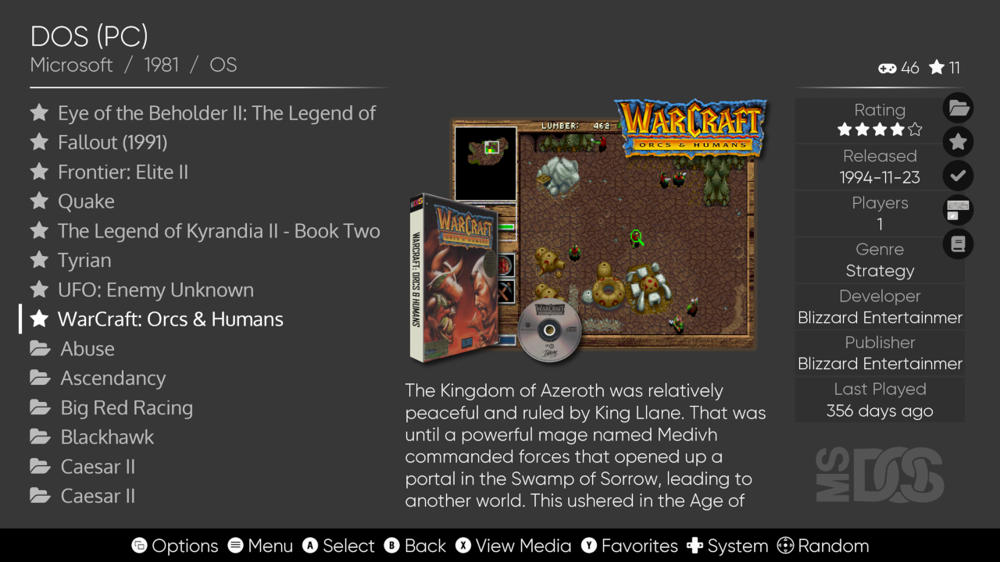
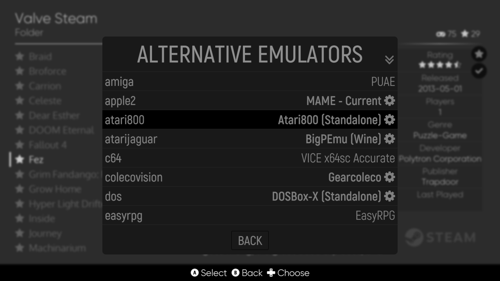
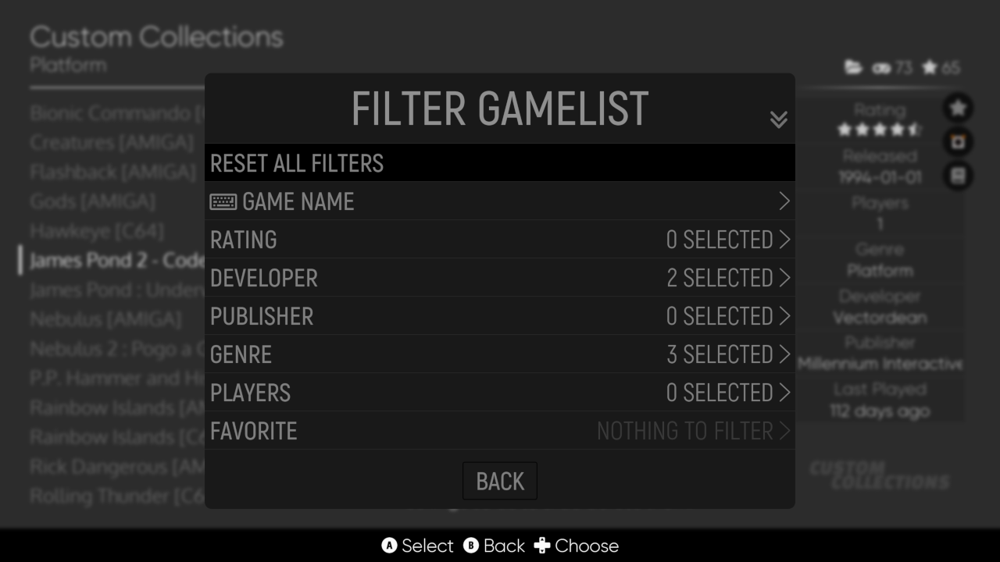

# EmulationStation Desktop Edition (ES-DE) v2.0 (development version) - User guide

This document is intended as a quick start guide and as a reference for the application settings and general functionality. For details on how to build ES-DE from source code and to perform more advanced configuration, please refer to [INSTALL-DEV.md](INSTALL-DEV.md).

This version of the user guide is only relevant for the current ES-DE development version, if you are using the latest stable release, refer to [USERGUIDE.md](USERGUIDE.md) instead.

It's generally recommended to read the [Frequently Asked Questions](FAQ.md) document prior to diving into the information in this guide.

Table of contents:

[[_TOC_]]

## Quick start guide

If you just want to get started as quickly as possible, simply follow these steps:

1) Install ES-DE
2) Start the application and press the _Create directories_ button to generate the ROMs directory structure
3) Put your game ROMs in the directories created by the previous step, or see [here](USERGUIDE-DEV.md#supported-game-systems) for additional details
4) Install [RetroArch](https://www.retroarch.com)
5) Start RetroArch and install the required emulator cores
6) Start ES-DE, scrape game media for your collection and play some games!

You can always close the application immediately by using the keyboard, by default the exit key is mapped to F4 but this can be changed to Alt + F4, Alt + Q or Command Q (on macOS) using the _Exit button combo_ menu option.

For additional details, read on below.

There are also installation videos available at the ES-DE YouTube channel:\
[https://www.youtube.com/channel/UCosLuC9yIMQPKFBJXgDpvVQ](https://www.youtube.com/channel/UCosLuC9yIMQPKFBJXgDpvVQ)

## Installation and first startup

To install ES-DE, just download the package or installer from [https://es-de.org](https://es-de.org) and follow the brief instructions below.

The following operating systems have been tested (all for the x86 architecture unless otherwise stated):

* Windows 11, 10 and 8.1
* macOS 10.14 "Mojave" to 12 "Monterey" (M1 and Intel)
* macOS 10.11 "El Capitan" (legacy release)
* Ubuntu 20.04 to 22.04
* Linux Mint 20
* Manjaro 21
* Fedora 35 Workstation
* SteamOS 3.0
* elementary OS 6
* Raspberry Pi OS 10 and 11 (armv7l and aarch64)
* FreeBSD 13.0
* NetBSD 9.1
* OpenBSD 6.8

Additional known issues are detailed in [CHANGELOG.md](CHANGELOG.md#known-issues).

As for display resolutions, the minimum pixel value is 224 and the maximum is 7680. This means that you can run ES-DE at for instance 320x224 all the way up to 7680x4320 (8K UHD). Vertical screen orientation is also supported, as well as ultra-wide resolutions like 3840x1440. Note that there could be some minor visual glitches when running in vertical orientation (this will be fixed in future ES-DE releases) and for the best experience you will probably need to use a customized theme set when running at extreme or unusual resolutions.

The installation procedure is just covered briefly here and may differ a bit for your specific operating system, so in case of problems refer to your system documentation.

**Installing the Linux .deb package**

The .deb package is intended for Linux distributions based on Debian, such as Ubuntu, Linux Mint, Raspberry Pi OS etc. Your distribution should include a graphical package installer, but if you prefer to use the command line, run the following which will install ES-DE and resolve any dependencies:

```
sudo apt install ./emulationstation-de-1.2.0-x64.deb
```

**Installing the Linux .rpm package**

On Fedora the RPM Fusion repository is a prerequisite for the installation, it can be installed like this:

```
sudo dnf install \
https://download1.rpmfusion.org/free/fedora/rpmfusion-free-release-$(rpm -E %fedora).noarch.rpm \
https://download1.rpmfusion.org/nonfree/fedora/rpmfusion-nonfree-release-$(rpm -E %fedora).noarch.rpm
```

Then you can use the graphical package installer or run this command, either method should automatically resolve the dependencies:

```
sudo dnf install ./emulationstation-de-1.2.0-x64.rpm
```

Of course the filename will differ slightly depending on the architecture, the example above is for the x64/x86 platform.

**Running the Linux AppImage**

In addition to the .deb and .rpm packages covered above, ES-DE is also available as an AppImage which should be usable on most modern x86 64-bit Linux distributions. After download you may have to set the file as executable, such as this:
```
chmod +x EmulationStation-DE-x64.AppImage
```

 But in some desktop environments this is not required and you can simply launch the file by double-clicking on it using your file manager. The first time you do this you will be required to confirm that you actually want to execute the file. Running the AppImage works exactly as if you would launch ES-DE if installed as a .deb or .rpm package. It's also possible to run it from a terminal window, in which case all command line options work the same way as if installed as an ordinary package.

For a better desktop integration it's recommended to install [AppImageLauncher](https://github.com/TheAssassin/AppImageLauncher) which will add an ES-DE entry to the application menu and move the AppImage file to the `~/Applications` directory (which is the recommended location for all AppImages).

**Installing on macOS and Windows**

There's not really much to say about these operating systems, just install ES-DE as you would any other application. On macOS it's via the .dmg drag-and-drop installer, and on Windows via the normal application installer or by unpacking the portable zip file somewhere on your filesystem.

**On first application startup**

Upon first startup, ES-DE will create its `~/.emulationstation` home directory.

On Unix this means /home/\<username\>/.emulationstation/, on macOS /Users/\<username\>/.emulationstation/ and on Windows C:\Users\\<username\>\\.emulationstation\

**Note:** As of ES-DE v1.2 there is no internationalization support, which means that the application will always require the physical rather than the localized path to your home directory. For instance on macOS configured for the Swedish language /Users/myusername will be the physical path but /Användare/myusername is the localized path that is actually shown in the user interface. The same is true on Windows where the directories would be C:\Users\myusername and C:\Användare\myusername respectively. If attempting to enter the localized path for any directory-related setting, ES-DE will not be able to find it. But it's always possible to use the tilde `~` symbol when referring to your home directory, which ES-DE will expand to the physical location regardless of what language you have configured for your operating system. If you're using an English-localized system, this whole point is irrelevant as the physical and localized paths are then identical.

It's possible to override the home directory path using the --home command line option, but this is normally required only for very special situations so we can safely ignore that option for now.

Also on first startup the configuration file `es_settings.xml` will be generated in the ES-DE home directory, containing all the application settings at their default values. Following this, a file named `es_systems.xml` will be loaded from the resources directory (which is part of the ES-DE installation). This file contains the game system definitions including which emulator to use per platform. For some systems there are also alternative emulators defined which can be applied system-wide or per game. How that works is explained later in this guide. A customized systems configuration file can also be used, as described in the next section.

There's an application log file created in the ES-DE home directory named `es_log.txt`, please refer to this in case of any issues as it should hopefully provide information on what went wrong. Starting ES-DE with the --debug flag provides even more detailed information.

After ES-DE finds at least one game file, it will populate that game system and the application will start. If there are no game files, a dialog will be shown explaining that you need to install your game files into your ROMs directory. You will also be given a choice to change that ROMs directory path if you don't want to use the default one. As well you have the option to generate the complete game systems directory structure based on information in es_systems.xml.

When generating the directory structure, a file named systeminfo.txt will be created in each game system folder which will provide you with some information about the system. Here's an example for the _gc_ system as seen on macOS:
```
System name:
gc

Full system name:
Nintendo GameCube

Supported file extensions:
.gcm .GCM .iso .ISO .wbfs .WBFS .ciso .CISO .gcz .GCZ .elf .ELF .dol .DOL .dff .DFF .tgc .TGC .wad .WAD .7z .7Z .zip .ZIP

Launch command:
%EMULATOR_RETROARCH% -L %CORE_RETROARCH%/dolphin_libretro.dylib %ROM%

Platform (for scraping):
gc

Theme folder:
gc
```

The primary use of this file is to see which RetroArch core the system needs, which you will have to install manually from inside the RetroArch user interface. Also the supported file extensions can be quite useful to know.

In addition to this, a file named systems.txt will be created in the root of the ROMs directory which shows the mapping between the directory names and the full system names.

For example:

```
gc: Nintendo GameCube
genesis: Sega Genesis
gx4000: Amstrad GX4000
```

If a custom es_systems.xml file is present in ~/.emulationstation/custom_systems/ any entries from this file will have their names trailed by the text _(custom system)_. So if the GameCube system in the example above would be present in the custom systems configuration file, the system would be shown as _gc (custom system)_ instead of simply _gc_. This is only applicable for the systems.txt and systeminfo.txt files, the trailing text is not applied or used anywhere else in the application.

Note that neither the systeminfo.txt files or the systems.txt file are needed to run ES-DE, they're only generated as a convenience to help with the setup.

There will be a lot of directories created if using the es_systems.xml file bundled with the installation, so it may be a good idea to remove the ones you don't need. It's recommended to move them to another location to be able to use them later if more systems should be added. For example a directory named _DISABLED could be created inside the ROMs folder (i.e. ~/ROMs/_DISABLED) and all game system directories you don't need could be moved there. Doing this reduces the application startup time as ES-DE would otherwise need to scan for game files for all these systems.


_This is the dialog shown if no game files were found. It lets you configure the ROM directory if you don't want to use the default one, and you can also generate the game systems directory structure. Note that the directory is the physical path, and that your operating system may present this as a localized path if you are using a language other than English._

## Upgrading to a newer release

**Note:** Before upgrading ES-DE, make sure that you have not made any system customizations anywhere in the installation directory structure as these files will be overwritten during the upgrade process. All customizations should go into ~/.emulationstation/custom_systems/ as described elsewhere in this guide. None of the upgrade methods mentioned below will ever touch any files inside your .emulationstation directory.

**Linux .deb and .rpm packages**

Upgrading ES-DE using these packages is very straightforward, just run them through the package manager of your operating system and the process should be entirely automatic. Note that you need to manually download the packages from [https://es-de.org](https://es-de.org) as ES-DE is not currently included in any operating system repositories.

**Linux AUR**

AUR upgrades should be automatically handled via your package manager and it should be a completely automatic process. When a new release is available you should be notified of this.

**Linux AppImage**

As the ES-DE AppImages always retain their filenames between releases you only need to replace the previous AppImage with the new one and you're done. Just make sure to set the new AppImage as executable so it can be launched.

**macOS**

Open _Applications_ in Finder and right click on _EmulationStation Desktop Edition_ and choose _Move to Trash_. Then simply install the new release using the .dmg drag-and-drop installer.

**Windows installer**

Just run the installer for the new release. A question will be asked whether you would like to uninstall the old version first. Say yes to this question and then proceed with running through the installer.

**Windows portable**

When upgrading the portable release it's recommended to not overwrite the contents by unpacking on top of the old release but instead to rename the old _EmulationStation-DE_ directory to something else, such as _EmulationStation-DE_OLD_ and then unpack the new release next to it. Following this, move over the contents inside _Emulators_, _ROMs_, _themes_ and _.emulationstation_ from the old to the new directory. That's the safest way to make the upgrade.

## Placing games into non-standard directories

As explained above, the basic logic for how ES-DE works is that it expects game files to be placed into a standardized directory structure under the ROMs directory. The location of this directory is configurable so it could for instance be placed on an external storage device or on a file share served by a NAS. The way it's implemented is via the %ROMPATH% variable in the es_systems.xml file which will always point to this ROM directory. For example this is an entry for the Super Nintendo system:
```
<path>%ROMPATH%/snes</path>
```

In theory it's possible to make a custom system entry and hardcode the path to a specific directory instead of using the %ROMPATH% variable, but this is not really supported and it also makes custom collections non-portable as the path to every game will be an absolute path rather than a path relative to the %ROMPATH% variable. So if you move your games to a different directory, you would manually need to modify all your custom collections configuration files as well as your custom es_systems.xml file.

If you really insist on not placing your games into the ES-DE standard directory structure, a much better solution is to symlink the game directories into the standard directory. In this way you don't need to make a custom es_systems.xml file and any additional emulators and other configuration added to future ES-DE releases will just work after upgrading.

This is an example of symlinking the Super Nintendo game directory on Unix and macOS:
```
cd ~/ROMs
ln -s ~/my_games/super_nintendo/ snes
```

And on Windows (you need to run this as Administrator):
```
cd C:\Users\Myusername\ROMs
mklink /D snes "C:\My Games\Super Nintendo\"
```

## Disabling game systems

The way ES-DE works is that it will always try to load any system for which there are game files available, so to disable a system it needs to be hidden from ES-DE. This is easily accomplished by renaming the game directory to something that is not recognized, for example changing `~/ROMs/c64` to `~/ROMs/c64_DISABLED`. Another approach is to create a subdirectory named DISABLED (or whatever name you prefer that is not matching a supported system) in the ROMs directory and move the game folder there, such as `~/ROMs/DISABLED/c64`. This makes it easy to disable and re-enable game systems in ES-DE. Note that the gamelist.xml file and any game media files are retained while the system is disabled so this is an entirely safe thing to do.

## Placing games and other resources on network shares

Although ES-DE does support placing game ROMs, the `.emulationstation` home directory and the `downloaded_media` directory on network shares, this can lead to serious performance problems in some instances. Especially problematic is the Microsoft SMB protocol as it offers abysmal performance for some disk operations on which ES-DE relies heavily. For small game libraries this can still be acceptable, but for libraries with hundreds or thousands of games the application startup time and overall usage will be very painful or even unusable.

A general recommendation is to place all game files and other data on drives connected directly to the machine where ES-DE is running. Even using low speed technology like USB thumb drives, SD cards etc. is generally fine and leads to acceptable performance in most instances.

If you insist on placing games and other resources on network drives such as a NAS, the NFS protocol has to be used instead of SMB as testing has shown between 10 and 30 times better performance with this protocol. Starting ES-DE with a certain game collection size could easily take minutes using SMB while it takes just seconds when using the NFS protocol. This is not a network throughput issue and using something like a 2.5 Gigabit or even 10 Gigabit wired interface will not help you as the SMB protocol has exceedingly bad latency regardless of physical adapter speed.

Unix-based operating systems like Linux and macOS ship with an NFS client built-in.

Here's how to mount an NFS drive from a NAS called _MyNAS_ on macOS:

```
sudo mkdir /private/ROMs
sudo mount -t nfs -o resvport MyNAS:/ROMs /private/ROMs
```

On Linux it's quite similar:
```
sudo mkdir /mnt/ROMs
sudo mount MyNAS:/ROMs /mnt/ROMs
```

On Windows 10 and 11 the NFS client first needs to be installed as it's not enabled by default. Open the _Control Panel_, then _Programs and Features_, then select _Turn Windows features on or off_ at the left side of the window and tick the box _Services for NFS_. It's unclear if both child items _Administrative Tools_ and _Client for NFS_ need to be selected, but it's probably safest to enable both of them.

Following this you can mount the NFS share in a terminal window as on a Unix system:
```
mount MyNAS:/ROMs g:
```

Note that the above are only examples to illustrate the general approach, you may need to take additional steps to make the configuration persistent across reboot and you may need to make other preparations. The NAS/file server also needs to be configured of course, but that's beyond the scope of this document.

## Specific notes for Windows

In general it should be straightforward to run ES-DE on Windows. Almost all emulators are available on this operating system and driver quality and controller support is normally very good.

Just make sure to not place games or other resources on network shares using the Microsoft SMB protocol as that will lead to unacceptable performance degradations and extremely long startup times if you have a large collection. See the point above on how to setup an NFS share if you insist on placing files or other resources on network drives.

In order for ES-DE to run, graphics drivers with OpenGL support have to be installed. If not, the application simply won't start. For really old graphics cards the available drivers may not provide an OpenGL version that is modern enough for ES-DE to work, and in this case a last resort solution would be to install the _Mesa3D for Windows_ library which provides software-based OpenGL rendering. The library can be downloaded from [https://fdossena.com/?p=mesa/index.frag](https://fdossena.com/?p=mesa/index.frag) and you simply extract the opengl32.dll file into the ES-DE installation directory. Just be aware that the performance may be quite bad.

Installing DS4Windows will break controller input in ES-DE for unknown reasons. Uninstalling this software should resolve the issue. On Windows 11 both DualShock 4 (PS4) and DualSense (PS5) controllers have been tested wired and via Bluetooth and both work fine in both ES-DE and RetroArch without any special drivers or configuration.

There are two ES-DE releases available for Windows; a regular installer and a portable/ZIP version. If going for the first option, an issue is that many emulators are not shipped with proper installers that implement any mechanism to inform ES-DE where they have been installed (like adding a Registry key with their installation path). Such emulators are marked accordingly in the _Supported game systems_ table at the bottom of this guide. These emulators are commonly shipped as a ZIP file that can be unpacked anywhere on the filesystem.

In order for ES-DE to find these emulators you need to add their directories to the operating system's Path environment variable. This is very easy to do, just open the _Settings_ application and then search for _path_ in the _Find a setting_ search box. Select the _Edit the system environment variables_ entry and then click the _Environment variables..._ button and add the emulator directory to the _Path_ variable. You need to restart ES-DE after changing the variable, but following this the emulator should be found when launching a game. If running ES-DE via Steam, you need to restart Steam as well to apply the changes to the Path variable.

The second alternative is to use the portable/ZIP release of ES-DE. This can be unzipped anywhere, including to removable devices such as hard drives or USB memory sticks. Together with games and emulators this makes for a fully portable retrogaming solution. There is a README.txt file distributed with this release that describes the setup, but essentially you just place your games in the ROMs directory and your emulators in the Emulators directory, both of which are included in the portable release.

If you want to create your own portable intallation from scratch or customize the setup, [INSTALL-DEV.md](INSTALL-DEV.md#portable-installation-on-windows) provides additional details.

## Specific notes for macOS

As macOS does not support Vulkan some emulators are not available, and some that do exist have not been updated for this operating system in recent years. But emulator support is steadily improving and native M1/ARM releases are also getting more common. One issue though is that some emulators are not codesigned and notarized so macOS refuses to run them by default. You can override the operating system's security settings however, which will work around this problem. Some emulators are also available via the [Homebrew](https://brew.sh) package manager and in many instances ES-DE includes support for these releases using the bundled configuration.

Lack of controller support is a bit of a problem on macOS, and in some instances controller drivers are available but quite buggy. In general it seems as if Sony PlayStation controllers are better supported than Microsoft Xbox controllers. For third party controllers you need to investigate the macOS support as it seems to differ quite a lot.

ES-DE is available both as an Intel/x86 build and as a native M1/ARM build. If running on an M1 Mac it's possible to launch either M1 or Intel emulators from ES-DE and it's sometimes recommended to go for the Intel versions. The reason is that some emulators are not yet working properly on the M1 architecture, and for RetroArch some cores are only available for the x86 platform. So investigate what makes most sense for your setup. Over time this situation should improve as M1 support matures.

One macOS-specific requirement is that the RetroArch setting _Start in Fullscreen mode_ is enabled or ES-DE will not be able to switch to the emulator window when launching games. As a workaround you can switch to the window manually using Command + Tab but it probably doesn't make sense to run emulators in windowed mode anyway. It's unclear if only RetroArch is affected by this issue, at least it has not been observed for any other emulators so far. The standalone PlayStation 2 emulator PCSX2 has a similar issue but that seems to be GPU driver related and is problematic also on other operating systems. If using this emulator you need to manually switch to the PCSX2 window using Command + Tab after launching a game. If using an M1 Mac then the AetherSX2 emulator is recommended instead of PCSX2.

The first time you launch a RetroArch-emulated game from within ES-DE the operating system will present you with a security option with the following description:

`"EmulationStation Desktop Edition" would like to access files in your Documents folder.`

If you don't allow this, you will not be able to place system BIOS ROMs in the RetroArch default system directory `~/Documents/RetroArch/system` even if you've already given RetroArch access to this folder. This is so because RetroArch runs as a subprocess to ES-DE and therefore inherits the security settings from the parent application. Attempting to launch a game without enabling the access will simply display an error message in the emulator that the BIOS files are missing. This of course only applies to emulators that require BIOS ROMs, all other games should work fine regardless of this security setting.

If you accidentally refused ES-DE the folder access, you can fix this by opening _System Preferences_, selecting _Security & Privacy_ and within the GUI choose _Files and Folders_. The option you need to enable is _Documents Folder_ under _EmulationStation Desktop Edition_.

By default files and directories starting with a dot are hidden on macOS, so to show the .emulationstation directory in your home directory you need to enable hidden files in Finder. You do this using the keyboard combination Shift + Command + . (a dot).

A minor annoyance is that macOS creates metadata files starting with ._ in the filename when placing game/ROM files on some filesystem types such as exFAT. This means that you will see double entries inside ES-DE for all such games. To hide these extra files, the option _Show hidden files and folders (requires restart)_ in the _Other settings_ menu can be set to disabled.

Another problem on macOS 11 Big Sur (and possibly older OS versions) is that when connecting a Sony DualShock 4 controller either via Bluetooth or using a USB cable, two separate controller devices are registered in parallel. This is a bug in either macOS or the DualShock driver and it makes it seem as if ES-DE is registering double button presses when actually two separate controller devices are generating identical input. A workaround if using Bluetooth mode is to plug in the USB cable just after connecting the controller, wait a second or two and then remove the cable again. This will remove the cabled device, leaving only the Bluetooth device active. Another workaround is to enable the setting _Only accept input from first controller_ in the ES-DE input device settings. The reason why this bug may not be visible in some other games and applications is that ES-DE enables and auto-configures all connected controllers. The issue appears to be resolved in macOS Monterey.

## Specific notes for Steam Deck

As the Steam Deck is essentially a Linux desktop computer with a custom user interface, there is really not much specifically to consider when running ES-DE compared to any other Linux-based operating system. There is a specific AppImage available for the Steam Deck though that is recommended to use, as a number of settings will be tuned for the best possible experience on this device.

Another approach is to install ES-DE using [EmuDeck](https://www.emudeck.com) which will automatically download the latest Steam Deck release.

For Flatpak releases of some emulators you may need to give extra permissions to be able to launch games placed on external devices such as a memory card. This is the case for instance for melonDS and RPCS3. The easiest way to do this is by using [Flatseal](https://flathub.org/apps/details/com.github.tchx84.Flatseal). The option you need to enable is _All system files_ in the _Filesystem_ section.

## Specific notes for Raspberry Pi

ES-DE on the Raspberry Pi requires a desktop environment, or more specifically a window manager and a sound server (like PulseAudio or PipeWire). There are no plans to add support for direct hardware access to the framebuffer or to ALSA. If you want to use your Raspberry Pi as an appliance, take a look at [RetroPie](https://retropie.org.uk), [Recalbox](https://www.recalbox.com) or [Batocera](https://batocera.org) instead.

The Raspberry Pi 4/400 is the minimum recommended version and earlier boards have not been tested. The GPU memory should be set to at least 256 MiB using `raspi-config` and the GL driver must be set to `GL (Fake KMS)` or the performance will be horrible. On Raspberry Pi OS 11 the KMS option is enabled by default.

In general, 720p works fine with the RPi 4, and 1080p is tolerable but not really a nice and smooth experience. Due to the relative weakness of the Rasperry Pi GPU, the video scanline rendering options for the screensaver and media viewer have been disabled (they're enabled by default on all other platforms). These options can be re-enabled via the menu if you don't mind lower video framerates.

Both the 32-bit (armv7l) and 64-bit (aarch64) versions of Raspberry Pi OS are supported. Although the 64-bit version of ES-DE actually runs much better than the 32-bit version it's still generally recommended to go for the 32-bit OS for now. The reason is that the Raspberry Pi Foundation has still not officially released the 64-bit version of Raspberry Pi OS so it's somewhat of a beta with some functionality apparently broken. As well there seems to be issues with installing RetroArch cores on aarch64 so you would probably need to compile them from source code.

At the time of writing the Snap version of RetroArch appears broken and won't start on the 32-bit OS, so the Flatpak version would have to be installed. That is accomplished using these commands:

```
sudo apt install flatpak
sudo flatpak remote-add --if-not-exists flathub https://flathub.org/repo/flathub.flatpakrepo
```

Following this you need to reboot, and then run this command:

```
sudo flatpak install retroarch
```

This will download and install a few hundred megabytes of data as there are some dependencies. Unfortunately the Flatpak environment does not seem to be properly setup so you will have to launch RetroArch like this to install your emulator cores:

```
/var/lib/flatpak/exports/bin/org.libretro.RetroArch
```

ES-DE will however detect and launch RetroArch correctly.

If the Snap version of RetroArch will be fixed in the future, it can be installed like this:

```
sudo apt-get install snapd
sudo snap install retroarch
sudo snap connect retroarch:removable-media
```

(The last line is only required if you intend to place your ROMs on an external device such as a USB-connected hard drive.)

On Raspberry Pi OS 10 Sony DualShock 4 controllers have problems with some button presses that don't register correctly. The issue appears resolved on Raspberry Pi OS 11.

On Raspberry Pi OS 11 there are various graphics issues and sometimes the application or emulator completely freezes which requires a power cycle of the machine. This is seemingly due to GPU driver bugs and we can only wait for OS updates to address these problems. These issues have not been encountered on Raspberry Pi OS 10 so for now this older OS version is recommended.

## Game system customizations

The game systems configuration file `es_systems.xml` is located in the ES-DE resources directory which is part of the application installation. As such this file is not intended to be modified directly. If system customizations are required, a separate es_systems.xml file should instead be placed in the `custom_systems` folder in the ES-DE home directory.

On Unix this means /home/\<username\>/.emulationstation/custom_systems/es_systems.xml, on macOS /Users/\<username\>/.emulationstation/custom_systems/es_systems.xml and on Windows C:\Users\\<username\>\\.emulationstation\custom_systems\es_systems.xml

Although it's possible to make a copy of the bundled configuration file, to modify it and then place it in this directory, that is not how the system customization is designed to be done. Instead the intention is that the file in `custom_systems` complements the bundled configuration, meaning only systems that are to be customized should be included.

For example you may want to replace the emulator launch command, modify the full name or change the supported file extensions for a single system. In this case it wouldn't make sense to copy the complete bundled file and just apply these minor modifications, instead an es_systems.xml file only containing the configuration for that single system should be placed in the custom_systems directory.

The instructions for how to customize the es_systems.xml file can be found in [INSTALL-DEV.md](INSTALL-DEV.md#es_systemsxml). There you can also find some examples of custom files that you can copy into ~/.emulationstation/custom_systems/ and modify as required.

## Migrating from other EmulationStation forks

**IMPORTANT!!! IMPORTANT!!! IMPORTANT!!!**

ES-DE is designed to be backward compatible to a certain degree. That is, it should be able to read data from other/previous EmulationStation versions such as the RetroPie fork. But the opposite is not true and it's a one-way ticket for your gamelist.xml files and your custom collection files when migrating to ES-DE as they will be modified in ways that previous ES versions will see as data loss. For instance ES-DE does not use image tags inside the gamelist.xml files to find game media but instead matches the media to the names of the game/ROM files. So it will not save any such tags back to the gamelist files during updates, effectively disabling the game media if the files are opened in another ES fork.

Due to this, always make backups of at least the following directories before testing ES-DE for the first time:

```
~/.emulationstation/gameslists/
~/.emulationstation/collections/
```

Also note that if you have gamelist.xml files in your ROMs directory tree then ES-DE will be able to use those as well, so make sure to make backups of these files too.

It's however recommended to move all such files to the ~/.emulationstation/gamelists/ tree as any new system you add to ES-DE will have its gamelist.xml file created there. The ability to read gamelist.xml files from the ROMs directory tree is only a backward compatibility feature and/or functionality for the few people who insist on keeping their existing gamelist.xml files there.

It's also strongly adviced to not rename an old es_settings.cfg file to es_settings.xml for use in ES-DE. Although this has been tested to some extent, it may cause undefined behavior.

If migrating from Batocera or Recalbox, be aware that ES-DE follows the RetroPie naming conventions for game systems. This means that your game files may not be found unless the folders are renamed accordingly. Such an example is the Sega SG-1000 system which in Batocera and Recalbox has the _sg1000_ system name, but is _sg-1000_ in RetroPie and ES-DE. See the [Supported game systems](USERGUIDE-DEV.md#supported-game-systems) table at the bottom of this guide for the correct system names in ES-DE. This issue also means that theme sets that were written or adapted specifically for Batocera or Recalbox may display unthemed systems in ES-DE. All RetroPie theme sets should however work fine (of course assuming that all your systems are actually supported by the theme set).

## Running on high resolution displays

ES-DE fully supports high resolution displays such as 1440p, 4K, 6K, 8K, ultrawide monitors etc. But many emulators (e.g. RetroArch) will also run using the same resolution which may cause performance problems on slower machines or when using resource intensive shaders. Although some emulator cores will have options to set their internal resolution, they still need to be scaled up to the screen resolution.

A solution to this is to use the custom event scripts functionality to set a temporary resolution upon launching a game that will be reverted when returning to ES-DE. Such a setup is detailed in [INSTALL-DEV.md](INSTALL-DEV.md#custom-event-scripts) for Unix, but should hopefully be possible to implement similarly on Windows. When going for this setup it's important that the setting _Run in background (while game is launched)_ is disabled or ES-DE may not be able to correctly switch to the emulator window when launching games.

On macOS it's problematic to change screen resolutions on the fly or on a per-application basis as Apple has seemingly disabled most of this functionality in recent operating system releases. The only real option here is to lower the display resolution prior to launching ES-DE.

## Input device configuration

ES-DE automatically configures the keyboard and any connected controllers using default button mappings, and normally no additional setup is required. But if you would like to apply custom button mappings for your devices or if you have an unusual device which isn't automatically configured, you can run the _Configure keyboard and controllers_ tool from the _Input device settings_ entry on the main menu.

You can also force a run of this tool directly on startup via the command line argument `--force-input-config`.

The actual procedure to map the inputs should be self-explanatory, just follow the on-screen instructions. Note that custom button mappings will not change the help prompts.

Any custom configuration is applied per unique device ID (GUID). So if two identical controllers are used with ES-DE, both will have the same configuration applied. If connecting controllers of the same type but of different revisions, the GUID may differ and therefore the custom configuration would need to be applied to each device individually.

If you have issues with your input configuration, as a last resort you can reset all the mappings by deleting or renaming the file ~/.emulationstation/es_input.xml.

## System view (main screen)

When starting ES-DE with the default settings, you will see the System view first. From here you can navigate your game systems and enter their respective gamelists.

Depending on the theme, the system navigation carousel can be horizontal, vertical or displayed as a wheel. The default theme slate-DE provides horizontal navigation, i.e. you browse your systems by scrolling left or right.

The game systems are sorted by their full names by default, as defined in the es_systems.xml file. It's however possible to set a custom sortname per system, as explained in the [INSTALL-DEV.md](INSTALL-DEV.md#es_systemsxml) document.


_The **System view** is the default starting point for the application, it's here that you browse through your game systems._

## Gamelist view

The gamelist view is where you browse and start your games, and it's where you will spend most of your time using ES-DE.

Upon startup with the default settings, ES-DE is set to the gamelist view style **Automatic**. In this mode the application will look for any game media files (videos and images) and set the view style accordingly. If at least one image is found for any game, the view style **Detailed** will be shown, and if at least one video file is found, the view style **Video** will be selected (superceding the Detailed style). If no game media files are found for a system, the simple **Basic** view style will be selected. This automatic selection is applied per game system.

Note that the Video view style requires that the theme supports it. If not, the Detailed style will be selected instead. The default theme slate-DE supports both of these view styles.

It's possible to manually set a specific gamelist view style in the UI settings entry of the main menu, but this is applied globally regardless of what media files are available per game system. The manual setting also overrides the theme-supported view styles which has the potential of making ES-DE very ugly indeed if the theme does not support the selected view style.

In addition to the styles just described, there is a **Grid** view style as well, but as of ES-DE version 1.2 this does not work correctly and is set as deprecated. Future ES-DE releases will remove this style entirely.

If the theme supports it, there's a gamelist information field displayed in the gamelist view, showing the number of games for the system (total and favorites) as well as a folder icon if a folder has been entered. When applying any filters to the gamelist, the game counter is replaced with the amount of games filtered, as in 'filtered / total games', e.g. '19 / 77'. If there are game entries in the filter result that are marked not to be counted as games, the number of such files will be indicated as 'filtered + filtered non-games / total games', for example '23 + 4 / 77' indicating 23 normal games, 4 non-games out of a total of 77. Due to this approach it's theoretically possible that the combined filtered game amount exceeds the number of counted games in the collection, for instance '69 + 11 / 77'. This is not considered a bug and is so by design. This gamelist information field functionality is specific to ES-DE so older themes will not support this.

Another feature which requires theme support is **Badges**, which is a set of icons displaying the status for various metadata fields. The currently supported badge types are _favorite, completed, kidgame, broken, controller_ and _alternative emulator_. If any of the first four metadata fields have been set for a game, their corresponding badges will be displayed. If a game-specific controller has been selected via the metadata editor, the corresponding controller badge will be shown, and if an alternative emulator has been selected for the specific game, that badge will be displayed. Setting an alternative emulator system-wide will not display this badge as it's only intended to indicate game-specific overrides. As well, disabling the option _Enable alternative emulators per game_ will also hide the alternative emulator badges.


_The **Gamelist view** is where you browse the games for a specific system._


_Here's an example of what the Basic view style looks like. Needless to say, ES-DE is not intended to be used like this. After scraping some game media for the system, the view style will automatically change to Detailed or Video (assuming the Automatic view style option has been selected)._

## UI modes

ES-DE supports three separate modes, **Full**, **Kiosk** and **Kid**.

These modes mandate the functionalty provided by the application in the following way:

* Full - This is the default mode which enables all functionality.
* Kiosk - The main menu will be severely restricted, only displaying the entry to change the audio volume. The game options menu will be restricted as well, removing the metadata editor and the ability to modify custom game collections. And finally the ability to flag or unflag games as favorites will be removed. Apart from this all games will be playable.
* Kid - Only games marked as being suitable for children will be displayed (this flag is set manually per game using the metadata editor). Additionally, the game options menu is disabled as is the ability to flag and unflag games as favorites. There is also a separate option available to enable or disable the main menu when in Kid mode, see _Enable menu in kid mode_ for additional information.

There is an unlock code available to revert to the Full mode from the Kiosk or Kid mode, as is described when changing this setting from the main menu. By default the button sequence is **Up, Up, Down, Down, Left, Right, Left, Right, B, A** (or equivalent buttons if an Xbox controller is not used). Either the keyboard or a controller can be used to input the passkey sequence, but it can't be entered when a menu is open.

The application can also be forced into any of the three modes via the command line options `--force-full`, `--force-kiosk` and `--force-kid`. This is only temporary until the restart of the application, unless the settings menu is entered and the setting is saved to the configuration file (this assumes that the main menu is available in the selected UI mode of course).

## Help system

There is a help system available throughout the application that provides an overview of the possible actions and buttons that can be used. But some general actions are never shown, such as the ability to quick jump in gamelists, menus and text input fields using the shoulder and trigger buttons. It's also possible to disable the help system using a menu option for a somewhat cleaner look.


_The help system is displayed at the bottom of the screen, indicating the various actions currently available._

## General navigation

The built-in help system will provide a contextual summary of the available navigation options, but here's still a general overview. These are the buttons mappings automatically applied by ES-DE, but they can be customized using the input configurator as described earlier in this document. It's not an exhaustive list, but it covers most situations. The button names are based on the Xbox 360 controller as that is the naming convention used by the SDL library which handles the controller input in ES-DE.

The default keyboard mappings are shown in brackets.

**Up and down**\
_(Arrow up / Arrow down)_

Navigate up and down in gamelists, between systems in the system view (if the theme has a vertical carousel) and in menus.

**Left and right**\
_(Arrow left / Arrow right)_

Navigate between gamelists (if the _Quick system select_ option has been enabled), between systems in the system view (if the theme has a horizontal carousel) and between media files in the media viewer. If the _Enable screensaver controls_ option has been enabled, either button also randomly selects a new game when using the Video or Slideshow screensavers.

**Start button**\
_(Escape)_

Opens and closes the main menu.

**Back button**\
_(F1)_

Opens and closes the game options menu in the gamelist view, or toggles the screensaver in the system view (if the _Enable screensaver controls_ setting is enabled).

**Left and right shoulder buttons**\
_(Page up / Page down)_

Provides quick jumping in gamelists and menus, jumps 10 games in the gamelists and 6 entries in the menus. Also jumps forward in text edit dialogs.

**Left and right trigger buttons**\
_(Home / End)_

Jumps to the first and last entry of the gamelists, menus and text edit dialogs.

**Left and right thumbstick click**\
_(F2 / F3)_

Jumps to a random game or system depending on whether pressed when in the system view or gamelist view. Only available if the _Enable random system or game button_ option has been enabled.

**A button**\
_(Enter)_

Opens gamelists from the system view, launches games, enters folders, selects menu entries etc.

**B button**\
_(Back key)_

Back button, self explanatory.

**X button**\
_(Delete)_

Starts the game media viewer (which is accessible from the gamelist views). Used by some other minor functions as explained by the help system and/or this guide.

**Y button**\
_(Insert on Unix and Windows, F13 on macOS)_

Marks games as favorites in the gamelist view (if the _Enable toggle favorites button_ option has been enabled). Used by some other minor functions as explained by the help system and/or this guide.

**F4 (keyboard only)** _Could alternatively be Alt + F4, Alt + Q or Command + Q_

Quits the application. This key combination can be changed using the _Exit button combo_ menu option described later in this document.

## RetroArch setup

ES-DE is a game browsing frontend and does not provide any emulation by itself. It does however come preconfigured for use with emulators as setup in the `es_systems.xml` file. By default it's primarily setup for use with [RetroArch](https://www.retroarch.com) but this can be modified if needed. If you're interested in customizing your es_systems.xml file, please refer to the [INSTALL-DEV.md](INSTALL-DEV.md#es_systemsxml) document which goes into detail on the structure of this file and more advanced configuration topics in general.

Installation and configuration of RetroArch and other emulators is beyond the scope of this guide, but many good resources can be found online on how to do this.

Keep in mind that ES-DE will not install any RetroArch cores, you need to do this manually from within the RetroArch user interface.

A general recommendation regarding installation on Linux is to try to avoid the RetroArch releases included in the OS repositories as they're usually quite limited with regards to the number of available cores, and they're usually older versions. Instead go for either the Snap, Flatpak or AppImage distributions or build from source.

If using the Snap distribution you need to run the following command if you intend to place your ROMs on a removable device such as a USB-connected hard drive:
```
sudo snap connect retroarch:removable-media
```

The default es_systems.xml file is paired with a file named es_find_rules.xml which tries to find the emulators and cores using some predefined rules. For Windows this should normally just work, and for macOS too as long as RetroArch is installed at the default location /Applications/RetroArch.app. For Unix/Linux there is one exception that is slightly problematic which is AppImage packages as there is no standardized directory for storing these files. Read more [here](USERGUIDE-DEV.md#using-emulators-in-appimage-format-on-linux) on how to get the AppImage release of RetroArch to work.

If ES-DE is unable to find an emulator when a game is launched, a notification popup will be shown. Likewise a notification will be shown if the defined emulator core is not installed. The es_log.txt file will also provide additional details.

## Using the Steam release of RetroArch

On Windows it's no problem to use the Steam release of RetroArch although you may have to add the installation location manually to your Path environment variable. By default the following locations will be searched:
```
C:\Program Files (x86)\Steam\steamapps\common\RetroArch\retroarch.exe
D:\Program Files (x86)\Steam\steamapps\common\RetroArch\retroarch.exe
C:\Program Files\Steam\steamapps\common\RetroArch\retroarch.exe
D:\Program Files\Steam\steamapps\common\RetroArch\retroarch.exe
```

If you have installed RetroArch at another location, simply start the Settings application, search for _path_ in the _Find a setting_ field and choose _Edit environment variables for your account_. Edit the _Path_ variable and add the directory where RetroArch is installed. This is required as there is no apparent way for ES-DE to find where RetroArch has been installed by the Steam application.

Unfortunately on Linux it's at the moment not possible to run the Steam release of RetroArch due to technical reasons. This RetroArch release runs as a type of container which can't be executed from ES-DE while correctly passing the necessary core and game options. Similarly it's not possible to launch RetroArch via the Steam application either as there seems to be a bug in Steam or RetroArch that prevents blankspaces from being present in game ROM files when passed as arguments (this works fine on Windows so it's definitely a Linux-specific issue and as well the same problem occurs if attempting to manually enter the launch command from a terminal window).

## Using emulators in AppImage format on Linux

AppImages are a great way to package emulators on Linux as they work across many different distributions, and launching and running them introduces virtually no overhead. There is one small problem though in that there is no standardized directory for storing these files, meaning ES-DE could have issues locating them.

Therefore all bundled emulator configuration entries that support AppImages will look for these files in the following directories:

```
~/Applications/
~/.local/bin/
~/bin/
```

It's generally recommended to go for the ~/Applications/ directory, but depending on your Linux distribution this may or may not exist by default. If the directory doesn't exist, then just go ahead and create it. Keep in mind that Linux is case-sensitive so make sure to spell it with a capital A.

As AppImages often embed version information into the actual filename, the bundled configuration uses wildcards to locate the files, such as `rpcs3*.AppImage` which would match the filename `rpcs3-v0.0.19-13103-cc21d1b3_linux64.AppImage` for instance. Note that if multiple files match the wildcard pattern, the first file returned by the operating system will be selected.

This approach also works when using [AppImageLauncher](https://github.com/TheAssassin/AppImageLauncher) which is recommended as it properly integrates AppImages into the application menu and such. When first launching an AppImage with AppImageLauncher installed a question will be asked whether to integrate the application. If accepting this, the AppImage will be moved to the `~/Applications` directory and a hash will be added to the filename, like in this example:
```
rpcs3-v0.0.19-13103-cc21d1b3_linux64_54579676ed3fa60dafec7188286495e4.AppImage
```
Again, the wildcard matching means this filename should be found by ES-DE when launching a game so no additional setup should be required.

If not using AppImageLauncher, then make sure to set the AppImages as executable or ES-DE will not be able to launch them. For example:
```
cd ~/Applications
chmod +x ./rpcs3-v0.0.19-13103-cc21d1b3_linux64.AppImage
```

The following emulators are supported in AppImage format when using the bundled configuration:

| System name  | Emulator    | Filename configuration          |
| :----------- | :---------- | :------------------------------ |
| _Multiple_   | RetroArch   | RetroArch-Linux-x86_64.AppImage |
| gba          | mGBA        | mGBA*.AppImage                  |
| gc           | Dolphin     | Dolphin_Emulator*.AppImage      |
| ps2          | Play!       | Play!*.AppImage                 |
| ps3          | RPCS3       | rpcs3*.AppImage                 |
| psx          | DuckStation | duckstation-nogui-x64.AppImage  |
| psx          | DuckStation | duckstation-qt-x64.AppImage     |
| switch       | Yuzu        | yuzu*.AppImage                  |
| xbox         | xemu        | Xemu*.AppImage                  |
| wii          | Dolphin     | Dolphin_Emulator*.AppImage      |

RetroArch does not embed any version information into the filename so no wildcard is required.

## Using manually downloaded emulators on Linux

Normally on Linux you would install emulators using either one of the established package formats, i.e. Flatpak, AppImage or Snap, or you would install them using the operating system repository. Less likely would be to build from source code and install to a standard system directory. In all these instances ES-DE should be able to find the emulator when launching a game. But in some rare cases you may instead manually download an emulator as an archive file to unzip somewhere on the file system. Normally you would want to place these files in your home directory, and if running a distribution that has an immutable filesystem (such as SteamOS), you don't even have the choice to install them to a standard system directory.

For these situations ES-DE looks for emulators in the same directories where it looks for AppImages (as explained in the section above), meaning:
```
~/Applications/
~/.local/bin/
~/bin/
```

It's generally recommended to go for the ~/Applications/ directory, but depending on your Linux distribution this may or may not exist by default. If the directory doesn't exist, then just go ahead and create it. Keep in mind that Linux is case-sensitive so make sure to spell it with a capital A.

So placing a manually downloaded emulator binary in either of these directories will make ES-DE able to locate it during game launch.

The following manually downloaded emulators are supported when using the bundled configuration:

| System name  | Emulator      | Filename configuration          |
| :----------- | :------------ | :------------------------------ |
| daphne       | Hypseus Singe | hypseus-singe/hypseus.bin       |
| dreamcast    | Redream       | redream                         |
| switch       | Ryujinx       | publish/Ryujinx                 |

Note that the Ryujinx binary is not set as executable after unpacking the archive, so you need to do that once before ES-DE can run it:
```
cd ~/Applications/publish
chmod +x ./Ryujinx
```

Hypseus Singe is also a special case as you may have to compile this emulator yourself as mentioned elsewhere in this guide.

## Running emulators in fullscreen mode

In general ES-DE does not pass command line parameters to emulators to start them in fullscreen mode. This is so as for most (if not all) emulators, command line arguments overrides the settings the user has defined. This means that windowed mode would have become impossible to achieve without creating custom systems configuration entries if ES-DE enforced fullscreen mode. There are only a very few exceptions for emulators where there is no other way to enter fullscreen mode than by passing such options during game launch.

So if an emulator starts in windowed mode and you prefer to have it running in fullscreen mode instead, make sure to enable that option in the emulator settings or configuration file (which should be a one-time job).

## Getting your games into ES-DE

For most systems this is straightforward, just put your game files into the folder corresponding to the platform name (these names can be found at the [end](USERGUIDE-DEV.md#supported-game-systems) of this guide.)

But for some systems a more elaborate setup is required, and we will attempt to cover such situations in this guide as well.

### Single game file installation

Let's start with the simple scenario of a single ROM file per game, which is the case for the majority of platforms. In this example we're setting up ES-DE to play Nintendo Entertainment System games.

The supported file extensions are listed in [unix/es_systems.xml](resources/systems/unix/es_systems.xml), [macos/es_systems.xml](resources/systems/macos/es_systems.xml) and [windows/es_systems.xml](resources/systems/windows/es_systems.xml) but if you generated the game system directories on first application startup, there will be a file named systeminfo.txt in each game system directory that includes the list of supported file extensions.

Here is a snippet from unix/es_systems.xml:

```xml
<system>
    <name>nes</name>
    <fullname>Nintendo Entertainment System</fullname>
    <path>%ROMPATH%/nes</path>
    <extension>.nes .NES .unf .UNF .unif .UNIF .7z .7Z .zip .ZIP</extension>
    <command label="Nestopia UE">%EMULATOR_RETROARCH% -L %CORE_RETROARCH%/nestopia_libretro.so %ROM%</command>
    <command label="FCEUmm">%EMULATOR_RETROARCH% -L %CORE_RETROARCH%/fceumm_libretro.so %ROM%</command>
    <command label="Mesen">%EMULATOR_RETROARCH% -L %CORE_RETROARCH%/mesen_libretro.so %ROM%</command>
    <command label="QuickNES">%EMULATOR_RETROARCH% -L %CORE_RETROARCH%/quicknes_libretro.so %ROM%</command>
    <platform>nes</platform>
    <theme>nes</theme>
</system>
```

The ROM files must named using one of the supported file extensions, or ES-DE won't find them.

It's highly recommended to use filenames that are corresponding to the full name of the game, otherwise you will need to manually feed the scraper the game name when scraping which is very tedious.

**Note:** Symlinks are supported for both ROM directories and individual game files, but make sure to not symlink between files within the same system directory or there may be undefined application behavior when scraping, launching games etc.

The default game folder is ~/ROMs. On Unix this defaults to /home/\<username\>/ROMs, on macOS /Users/\<username\>/ROMs and on Windows C:\Users\\<username\>\ROMs\. If the --home command line option was used to start ES-DE, the tilde symbol will resolve to whatever directory was passed as an argument to this option.

Assuming the default ROM directory is used, we need to create a subdirectory corresponding to the \<path\> tag in es_systems.xml, for this example it's `nes`.

So this would look something like the following:

```
/home/myusername/ROMs/nes     # On Unix
/Users/myusername/ROMs/nes    # On macOS
C:\Users\myusername\ROMs\nes  # On Windows
```

Then simply copy your game ROMs into this folder, and you should end up with something like this (example for Unix):

```
~/ROMs/nes/Legend of Zelda, the.zip
~/ROMs/nes/Metal Gear.zip
~/ROMs/nes/Super Mario Bros. 3.zip
```

**Note:** These directories are case sensitive on Unix, so creating a directory named `Nes` instead of `nes` won't work.

That's it, start ES-DE and the NES game system should be populated. You can now scrape information and media for the games, and assuming you've setup RetroArch correctly with the Nestopia UE core, you can launch the games. If you instead prefer to use any of the three alternative emulators listed above (FCEUmm, Mesen or QuickNES) you can install one of these cores instead and change your emulator preference using the _Alternative emulators_ interface in the _Other settings_ menu. Note that alternative emulators are only available for some game systems.

### Multiple game files installation

For some systems, there are sometimes (or always) multiple files per game. Such an example would be the Commodore 64 when multidisk games are being played. For such instances, simply group the files inside folders.

The system name for the Commodore 64 is `c64`, so the following structure would be a possible approach:

```
~/ROMs/c64/Cartridge
~/ROMs/c64/Tape
~/ROMs/c64/Disk
~/ROMs/c64/Multidisk
~/ROMs/c64/Multidisk/Last Ninja 2.m3u/LNINJA2A.D64
~/ROMs/c64/Multidisk/Last Ninja 2.m3u/LNINJA2B.D64
~/ROMs/c64/Multidisk/Last Ninja 2.m3u/Last Ninja 2.m3u
~/ROMs/c64/Multidisk/Pirates!.m3u/PIRAT-E0.d64
~/ROMs/c64/Multidisk/Pirates!.m3u/PIRAT-E1.d64
~/ROMs/c64/Multidisk/Pirates!.m3u/PIRAT-E2.d64
~/ROMs/c64/Multidisk/Pirates!.m3u/Pirates!.m3u
```

It's highly recommended to create `.m3u` playlist files for multi-disc images as this normally automates disk swapping in the emulator. It's then this .m3u file that should be selected for launching the game.

The .m3u file simply contains a list of the game files, for example in the case of Last Ninja 2.m3u:

```
LNINJA2A.D64
LNINJA2B.D64
```

Setting the directories to the same name as the .m3u files will interpret them as files, meaning they will behave just like any normal files inside ES-DE instead of being displayed as folders. When launching such a game, the file inside the directory that matches the directory name will be passed to the emulator. See the following section below for more information about this functionality.

This setup is of course entirely optional, you can also leave the directories as normal folders, meaning they will behave just like you would expect, i.e. you will have to enter them and then select the file you want to launch. If going for this setup it's possible to easily hide the files that are not relevant using the metadata editor.

### Directories interpreted as files

There are two scenarios where it's useful to interpret directories as files inside ES-DE. The first one is to hide the directory structure for multi-file/multi-disc games while still being able to directly launch files inside these folders, and the second is that some emulators support passing a directory rather than an individual file as the game ROM argument.

In both cases, renaming a directory to one of the supported file extensions will automatically make ES-DE interpret it as a file. This also means that the directory can be part of the automatic collections and any custom collections.

The only difference between a real file and a directory interpreted as a file is that the _Delete_ button in the metadata editor will be disabled as ES-DE does not support deletion of directories for safety reasons.

For the first scenario, to automatically launch a file inside a directory, just rename the directory to the same name as the file inside the folder that you would like to launch. For example:
```
~/ROMs/dreamcast/Jet Grind Radio.cue/
~/ROMs/dreamcast/Jet Grind Radio.cue/Jet Grind Radio.cue
~/ROMs/dreamcast/Jet Grind Radio.cue/Jet Grind Radio.gdi
~/ROMs/dreamcast/Jet Grind Radio.cue/Jet Grind Radio (Track 1).bin
~/ROMs/dreamcast/Jet Grind Radio.cue/Jet Grind Radio (Track 2).bin
~/ROMs/dreamcast/Jet Grind Radio.cue/Jet Grind Radio (Track 3).bin
```

In this case the directory is named _Jet Grind Radio.cue_, i.e. exactly the same name as one of the files inside the directory. This means that when launching the game, `~/ROMs/dreamcast/Jet Grind Radio.cue/Jet Grind Radio.cue` will actually be passed to the emulator.

Here's another example when using .m3u files:

```
~/ROMs/psx/Final Fantasy VII.m3u/
~/ROMs/psx/Final Fantasy VII.m3u/Final Fantasy VII (Disc 1).chd
~/ROMs/psx/Final Fantasy VII.m3u/Final Fantasy VII (Disc 2).chd
~/ROMs/psx/Final Fantasy VII.m3u/Final Fantasy VII (Disc 3).chd
~/ROMs/psx/Final Fantasy VII.m3u/Final Fantasy VII.m3u
```

In exactly the same manner, the file `~/ROMs/psx/Final Fantasy VII.m3u/Final Fantasy VII.m3u` will be passed to the emulator on game launch. See the section just above this one, _Multiple game files installation_ for an explanations of how .m3u files work.

The second scenario is when an emulator supports passing a directory rather than a file to launch a game. Such an example is the PlayStation 3 emulator RPCS3.

For PS3 games the extension in es_systems.xml is .ps3 so this is what a game directory could look like:
```
~/ROMs/ps3/Gran Turismo 5.ps3
```

It's possible to combine these types of special directories with normal directories, for a setup like this:
```
~/ROMs/ps3/racing/Gran Turismo 5.ps3
```

Also in this case the directory will be displayed as a regular game file inside ES-DE and when launching the game the directory is passed as the game ROM argument to RPCS3.

### Folder flattening

**This functionality is experimental and may cause all sorts of issues including corrupting your gamelist.xml files, so make sure to have backups of your data prior to attempting to use this.**

ES-DE works according to the filesystem paradigm used on most operating systems, meaning the file and directory structure of your ROMs directory is reflected inside the application. So if you create a directory on the filesystem and place some games in there, it will be reflected inside ES-DE as a folder that you can enter and launch games from.

A slight exception to this is the _Directories interpreted as files_ functionality where you can display a folder as a single entry. But even then, the basic directory structure is retained.

However, some users have a setup where they have separated games inside their systems into folders but would still want to see these as a flat structure in ES-DE. While this is possible to accomplish, it's discouraged as it will cause multiple issues:
* It completely disables folder support for the system
* Any identically named files will be added only once in a semi-random fashion, meaning you could miss some games
* If there is metadata available for multiple games with the same filename (which could happen if scraping was done prior to flattening the folders) then the behavior is undefined and metadata from the wrong game may get used
* Some systems like MS-DOS and ScummVM may be completely broken
* The setup may cause confusion when reorganizing your collection and similar as what you'll see inside ES-DE will not reflect what you see if navigating the ROM directory in your operating system's file manager

Only enable this functionality if you know exactly what you're doing and understand the adverse side effects mentioned above. If you have any name collisions in your directory structure then make sure to rename each file to have a unique name. Also delete your gamelist.xml file and rescrape the entire system after fixing any collisions as it's otherwise random which metadata will be used for those games.

If you still want to go ahead and enable folder flattening, then place an empty file named `flatten.txt` in the root of each system where you would like to have this applied.

Here's an example setup:
```
~/ROMs/nes/EU/Kid Icarus.zip
~/ROMs/nes/EU/Metal Gear (EU).zip
~/ROMs/nes/USA/Kid Icarus.zip
~/ROMs/nes/USA/Metal Gear (USA).zip
~/ROMs/nes/Contra.zip
~/ROMs/nes/Recca.zip
~/ROMs/nes/flatten.txt
```

For this example the following entries will show up inside ES-DE:
```
Contra
Kid Icarus
Metal Gear (EU)
Metal Gear (USA)
Recca
```

Note that _Kid Icarus_ will only show up once since there is a name collision present and in this case only the first file processed will be added and any other identically named files will be ignored. Also note that in this case it's random whether metadata from _EU/Kid Icarus_ or _USA/Kid Icarus_ will be used.

### Special game installation considerations

Not all systems are as simple as described above, or there may be multiple ways to do the configuration. Specifics for such systems will be covered here. Consider this a work in progress as there are many platforms supported by ES-DE.

#### Arcade and Neo Geo

For all the supported MAME variants as well as Final Burn Alpha/FinalBurn Neo and Neo Geo, single file archives should be used. But these should retain the MAME names as filenames since ES-DE ships with MAME lookup tables, meaning the MAME names are expanded to the full game names.

For instance `topgunnr.7z` will be expanded to `Top Gunner`.

This is required by the TheGamesDB scraper where the expanded filenames are used for game searches. (Screenscraper natively supports searches using the MAME names). It's also quite nice to have the gamelist populated with the expanded game names even before any scraping has taken place.

If emulating Sega Model 2 games using _Model 2 Emulator_, then you need to change the ROM directory path in the EMULATOR.INI file to point to your Model 2 ROMs. This file is found in the emulator installation directory.

#### Vintage systems emulated using MAME

**Bally Astrocade:**

Place the ROMs in the astrocde directory, the files must have the short MAME names such as _astrobat.zip_ and _conan.zip_. If using MAME standalone then no further setup is required and the games should just launch. But if using the _MAME - Current_ RetroArch core, then a hash file must be added inside the RetroArch system directory at this location:

```
mame/hash/astrocde.xml
```

The hash file is available from the MAME GitHub repository: \
https://raw.githubusercontent.com/mamedev/mame/master/hash/astrocde.xml

#### Nintendo Switch

The Nintendo Switch emulator Yuzu is distributed as a Snap package, Flatpak package or AppImage on Linux and as a regular installer on Windows. At the moment there is unfortunately no macOS release of this emulator and it's unclear if it can run on BSD Unix.

If installed as a Snap or Flatpak package or if built from source code on Linux, ES-DE should be able to easily locate the emulator binary.

But if using the AppImage release it's a bit more complicated. See [here](USERGUIDE-DEV.md#using-emulators-in-appimage-format-on-linux) for more information on how to get it to work.

For Windows, ES-DE will look for _yuzu.exe_ in the system Path as well as in the default installation directory `~\AppData\Local\yuzu\yuzu-windows-msvc\`

Apart from the potential difficulty in locating the emulator binary, there are some special configuration steps required for the emulator, refer to the Yuzu website for more information about this.

#### Nintendo Wii U

This section is specific to Windows as Cemu is currently only supported on this operating system.

Recently Cemu added support for the .wua archive format which is much easier to use than the unpacked game format. Therefore this is now the recommended approach. But both this and the traditional method of adding unpacked games are covered here.

.wud and .wux files are also supported, but these two formats are not discussed here as the .wua format is clearly the way to go in the future.

**Method 1, using .wua files:**

Start Cemu and install the game, any updates as well as optional DLCs to the Cemu NAND. After the installation is completed, open the _Title Manager_ from the _Tools_ menu, select your game, right click and select _Convert to compressed Wii U archive (.wua)_ and select your `wiiu` ROMs directory as the target. You can modify the file name if you want to, or keep it at its default value. Press the _Save_ button and the game will be automatically packaged as a .wua file.

Following this just start ES-DE and the game should be shown as a single entry that can be launched using Cemu.

**Method 2, unpacked games:**

Using this unpacked approach, the content of each game is divided into the three directories _code, content_ and _meta_.

The first step is to prepare the target directory in the `wiiu` ROMs directory, for this example we'll go for the game _Super Mario 3D World_. So simply create a directory with this name inside the wiiu folder. It should look something like the following:
```
C:\Users\myusername\ROMs\wiiu\Super Mario 3D World\
```

The next step is done inside the Cemu user interface. You should install the game, any updates as well as optional DLCs to the Cemu NAND. After the installation is completed, right click on the game and choose _Game directory_. An Explorer window should now open showing the content of the game. Here's the game directory for our example:
```
C:\Games\cemu\mlc01\usr\title\00050000\10145d00\code
```

Go up one level and copy the _code, content_ and _meta_ directories and paste them into the C:\Users\myusername\ROMs\wiiu\Super Mario 3D World\ directory. It should now look something like the following:

```
C:\Users\myusername\ROMs\wiiu\Super Mario 3D World\code
C:\Users\myusername\ROMs\wiiu\Super Mario 3D World\content
C:\Users\myusername\ROMs\wiiu\Super Mario 3D World\meta
```

Starting ES-DE should now show the _Super Mario 3D World_ entry for the Wii U system. The actual game file with the extension .rpx is stored inside the _code_ directory, and does not normally match the name of the game. For this example it's named `RedCarpet.rpx`. When scraping the .rpx file you therefore need to refine the search and manually enter the game name. ES-DE fully supports scraping of directories, so you can scrape the _Super Mario 3D World_ folder as well.

#### Sony PlayStation 3

The RPCS3 emulator requires a bit of special setup.

On Windows RPCS3 does not ship with an installer but rather as a zip file that contains all application files. You will need to unzip the content and manually add that directory to your environment Path variable so that ES-DE will be able to find the emulator binary rpcs3.exe, or you can optionally place the RPCS3 directory inside the ES-DE installation directory in which case it will be found when launching a game. Both these options are described in more detail [here](USERGUIDE-DEV.md#specific-notes-for-windows)

The macOS release ships as a regular DMG file that is installed as usual.

On Linux RPCS3 is shipped as a Snap package, Flatpak package or AppImage. If installed as a Snap or Flatpak or if built from source code, ES-DE should be able to easily locate the emulator binary.

But if using the AppImage release it's a bit more complicated. See [here](USERGUIDE-DEV.md#using-emulators-in-appimage-format-on-linux) for more information on how to get it to work.

If using the Flatpak release and your games are stored on an external device (such as a memory card if using a Steam Deck), you need to give RPCS3 the necessary permissions. The easiest way to do this is by using [Flatseal](https://flathub.org/apps/details/com.github.tchx84.Flatseal). The option you need to enable is _All system files_ in the _Filesystem_ section.

As for the game installation on both Windows and Linux as well as on macOS, you need to retain the directory structure of the Blu-ray disc or the directory created by installing the .pkg file. Each directory needs to be renamed by adding the .ps3 extension, which will make ES-DE interpret the directory as if it were a file and pass that directory to the emulator when launching a game.

Here's an example of what a Blu-ray disc directory could look like:
```
~/ROMs/ps3/Gran Turismo 5.ps3
```

It's possible to create a symlink instead, and in this case only the symlink needs to have the .ps3 extension.

Here's how to do it on Linux and macOS:
```
cd ~/ROMs
ln -s ~/games/PS3/Gran\ Turismo\ 5 Gran\ Turismo\ 5.ps3
```

And here's how to do it on Windows (you need to run this as Administrator):
```
cd C:\Users\Myusername\ROMs\ps3
mklink /D "Gran Turismo 5.ps3" "C:\Games\PS3\Gran Turismo 5"
```

If you've installed a .pkg using RPCS3 you can either symlink to the installation directory or move the directory to the ROMs folder. Also in this case the directory (or symlink) needs to be named with the .ps3 extension.

An example on Linux:
```
cd ~/ROMs
ln -s ~/.config/rpcs3/dev_hdd0/game/NPUA30002 Bejeweled2.ps3
```

This example is for the AppImage version of RPCS3, for the Snap or Flatpak versions, the installed games will be located in a different directory.

Here's how to achieve the same on Windows:
```
cd C:\Users\Myusername\ROMs\ps3
mklink /D "Bejeweled2.ps3" "C:\Emulators\RPCS3\dev_hdd0\game\NPUA30002"
```

Of course you can name the symlink anything you want as long as it has the .ps3 extension.

Apparently some specific games have issues launching when using symlinks so you need to test and experiment with what works for your collection.

Apart from this you need to install the PS3 system firmware to use the emulator, but that is described in the RPCS3 documentation.

#### Commodore Amiga

There are multiple ways to run Amiga games, but the recommended approach is to use WHDLoad. The best way is to use hard disk images in `.hdf` or `.hdz` format, meaning there will be a single file per game. This makes it just as easy to play Amiga games as any console with game ROMs.

An alternative would be to use `.adf` images as not all games may be available with WHDLoad support. For this, you can either put single-disc images in the root folder or in a dedicated adf directory, or multiple-disk games in separate folders. It's highly recommended to create `.m3u` playlist files for multi-disc images as described earlier.

Here's an example of what the file structure could look like:

```
~/ROMs/amiga/Multidisk/ZakMcKracken/ZakMcKracken (Disk 1 of 2).adf
~/ROMs/amiga/Multidisk/ZakMcKracken/ZakMcKracken (Disk 2 of 2).adf
~/ROMs/amiga/Multidisk/ZakMcKracken/ZakMcKracken.m3u
~/ROMs/amiga/Robbeary.adf
~/ROMs/amiga/Dungeon Master.hdf
```

Advanced topics such as the need for the Amiga Kickstart ROMs to run Amiga games is beyond the scope of this guide, but the following page is recommended for reading more about how this setup can be achieved:

[https://github.com/libretro/libretro-uae/blob/master/README.md](https://github.com/libretro/libretro-uae/blob/master/README.md)

#### DOS / PC

For this platform there are two basic approaches for how the setup could be done; either to present each game as a single entry inside ES-DE, or to retain each game's directory structure. The first alternative is more user-friendly, tidy and requires less setup but basically restricts the emulator selection to the DOSBox-Pure RetroArch core. There is an alternative way to setup single entries to work with all DOSBox forks, but it has some drawbacks as discussed below.

If you prefer to present the games as single entries you could compress each game directory into a ZIP file with either the .zip or .dosz file extension. On game launch a menu will be displayed by DOSBox-Pure, asking which file inside the archive you would like to execute. This makes it possible to select the actual game file, or for example a setup utility like SETUP.EXE or INSTALL.EXE. Attempting to launch such an archive file with any other DOSBox fork will fail, or not work as expected.

Here's an example of a .zip archive setup for use with DOSBox-Pure:
```
~/ROMs/dos/Dune 2 - The Building of a Dynasty.zip
~/ROMs/dos/Quake.zip
~/ROMs/dos/Tyrian.zip
~/ROMs/dos/UFO Enemy Unknown.zip
```

The alternative setup to get single entries working is to use the _Directories interpreted as files_ functionality explained elsewhere in this guide. This makes it possible to use other DOSBox forks than DOSBox-Pure, but requires some additional setup. How this works is that you create a .bat file inside each game directory with the name of the game, and inside this .bat file you enter the game file you would like to launch. You then rename the game directory to the name of the .bat file including the file extension.

There are however multiple issues with this approach, the first being that only DOSBox-X supports long filenames (LFN) so you can only use directory names with a maximum of 8 characters plus the .bat extension if using another DOSBox fork. The second issue is that as of the time of writing, this setup does not seem to work at all with DOSBox-Core.

The third issue is that by this setup you will no longer be able to reach any other file than the binary you have defined inside the .bat file. So if you want to be able to reach both the game itself and a configuration utility like SETUP.EXE or INSTALL.EXE, then you would have to create some kind of simple menu inside the batch file that will be displayed on game launch. While this is certainly doable, it's beyond the scope of this guide.

Here's an example of the _Directories interpreted as files_ setup for use with any DOSBox fork except DOSBox-Core:

```
~/ROMs/dos/Dune 2/Dune 2.bat
~/ROMs/dos/Quake.bat/Quake.bat
~/ROMs/dos/Tyrian.bat/Tyrian.bat
~/ROMs/dos/Xcom1/Xcom1.bat
```

If DOSBox-X is used, then the game names could be longer than this, as long filenames (LFN) are supported by this fork.

For this example, the contents of Tyrian.bat could look like the following:
```
TYRIAN.EXE
```

The second approach for DOS games is to keep the directory structure intact for each game, just as if running the game on a real DOS PC. If going for this approach it's recommended to set the metadata field _Count as game_ to off for all files except the actual file used to launch the game, i.e. the binary or the .bat batch file. This is done so that the game counter correctly reflects the number of games you have installed. It's also possible to mark files and subdirectories as hidden to avoid seeing them in ES-DE. Both of these fields can be set using the metadata editor. While this setup is a bit tedious and not as tidy, it can be used with all DOSBox forks while still being able to easily access all files inside the game directory, such as any game configuration utilities.

When going for this approach the game folders can be scraped so that it looks nice when browsing the gamelist, but make sure to also scrape the files used to launch the games or otherwise their entries in the collections _All games, Favorites_ and _Last played_ as well as any custom collections will miss the game metadata and game media. If you don't have these collections activated, then this can of course be skipped.

#### ScummVM

ScummVM overlaps a bit with DOS when it comes to the logic of setting it up. It's recommended to keep games in separate folders, so if you have a game distributed as a ZIP file, uncompress it to its own directory.

Although ScummVM supports launching of .exe files, ES-DE is currently not configured as such and it's instead recommended to create a .scummvm file in each game directory and launch that. This makes for a cleaner setup as you don't need to run game configuration utilities like INSTALL.EXE or SETUP.EXE directly as you would with DOSBox. Rather the game configuration is done within the ScummVM emulator.

The .scummvm files should simply contain a single word which is referred to as the _Game Short Name_. You can find the complete list of supported ScummVM games with their corresponding short names here:\
[https://www.scummvm.org/compatibility](https://www.scummvm.org/compatibility)

An example setup could look like the following:
```
~/ROMs/scummvm/Beneath a Steel Sky/sky.scummvm
~/ROMs/scummvm/Flight of the Amazon Queen/queen.scummvm
```

To clarify, the sky.scummvm file should contain just the single word `sky` and likewise the queen.scummvm file should only contain the word `queen`.

In order to avoid having to display each game as a directory inside ES-DE (that needs to be entered each time you want to launch a game), you can optionally interpret each game directory as a file. Make sure to read the _Directories interpreted as files_ section [here](USERGUIDE-DEV.md#directories-interpreted-as-files) to understand how this functionality works, but essentially the following would be the setup required for our example:
```
~/ROMs/scummvm/sky.scummvm/sky.scummvm
~/ROMs/scummvm/queen.scummvm/queen.scummvm
```

In this case the two entries _sky_ and _queen_ will show up inside ES-DE and these will be handled like any other game files and can be part of automatic and custom collections for instance.

The only drawback of this approach is that when scraping using TheGamesDB you will get very inaccurate results as this scraper service does not support ScummVM short names. It can however be worked around by refining the searches. ScreenScraper does natively support ScummVM short names and you should get very accurate results with this scraper service.

A final alternative is to use _folder links_ to keep the directory structure intact while still being able to launch the game file directly without having to enter the directory, but for ScummVM specifically that is not really recommended.

#### Ports

Ports are not executed using emulators, but are rather applications running natively on the operating system.

On Windows it's straightforward to add these to ES-DE, simply copy the Start Menu entries for your games into the ~\ROMs\ports directory. These files have the .lnk extension and can be launched directly from within ES-DE.

For Linux and macOS it's a bit more complicated.  The easiest way to handle these is to add a simple shell script where you can customize the exact launch parameters for the game. It's possible to add these files directly to the root of the ports folder, but normally it's recommended to setup a separate directory per game as there may be more than a single file required. For instance you often want to have easy access to the game setup utility which may have to be executed separately from the actual game.

That's possibly also true on Windows, so even when just copying .lnk files from the Start Menu it may be a good idea to separate the games into their own folders.

Here's an example for setting up Chocolate-Doom, GZDoom and DarkPlaces on Unix:

```
~/ROMs/ports/Chocolate-Doom/chocolate-doom.sh
~/ROMs/ports/Chocolate-Doom/chocolate-doom-setup.sh
~/ROMs/ports/GZDoom/gzdoom.sh
~/ROMs/ports/DarkPlaces/darkplaces.sh
```

chocolate-doom.sh:

```
#!/bin/bash
chocolate-doom
```

chocolate-doom-setup.sh:

```
#!/bin/bash
chocolate-doom-setup
```

gzdoom.sh:

```
#!/bin/bash
GZ_dir=/home/myusername/Games/Ports/GZDoom

gzdoom -iwad /home/myusername/Games/Ports/GameData/Doom/doom.wad -config $GZ_dir/gzdoom.ini -savedir $GZ_dir/Savegames \
-file $GZ_dir/Mods/DoomMetalVol4_44100.wad \
-file $GZ_dir/Mods/brutalv21.pk3 \
-file $GZ_dir/Mods/DHTP-2019_11_17.pk3
```

darkplaces.sh:

```
#!/bin/bash
darkplaces -basedir ~/Games/Ports/GameData/Quake
```

You don't need to set execution permissions for these scripts, ES-DE will run them anyway.

#### Lutris

Lutris runs only on Unix so it's only present as a placeholder in the es_systems.xml files for macOS and Windows.

These games are executed via the Lutris binary (well it's actually a Python script) and you simply create a shell script per game inside the lutris system directory.

Add the game information to each shell script using the syntax `lutris lutris:rungame/<game name>`

You can see the list of installed games by running this command:
```
lutris --list-games
```

Here's an example for adding Diablo and Fallout:

```
~/ROMs/lutris/Diablo.sh
~/ROMs/lutris/Fallout.sh
```

Diablo.sh:

```
lutris lutris:rungame/diablo
```

Fallout.sh:

```
lutris lutris:rungame/fallout
```

You don't need to set execution permissions for these scripts, ES-DE will run them anyway.

As an alternative, you can add the Lutris games to the Ports game system, if you prefer to not separate them. The instructions above are identical in this case except that the shell scripts should be located inside the `ports` directory rather than inside the `lutris` directory.

#### Steam

**Note:** Launching Steam games currently has some limitations such as missing error messages when a game fails to start as well as missing game output logging. ES-DE also needs to keep running in the background for technical reasons, which has some minor side effects.

On Windows it's straightforward to add Steam games to ES-DE, simply copy the Start Menu entries for your Steam games into the ~\ROMs\steam directory. These files have the .url extension and can be launched directly from within ES-DE.

For Linux and macOS it's a bit more complicated. For these platforms it's recommended to place shell scripts directly in the steam system directory, with filenames corresponding to the game names.

Add the game information to each shell script using the syntax `<steam binary> steam://rungameid/<game ID>`

Here's an example for the game Broforce, first on Unix with the filename `Broforce.sh`:

```
steam steam://rungameid/274190
```

And on macOS with the filename `Broforce.sh`:
```
/Applications/Steam.app/Contents/MacOS/steam_osx steam://rungameid/274190
```

The game ID can be found by going to [https://store.steampowered.com](https://store.steampowered.com) and searching for a game. The Broforce example would have an URL such as this:

https://store.steampowered.com/app/274190/Broforce

On Linux it's very easy to find all your game ID's by looking in the desktop entries.

```
grep steam ~/.local/share/applications/*desktop | grep rungameid
/home/myusername/.local/share/applications/Broforce.desktop:Exec=steam steam://rungameid/274190
/home/myusername/.local/share/applications/FEZ.desktop:Exec=steam steam://rungameid/224760
/home/myusername/.local/share/applications/INSIDE.desktop:Exec=steam steam://rungameid/304430
/home/myusername/.local/share/applications/Subnautica.desktop:Exec=steam steam://rungameid/264710
```

This of course assumes that you have menu entries setup for your Steam games.

To greatly simplify this setup, automatic Steam library import is planned for a future ES-DE release.

#### Hypseus Singe (Daphne)

Hypseus Singe is a fork of the Daphne arcade LaserDisc emulator that is still maintained. The setup is very particular so make sure to read this section thoroughly to get it to work.

The first step is to even get the emulator to run. On Windows it's straightforward, just download the win64 release from [https://github.com/DirtBagXon/hypseus-singe](https://github.com/DirtBagXon/hypseus-singe) and unpack it and you're good to go.

For Linux there does not seem to be any precompiled release that is working reliably so you will need to compile it yourself. If running a distribution with access to the AUR, there is a Hypseus Singe release available but this seems to be broken somehow and does not seem to be usable. If the AUR release doesn't work for you, then make sure to uninstall it as it will otherwise be tried first and you'll never get LaserDisc games to work.

Fortunately compiling Hypseus Singe is easy, just make sure that you have the necessary dependencies installed and then follow these steps:
```
git clone https://github.com/DirtBagXon/hypseus-singe.git
cd hypseus-singe/src
cmake .
make -j
mkdir -p ~/Applications/hypseus-singe
cp -r ../fonts ~/Applications/hypseus-singe
cp -r ../roms ~/Applications/hypseus-singe
cp -r ../sound ~/Applications/hypseus-singe
cp -r ../pics ~/Applications/hypseus-singe
cp hypseus ~/Applications/hypseus-singe/hypseus.bin
```

Although there is an official Hypseus Singe release available for macOS M1 this appears somehow broken so you may need to compile it yourself. This is a bit more involved than compiling code on Linux so it's beyond the scope of this document to describe it. For this reason macOS is not listed as supported but the configuration is still bundled so if you're persistent and manage to get the emulator to work, it will hopefully work from within ES-DE as well.

After the emlulator is installed, copy the required BIOS ROMs into `Hypseus Singe\roms\` on Windows or `~/Applications/hypseus-singe/roms/` on Linux.

There are two types of games supported by Hypseus and these are _Daphne_ and _Singe_. It's beyond the scope of this document to describe these game formats in detail but there are many resources available online for this. The setup differs a bit between these two types however, and you need to use an alternative emulator entry in ES-DE to launch Singe games.

**Daphne games**

For Daphne games the structure will look something like the following, which is for the game _Dragon's Lair_:

```
~/ROMs/daphne/lair.daphne/
~/ROMs/daphne/lair.daphne/lair.dat
~/ROMs/daphne/lair.daphne/lair.m2v
~/ROMs/daphne/lair.daphne/lair.m2v.bf
~/ROMs/daphne/lair.daphne/lair.ogg
~/ROMs/daphne/lair.daphne/lair.ogg.bf
~/ROMs/daphne/lair.daphne/lair.txt
```

The directory name has to keep this naming convention with the name consisting of the Daphne game type (_lair_ for this example) followed by the .daphne extension. This name logic with a short name per game is similar to how it works in MAME and ScummVM. A list of available games can be found here: \
[http://www.daphne-emu.com/mediawiki/index.php/CmdLine](http://www.daphne-emu.com/mediawiki/index.php/CmdLine)

In order to get the games to work, simply create an empty file named _\<game\>.daphne_ inside the game directory, for example `lair.daphne` in this case. The _Directories interpreted as files_ functionality will then allow the game to be launched even though it shows up as a single entry inside ES-DE.

There is also the option to add command line parameters for each game which is somehow important as different games may require different DIP switches to be set and you may also want to apply general options like fullscreen mode.

To accomplish this, create a file named _\<game\>.commands_ such as `lair.commands` for this example. The content of this file could look something like the following:
```
-fastboot -fullscreen
```

The -fastboot option is recommended in particular since it leads to a much shorter startup time for those games that support it. All command line options are described at the daphne-emu.com URL posted above.

With these files in place, the game directory should look something like this:

```
~/ROMs/daphne/lair.daphne/
~/ROMs/daphne/lair.daphne/lair.commands
~/ROMs/daphne/lair.daphne/lair.daphne
~/ROMs/daphne/lair.daphne/lair.dat
~/ROMs/daphne/lair.daphne/lair.m2v
~/ROMs/daphne/lair.daphne/lair.m2v.bf
~/ROMs/daphne/lair.daphne/lair.ogg
~/ROMs/daphne/lair.daphne/lair.ogg.bf
~/ROMs/daphne/lair.daphne/lair.txt
```

**Singe games**

Singe games work a bit differently compared to Daphne games. They come packaged with a lot of files and the game directories normally just consist of the game names, such as:
```
~/ROMs/daphne/fireandice/
~/ROMs/daphne/mononoke/
```

To make these games work, rename the directories by appending the .singe extension, such as:
```
~/ROMs/daphne/fireandice.singe/
~/ROMs/daphne/mononoke.singe/
```

You could optionally create a .commands file as well to specify some additional command line parameters, as described above in the Daphne section.

The next step is to modify the _\<game\>.singe_ file to point to the exact game directory.

So for example on Unix, modify the file `~/ROMs/daphne/mononoke.singe/mononoke.singe` by changing the following line:
```
MYDIR = "singe/mononoke/"
```
To this:
```
MYDIR = "/home/myusername/ROMs/daphne/mononoke.singe/"
```

Note that the tilde ~ character can not be used inside this file to point to your home directory, you have to set the absolute path. And you should of course replace _myusername_ with your own username. The forward slash at the end of the path is also required.

If on Windows, it could look like the following instead:
```
MYDIR = "C:\\Users\\myusername\\ROMs\\daphne\\mononoke.singe\\"
```

You have to put double backslash characters as shown above (including at the end of the path), otherwise the game won't start.

The last step to get Singe games to work is to assign the alternative emulator _Hypseus [Singe] (Standalone)_ to these games. This is done via the _Alternative emulator_ entry in the metadata editor. Attempting to launch a Singe game using the default emulator will not work.

#### OpenBOR

The Open Beats of Rage (OpenBOR) game engine is available on Windows and Linux. Unfortunately the macOS ports seems to have been abandoned.

These games are often but not always distributed together with the game engine as specific engine versions may be required for some games. The setup is slightly different between Windows and Linux so they are described separately here.

**Windows:**

There are two different OpenBOR setup methods supported on Windows, either to place the game directories directly inside the ROMs\openbor directory or to place the games somewhere else on the filesystems and create .lnk shortcuts and place these inside the ROMs\openbor directory.

Let's use the game _Knights & Dragons The Endless Quest_ as an example. When the game archive has been uncompressed it looks like the following:

```
~\ROMs\openbor\D&D - K&D - The Endless Quest LNS\
~\ROMs\openbor\D&D - K&D - The Endless Quest LNS\Logs\
~\ROMs\openbor\D&D - K&D - The Endless Quest LNS\Paks\
~\ROMs\openbor\D&D - K&D - The Endless Quest LNS\Saves\
~\ROMs\openbor\D&D - K&D - The Endless Quest LNS\ScreenShots\
~\ROMs\openbor\D&D - K&D - The Endless Quest LNS\OpenBOR.exe
```

Starting ES-DE with this setup actually works fine, you can enter the game folder and launch the OpenBOR.exe file which will run the game. But to make it a bit tidier you can rename the OpenBOR.exe file to the name of the game, such as:
```
~\ROMs\openbor\D&D - K&D - The Endless Quest LNS\The Endless Quest.exe
```

This will make the game show up with that name inside ES-DE and it will also make it easy to scrape. A further improvement is to use the _directories interpreted as files_ functionality to display the game as a single entry instead of a directory. To accomplish this, simply rename the game directory to the same name as the .exe file, for example:

```
~\ROMs\openbor\The Endless Quest.exe\The Endless Quest.exe
```

Doing this will make the game show up as if it was a single file inside ES-DE and it can be included in automatic collections, custom collections and so on.

The second option on Windows is to unpack the game somewhere outside the ROMs directory tree and make a shortcut to the OpenBOR.exe binary. Just right click on this file in Explorer and select _Create shortcut_. You can then rename this .lnk file to the name of the game and move it to the ROMs\openbor directory, for example:

```
~\ROMs\openbor\The Endless Quest.lnk
```

**Linux:**

On Linux you need to supply your own game engine binary as few (if any) games are distributed with the Linux release of OpenBOR. Download the .7z archive from the [https://github.com/DCurrent/openbor](https://github.com/DCurrent/openbor) repository. The file you want is _OpenBOR_3.0_6391.AppImage_ which is located inside the LINUX/OpenBOR folder. If you need an older engine for some specific game, then you may need to download an earlier release instead.

Copy this file to the game directory and make it executable using the command `chmod +x OpenBOR_3.0_6391.AppImage`

Using the same game example as for the Windows instructions above, the directory structure should look like the following:

```
~/ROMs/openbor/D&D - K&D - The Endless Quest LNS/
~/ROMs/openbor/D&D - K&D - The Endless Quest LNS/Logs/
~/ROMs/openbor/D&D - K&D - The Endless Quest LNS/Paks/
~/ROMs/openbor/D&D - K&D - The Endless Quest LNS/Saves/
~/ROMs/openbor/D&D - K&D - The Endless Quest LNS/ScreenShots/
~/ROMs/openbor/D&D - K&D - The Endless Quest LNS/OpenBOR_3.0_6391.AppImage
~/ROMs/openbor/D&D - K&D - The Endless Quest LNS/OpenBOR.exe
```

You can delete the OpenBOR.exe file since you don't need it, and it's recommended to rename the OpenBOR_3.0_6391.AppImage file to the name of the game, such as:

```
~/ROMs/openbor/D&D - K&D - The Endless Quest LNS/The Endless Quest.AppImage
```

Starting ES-DE and launching the game should now work fine, but a further improvement is to use the _directories interpreted as files_ functionality to display the game as a single entry instead of a directory. To accomplish this, simply rename the game directory to the same name as the .AppImage file, such as:

```
~/ROMs/openbor/The Endless Quest.AppImage/The Endless Quest.AppImage
```

Doing this will make the game show up as if it was a single file inside ES-DE and it can be included in automatic collections, custom collections and so on.

## Scraping

Scraping means downloading metadata and game media files (images and videos) for the games in your collection.

ES-DE supports the two scraper services [ScreenScraper.fr](https://www.screenscraper.fr) and [TheGamesDB.net](https://thegamesdb.net). In general TheGamesDB supports less formats and less systems, but in some areas such PC gaming, the quality is better and sometimes ScreenScraper is missing some specific information such as release dates where TheGamesDB may be able to fill in the gaps.

Here's an overview of what's supported when using these scrapers:

| Media type or option              | ScreenScraper | TheGamesDB |
| :-------------------------------- | :-----------: | :--------: |
| Region (EU/JP/US/WOR)             | Yes           | No         |
| Multi-language                    | Yes           | No         |
| Game names                        | Yes           | Yes        |
| Ratings                           | Yes           | No         |
| Controllers (arcade systems only) | Yes           | No         |
| Other game metadata               | Yes           | Yes        |
| Videos                            | Yes           | No         |
| Screenshots                       | Yes           | Yes        |
| Title screens                     | Yes           | Yes        |
| Box covers                        | Yes           | Yes        |
| Box back covers                   | Yes           | Yes        |
| Marquees/wheels                   | Yes           | Yes        |
| 3D boxes                          | Yes           | No         |
| Fan art                           | Yes           | Yes        |
| Physical media                    | Yes           | No         |

The category **Other game metadata** includes Description, Release date, Developer, Publisher, Genre and Players.

The **Multi-language** support includes translated game genres and game descriptions for a number of languages.

**Controllers** is metadata indicating the controller type (it's not images of controllers).

**Physical media** means images of cartridges, diskettes, tapes, CD-ROMs etc. that were used to distribute the games.

There are two approaches to scraping, either for a single game from the metadata editor, or for multiple games and systems using the multi-scraper.


_Here's an example of the multi-scraper running in interactive mode, asking the user to make a selection from the multiple matching games returned by the scraper service._

### Single-game scraper

The single-game scraper is launched from the metadata editor. You navigate to a game, open the game options menu, choose **Edit this game's metadata** and then select the **Scrape** button (alternatively the "Y" button shortcut can be used to start the scraper).

### Multi-scraper

The multi-scraper is accessed from the main menu by entering the **Scraper** menu and then selecting the **Start** button (or the "Y" button shortcut can be used).

### Scraping process

The default mode for the scraper is _Non-interactive_ mode, also referred to as _Automatic_ mode. When using this mode the selected systems are scraped without requiring any user input. This is quite convenient, but has the drawback of not asking for input if multiple matching games are returned by the scraper service. This could lead to the wrong game metadata and media being downloaded, but in practice this is quite rare so it's generally recommended to keep the automatic mode enabled. If no result is found for a game, the scraper will skip to the next one in queue.

If _interactive mode_ is instead enabled, the process of scraping games is basically identical between the single-game scraper and the multi-scraper. You're presented with the returned scraper results, and you're able to refine the search if the scraper could not find your game. Sometimes small changes like adding or removing a colon or a minus sign can yield better results. Note that searches are handled entirely by the scraper service, ES-DE just presents the results returned from the service.

When scraping in interactive mode it's recommended to keep the _Auto-accept single game matches_ option enabled as it will run the scraper in semi-automatic mode, only stopping to ask for user input if there are multiple results returned or if no game was found. If this option is disabled, the scraper will stop and ask for confirmation for every game.

Under normal circumstances the scraper service will only return games for the platforms used for searching, but sometimes when it's not sure about the results it will also include games from other platforms. If this happens, these additional platform names will be displayed within square brackets after the game name in the result list. And if a game system is configured for multiple platforms, then the specific platform returned per result will always be displayed within square brackets. The exception for these two scenarios is if the multi-scraper is running in fully automatic mode as the additional platform information is then always omitted. Note that the additional platform information will not be included in the scraped game name, it's only used for clarification within the scraper result list.

By default, ES-DE will search using the metadata name of the game. If no name has previously been defined via scraping or via manually entering it using the metadata editor, the name used for searching will correspond to the physical filename minus all text inside either normal brackets `()` or square brackets `[]`. So for example the physical filename `Mygame (U) [v2].zip` will be stripped to simply `Mygame` when performing the scraper search.

By disabling the option _Search using metadata name_, the physical filename will be used even if there is a scraped or manually entered name for the game.

There is however an exception to this for arcade games (MAME and Neo Geo) when using the TheGamesDB scraper. As this service does not support searches using the short MAME names, these will be expanded to the full game names via a lookup in the MAME name database supplied with the ES-DE installation. But if using ScreenScraper the _Search using metadata name_ option is always respected as this service fully support scraping based on the short MAME names.

Apart from this, hopefully the scraping process should be self-explanatory.

### Manually copying game media files

If you already have a library of game media (images and videos) you can manually copy these files into ES-DE.

The default media directory is `~/.emulationstation/downloaded_media/<game system>/<media type>`

For example on Unix:
```
/home/myusername/.emulationstation/downloaded_media/c64/screenshots/
```

For example on macOS:

```
/Users/myusername/.emulationstation/downloaded_media/c64/screenshots/
```

For example on Windows:

```
C:\Users\Myusername\.emulationstation\downloaded_media\c64\screenshots\
```

The media directories per game system are:

* 3dboxes
* backcovers
* covers
* fanart
* marquees
* miximages
* physicalmedia
* screenshots
* titlescreens
* videos

The miximages are generated by ES-DE. Normally that takes place automatically when scraping, but in this example of manually copying existing media files, the miximage offline generator should be used instead. This tool can generate the miximages for the complete game collection in one go. How that works is explained elsewhere in this guide.

The media files must correspond exactly to the game files. Take for example this game:

```
~/ROMs/c64/Multidisk/Last Ninja 2/Last Ninja 2.m3u
```

For this example, the filename structure needs to look like the following:

```
~/.emulationstation/downloaded_media/c64/screenshots/Multidisk/Last Ninja 2/Last Ninja 2.jpg
~/.emulationstation/downloaded_media/c64/videos/Multidisk/Last Ninja 2/Last Ninja 2.mp4
```

Note that there is seemingly an exception to this logic if the _Directories interpreted as files_ functionality has been used, in which case the "file extension" added to the directory is also included in the game media filenames. Take for example the following ScummVM game:
```
~/ROMs/scummvm/dig.scummvm/dig.scummvm
```

The media files for this directory which is interpreted as a file will be:

```
~/.emulationstation/downloaded_media/scummvm/screenshots/dig.scummvm.png
~/.emulationstation/downloaded_media/scummvm/videos/dig.scummvm.mp4
```

This is not a bug as these are not really file extensions after all, it's just a directory with a dot in the filename that happens to look like a file extension because that's how the _Directories interpreted as files_ logic works.

For images .jpg and .png file extensions are supported and for videos .avi, .mkv, .mov, .mp4 and .wmv are supported.

Remember that on Unix filenames are case sensitive, and as well the file extensions must be in lower case, such as .png instead of .PNG or .Png or the file won't be found.

It's possible to change the game media directory location from within ES-DE, for this see the option _Game media directory_.

## Main menu

This menu can be accessed from both the system view and gamelist view. It contains the scraper, application settings and various tools such as the input configurator and the miximage generator. Settings are saved when navigating back from any menu screen, assuming at least one setting was changed. Pressing the application exit key (F4 by default) will also save any pending changes.


_The main menu with its multiple submenus._

Following is a breakdown of the main menu entries.

### Scraper

Contains the various options for the scraper, which is used to download metadata, images and videos for your games.


_Some of the scraper settings._

**Scrape from**

Scraper service selection, currently ScreenScraper.fr and TheGamesDB.net are supported.

**Scrape these games**

Criteria for what games to include. It can be set to _All games, Favorite games, No metadata, No game image, No game video_ or _Folders only_.

**Scrape these systems**

A selection of which systems to scrape for. It's possible to automatically scrape several or all systems in one go.

#### Account settings

Setup of ScreenScraper account.

**ScreenScraper username**

Username as registered on screenscraper.fr.

**ScreenScraper password**

The password as registered on screenscraper.fr. This is masked using asterisks on the screen, and the password input field will be blank when attempting to update an existing password. This is by design and not a bug. Be aware that the es_settings.xml file contains the password in clear text.

**Use this account for ScreenScraper**

Whether to use the account that has been configured. If this is disabled, the username and password setup on this screen will be ignored during scraping. This can be useful if you have scraping issues and want to check whether it's related to your account or if it's a general problem. Note that screenscraper.fr does not seem to return a proper error message regarding incorrect username and password, but starting ES-DE with the --debug flag will indicate in the log file whether the username was included in the server response.

#### Content settings

Describes the content types to include in the scraping.

**Game names**

Whether to scrape the names of the games. This does not affect the actual files on the filesystem and the game name is primarily used for appearance and sorting purposes. The downloaded media files are matched against the physical game files on the filesystem, and not against this metadata. See the comments under _Overwrite files and data_ below to understand some additional implications regarding game names.

**Ratings** _(ScreenScraper only)_

Downloads game ratings.

**Controllers (arcade systems only)** _(ScreenScraper only)_

Scrapes controller metadata which is used to set the correct controller badge. This is only available for MAME arcade games, for systems such as _arcade_, _mame_, _neogeo_, _fba_ etc. This is so because ScreenScraper does not seem to provide controller information for other platforms. The type of controllers that are scraped are _joystick_ (separated into entries from no buttons up to 6 buttons), _steering wheel_, _flight stick_, _spinner_, _trackball_ and _lightgun_.

**Other metadata**

This includes the game description, release date, developer, publisher, genre and the number of players.

**Videos** _(ScreenScraper only)_

Videos of actual gameplay.

**Screenshot images**

Screenshot images of actual gameplay.

**Title screen images**

Screenshot images of the title screen.

**Box cover images**

Cover art, front of box/case.

**Box back cover images**

Back of box/case.

**Marquee (wheel) images**

Logotype for the game.

**3D box images** _(ScreenScraper only)_

These are only used for generating miximages.

**Physical media images** _(ScreenScraper only)_

Images of cartridges, diskettes, tapes, CD-ROMs etc. that were used to distribute the games. These are only used for generating miximages.

**Fan art images**

Fan art. These can get quite large so if you don't need them then disable this option to speed up the scraping process.

#### Miximage settings

These are the settings for the miximage generator, which can either be run from the scraper (single-game scraper or multi-scraper) or from the offline generator. The miximage combines the screenshot, marquee, box/cover and physical media images to make a composite picture that is displayed in the gamelist view. There are various settings for the generator.

**Miximage resolution**

It's possible to select betweeen the 1280x960, 1920x1440 and 640x480 resolutions for the generated miximages. It's normally recommended to use the default option 1280x960 which gives good image quality without slowing down ES-DE too much. But for very weak machines, 640x480 may be a better option. The 1920x1440 resolution is normally not recommended as it brings little quality improvements over 1280x960 and slows down the gamelist browsing.

**Screenshot scaling method**

The _sharp_ scaling method uses nearest-neighbor interpolation which retains sharp pixels and looks better for most low-resolution retro games. The _smooth_ scaling method uses the Lanczos algorithm and produces smoother pixels. This may look better on some more modern games at higher resolutions. If unsure, use the _sharp_ method.

**Box size**

The size of the 3D game box, or the cover image if there is no 3D box and the _Use cover image if 3D box is missing_ setting has been enabled. The available options are _medium, small_ and _large_.

**Physical media size**

The size of the physical media image. The available options are _medium, small_ and _large_.

**Generate miximages when scraping**

Enables or disables the miximage generator when scraping. Applies to both the single-game scraper and the multi-scraper.

**Overwrite miximages (scraper/offline generator)**

Controls whether miximages should be overwritten or not. Note that the scraper setting _Overwrite files and data_ does not affect the miximages.

**Remove letterboxes from screenshots**

With this option enabled, any horizontal pure black areas at the top and bottom of the screenshots are automatically cropped.

**Remove pillarboxes from screenshots**

With this option enabled, any vertical pure black areas at the left and right sides of the screenshots are automatically cropped.

**Rotate horizontally oriented boxes**

Some consoles such as Super Nintendo have game boxes with the cover printed horizontally rather than using the more common vertical format. If enabling this setting, those images will be rotated 90 degrees so they stand up like the box images for most other systems.

**Incude marquee image**

Whether to include the marquee (wheel) image in the composite miximage.

**Incude box image**

Whether to include the box image in the composite miximage. If a 3D box exists for the game, this will be used.

**Use cover image if 3D box is missing**

Whether to use the 2D box cover as fallback if the 3D box image is missing for the game.

**Include physical media image**

Whether to include the image of the physical media used to distribute the game, for example a cartridge, diskette, tape, CD-ROM etc.

**Offline generator**

This is not a setting, but instead a GUI to generate miximages offline without going via the scraper. This tool uses the same game system selections as the scraper, so you need to select at least one system on the scraper menu before attempting to run it. All the miximage settings are applied in the same way as when generating images via the scraper. The prerequisite is that at least a screenshot exists for each game. If there is no screenshot, or if the screenshot is unreadable for some reason, the generation for that specific game will fail. There is statistics shown in the tool displaying the number of generated, overwritten, skipped and failed images. Any error message is shown on screen as well as being saved to the es_log.txt file. Note that although the system selections are the same as for the scraper, the _Scrape these games_ filter is ignored and the generator always attempts to generate miximages for all games in a system.

#### Other settings

Various scraping settings.

**Region** _(ScreenScraper only)_

The region to scrape for. This affects game names, game media and release dates. Possible options are Europe, Japan, USA and World.

**Preferred language** _(ScreenScraper only)_

Multiple languages are supported by ScreenScraper, and this affects translations of game genres and game descriptions. As the option name implies this is the preferred language only as not all games have had their metadata translated. Unfortunately some less used languages have quite few games translated, but hopefully this will improve over time as there's an ongoing community effort to make more translations. If the preferred language is not available for a game, ES-DE will fall back to using the English metadata.

**Overwrite files and data**

Affects both overwriting of metadata as well as actual game media files on the filesystem. Even with this option disabled, metadata entries which are set to their default values will be populated by the scraper. In other words, this option only affects overwriting of previously scraped data, or data manually entered via the metadata editor. Game names are considered as set to their default values if either corresponding to the physical game file on disk minus the extension (e.g. the entry _Commando_ if the file is named _Commando.zip_), or for arcade games if corresponding to the MAME names as defined in the bundled mamenames.xml. Note that this setting does not affect generated miximages, that is instead controlled by the setting _Overwrite miximages (scraper/offline generator)_ found in the miximage settings menu.

**Halt on invalid media files**

With this setting enabled, if any media files returned by the scraper seem to be invalid, the scraping is halted and an error message is presented where it's possible to retry or cancel the scraping of the specific game. In the case of multi-scraping it's also possible to skip the game and proceed to the next one in the queue. With this setting disabled, all media files will always be accepted and saved to disk. As of ES-DE v1.2 the file verification is quite basic and future versions will improve on this by using file checksums and other file integrity checks. There is an exception in place for box back covers when using ScreenScraper. As many of these specific images are broken, there is an automatic filter built in that is always active and which removes blank images and those containing only a few lines of pixels.

**Search using metadata names**

By default ES-DE will perform scraper searches based on the game name that has been manually set in the metadata editor, or that has been previously scraped. If you prefer to search using the physical filename regardless of such data being available, then disable this option. Note that when using TheGamesDB as scraper service for arcade games (MAME and Neo Geo), the short MAME name will always be expanded to the full game name as this scraper service does not support searches using short MAME names. In general it's recommended to disable this option if scraping arcade games using ScreenScraper as the MAME short names is much more reliable than using the metadata names.

**Scrape actual folders** _(Multi-scraper only)_

Enabling this option causes folders themselves to be included by the scraper. This is useful for DOS or ScummVM games or for multi-disc games where there is a folder for each individual game.

**Interactive mode** _(Multi-scraper only)_

If turned off, the scraping will be fully automatic and will not stop on multiple results or when no matching game was found.

**Auto-accept single game matches** _(Multi-scraper only)_

Used in conjunction with interactive mode, to not having to confirm searches where a single result is returned from the scraper service.

**Respect per-file scraper exclusions** _(Multi-scraper only)_

It's possible to set a flag per game file or folder using the metadata editor to indicate that it should be excluded from the multi-scraper. This setting makes it possible to override that restriction and scrape all entries anyway.

**Exclude folders recursively** _(Multi-scraper only)_

If this setting is enabled and a folder has its flag set to be excluded from the scraper, then the entire folder contents are skipped when running the multi-scraper.

**Convert underscores to spaces when searching**

With this option enabled underscores _ in game names are converted to spaces when performing scraper searches. This affects both the single-game scraper and the multi-scraper and it will also be applied automatically to the _Refine search_ dialog.

**Auto-retry on peer verification errors** _(ScreenScraper only)_

ScreenScraper sometimes has issues with its TLS certificates which causes searches to randomly fail. It's normally resolved within a few days, but in the meanwhile activating this setting will have the scraper automatically make up to eight additional attempts when this error occurs. That is normally enough to complete the search, but if not, just press _Retry_ in the error dialog and ES-DE will try eight more times. This setting applies to both the single-game scraper and the multi-scraper. The following error notification dialog and corresponding es_log.txt entry is displayed when this error occurs: "Error downloading thumbnail: SSL peer certificate or SSH remote key was not OK".

### UI settings

Various settings that affect the user interface.

**Theme set**

The theme set to use. Defaults to slate-DE which is shipped with the application. There are two types of theme sets; the new type which was introduced with ES-DE v2.0 and legacy themes that are supported for backward compatibility with RetroPie EmulationStation. The use of legacy themes is however discouraged as their functionality is very limited. As well the backward compabitility will likely be removed at some point in the future.

**Theme variant**

Non-legacy theme sets optionally support variants which are a type of theme profiles defined by the theme author. This could be things like light and dark color schemes or modes with or without the video player enabled for instance.

**Theme aspect ratio**

Non-legacy theme sets could optionally be optimized for different screen aspect ratios. ES-DE supports 16:9, 16:10, 3:2, 4:3, 5:4, 21:9 and 32:9 in both horizontal and vertical orientation but it's completely up to the theme author which of these are supported by the theme set.

**Legacy gamelist view style**

Sets the view style to _Automatic, Basic, Detailed or Video_ for legacy themes. See the description [above](USERGUIDE-DEV.md#gamelist-view) in this document for more information regarding view styles. _Variants_ have replaced gamelist view styles for non-legacy themes so this option will be grayed out if a modern theme set has been selected.

**Legacy transition style**

Transition animation when navigating between gamelists, or between systems on the System view carousel. Can be set to _Slide, Fade_ or _Instant_. Only applicable for legacy themes as the newer type of theme sets lets the theme author define the transition animations in a more fine-grained manner. Therefore this option will be grayed out if a modern theme set has been selected.

**Gamelist on startup**

If set to _None_, the system view will be displayed. Any other value will jump to that game system automatically on startup.

**Default sort order**

The order in which to sort your gamelists. This can be overriden per game system using the game options menu, but that override will only be persistent during the application session. The _System_ sorting can not be selected here as it's only applicable to collection systems.

**Menu opening effect**

Animation to play when opening the main menu or the game options menu. Also sets the animation for the game launch screen. Can be set to _Scale-up_ or _None_.

**Launch screen duration**

This configures for how long to display the game launch screen when starting a game. The options are _Normal_, _Brief_, _Long_ and _Disabled_. If set to _Disabled_, a simple notification popup will be displayed instead.

**UI mode**

Sets the user interface mode for the application to _Full, Kiosk_ or _Kid_. See the description [above](USERGUIDE-DEV.md#ui-modes) in this document for additional information.

**Media viewer settings**

Submenu containing all the settings for the media viewer. These are described in detail below.

**Screensaver settings**

Submenu containing all the settings for the screensaver. These are described in detailed below.

**Blur background when menu is open**

This option will blur the background behind the menu slightly. Normally this can be left enabled, but if you have a really slow GPU, disabling this option may make the application feel a bit more responsive.

**Display pillarboxes for gamelist videos** _Only for legacy theme sets_

With this option enabled, there are black pillarboxes (and to a lesser extent letterboxes) displayed around videos with non-standard aspect ratios. This will probably be most commonly used for vertical arcade shooters, or for game systems that has a screen in portrait orientation. For wider than normal videos, letterboxes are added, but this is quite rare compared to videos in portrait orientation. This option looks good with some theme sets such as slate-DE, but on others it may be more visually pleasing to disable it. On less wide displays such as those in 4:3 aspect ratio this option should probably be disabled as it may otherwise add quite excessive letterboxing. This option is only available for legacy theme sets as it's otherwise managed by the theme author.

**Render scanlines for gamelist videos** _Only for legacy theme sets_

Whether to use a shader to render scanlines for videos in the gamelist view. The effect is usually pretty subtle as the video is normally renderered in a limited size in the GUI and the scanlines are sized relative to the video window size. This option is only available for legacy theme sets as it's otherwise managed by the theme author.

**Sort folders on top of gamelists**

Whether to place all folders on top of the gamelists. If enabled the folders will not be part of the quick selector index, meaning they can no longer be quick-jumped to. That is, unless there are only folders in the gamelist in which case the folders will be handled like files.

**Sort favorite games above non-favorites**

Whether to sort your favorite games above your other games in the gamelists.

**Add star markings to favorite games**

With this setting enabled, there is a star symbol added at the beginning of the game name in the gamelist views. If you're not using a theme set which support badges, it's strongly recommended to keep this setting enabled. Especially so if the option to sort favorite games above non-favorites has been enabled. Otherwise favorite games would be sorted on top of the gamelist with no clear visual indication that they are favorites which would be quite confusing.

**Enable quick list scrolling overlay**

With this option enabled, there will be an overlay displayed when scrolling the gamelists quickly, i.e. when holding down the _Up_, _Down_, _Left shoulder_ or _Right shoulder_ buttons for some time. The overlay will darken the background slightly and display the first two characters of the game names. If the game is a favorite and the setting to sort favorites above non-favorites has been enabled, a star symbol will be shown instead.

**Enable virtual keyboard**

This enables a virtual (on-screen) keyboard that can be used at various places throughout the application to input text and numbers using a controller. The Shift and Alt keys can be toggled individually or combined to access many special characters. The general use of the virtual keyboard should hopefully be self-explanatory.

**Enable menu scroll indicators**

With this option enabled, "up and down" scroll indicators will be displayed in the upper right corner of menus (including the metadata editor and scraper) if there are more entries available than can be shown on the screen at the same time. These indicators will change dynamically as the list is scrolled. If the setting is disabled, a simplified static indicator will be displayed instead.

**Enable toggle favorites button**

This setting enables the _Y_ button for quickly toggling a game as favorite. Although this may be convenient at times, it's also quite easy to accidentally remove a favorite tagging of a game when using the application more casually. As such it could sometimes make sense to disable this functionality. It's of course still possible to mark a game as favorite using the metadata editor when this setting is disabled. The option does not affect the use of the _Y_ button to add or remove games when editing custom collections.

**Enable random system or game button**

This enables or disables the ability to jump to a random system or game. It's mapped to the thumbstick click button, either the left or right thumbstick will work. The help prompts will also visually indicate whether this option is enabled or not.

**Enable gamelist filters**

Activating or deactivating the ability to filter your gamelists. This can normally be left enabled.

**Enable quick system select**

If enabled, it's possible to navigate between gamelists using the _Left_ and _Right_ buttons without having to first go back to the System view.

**Display on-screen help**

Activates or deactivates the built-in help system that provides contextual information regarding button usage.

#### Media viewer settings

Settings for the media viewer that is accessible from the gamelist views.

**Keep videos running when viewing images**

With this option enabled, the video will continue to run when viewing the images for the game. If disabling this setting, the video will stop immediately when browsing to the first image, and it will restart when navigating back to the video.

**Stretch videos to screen resolution**

This will fill the entire screen surface but will probably break the aspect ratio of the video.

**Render scanlines for videos**

Whether to use a shader to render scanlines for the videos. Be aware that this is quite demanding for the GPU.

**Render blur for videos**

Whether to use a shader to render a slight horizontal blur which somewhat simulates a well-used CRT monitor. Be aware that this is quite demanding for the GPU.

**Render scanlines for screenshots and titles**

Whether to use a shader to render scanlines for the screenshot and title screen images.

#### Screensaver settings

Settings for the built-in screensaver.

**Start screensaver after (minutes)**

After how many minutes to start the screensaver. If set to 0 minutes, the timer will be deactivated and the screensaver will never start automatically. It's however still possible to start the screensaver manually in this case, assuming the _Enable screensaver controls_ setting is enabled. While any menu is open, the screensaver will not start regardless of how this timer setting is configured.

**Screensaver type**

The screensaven type to use; _Dim_, _Black_, _Slideshow_ or _Video_.

**Enable screensaver controls**

This enables the ability to start the screensaver manually using the _Back_ button from the system view, but also while the screensaver is running to jump to a new random game using the _Left_ and _Right_ buttons, to launch the game currently shown using the _A_ button or to jump to the game in its gamelist using the _Y_ button. If this setting is disabled, any key or button press will stop the screensaver.

#### Slideshow screensaver settings

Options specific to the slideshow screensaver.

**Swap images after (seconds)**

For how long to display images before changing to the next game. Allowed range is between 2 and 120 seconds in 2-second increments. The default value is 10 seconds.

**Stretch images to screen resolution**

This will fill the entire screen surface but will probably break the aspect ratio of the image.

**Display game info overlay**

This will display an overlay in the upper left corner, showing the game name and the game system name. A star symbol following the game name indicates that it's flagged as a favorite.

**Render scanlines**

Whether to use a shader to render scanlines for the images.

**Use custom images**

Using this option it's possible to use custom images instead of random images from the game library. As is the case with the rest of ES-DE, the supported file formats are JPG and PNG.

**Custom image directory recursive search**

Whether to search the custom image directory recursively.

**Custom image directory**

The directory for the custom images. The tilde `~` symbol can be used which will expand to the user home directory. It's also possible to use the %ESPATH% and %ROMPATH% variables which will set the directory relative to the ES-DE binary directory or the ROMs directory.

#### Video screensaver settings

Options specific to the video screensaver.

**Swap videos after (seconds)**

For how long to play videos before changing to the next game. Allowed range is between 0 and 120 seconds in 2-second increments. If set to 0 (which is the default value), the next game will be selected after the entire video has finished playing. If set to a higher value than the length of a game video, it will loop until reaching the swap time.

**Stretch videos to screen resolution**

This will fill the entire screen surface but will probably break the aspect ratio of the video.

**Display game info overlay**

This will display an overlay in the upper left corner, showing the game name and the game system name. A star symbol following the game name indicates that it's flagged as a favorite.

**Render scanlines**

Whether to use a shader to render scanlines for the videos. Be aware that this is quite demanding for the GPU.

**Render blur**

Whether to use a shader to render a slight horizontal blur which somewhat simulates a well-used CRT monitor. Be aware that this is quite demanding for the GPU.

### Sound settings

Various sound settings.

**System volume** _(Linux and Windows only)_

As the name implies, this sets the overall system volume and not the volume specifically for ES-DE. The volume change is applied when leaving the sound settings menu and not immediately when moving the slider.

**Navigation sounds volume**

Sets the volume for the navigation sounds.

**Video player volume**

Sets the volume for the video player. This applies to the gamelist view, the media viewer and the video screensaver.

**Play audio for gamelist and system view videos**

With this turned off, audio won't play for videos in the gamelist or system views. Note that even with this option enabled videos may be muted as the audio can be disabled per video element from the theme configuration.

**Play audio for media viewer videos**

With this turned off, audio won't play for videos displayed using the media viewer.

**Play audio for screensaver videos**

With this turned off, audio won't play for videos when using the video screensaver.

**Enable navigation sounds**

Enables or disables navigation sounds throughout the application. Sounds are played when browsing systems and lists, starting games, adding and removing games as favorites etc. The sounds can be customized per theme, but if the theme does not support navigation sounds, ES-DE will fall back to its built-in samples.

### Input device settings

Settings related to the input devices, i.e. the keyboard and controllers.

**Controller type**

This setting gives the ability to choose between the controller types _Xbox, Xbox 360, PlayStation 4, PlayStation 5_ and _SNES_ (Super Nintendo). Doing so alters the help icons and help text as well as the icons and text for the input device configurator. The setting is only cosmetic and does not change the controller behavior or the controller button mappings.

**Only accept input from first controller**

If enabling this option, only the first controller detected during startup will send its input to ES-DE (the keyboard input is unaffected by this setting and will be enabled regardless). This is a good way to limit potential chaos with multiple persons fighting over which games to start. Disconnecting and reconnecting controllers while ES-DE is running may change what is considered the first controller. This setting does not affect the emulators in any way, it's only applied to ES-DE.

**Configure keyboard and controllers**

This tool provides configuration of button mappings for the keyboard and controllers, as explained [here](USERGUIDE-DEV.md#input-device-configuration). Normally this is not required as ES-DE automatically configures all input devices, but button customizations may be useful in some special situations. You may also need to run this tool if you have an unusual controller which could not be automatically configured. Be aware that custom button mappings will not change the help icons or help text.

### Game collection settings

Handles collections, which are assembled using games present in the game systems. See the [collections](USERGUIDE-DEV.md#game-collections) section below in this document for more information.

**Finish editing _'COLLECTION NAME'_ collection** _(Entry only visible when editing a custom collection)_

Self explanatory.

**Automatic game collections**

This lets you enable or disable the automatic game collections _All games, Favorites_ and _Last played_.

**Custom game collections**

This lets you enable or disable your own custom game collections. If there are no custom collections available, this menu entry will be grayed out.

**Create new custom collection from theme** _(Entry only visible if the ability is provided by the theme set)_

If the theme set in use provides themes for custom collections, then this entry can be selected. For example, there could be themes for _Fighting games_ or _Driving games_ etc. The default slate-DE theme set does not provide such themes for custom collections and in general it's not recommended to use this approach, as is explained [later](USERGUIDE-DEV.md#custom-collections) in this guide.

**Create new custom collection**

This lets you create a completely custom collection with a name of your choice. If the selected name collides with an existing name, a sequence number inside brackets will be appended to the collection name, such as _fighting (1)_ if a _fighting_ collection already existed. Note that custom collection names are always converted to lowercase.

**Delete custom collection**

This permanently deletes a custom collection, including its configuration file on the file system. A list of available collections is shown, and a confirmation dialog is displayed before performing the actual deletion. Only one collection at a time can be deleted.

**Sort favorites on top for custom collections**

Whether to sort your favorite games above your other games. This is disabled by default, as for collections you probably want to be able to mix all games regardless of whether they are favorites or not.

**Display star markings for custom collections**

With this option enabled, there is a star symbol added to each favorite game name. It works identically to the setting _Add star markings to favorite games_ under the _UI settings_ menu but is applied specifically to custom collections. It's disabled by default.

**Group unthemed custom collections**

With this enabled, if you have created custom collections and there is no theme support for the names you've selected, the collections will be grouped in a general collection system which is correctly themed. It's strongly recommended to keep this option enabled as otherwise your collections would be completely unthemed which doesn't make much sense. This option is provided mostly for testing and theme development purposes.

**Show system names in collections**

Enables the system name to be shown in square brackets after the game name, for example _CONTRA [NES]_ or _DOOM [DOS]_. This is applied to both automatic and custom collections. It's recommended to keep this option enabled.

### Other settings

These are mostly technical settings.

**Alternative emulators**

Using this interface it's possible to select alternative emulators to use per game system, which requires that these alternatives have been defined in the es_systems.xml file. Note that only systems that you have currently populated will be listed. To change to an alternative emulator, you simply select a system from the list and choose which alternative to use from the presented options. If you select an alternative emulator and later remove its corresponding entry from the es_systems.xml file, an error message will be shown on application startup telling you to review your invalid emulator selection. Games will still launch, but the default emulator will be used in this case. How to clear an invalid entry should be self-explanatory once you access the interface. It's also possible to set alternative emulators per game using the metadata editor. If this is done, it will take precedence and override the system-wide emulator selection for the specific game. The alternative emulator badges and the corresponding gamelist filter are controlled by these per-game alternative emulator values and not by the system-wide option.


_The system-wide alternative emulators interface. An entry in bold and with a gear symbol indicates that an alternative emulator has been selected._

**Game media directory**

This setting defines the directory for the game media, i.e. game images and videos. The default location is _~/.emulationstation/downloaded_media_

**VRAM limit**

The amount of video RAM to use for the application. Defaults to 256 MiB (512 MiB on the Steam Deck and 184 MiB on the Raspberry Pi) which works fine most of the time when running at 1080p resolution and with a moderate amount of game systems. If running at 4K resolution or similar and with lots of game systems enabled, it's recommended to increase this number to 512 MiB or possibly more to avoid stuttering transition animations caused by unloading and loading of textures from the cache. Enabling the GPU statistics overlay gives some indications regarding the amount of texture memory currently used, which is helpful to determine a reasonable value for this option. The allowed range for the settings is 80 to 1024 MiB. If you try to set it lower or higher than this by passing such values as command line parameters or by editing the es_settings.xml file manually, ES-DE will log a warning and automatically adjust the value within the allowable range.

**Display/monitor index (requires restart)**

This option sets the display to use for ES-DE for multi-monitor setups. The possible values are the monitor index numbers 1, 2, 3 or 4. If a value is set here for a display that does not actually exist, then ES-DE will set it to 1 upon startup. Index 1 is the primary display for the computer. It's also possible to override the setting by passing the --display command line argument. Doing so will also overwrite the display index setting in es_settings.xml. The Display/monitor index option only changes the display used by ES-DE; the emulators need to be configured separately (which can easily be done globally if using RetroArch).

**Exit button combo**

This gives the choice of which key combination to use to close the application. The default value is F4, but this can be changed to Alt + F4 on all operating systems. Additionally on macOS the Command + Q combination is selectable and on all other operating systems Alt + Q is selectable instead. Note that on Windows and most window managers on Unix/Linux, Alt + F4 will close the application regardless of the selected option as that key combination is a default which can't be restricted by ES-DE. Similarly on macOS, Command + Q always closes the application, so selecting this combination simply disables the previously selected exit button.

**When to save game metadata**

The metadata for a game is updated by scraping or by manual editing using the metadata editor, but also when launching it as this updates the _Times played_ counter and the _Last played_ timestamp. This setting enables you to define when to write such metadata changes to the gamelist.xml files. Setting the option to _Never_ will disable writing to these files altogether, except for some special conditions such as when a game is manually deleted using the metadata editor, when scraping using the multi-scraper (the multi-scraper will always save any updates immediately to the gamelist.xml files) or when changing the system-wide alternative emulator. In theory _On exit_ will give some small performance gains, but it's normally recommended to leave the setting at its default value which is _Always_. Note that with the settings set to _Never_, any updates such as the _Last played_ date will still be shown on screen, but during the next application startup, any values previously saved to the gamelist.xml files will be read in again. As well, when changing this setting to _Always_ from either of the two other options, any pending changes will be immediately written to the gamelist.xml files.

**Hide taskbar (requires restart)** _(Windows only)_

With this setting enabled, the taskbar will be hidden when launching ES-DE, and it will be restored when the application exits. This can make for a more seamless experience as the taskbar could otherwise flash by briefly when launching and returning from games.

**Run in background (while game is launched)**

Enabling this option makes ES-DE continue to run while a game is launched. This is normally not recommended as it leads to a slightly strange application behavior and it also removes the ability to capture return codes and log output from the emulators. Generally this option should only be enabled if there are issues with launching games while suspending ES-DE. Note however that some systems like Valve Steam will always keep ES-DE running in the background because they require it for technical reasons (i.e. those systems will override this menu option).

**Upscale video frame rate to 60 FPS**

With this option enabled, videos with lower frame rates than 60 FPS, such as 24 and 30 will get upscaled to 60 FPS. This results in slightly smoother playback for some videos. There is a small performance hit from this option, so on weaker machines it may be necessary to keep it disabled for fluent video playback.

**Enable alternative emulators per game**

If enabled, you will be able to select alternative emulators per game using the metadata editor, which will be used when launching the game. If disabled, the corresponding entry in the metadata editor will be hidden, the alternative emulator badges will not be displayed and it will not be possible to filter the gamelist based on these values. As well, the game will be launched using the default emulator, or using the system-wide alternative emulator if this has been configured for the game system. It's only recommended to disable this option for testing purposes.

**Show hidden files and folders (requires restart)**

If this option is disabled, hidden files and folders within the ROMs directory tree are excluded from ES-DE. On Unix and macOS this means those starting with a dot, and on Windows it's those set as hidden by using an NTFS attribute. This setting is only intended for special situations and is not to be confused with the next option which hides files based on metadata configuration within ES-DE.

**Show hidden games (requires restart)**

You can mark games as hidden in the metadata editor, which is useful for instance for DOS games where you may not want to see some batch files and executables inside ES-DE, or for multi-disc games where you may only want to show the .m3u playlists and not the individual game files. By disabling this option these files will not be processed at all when ES-DE starts up. If you enable the option you will see the files, but their name entries will be almost transparent in the gamelist view to visually indicate that they are hidden.

**Enable custom event scripts**

It's possible to trigger custom scripts for a number of actions in ES-DE, as is discussed [below](USERGUIDE-DEV.md#custom-event-scripts), and this setting decides whether this functionality is enabled.

**Only show ROMs from gamelist.xml files**

If enabled, only ROMs that have metadata saved to the gamelist.xml files will be shown in ES-DE. This option is intended primarily for testing and debugging purposes so it should normally not be enabled.

**Disable desktop composition (requires restart)** _(Unix only)_

The window manager desktop composition can adversely affect the framerate of ES-DE, especially on weaker graphics cards and when running at higher resolution. As such the desktop compositor is disabled by default, although the window manager has to be configured to allow applications to do this for the option to have any effect. Note that this setting can cause problems with some graphics drivers (notably the Nvidia proprietary drivers) so if you see strange flickering and similar after quitting ES-DE, then disable the setting. In case of such issues, make sure that the emulator is also not blocking the composition (e.g. RetroArch has a corresponding option).

**Display GPU statistics overlay**

Displays the framerate and VRAM statistics as an overlay. You normally never need to use this unless you're debugging a performance problem or similar. **Note:** As of ES-DE v1.2 the VRAM usage statistics is not accurate. This will be addressed in a future release.

**Enable menu in kid mode**

Enabling or disabling the menu when the UI mode is set to Kid. Mostly intended for testing purposes as it's not recommended to enable the menu in this restricted mode.

**Show quit menu (reboot and power off entries)** _(Unix and Windows only)_

With this setting enabled, there is a Quit menu shown as the last entry on the main menu which provides options to quit ES-DE, to reboot the computer or to power off the computer. With this setting disabled, there will simply be an entry to quit the application instead of the complete quit menu.

### Quit / Quit EmulationStation
The _Quit_ menu or _Quit EmulationStation_ entry as described by the _Show quit menu (reboot and power off entries)_ option above.

If the menu is enabled, these are its entries:

**Quit EmulationStation**

If the option _When to save game metadata_ has been set to _On exit_, the gamelist.xml files will be updated at this point. This applies also if the Quit menu is disabled and replaced by the _Quit EmulationStation_ entry.

**Reboot system** _(Unix and Windows only)_

Self explanatory.

**Power off system** _(Unix and Windows only)_

Self explanatory.

## Game options menu

This menu is opened from the gamelist view, and can't be accessed from the system view. The menu changes slightly depending on the context, for example if a game file or a folder is selected, or whether the current system is a collection or a normal game system.

You open the menu using the **Back** button, and by pressing **B** or selecting the **Apply** button any settings such as letter jumping using the quick selector or sorting changes are applied. If you instead press the Back button again or select the **Cancel** button, the menu is closed without applying any changes.


_The game options menu as laid out when opening it from within a custom collection, which adds the menu entry to add or remove games from the collection._

Here's a summary of the menu entries:

### Jump to..

This provides a quick selector for jumping to a certain letter. If the setting to sort favorite games above non-favorites has been enabled, then it's also possible to jump to the favorites games by choosing the star symbol. Similarly if there is a mix of folders and game files in the system and folders are configured to be sorted on top, then it's possible to jump to the folders using the folder icon. If there are only folders or only favorite games for the system, these games and folders will be indexed by their first letters and the star and folder symbols will not be disabled in the quick selector.

### Sort games by

This is the sort order for the gamelist. The default sorting shown here is taken from the setting _Default sort order_ under _UI settings_ in the main menu. Any sorting that is applied via the game options menu will be persistent throughout the program session, and it can be set individually per game system and per collection.

Sorting can be applied using the following metadata, in either ascending or descending order:

* Filename
* Rating
* Release date
* Developer
* Publisher
* Genre
* Players
* Last played
* Times played
* System _(Only for collections)_

The secondary sorting is always in ascending filename order.

### Filter gamelist

Choosing this entry opens a separate screen where it's possible to apply a filter to the gamelist. The filter is persistent throughout the program session, or until it's manually reset. The option to reset all filters is shown on the same screen.


_The gamelist filter screen, accessed from the game options menu._

The following filters can be applied:

**Game name**

**Rating**

**Developer**

**Publisher**

**Genre**

**Players**

**Favorite**

**Completed**

**Kidgame**

**Hidden** _If the "Show hidden games" option is enabled_

**Broken**

**Controller**

**Alternative emulator** _If the "Enable alternative emulators per game" option is enabled_

With the exception of the game name text filter, all available filter values are assembled from metadata from the actual gamelist, so if there is no data to filter for the specific field, the text _Nothing to filter_ will be displayed. This for example happens for the _Completed_ filter if there are no games marked as having been completed in the current gamelist. The same happens if a metadata setting is identical for all games, such as all games being flagged as favorites.

Note that the _Alternative emulator_ filter only includes game-specific values that have been set using the metadata editor, the system-wide alternative emulators setting has no effect on this filter.

Be aware that although folders can have most of the metadata values set, the filters are only applied to files (this is also true for the game name text filter). So if you for example set a filter to only display your favorite games, any folder that contains a favorite game will be displayed, and other folders which are themselves marked as favorites but that do not contain any favorite games will be hidden.

The filters are always applied for the complete game system, including all folder content.

Note that the game name filter is case insensitive.

### Add/remove games to this collection

This entry is only shown if the system is a custom collection. The way this works is described in more detail [below](USERGUIDE-DEV.md#custom-collections).

### Finish editing _'COLLECTION NAME'_ collection

This entry is only visible if the system is a custom collection and it's currently being edited.

### Edit this game's metadata / Edit this folder's metadata

This opens the metadata editor for the currently selected game file or folder.

### Enter folder (override folder link)

If the current game is a folder which has a _folder link_ configured (meaning it points to a file inside the folder structure that will be launched when pressing the _A_ button), then this entry will appear in the menu. It simply overrides the link and enters the folder just as if no link would have been configured. The folder link functionality is described in more detail below.

## Metadata editor

In the metadata editor, you can modify the metadata, scrape for game info and media files, clear the entry which will delete all metadata and game media files, or delete the entire game which also removes its file on the filesystem. When manually modifying a value, it will change color from gray to blue, and if the scraper has changed a value, it will change to red. When leaving the metadata editor you will be asked whether you want to save any settings done manually or by the scraper.


_The metadata editor._

### Metadata entries

The following entries can be modified (note that some of these are not available for folders, only for game files):

**Name**

This is the name that will be shown when browsing the gamelist. If no sortname has been defined, the games are sorted using this field. If the scraper option _Search using metadata names_ has been enabled, this name will be used for scraper searches.

**Sortname** _(files only)_

This entry makes it possible to change the sorting of a game without having to change its name. For instance it can be used to sort _Mille Miglia_ as _1000 Miglia_ or _The Punisher_ as _Punisher, The_. Note that the _Jump to..._ quick selector on the game options menu will base its index on the first character of the sortname if it exists for a game, which could be slightly confusing in some instances when quick jumping in the gamelist. The _sortname_ entry also affects custom collections, although for these it's possible to override the value as described below.

**Custom collections sortname** _(only visible when editing a game from within a custom collection)_

This entry works exactly like _sortname_ but will only affect the sorting for custom collections, meaning the normal system gamelists and the automatic collections (_All games, Favorites_ and _Last played_) will not be affected by this value. If there is both a _sortname_ and a _custom collections sortname_ defined, the latter will take precedence. This also means that the _Jump to..._ quick selector will use the custom collections sortname for its letter index even if there is a different value defined for the regular sortname field. Note that _custom collections sortname_ is completely optional and is only intended for overriding the regular _sortname_ field. Also note that it will affect all custom collections where the game is present; it's not possible to set a different value per collection.

**Description**

Usually provided by the scraper although it's possible to update this manually or write your own game description.

**Rating**

Rating in half-star increments. This can be set as such manually or it can be scraped, assuming the scraper service provides ratings (currently only ScreenScraper does). If an external scraper application such as [Skyscraper](https://github.com/muldjord/skyscraper) has been used that may set the ratings in fractional values such as three-quarter stars, then ES-DE will round them to the nearest half-star. When this happens, the rating stars will be colored green to notify that a rounding has taken place and a question will be asked whether to save the changes even if no other manual changes were performed.

**Release date**

Release date in ISO 8601 format (YYYY-MM-DD).

**Developer**

Developer of the game.

**Publisher**

Publisher of the game.

**Genre**

One or multiple genres for the game.

**Players**

The amount of players the game supports. This could be an absolute number such as 1 or 3, or it could be a range, such as 2-4.

**Favorite**

A flag to indicate whether this is a favorite game. This flag can also be set directly from the gamelist view by using the _Y_ button (assuming the _Enable toggle favorites buttom_ option is enabled).

**Completed**

A flag to indicate whether you have completed the game.

**Kidgame**

A flag to mark whether the game is suitable for children. This will be applied as a filter when starting ES-DE in _Kid_ mode. Although it's possible to also set this flag for folders, this will **not** affect the actual files inside those folders. It will instead only be used to display the Kidgame badge for the folders themselves.

**Hidden**

A flag to indicate that the game is hidden. If the corresponding option has been set in the main menu, the game will not be shown. Useful for example for DOS games to hide batch scripts and unnecessary binaries or to hide the actual game files for multi-disc games. If a file or folder is flagged as hidden but the corresponding option to hide hidden games has not been enabled, then the opacity of the text will be lowered significantly to make it clear that it's a hidden entry.

**Broken/not working**

A flag to indicate whether the game is broken. Useful for MAME games for instance where future releases may make the game functional.

**Exclude from game counter** _(files only)_

A flag to indicate whether the game should be excluded from being counted. If this is set for a game, it will not be included in the game counter shown per system in the system view, and it will not be included in the system information field in the gamelist view. As well, it will be excluded from all automatic and custom collections. This option is quite useful for multi-file games such as multi-disc Amiga or Commodore 64 games, or for DOS games where you want to exclude setup programs and similar but still need them available in ES-DE and therefore can't hide them. Files that have this flag set will have a lower opacity in the gamelists, making them easy to spot.

**Exclude from multi-scraper**

Whether to exclude the file from the multi-scraper. This is quite useful in order to avoid scraping all the disks for multi-disc games for example. There is an option in the scraper settings to ignore this flag, but by default the multi-scraper will respect it.

**Hide metadata fields**

This option will hide most metadata fields as well as any badges. The intention is to be able to hide the fields for situations such as general folders (Multi-disc, Cartridges etc.) and for setup programs and similar (e.g. SETUP.EXE or INSTALL.BAT for DOS games). It could also be used on the game files for multi-disc games where perhaps only the .m3u playlist should have any metadata values. The only fields shown with this option enabled are the game name and description. So using the description it's possible to write some comments regarding the file or folder, should you want to. Game images and videos will also still be displayed if this setting is enabled.

**Times played** _(files only)_

A statistics counter that tracks how many times you have played the game. You normally don't need to touch this, but if you want to, the possibility is there.

**Controller**

This entry provides a selection of controller icons that are built into ES-DE (although the theme set can override the actual graphics files). The selected icon will be displayed as a badge if the current theme set support badges. The gamelist can also be filtered based on the controllers, but apart from this the functionality is cosmetic and will not affect the actual emulators.

**Alternative emulator** _(files only)_

If the option _Enable alternative emulators per game_ has been enabled, there will be an entry shown where you can select between alternative emulators for the specific game. There is a similar _Alternative emulators_ entry under the _Other settings_ menu, but that will apply the selection to the entire game system. If you select an alternative for a specific game using the metadata editor, that will take precedence and override any system-wide emulator selection (the currently selected system-wide emulator will be clearly marked on the selection screen). The alternative emulators need to be defined in the es_systems.xml file, and if there are no alternatives available for the current system, this row in the metadata editor will be grayed out. If you select an alternative emulator and later remove its corresponding entry from the es_systems.xml file, an error notice will be shown on this row. In this case you have the option to remove the invalid entry. But even if there is an invalid entry, games will still launch using the default emulator while logging a warning message to the es_log.txt file. Apart from this, the emulator selection should hopefully be self-explanatory.

**Folder link** _(folders only)_

Using this option it's possible to link a specific file inside the game's folder structure that will be launched directly instead of entering the folder when pressing the _A_ button. This is very useful for systems where there are multiple files per game, such as multi-disc games where an .m3u file is used to launch the game. As the name implies this is only a link, and as folders can't be part of collections (the automatic collections _All games, Favorites_ and _Last played_ as well as any custom collections) it's the linked file inside the folder that is included in such collections. So for instance, launching a game via a linked folder will have the linked file show up in the _Last played_ collection rather than the folder itself. This also means that you should scrape the linked file in addition to the folder to be able to see game media and metadata throughout the application. To override the folder link and enter the directory, there is an entry available in the game options menu.

### Buttons

For game files, there will be five buttons displayed on the bottom of the metadata editor window, and for folders there will be four. These are their functions:

**Scrape**

Opens the single-game scraper. The _Y_ button can also be used as a shortcut to start the scraper without having to navigate to this button.

**Save**

Saves any changes and closes the window.

**Cancel**

Cancels any changes and closes the window.

**Clear**

This will remove any media files for the file or folder and also remove its entry from the gamelist.xml file, effectively deleting all metadata. The actual game file or folder will however _not_ be deleted. A prompt will be shown asking for confirmation.

**Delete** _(files only, and not for directories interpreted as files)_

This will remove the actual game file, its gamelist.xml entry, its entry in any custom collections and its media files. A prompt will be shown asking for confirmation. The deletion of folders is not supported as that would potentially be dangerous, instead use the appropriate operating system tools to handle deletion of directories. Likewise, for directories that are interpreted as files (this functionality is described earlier in this document) the Delete button is disabled.

## Game media viewer

The game media viewer displays videos and images in fullscreen mode and is launched from the gamelist view by pressing the _X_ button.

If a game video is available, this will be played automatically when launching the viewer. The _left_ and _right_ buttons are used to navigate betweeen the game media files. By default the video will continue to play when browsing the images, but this can be changed with a setting as described earlier in this document.

The media viewer can display the following media: _video, box cover, box back cover, title screen, screenshot_, _fan art_ and _miximage_.

The other settings for the media viewer are similar to what is available for the screensavers; the audio can be enabled or disabled, the video can be stretched to fill the entire screen and scanlines and blur can be rendered on top of it. For screenshots and title screens, scanlines can be rendered. All these options are configurable via the _UI Settings_ menu.

Pressing any other button than _left_ or _right_ closes the media viewer.

## Screensaver

There are four types of screensavers built into ES-DE: **Dim**, **Black**, **Slideshow** and **Video**.

Numerous options can be set for these screensavers, as detailed [here](USERGUIDE-DEV.md#screensaver-settings).

The Dim screensaver simply dims and desaturates the current view and Black will show a black screen. The Slideshow and Video screensavers are more interesting as they can display images and videos from your game collection. In addition to this, the Slideshow screensaver can be configured to only show images from a specified directory.

If the option _Enable screensaver controls_ has been activated, you can manually toggle the screensaver from the system view by pressing the _Back_ button. In addition to this, for the Slideshow and Video screensavers, the controls will allow you to jump to a new random image or video by using the _Left_ and _Right_ buttons on your keyboard or controller. It's also possible to launch the game currently displayed using the _A_ button, and the _Y_ button will jump to the game in its gamelist without starting it.

For the video and slideshow screensavers, an overlay can be enabled via the screensaver options that displays the game name and the game system as well as a star symbol if the game is marked as a favorite.

If the Video screensaver has been selected and there are no videos available, a fallback to the Dim screensaver will take place. The same is true for the Slideshow screensaver if no game images are available.


_An example of what the video screensaver looks like._

## Game collections

ES-DE provides two types of collections, **Automatic collections** and **Custom collections**, the latter being defined by the user. Collections are as the name implies only collections of games already present in your actual game systems, so they're basically grouping of games into convenient views. As such the use of collections is entirely optional, but especially the custom collection support is a very nice feature which is worth some effort to setup.

The numerous collection settings available are covered [here](USERGUIDE-DEV.md#game-collection-settings).

### Automatic collections

The automatic collections are named _All games, Favorites_ and _Last played_. The _All games_ collection simply groups all your game systems into one big list, _Favorites_ combines all your games marked as favorites from all your game systems, and _Last played_ is a list of the 50 last games you have launched.

These automatic collections can be individually enabled or disabled by going to the main menu, selecting _Game collection settings_ and then _Automatic game collections_.

### Custom collections

These are collections that you create yourself. Examples could be grouping in genres like _Shoot em up_, _Fighting games_ etc. or perhaps a time period like _1980s_, _1990s_ and so on.

If the theme set supports it, you can create a custom collection directly from a theme. However, slate-DE and modern-DE do not provide such themes as it's believed that grouping them together in a dedicated _Collections_ system is a more elegant solution. Especially since the theme set would need to ship with an almost endless amount of collection themes for whatever categories the users would like to use for their game collections.

So if you have enabled the option _Group unthemed custom collections_ (it's enabled by default), any collections you add will show up in the special _Collections_ system. Here you can access them just as you would access folders inside a regular gamelist. The amount of games per collection is shown in the description, and a random game is displayed each time you browse through the list. You can also quick jump to this random game by pressing the _Y_ button.

To create a custom collection, go to **Game collection settings** from the main menu and choose **Create new custom collection**.

Choose a name and press enter, let's use the name _Platform_ for this example.

The collection will now be created and the collection edit mode will be entered. You can now add games to the collection by navigating to any gamelist and pressing the _Y_ button. Any number of games from any of your game systems can be added. A game can also be part of multiple collections, there is no real limit for this.

Removing games works the same way, just press _Y_ to remove it if it's already present in your collection. You can do this either from the gamelist where the game was added, or from the collection itself.

Only files can be part of collections, not folders. Games marked as hidden or to not be counted as games can't be added either.

During the time that the collection is being edited, any game that is part of the collection is marked with a leading tick symbol in the game name.

As well, when editing custom collections the _folder link_ configuration is disabled, making it possible to enter folders with such configuration just as if there were no folder links configured.

When you are done adding games, you can either open the main menu and go to **Game collection settings** and select the **Finish editing 'Platform' collection** or you can open the game options menu and select the same option there. The latter works from within any gamelist, so you don't need to first navigate back to the collection that you're editing.

You can later add additional games to the collection by navigating to it, bringing up the game options menu and choosing **Add/remove games to this game collection**.


_Example of custom collections, here configured as genres._


_When editing a custom collection, a tick symbol will be displayed for any game that is part of the collection._


The way that custom collections are implemented is very simple. There is a single configuration file per collection inside the folder `~/.emulationstation/collections`

For this example a file will have been created named `~/.emulationstation/collections/custom-platform.cfg`

The file contents is simply a list of ROM files, such as the following:

```
%ROMPATH%/amiga/Flashback_v3.2_1163.hdf
%ROMPATH%/amiga/JamesPond2_v1.1_AGA_1354.hdf
%ROMPATH%/amiga/Nebulus_v1.3_0361.hdf
%ROMPATH%/c64/Bionic Commando.d64
%ROMPATH%/c64/Great Giana Sisters, The.d64
%ROMPATH%/c64/Trantor.d64
%ROMPATH%/c64/Zorro.d64
```

Any changes to custom collections, for example adding or removing a game, will be immediately written to the corresponding collection configuration file.

If you copy or migrate a collection from a previous version of EmulationStation or if you're setting up ES-DE on a new computer, the collection will not be enabled by just copying its configuration file to the `~/.emulationstation/collections` directory. You always need to explicitly enable each collection via the menu.

If you're migrating from a previous version of EmulationStation that has absolute paths in the collection files, these will be rewritten with the %ROMPATH% variable the first time you make a change to the collection.

## Themes

ES-DE is fully themeable, and although the application ships with the comprehensive slate-DE and modern-DE theme sets, you can use any RetroPie-compatible EmulationStation themes as well. Just be aware that ES-DE has added additional theme functionality compared to the RetroPie fork and more still will be added in future versions. This means that you may not get the full benefits of the application if you're using a theme set which has not been updated specifically for ES-DE. Some themes may also look slightly different as bugs that were present in the RetroPie fork have been fixed. Also note that most Batocera and Recalbox themes are not compatible as these forks are quite different.

As a side comment, the terms _theme_ and _theme set_ are both used when talking about theming. The technically correct term for what you apply to the application to achieve a different look is a _theme set_ as it's a collection of a number of themes for a number of game systems. But in practice it doesn't matter as both terms refer to the same thing and the terms are used interchangeably in this guide.


Themes are most easily installed to your ES-DE home directory, i.e. `~/.emulationstation/themes`. By just adding the theme sets there, one folder each, they will be found during startup and you can then choose between them via the _UI Settings_ menu on the main menu.

For this example, we've downloaded the [Carbon](https://github.com/RetroPie/es-theme-carbon) and [Fundamental](https://github.com/G-rila/es-theme-fundamental) themes and uncompressed them to the ES-DE home directory:

```
~/.emulationstation/themes/es-theme-carbon
~/.emulationstation/themes/es-theme-fundamental
```

We now have four entries in the Theme set selector in the UI settings menu, i.e. _slate-DE, modern-DE, es-theme-carbon_ and _es-theme-fundamental_.

Although you place additional themes in your ES-DE home directory, the default slate-DE and modern-DE themes are located in the installation folder. For example this could be `/usr/share/emulationstation/themes` or `/usr/local/share/emulationstation/themes` on Unix, `/Applications/EmulationStation Desktop Edition.app/Contents/Resources/themes` on macOS or `C:\Program Files\EmulationStation-DE\themes` on Windows.

So if you would like to customize the slate-DE or modern-DE theme sets, simply make a copy of their directories to ~/.emulationstation/themes and then those copies will take precedence over the ones in the application installation directory.

Here is a good resource with a list of themes (although you will have to search online for the download location for each theme set):

https://retropie.org.uk/docs/Themes


_This is a screenshot of the modern-DE theme that is bundled with ES-DE (in addition to the default slate-DE theme)._

## Custom event scripts

There are numerous locations throughout ES-DE where custom scripts will be executed if the option to do so has been enabled in the settings. By default it's deactivated so be sure to enable it to use this feature.

The setup for event scripts is a bit technical, so refer to the [INSTALL-DEV.md](INSTALL-DEV.md#custom-event-scripts) document to see how it's configured.

## Command line options

See the [INSTALL-DEV.md](INSTALL-DEV.md#command-line-options) document for a list of the command line options per operating system.

## Supported game systems

**Note:** The following list is what the default es_systems.xml files and the slate-DE and modern-DE themes support. These theme sets are very comprehensive, so if you're using another theme, it may be that some or many of these systems are not supported. ES-DE will still work but the game system will unthemed which looks very ugly.

Note as well that the list and corresponding es_systems.xml templates may not reflect what is readily available for all supported operating system. This is especially true on Unix/Linux if installing RetroArch via the OS repository instead of using the Snap or Flatpak distributions (or compiling from source code) as the repository versions are normally quite crippled.

The column **System name** corresponds to the directory where you should put your game files, e.g. `~/ROMs/c64` or `~/ROMs/megadrive`. This follows the RetroPie naming convention, with some additions for systems that are not supported on RetroPie. So if migrating from Batocera or Recalbox, check this carefully and rename your system folders as required or ES-DE will not be able to find your games.

Regional differences are handled by simply using the game system name corresponding to your region. For example for Sega Mega Drive, _megadrive_ would be used by most people in the world, although persons from North America would use _genesis_ instead. The same is true for _pcengine_ vs _tg16_ etc. This only affects the theme selection and the corresponding theme graphics, the same emulator and scraper settings are still used for the regional variants although that can of course be customized in the es_systems.xml file if you wish.

Sometimes the name of the console is (more or less) the same for multiple regions, and in those cases the region has been added as a suffix to the game system name. For instance `na` for North America has been added to `snes` (Super Nintendo) giving the system name `snesna`. The same goes for Japan, as in `megacd` and `megacdjp`. Again, this only affects the theme and theme graphics.

For the **Full name** column, text inside square brackets [] are comments and not part of the actual system name.

The **Default emulator** column lists the primary emulator as configured in es_systems.xml. If this differs between Unix, macOS and Windows then it's specified in square brackets, such as [UW] for Unix and Windows and [M] for macOS. If one or more of the platforms are not specified it means that the system is not available on those platforms. For example Lutris which only exists on Unix is marked with only a [U]. There is a special [W*] indication for Windows which means that you need to manually add the emulator directory to the operating system's Path environment variable. This is required as some emulators don't ship with proper installers but instead only as a zip file that can be extracted anywhere on the filesystem. However, if using the portable/ZIP release of ES-DE, then this is not applicable as all emulators placed inside the `Emulators` directory will be automatically found. Unless explicitly marked as **(Standalone)**, each emulator is a RetroArch core. A number of systems are marked as _Placeholder_ which means that although there is a configuration entry present, the actual emulator is not preconfigured. If you want to use such a system, you need to add a custom configuration yourself. The long term goal is to have these placeholders replaced with proper emulator configuration so all systems can be used without requiring manual setup.

The **Alternative emulators** column lists additional emulators configured in es_systems.xml that can be selected per system and per game, as explained earlier in this guide. This does not necessarily include everything in existence, as for some platforms there are a lot of emulators to choose from. In those cases the included emulators is a curated selection. In the same manner as the _Default emulator_ column, differences between Unix, macOS and Windows are marked using square brackets. Unless explicitly marked as **(Standalone)**, each emulator is a RetroArch core.

The **Needs BIOS** column indicates if additional BIOS/system ROMs are required, as should be explained by the emulator documentation. Good starting points for such documentation are [https://docs.libretro.com](https://docs.libretro.com) and [https://docs.libretro.com/library/bios](https://docs.libretro.com/library/bios)

For additional details regarding which game file extensions are supported per system, refer to the es_systems.xml files [unix/es_systems.xml](resources/systems/unix/es_systems.xml), [macos/es_systems.xml](resources/systems/macos/es_systems.xml) and [windows/es_systems.xml](resources/systems/windows/es_systems.xml). Normally the extensions setup in these files should cover everything that the emulators support. For systems that have alternative emulators defined, the list of extensions is a combination of what is supported by all the emulators. This approach is necessary as you want to be able to see all games for each system while potentially testing and switching between different emulators, either system-wide or on a per game basis.

If you generated the ROMs directory structure when first starting ES-DE, the systeminfo.txt files located in each game system directory will also contain information about the emulators and supported file extensions.

For CD-based systems it's generally recommended to use CHD files (extension .chd) as this saves space due to compression compared to BIN/CUE, IMG, ISO etc. The CHD format is also supported by most emulators. You can convert to CHD from various formats using the MAME `chdman` utility, for example `chdman createcd -i mygame.iso -o mygame.chd`. Sometimes chdman has issues converting from the IMG and BIN formats, and in this case it's possible to first convert to ISO using `ccd2iso`, such as `ccd2iso mygame.img mygame.iso` or in the case of BIN files `ccd2iso mygame.bin mygame.iso`.

MAME emulation is a bit special as the choice of emulator depends on which ROM set you're using. It's recommended to go for the latest available set, as MAME is constantly improved with more complete and accurate emulation. Therefore the `arcade` and `mame` systems are configured to use _MAME - Current_ by default, which as the name implies will be the latest available MAME version. But if you have a really slow computer you may want to use another ROM set such as the popular 0.78. In this case, you can select _MAME 2003-Plus_ as an alternative emulator. There are more MAME versions available as alternative emulators, as you can see in the table below.

There are also other MAME forks and derivates available such as MAME4ALL, AdvanceMAME, FinalBurn Alpha and FinalBurn Neo but it's beyond the scope of this document to describe those in detail. For more information, refer to the [RetroPie arcade documentation](https://retropie.org.uk/docs/Arcade) which has a good overview of the various MAME alternatives.

In general .zip or .7z files are recommended for smaller-sized games like those from older systems (assuming the emulator supports it). But for CD-based systems it's not a good approach as uncompressing the larger CD images takes quite some time, leading to slow game launches. As explained above, converting CD images to CHD files is a better solution for achieving file compression while still enjoying fast game launches.

Consider the table below a work in progress as it's obvioulsy not fully populated yet!

Default emulator/Alternative emulators columns: \
**[U]**: Unix, **[M]**: macOS, **[W]**: Windows, **[W\*]**: Windows, needs to have a Path environment variable entry (not applicable if using the portable ES-DE release)

All emulators are RetroArch cores unless marked as **(Standalone**)

The **@** symbol indicates that the emulator is _deprecated_ and will be removed in a future ES-DE release.

| System name           | Full name                                      | Default emulator                  | Alternative emulators             | Needs BIOS   | Recommended game setup               |
| :-------------------- | :--------------------------------------------- | :-------------------------------- | :-------------------------------- | :----------- | :----------------------------------- |
| 3do                   | 3DO                                            | Opera                             |                                   | Yes          |                                      |
| 64dd                  | Nintendo 64DD                                  | Mupen64Plus-Next [UW],<br>ParaLLEl N64 [M] | ParaLLEl N64 [UW],<br>Mupen64Plus **(Standalone)** [UMW*],<br>sixtyforce **(Standalone)** [M] |              |                                      |
| ags                   | Adventure Game Studio Game Engine              | _Placeholder_                     |                                   |              |                                      |
| amiga                 | Commodore Amiga                                | PUAE                              | PUAE 2021                         | Yes          | WHDLoad hard disk image in .hdf or .hdz format in root folder, or diskette image in .adf format in root folder if single-disc, or in separate folder with .m3u playlist if multi-disc |
| amiga600              | Commodore Amiga 600                            | PUAE                              | PUAE 2021                         | Yes          | WHDLoad hard disk image in .hdf or .hdz format in root folder, or diskette image in .adf format in root folder if single-disc, or in separate folder with .m3u playlist if multi-disc |
| amiga1200             | Commodore Amiga 1200                           | PUAE                              | PUAE 2021                         | Yes          | WHDLoad hard disk image in .hdf or .hdz format in root folder, or diskette image in .adf format in root folder if single-disc, or in separate folder with .m3u playlist if multi-disc |
| amigacd32             | Commodore Amiga CD32                           | PUAE                              | PUAE 2021                         | Yes          |                                      |
| amstradcpc            | Amstrad CPC                                    | Caprice32                         | CrocoDS                           |              |                                      |
| android               | Google Android                                 | _Placeholder_                     |                                   |              |                                      |
| apple2                | Apple II                                       | _Placeholder_                     |                                   |              |                                      |
| apple2gs              | Apple IIGS                                     | _Placeholder_                     |                                   |              |                                      |
| arcade                | Arcade                                         | MAME - Current                    | MAME 2010,<br>MAME 2003-Plus,<br>MAME 2000,<br>MAME **(Standalone)** [UMW*],<br>FinalBurn Neo,<br>FB Alpha 2012,<br>Flycast,<br>Flycast **(Standalone)** [UMW*],<br>Model 2 Emulator **(Standalone)** [W*],<br>Supermodel **(Standalone)** [W*] | Depends      | Single archive file following MAME name standard in root folder |
| astrocde              | Bally Astrocade                                | MAME - Current                    | MAME **(Standalone)** [UMW*]      |              | Single archive in root folder        |
| atari2600             | Atari 2600                                     | Stella                            | Stella 2014                       | No           | Single archive or ROM file in root folder |
| atari5200             | Atari 5200                                     | a5200                             | Atari800                          | Yes          |                                      |
| atari7800             | Atari 7800 ProSystem                           | ProSystem                         |                                   | Yes          |                                      |
| atari800              | Atari 800                                      | Atari800                          | Atari800 **(Standalone)** [UMW*]  | No           |                                      |
| atarijaguar           | Atari Jaguar                                   | Virtual Jaguar                    |                                   | No           |                                      |
| atarijaguarcd         | Atari Jaguar CD                                | Virtual Jaguar                    |                                   |              |                                      |
| atarilynx             | Atari Lynx                                     | Handy                             | Beetle Lynx                       |              |                                      |
| atarist               | Atari ST [also STE and Falcon]                 | Hatari                            |                                   |              |                                      |
| atarixe               | Atari XE                                       | Atari800                          | Atari800 **(Standalone)** [UMW*]  | No           |                                      |
| atomiswave            | Atomiswave                                     | Flycast                           | Flycast **(Standalone)** [UMW*]   |              |                                      |
| bbcmicro              | BBC Micro                                      | _Placeholder_                     |                                   |              |                                      |
| c64                   | Commodore 64                                   | VICE x64sc Accurate               | VICE x64 Fast,<br>VICE x64 SuperCPU,<br>VICE x128,<br>Frodo | No           | Single disk, tape or cartridge image in root folder and/or multi-disc images in separate folder |
| cavestory             | Cave Story (NXEngine)                          | NXEngine                          |                                   |              |                                      |
| cdimono1              | Philips CD-i                                   | SAME CDi                          | CDi 2015                          | Yes          | Single .bin/.cue pair in root folder |
| cdtv                  | Commodore CDTV                                 | PUAE                              | PUAE 2021                         | Yes          |                                      |
| chailove              | ChaiLove Game Engine                           | ChaiLove                          |                                   |              |                                      |
| channelf              | Fairchild Channel F                            | FreeChaF                          |                                   |              |                                      |
| coco                  | Tandy Color Computer                           | _Placeholder_                     |                                   |              |                                      |
| colecovision          | ColecoVision                                   | blueMSX                           | Gearcoleco                        |              |                                      |
| daphne                | Daphne Arcade LaserDisc Emulator               | Hypseus [Daphne] **(Standalone)** [UW*] | Hypseus [Singe] **(Standalone)** [UW*] | Yes (Daphne games) | See the specific _Hypseus Singe (Daphne)_ section elsewhere in this guide |
| desktop               | Desktop Applications                           | N/A                               |                                   | No           |                                      |
| doom                  | Doom                                           | PrBoom                            |                                   |              |                                      |
| dos                   | DOS (PC)                                       | DOSBox-Pure                       | DOSBox-Core,<br>DOSBox-SVN,<br>DOSBox-X **(Standalone)**,<br>DOSBox Staging **(Standalone)** [UMW*] | No           | In separate folder (one folder per game with complete file structure retained) |
| dragon32              | Dragon 32                                      | _Placeholder_                     |                                   |              |                                      |
| dreamcast             | Sega Dreamcast                                 | Flycast                           | Flycast **(Standalone)** [UMW*],<br>Redream **(Standalone)** [UMW*]   | No           | In separate folder                   |
| epic                  | Epic Games Store                               | Epic Games Store application **(Standalone)** |                       | No           | Shell script/batch file in root folder |
| famicom               | Nintendo Family Computer                       | Mesen                             | Nestopia UE,<br>Nestopia UE **(Standalone)** [U],<br>FCEUmm,<br>QuickNES | No           | Single archive or ROM file in root folder |
| fba                   | FinalBurn Alpha                                | FB Alpha 2012                     | FB Alpha 2012 Neo Geo,<br>FB Alpha 2012 CPS-1,<br>FB Alpha 2012 CPS-2,<br>FB Alpha 2012 CPS-3 | Yes          | Single archive file following MAME name standard in root folder |
| fbneo                 | FinalBurn Neo                                  | FinalBurn Neo                     |                                   | Yes          | Single archive file following MAME name standard in root folder |
| fds                   | Nintendo Famicom Disk System                   | Mesen                             | Nestopia UE,<br>Nestopia UE **(Standalone)** [U],<br>FCEUmm | Yes          | Single archive or ROM file in root folder |
| gameandwatch          | Nintendo Game and Watch                        | GW                                |                                   |              |                                      |
| gamegear              | Sega Game Gear                                 | Genesis Plus GX                   | Genesis Plus GX Wide,<br>Gearsystem,<br>SMS Plus GX |              |                                      |
| gb                    | Nintendo Game Boy                              | Gambatte                          | SameBoy,<br>Gearboy,<br>TGB Dual,<br>Mesen-S,<br>bsnes,<br>mGBA,<br>mGBA **(Standalone)**,<br>VBA-M,<br>VBA-M **(Standalone)** | No           | Single archive or ROM file in root folder |
| gba                   | Nintendo Game Boy Advance                      | mGBA                              | mGBA **(Standalone)**,<br>VBA-M,<br>VBA-M **(Standalone)** [UMW*],<br>VBA Next,<br>gpSP       | No           | Single archive or ROM file in root folder |
| gbc                   | Nintendo Game Boy Color                        | Gambatte                          | SameBoy,<br>Gearboy,<br>TGB Dual,<br>Mesen-S,<br>bsnes,<br>mGBA,<br>mGBA **(Standalone)**,<br>VBA-M,<br>VBA-M **(Standalone)** | No           | Single archive or ROM file in root folder |
| gc                    | Nintendo GameCube                              | Dolphin                           | Dolphin **(Standalone)** [UMW*], PrimeHack **(Standalone)** [U] | No           | Single .iso file in root folder       |
| genesis               | Sega Genesis                                   | Genesis Plus GX                   | Genesis Plus GX Wide,<br>PicoDrive,<br>BlastEm,<br>BlastEm **(Standalone)** [U] | No           | Single archive or ROM file in root folder |
| gx4000                | Amstrad GX4000                                 | _Placeholder_                     |                                   |              |                                      |
| intellivision         | Mattel Electronics Intellivision               | FreeIntv                          |                                   |              |                                      |
| j2me                  | Java 2 Micro Edition (J2ME)                    | SquirrelJME                       |                                   | Yes          | Single .jar file in root folder       |
| kodi                  | Kodi Home Theatre Software                     | N/A                               |                                   | No           |                                      |
| lutris                | Lutris Open Gaming Platform                    | Lutris application **(Standalone)** [U] |                             | No           | Shell script in root folder          |
| lutro                 | Lutro Game Engine                              | Lutro                             |                                   |              |                                      |
| macintosh             | Apple Macintosh                                | _Placeholder_                     |                                   |              |                                      |
| mame                  | Multiple Arcade Machine Emulator               | MAME - Current                    | MAME 2010,<br>MAME 2003-Plus,<br>MAME 2000,<br>MAME **(Standalone)** [UMW*],<br>FinalBurn Neo,<br>FB Alpha 2012,<br>Flycast,<br>Flycast **(Standalone)** [UMW*],<br>Model 2 Emulator **(Standalone)** [W*],<br>Supermodel **(Standalone)** [W*] | Depends      | Single archive file following MAME name standard in root folder |
| mame-advmame          | AdvanceMAME                                    | _Placeholder_                     |                                   | Depends      | Single archive file following MAME name standard in root folder |
| mame-mame4all         | MAME4ALL                                       | _Placeholder_                     |                                   | Depends      | Single archive file following MAME name standard in root folder |
| mastersystem          | Sega Master System                             | Genesis Plus GX                   | Genesis Plus GX Wide,<br>SMS Plus GX,<br>Gearsystem,<br>PicoDrive | No           | Single archive or ROM file in root folder |
| megacd                | Sega Mega-CD                                   | Genesis Plus GX                   | Genesis Plus GX Wide,<br>PicoDrive |              |                                      |
| megacdjp              | Sega Mega-CD [Japan]                           | Genesis Plus GX                   | Genesis Plus GX Wide,<br>PicoDrive |              |                                      |
| megadrive             | Sega Mega Drive                                | Genesis Plus GX                   | Genesis Plus GX Wide,<br>PicoDrive,<br>BlastEm,<br>BlastEm **(Standalone)** [U] | No           | Single archive or ROM file in root folder |
| mess                  | Multi Emulator Super System                    | MESS 2015                         |                                   |              |                                      |
| moonlight             | Moonlight Game Streaming                       | _Placeholder_                     |                                   |              |                                      |
| moto                  | Thomson MO/TO Series                           | Theodore                          |                                   |              |                                      |
| msx                   | MSX                                            | blueMSX                           | fMSX                              |              |                                      |
| msx1                  | MSX1                                           | blueMSX                           | fMSX                              |              |                                      |
| msx2                  | MSX2                                           | blueMSX                           | fMSX                              |              |                                      |
| msxturbor             | MSX Turbo R                                    | blueMSX                           |                                   |              |                                      |
| multivision           | Othello Multivision                            | Gearsystem                        |                                   |              |                                      |
| naomi                 | Sega NAOMI                                     | Flycast                           | Flycast **(Standalone)** [UMW*]   |              |                                      |
| naomigd               | Sega NAOMI GD-ROM                              | Flycast                           | Flycast **(Standalone)** [UMW*]   |              |                                      |
| n3ds                  | Nintendo 3DS                                   | Citra [UW],<br>Citra **(Standalone)** [M] | Citra 2018 [UW],<br>Citra **(Standalone)** [UW*] | No           | Single ROM file in root folder       |
| n64                   | Nintendo 64                                    | Mupen64Plus-Next [UW],<br>ParaLLEl N64 [M] | ParaLLEl N64 [UW],<br>Mupen64Plus **(Standalone)** [UMW*],<br>sixtyforce **(Standalone)** [M] | No           | Single archive or ROM file in root folder |
| nds                   | Nintendo DS                                    | DeSmuME                           | DeSmuME 2015,<br>DeSmuME **(Standalone)** [U],<br>melonDS,<br>melonDS **(Standalone)** [UMW*] | No           |                                      |
| neogeo                | SNK Neo Geo                                    | FinalBurn Neo                     |                                   | Yes          | Single archive file following MAME name standard in root folder |
| neogeocd              | SNK Neo Geo CD                                 | NeoCD                             |                                   | Yes          | Single archive in root folder (which includes the CD image and ripped audio) |
| neogeocdjp            | SNK Neo Geo CD [Japan]                         | NeoCD                             |                                   | Yes          | Single archive in root folder (which includes the CD image and ripped audio) |
| nes                   | Nintendo Entertainment System                  | Mesen                             | Nestopia UE,<br>Nestopia UE **(Standalone)** [U],<br>FCEUmm,<br>QuickNES | No           | Single archive or ROM file in root folder |
| ngp                   | SNK Neo Geo Pocket                             | Beetle NeoPop                     | RACE                              |              |                                      |
| ngpc                  | SNK Neo Geo Pocket Color                       | Beetle NeoPop                     | RACE                              |              |                                      |
| odyssey2              | Magnavox Odyssey2                              | O2EM                              |                                   |              |                                      |
| openbor               | OpenBOR Game Engine                            | OpenBOR **(Standalone)** [UW]     |                                   |              | See the specific _OpenBOR_ section elsewhere in this guide |
| oric                  | Tangerine Computer Systems Oric                | _Placeholder_                     |                                   |              |                                      |
| palm                  | Palm OS                                        | Mu                                |                                   |              |                                      |
| pc                    | IBM PC                                         | DOSBox-Pure                       | DOSBox-Core,<br>DOSBox-SVN,<br>DOSBox-X **(Standalone)**,<br>DOSBox Staging **(Standalone)** [UMW*] | No           | In separate folder (one folder per game with complete file structure retained) |
| pc88                  | NEC PC-8800 Series                             | QUASI88                           |                                   |              |                                      |
| pc98                  | NEC PC-9800 Series                             | Neko Project II Kai               | Neko Project II                   |              |                                      |
| pcengine              | NEC PC Engine                                  | Beetle PCE                        | Beetle PCE FAST                   | No           | Single archive or ROM file in root folder |
| pcenginecd            | NEC PC Engine CD                               | Beetle PCE                        | Beetle PCE FAST                   | Yes          |                                      |
| pcfx                  | NEC PC-FX                                      | Beetle PC-FX                      |                                   |              |                                      |
| pokemini              | Nintendo Pokémon Mini                          | PokeMini                          |                                   | No           |                                      |
| ports                 | Ports                                          | N/A                               |                                   | No           | Shell/batch script in separate folder (possibly combined with game data) |
| ps2                   | Sony PlayStation 2                             | PCSX2 [UW],<br>PCSX2 **(Standalone)** [M] | PCSX2 **(Standalone)** [UW],<br>PCSX2 Qt **(Standalone)** [W*],<br>PCSX2 wxWidgets **(Standalone)** [W*],<br>Play! **(Standalone)** [UMW*],<br>AetherSX2 **(Standalone)** [M] | Yes (No for Play!) |                                      |
| ps3                   | Sony PlayStation 3                             | RPCS3 **(Standalone)** [UMW*]     |                                   | Yes          | In separate folder (one folder per game with complete file structure retained, renamed to the .ps3 extension) |
| ps4                   | Sony PlayStation 4                             | _Placeholder_                     |                                   |              |                                      |
| psp                   | Sony PlayStation Portable                      | PPSSPP                            | PPSSPP **(Standalone)**           | No           | Single .iso file in root folder       |
| psvita                | Sony PlayStation Vita                          | _Placeholder_                     |                                   |              |                                      |
| psx                   | Sony PlayStation                               | Beetle PSX                        | Beetle PSX HW,<br>PCSX ReARMed,<br>SwanStation,<br>DuckStation **(Standalone)** [UMW*] | Yes          | .chd file in root folder for single-disc games, .m3u playlist in root folder for multi-disc games |
| samcoupe              | SAM Coupé                                      | SimCoupe                          |                                   |              |                                      |
| satellaview           | Nintendo Satellaview                           | Snes9x - Current                  | Snes9x 2010,<br>Snes9x **(Standalone)** [UMW*],<br>bsnes,<br>bsnes-hd,<br>bsnes-mercury Accuracy,<br>bsnes **(Standalone)** [UW*],<br>Mesen-S |              |                                      |
| saturn                | Sega Saturn                                    | Beetle Saturn                     | Kronos [UW],<br>YabaSanshiro [UW],<br>Yabause | Yes          | In separate folder interpreted as a file, with .m3u playlist if multi-disc game |
| saturnjp              | Sega Saturn [Japan]                            | Beetle Saturn                     | Kronos [UW],<br>YabaSanshiro [UW],<br>Yabause | Yes          | In separate folder interpreted as a file, with .m3u playlist if multi-disc game |
| scummvm               | ScummVM Game Engine                            | ScummVM                           |                                   | No           | In separate folder (one folder per game with complete file structure retained) and with a .scummvm file for launching the game |
| sega32x               | Sega Mega Drive 32X                            | PicoDrive                         |                                   | No           | Single archive or ROM file in root folder |
| sega32xjp             | Sega Super 32X [Japan]                         | PicoDrive                         |                                   | No           | Single archive or ROM file in root folder |
| sega32xna             | Sega Genesis 32X [North America]               | PicoDrive                         |                                   | No           | Single archive or ROM file in root folder |
| segacd                | Sega CD                                        | Genesis Plus GX                   | Genesis Plus GX Wide,<br>PicoDrive |              |                                      |
| sfc                   | Nintendo SFC (Super Famicom)                   | Snes9x - Current                  | Snes9x 2010,<br>Snes9x **(Standalone)** [UMW*],<br>bsnes,<br>bsnes-hd,<br>bsnes-mercury Accuracy,<br>bsnes **(Standalone)** [UW*],<br>Beetle Supafaust [UW],<br>Mesen-S | No           | Single archive or ROM file in root folder |
| sg-1000               | Sega SG-1000                                   | Genesis Plus GX                   | Genesis Plus GX Wide,<br>Gearsystem,<br>blueMSX | No           |                                      |
| snes                  | Nintendo SNES (Super Nintendo)                 | Snes9x - Current                  | Snes9x 2010,<br>Snes9x **(Standalone)** [UMW*],<br>bsnes,<br>bsnes-hd,<br>bsnes-mercury Accuracy,<br>bsnes **(Standalone)** [UW*],<br>Beetle Supafaust [UW],<br>Mesen-S | No           | Single archive or ROM file in root folder |
| snesna                | Nintendo SNES (Super Nintendo) [North America] | Snes9x - Current                  | Snes9x 2010,<br>Snes9x **(Standalone)** [UMW*],<br>bsnes,<br>bsnes-hd,<br>bsnes-mercury Accuracy,<br>bsnes **(Standalone)** [UW*],<br>Beetle Supafaust [UW],<br>Mesen-S | No           | Single archive or ROM file in root folder |
| solarus               | Solarus Game Engine                            | _Placeholder_                     |                                   |              |                                      |
| spectravideo          | Spectravideo                                   | blueMSX                           |                                   |              |                                      |
| steam                 | Valve Steam                                    | Steam application **(Standalone)** |                                  | No           | Shell script/batch file in root folder (and .url files supported on Windows) |
| stratagus             | Stratagus Game Engine                          | _Placeholder_                     |                                   |              |                                      |
| sufami                | Bandai SuFami Turbo                            | Snes9x - Current                  | Snes9x 2010,<br>Snes9x **(Standalone)** [UMW*],<br>bsnes,<br>bsnes-hd,<br>bsnes-mercury Accuracy,<br>bsnes **(Standalone)** [UW*] |              |                                      |
| supergrafx            | NEC SuperGrafx                                 | Beetle SuperGrafx                 | Beetle PCE                        |              |                                      |
| switch                | Nintendo Switch                                | Yuzu **(Standalone)** [UW]        | Ryujinx **(Standalone)** [UW*]    | Yes          |                                      |
| symbian               | Symbian                                        | _Placeholder_                     |                                   |              |                                      |
| tanodragon            | Tano Dragon                                    | _Placeholder_                     |                                   |              |                                      |
| tg16                  | NEC TurboGrafx-16                              | Beetle PCE                        | Beetle PCE FAST                   | No           | Single archive or ROM file in root folder |
| tg-cd                 | NEC TurboGrafx-CD                              | Beetle PCE                        | Beetle PCE FAST                   | Yes          |                                      |
| ti99                  | Texas Instruments TI-99                        | _Placeholder_                     |                                   |              |                                      |
| tic80                 | TIC-80 Game Engine                             | _Placeholder_                     |                                   |              |                                      |
| to8                   | Thomson TO8                                    | Theodore                          |                                   |              |                                      |
| trs-80                | Tandy TRS-80                                   | _Placeholder_                     |                                   |              |                                      |
| uzebox                | Uzebox                                         | Uzem                              |                                   |              |                                      |
| vectrex               | Vectrex                                        | vecx                              |                                   | No           |                                      |
| vic20                 | Commodore VIC-20                               | VICE xvic                         |                                   |              | Single disk, tape or cartridge image in root folder |
| videopac              | Philips Videopac G7000                         | O2EM                              |                                   |              |                                      |
| virtualboy            | Nintendo Virtual Boy                           | Beetle VB                         |                                   |              |                                      |
| wii                   | Nintendo Wii                                   | Dolphin                           | Dolphin **(Standalone)** [UMW*],<br>PrimeHack **(Standalone)** [U] |              |                                      |
| wiiu                  | Nintendo Wii U                                 | Cemu **(Standalone)** [W*]        |                                   | No           | In separate folder                   |
| wonderswan            | Bandai WonderSwan                              | Beetle Cygne                      |                                   | No           |                                      |
| wonderswancolor       | Bandai WonderSwan Color                        | Beetle Cygne                      |                                   | No           |                                      |
| x1                    | Sharp X1                                       | x1                                |                                   |              | Single archive or ROM file in root folder |
| x68000                | Sharp X68000                                   | PX68k                             |                                   | Yes          |                                      |
| xbox                  | Microsoft Xbox                                 | xemu **(Standalone)** [UMW*]      |                                   | Yes          | Single .iso file in root folder      |
| xbox360               | Microsoft Xbox 360                             | xenia **(Standalone)** [W*]       |                                   | No           |                                      |
| zmachine              | Infocom Z-machine                              | _Placeholder_                     |                                   |              |                                      |
| zx81                  | Sinclair ZX81                                  | EightyOne                         |                                   |              |                                      |
| zxspectrum            | Sinclair ZX Spectrum                           | Fuse                              |                                   | No           |                                      |
