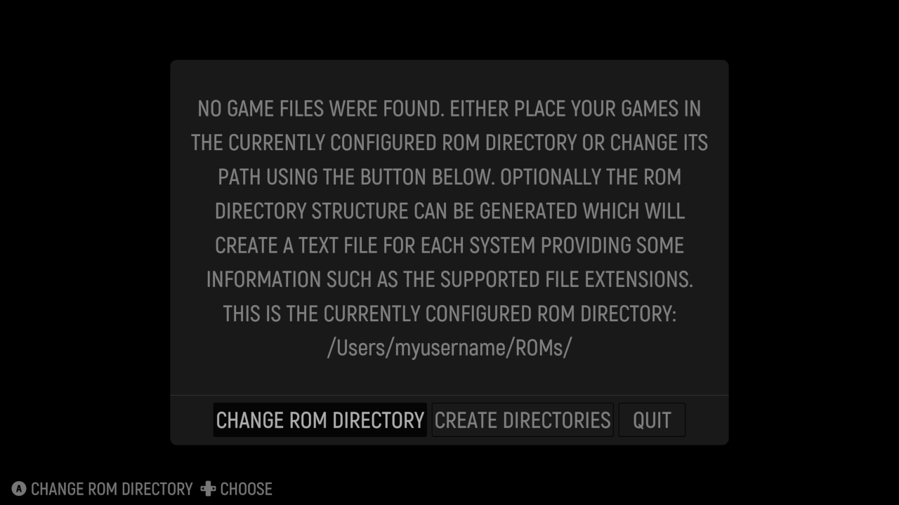
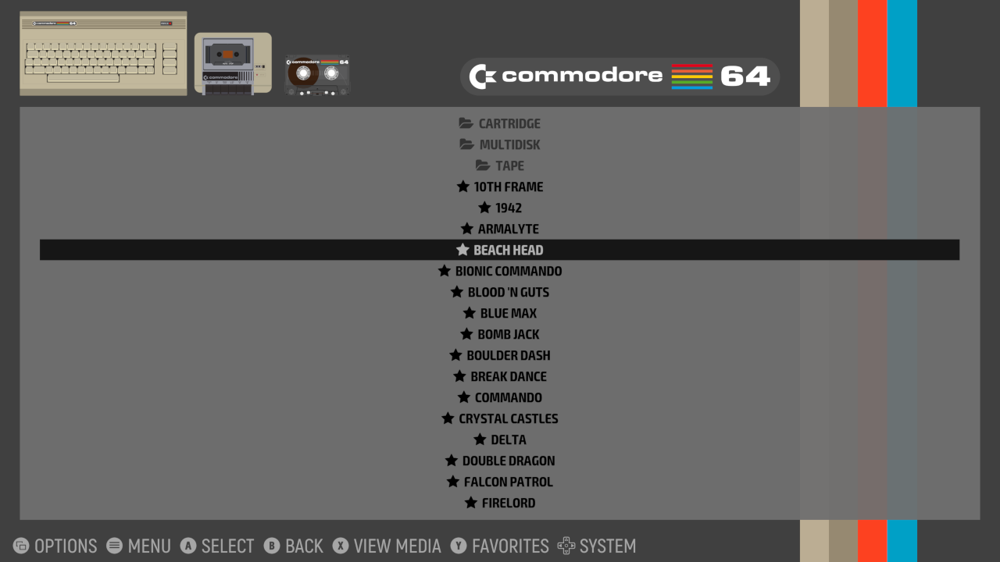
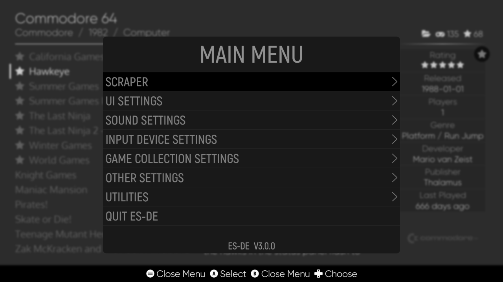
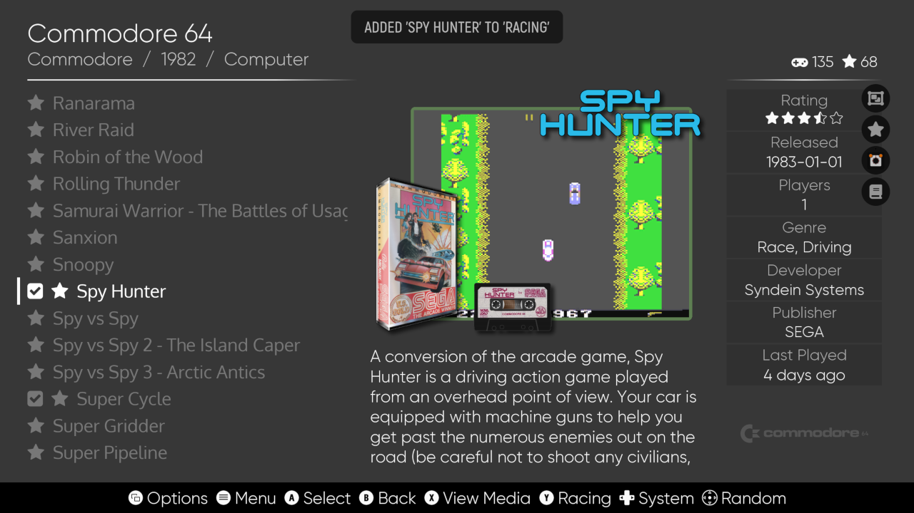

# EmulationStation Desktop Edition (ES-DE) v2.0 - User guide

It's generally recommended to read the [Frequently Asked Questions (FAQ)](FAQ.md) document prior to diving into the information in this guide.

Table of contents:

[[_TOC_]]

## Quick start guide

If you just want to get started as quickly as possible, simply follow these steps:

1) Install ES-DE
2) Start the application and press the _Create directories_ button to generate the ROMs directory structure
3) Put your game ROMs in the directories created by the previous step, or see [here](USERGUIDE.md#supported-game-systems) for additional details
4) Install [RetroArch](https://www.retroarch.com)
5) Start RetroArch and install the required emulator cores
6) Start ES-DE, scrape game media for your collection and play some games!

You can always close the application immediately using the keyboard, by default the quit shortcut is Alt + F4 on Windows and Linux and Command + Q on macOS. This shortcut can also be changed using the _Keyboard quit shortcut_ menu option.

For additional details, read on below.

There are also installation videos available at the ES-DE YouTube channel:\
[https://www.youtube.com/channel/UCosLuC9yIMQPKFBJXgDpvVQ](https://www.youtube.com/channel/UCosLuC9yIMQPKFBJXgDpvVQ)

## Installation and first startup

To install ES-DE, just download the package or installer from [https://es-de.org](https://es-de.org) and follow the brief instructions below.

As for display resolutions, the minimum pixel value is 224 and the maximum is 7680. This means that you can run ES-DE at for instance 320x224 all the way up to 7680x4320 (8K UHD). Vertical screen orientation is also supported, as well as ultra-wide resolutions like 3840x1440.

The installation procedure is just covered briefly here and may differ a bit for your specific operating system, so in case of problems refer to your system documentation.

**Installing the Linux .deb package**

The .deb package is intended for Ubuntu but may work on other Debian-based distributions like Linux Mint and vanilla Debian. Your distribution should include a graphical package installer, but if you prefer to use the command line, run the following which will install ES-DE and resolve any dependencies:

```
sudo apt install ./emulationstation-de-2.0.0-x64.deb
```

**Installing the Linux .rpm package**

On Fedora the RPM Fusion repository is a prerequisite for the installation, it can be installed like this:

```
sudo dnf install \
https://download1.rpmfusion.org/free/fedora/rpmfusion-free-release-$(rpm -E %fedora).noarch.rpm \
https://download1.rpmfusion.org/nonfree/fedora/rpmfusion-nonfree-release-$(rpm -E %fedora).noarch.rpm
```

Then you can use the graphical package installer or run this command, either method should automatically resolve the dependencies:

```
sudo dnf install ./emulationstation-de-2.0.0-x64.rpm
```

**Running the Linux AppImage**

The AppImage release should be usable on most modern x86 64-bit Linux distributions. After download you may have to set the file as executable, such as this:
```
chmod +x EmulationStation-DE-x64.AppImage
```

To run AppImage files you need libfuse2 installed, but some newer distributions like Ubuntu 22.04 LTS no longer ship with this library preinstalled. You can however easily install it like this:
```
sudo apt install libfuse2
```

Of course, if you're not using a Debian-based distribution, you may need to use another package manager than apt to install the library.

**Installing on macOS and Windows**

There's not really much to say about these operating systems, just install ES-DE as you would any other application. On macOS it's via the .dmg drag-and-drop installer, and on Windows via the normal application installer or by unpacking the portable zip file somewhere on your filesystem.

**On first application startup**

Upon first startup, ES-DE will create its `~/.emulationstation` home directory.

On Unix this means `/home/<username>/.emulationstation`, on macOS `/Users/<username>/.emulationstation` and on Windows `C:\Users\<username>\.emulationstation`

Also on first startup the configuration file `es_settings.xml` will be generated in the ES-DE home directory, containing all the application settings at their default values. Following this, a file named `es_systems.xml` will be loaded from the resources directory (which is part of the ES-DE installation). This file contains the game system definitions including which emulator to use per platform. For many systems there are also alternative emulators defined which can be applied system-wide or per game. How that works is explained later in this guide. A customized systems configuration file can also be used, as described in the next section below.

There's an application log file created in the ES-DE home directory named `es_log.txt`, please refer to this in case of any issues as it should hopefully provide information on what went wrong. Starting ES-DE with the --debug flag provides even more detailed information.

After ES-DE finds at least one game file, it will populate that game system and the application will start. If there are no game files, a dialog will be shown explaining that you need to install your game files into your ROMs directory. You will also be given a choice to change that ROMs directory path if you don't want to use the default one. As well you have the option to generate the complete game systems directory structure based on information in es_systems.xml.

When generating the directory structure, a file named systeminfo.txt will be created in each game system folder which will provide you with some information about the system. Here's an example for the _gc_ system as seen on Unix:
```
System name:
gc

Full system name:
Nintendo GameCube

Supported file extensions:
.ciso .CISO .dff .DFF .dol .DOL .elf .ELF .gcm .GCM .gcz .GCZ .iso .ISO .json .JSON .m3u .M3U .rvz .RVZ .tgc .TGC .wad .WAD .wbfs .WBFS .wia .WIA .7z .7Z .zip .ZIP

Launch command:
%EMULATOR_RETROARCH% -L %CORE_RETROARCH%/dolphin_libretro.so %ROM%

Alternative launch commands:
%EMULATOR_DOLPHIN% -b -e %ROM%
%EMULATOR_PRIMEHACK% -b -e %ROM%
%EMULATOR_TRIFORCE% -b -e %ROM%

Platform (for scraping):
gc

Theme folder:
gc
```

This file is not needed to run ES-DE, it's only a convenience to easily see which emulators and file extensions are supported per system.

In addition to this, a file named systems.txt will be created in the root of the ROMs directory which shows the mapping between the directory names and the full system names.

For example:

```
gc: Nintendo GameCube
genesis: Sega Genesis
gx4000: Amstrad GX4000
```

If a custom es_systems.xml file is present in ~/.emulationstation/custom_systems/ any entries from this file will have their names trailed by the text _(custom system)_. So if the GameCube system in the example above would be present in the custom systems configuration file, the system would be shown as _gc (custom system)_ instead of simply _gc_. This is only applicable for the systems.txt and systeminfo.txt files, the trailing text is not applied or used anywhere else in the application.


_This is the dialog shown if no game files were found. It lets you configure the ROM directory if you don't want to use the default one, and you can also generate the game systems directory structure. Note that the directory is the physical path, and that your operating system may present this as a localized path if you are using a language other than English._

## Upgrading to a newer release

**Note:** Before upgrading ES-DE, make sure that you have not made any system customizations anywhere in the installation directory structure as these files will be overwritten during the upgrade process. All customizations should go into ~/.emulationstation/custom_systems/ as described elsewhere in this guide. None of the upgrade methods mentioned below will ever touch any files inside your .emulationstation directory.

It's possible that the new ES-DE release adds support for more systems and emulators compared to the version you previously had installed, so you may want to recreate the ROMs directory tree after you've completed the installation. The easiest way to do that is to start ES-DE once with the _--create-system-dirs_ command line option which will create any missing system directories and also update the systems.txt and systeminfo.txt files. This is a safe operation as it will not overwrite or delete your game files.

**Linux .deb and .rpm packages**

Upgrading ES-DE using these packages is very straightforward, just run them through the package manager of your operating system and the process should be entirely automatic.

**Linux AUR**

AUR upgrades should be automatically handled via your package manager and it should be a completely automatic process. When a new release is available you should be notified of this.

**Linux AppImage**

As the ES-DE AppImages always retain their filenames between stable releases you only need to replace the previous AppImage with the new one and you're done. Just make sure to set the new AppImage as executable so it can be launched.

**macOS**

Open _Applications_ in Finder and right click on _EmulationStation Desktop Edition_ and choose _Move to Trash_. Then simply install the new release using the .dmg drag-and-drop installer.

**Windows installer**

Just run the installer for the new release. A question will be asked whether you would like to uninstall the old version first. Say yes to this question and then proceed with running through the installer.

**Windows portable**

Refer to the README.txt file inside the ES-DE ZIP archive as it contains instructions on how to safely perform the upgrade. Just make sure to not unpack this archive on top of the old installation as that may lead to all sorts of problems.

## Placing games into non-standard directories

As explained above, the basic logic for how ES-DE works is that it expects game files to be placed into a standardized directory structure under the ROMs directory. The location of this directory is configurable so it could for instance be placed on an external storage device or on a file share served by a NAS. The way it's implemented is via the %ROMPATH% variable in the es_systems.xml file which will always point to this ROM directory. For example this is an entry for the Super Nintendo system:
```
<path>%ROMPATH%/snes</path>
```

In theory it's possible to make a custom system entry and hardcode the path to a specific directory instead of using the %ROMPATH% variable, but this is not really supported and it also makes custom collections non-portable as the path to every game will be an absolute path rather than a path relative to the %ROMPATH% variable. So if you move your games to a different directory, you would manually need to modify all your custom collections configuration files as well as your custom es_systems.xml file.

If you really insist on not placing your games into the ES-DE standard directory structure, a much better solution is to symlink the game directories into the standard directory. In this way you don't need to make a custom es_systems.xml file and any additional emulators and other configuration added to future ES-DE releases will just work after upgrading.

This is an example of symlinking the Super Nintendo game directory on Unix and macOS:
```
cd ~/ROMs
ln -s ~/my_games/super_nintendo/ snes
```

And on Windows (you need to run this as Administrator):
```
cd C:\Users\Myusername\ROMs
mklink /D snes "C:\My Games\Super Nintendo\"
```

## Disabling game systems

The way ES-DE works is that it will always try to load any system for which there are game files available, so to disable a system it needs to be hidden from ES-DE. This is easily accomplished by renaming the system directory to something that is not recognized, for example changing `~/ROMs/c64` to `~/ROMs/c64_DISABLED`. Another approach is to create a subdirectory named DISABLED (or whatever name you prefer that is not matching a supported system) in the ROMs directory and move the system folder there, such as `~/ROMs/DISABLED/c64`. This makes it easy to disable and re-enable systems in ES-DE. Note that the gamelist.xml file and any game media files are retained while the system is disabled so this is an entirely safe thing to do.

For very specific situations such as when the ROM directory tree is shared with another frontend, you may want to exclude some systems from loading even though their directories exist. In this case simply create an empty file named `noload.txt` in the root of the directory and the system will not get populated when ES-DE is started. For example:
```
~/ROMs/nes/noload.txt
```

Note that if the setting _Only show ROMs from gamelist.xml files_ has been enabled then the noload.txt logic is completely bypassed as this option will make ES-DE load anything present in the gamelist.xml files, regardless of whether the files and directories actually exist. But this option (or the equivalent --gamelist-only command line option) is only intended for troubleshooting and debugging purposes and should not be enabled during normal application usage.

## Placing games and other resources on network shares

Although ES-DE does support placing game ROMs, the `.emulationstation` home directory and the `downloaded_media` directory on network shares, this can lead to serious performance problems in some instances. Especially problematic is the Microsoft SMB protocol as it offers abysmal performance for some disk operations on which ES-DE relies heavily. For small game libraries this can still be acceptable, but for libraries with hundreds or thousands of games the application startup time and overall usage will be very painful or even unusable. Similar issues could occur when using file hosting services like Google Drive.

A general recommendation is to place all game files and other data on drives connected directly to the machine where ES-DE is running. Even using low speed technology like USB thumb drives, SD cards etc. is generally fine and leads to acceptable performance in most instances.

If you insist on placing games and other resources on network drives such as a NAS, the NFS protocol has to be used instead of SMB as testing has shown between 10 and 30 times better performance with this protocol. Starting ES-DE with a certain game collection size could easily take minutes using SMB while it takes just seconds when using the NFS protocol. This is not a network throughput issue and using something like a 2.5 Gigabit or even 10 Gigabit wired interface will not help you as the SMB protocol has exceedingly bad latency regardless of physical adapter speed.

Unix-based operating systems like Linux and macOS ship with an NFS client built-in.

Here's how to mount an NFS drive from a NAS called _MyNAS_ on macOS:

```
sudo mkdir /private/ROMs
sudo mount -t nfs -o resvport MyNAS:/ROMs /private/ROMs
```

On Linux it's quite similar:
```
sudo mkdir /mnt/ROMs
sudo mount MyNAS:/ROMs /mnt/ROMs
```

On Windows 10 and 11 the NFS client first needs to be installed as it's not enabled by default. Open the _Control Panel_, then _Programs and Features_, then select _Turn Windows features on or off_ at the left side of the window and tick the box _Services for NFS_. It's unclear if both child items _Administrative Tools_ and _Client for NFS_ need to be selected, but it's probably safest to enable both of them.

Following this you can mount the NFS share in a terminal window as on a Unix system:
```
mount MyNAS:/ROMs g:
```

Note that the above are only examples to illustrate the general approach, you may need to take additional steps to make the configuration persistent across reboot and you may need to make other preparations. The NAS/file server also needs to be configured of course, but that's beyond the scope of this document.

## Specific notes for Windows

In general it should be straightforward to run ES-DE on Windows. Almost all emulators are available on this operating system and driver quality and controller support is normally very good.

Just make sure to never place games or other resources on network shares using the Microsoft SMB protocol as that will lead to unacceptable performance degradations and extremely long startup times if you have a large collection. See the point above on how to setup an NFS share if you insist on placing files or other resources on network drives.

In order for ES-DE to run, graphics drivers with OpenGL support have to be installed. If not, the application simply won't start. For really old graphics cards the available drivers may not provide an OpenGL version that is modern enough for ES-DE to work, and in this case a last resort solution would be to install the _Mesa3D for Windows_ library which provides software-based OpenGL rendering. The 64-bit version of this library can be downloaded from [https://fdossena.com/?p=mesa/index.frag](https://fdossena.com/?p=mesa/index.frag) and you simply extract the opengl32.dll file into the ES-DE installation directory. Just be aware that the performance may be quite bad.

On some GPUs with buggy drivers, ES-DE may only display a black screen on startup or when launching a game. The problem can be worked around by specifying a window size for ES-DE that is a single pixel wider than the actual screen resolution. So for example for a 1280x800 display, the resolution can be set to 1281x800 and then rendering should work correctly. This is applied using the --resolution command line option, for example:
```
EmulationStation.exe --resolution 1281 800
```

Some computers using Intel Iris Xe GPUs refuse to start ES-DE or display excessive graphics corruption. These problems are seemingly caused by driver bugs and do not occur when using Linux. There is no known solution or workaround to this issue other than switching to Linux or waiting for Intel to resolve the problem with a driver update.

Some older games (and possibly emulators too) may not work correctly or even start at all if ES-DE is set to run in the background while a game is launched. So if you experience strange issues with some games, make sure that the setting _Run in background (while game is launched)_ is disabled. If launching any of these problematic games from the _desktop_ system, also make sure to use the default emulator entry _Suspend ES-DE_ and not the alternative emulator _Keep ES-DE running_.

In a similar fashion, some older games may require the compatibility mode to be set to an older Windows release. This is done by right clicking on the .exe file or .lnk shortcut for the game or emulator, selecting _Properties_ and then the _Compatibility_ tab, then checking the box named _Run this program in compatibility mode for:_ and finally selecting an appropriate Windows release. Some experimentation with different Windows versions may be required. Don't attempt to change the compatibility mode for ES-DE itself though as that may cause any types of unforeseen issues.

Installing DS4Windows will break controller input in ES-DE for unknown reasons. Uninstalling this software should resolve the issue. On Windows 11 both DualShock 4 (PS4) and DualSense (PS5) controllers have been tested wired and via Bluetooth and both work fine in both ES-DE and RetroArch without any special drivers or configuration.

There are two ES-DE releases available for Windows; a regular installer and a portable/ZIP version. If going for the first option, an issue is that many emulators are not shipped with proper installers that implement any mechanism to inform ES-DE where they have been installed (like adding a Registry key with their installation path). Such emulators are marked accordingly in the _Supported game systems_ table at the bottom of this guide. These emulators are commonly shipped as a ZIP file that can be unpacked anywhere on the filesystem.

In order for ES-DE to find these emulators you need to add their directories to the operating system's Path environment variable. This is very easy to do, just open the _Settings_ application and then search for _path_ in the _Find a setting_ search box. Select the _Edit the system environment variables_ entry and then click the _Environment variables..._ button and add the emulator directory to the _Path_ variable. You need to restart ES-DE after changing the variable, but following this the emulator should be found when launching a game. If running ES-DE via Steam, you need to restart Steam as well to apply the changes to the Path variable.

The second alternative is to use the portable/ZIP release of ES-DE. This can be unzipped anywhere, including to removable devices such as hard drives or USB memory sticks. Together with games and emulators this makes for a fully portable retrogaming solution. There is a README.txt file distributed with this release that describes the setup, but essentially you just place your games in the ROMs directory and your emulators in the Emulators directory, both of which are included in the portable release.

If you want to create your own portable intallation from scratch or customize the setup, [INSTALL.md](INSTALL.md#portable-installation-on-windows) provides additional details.

## Specific notes for macOS

As macOS does not support Vulkan some emulators are not available, and some that do exist have not been updated for this operating system in recent years. But emulator support is steadily improving and native ARM releases ("Apple Silicon") are also getting more common. One issue though is that some emulators are not codesigned and notarized so macOS refuses to run them by default. You can override the operating system's security settings however, which will work around this problem. Some emulators are also available via the [Homebrew](https://brew.sh) package manager and in many instances ES-DE includes support for these releases using the bundled configuration.

Lack of controller support is a bit of a problem on macOS, and in some instances controller drivers are available but quite buggy. In general it seems as if Sony PlayStation controllers are better supported than Microsoft Xbox controllers. For third party controllers you need to investigate the macOS support as it seems to differ quite a lot.

One macOS-specific requirement is that the RetroArch setting _Start in Fullscreen mode_ is enabled or ES-DE will not be able to switch to the emulator window when launching games. As a workaround you can switch to the window manually using Command + Tab but it probably doesn't make sense to run emulators in windowed mode anyway. This issue has not been observed with any other emulators.

At the time of writing there is an additional issue with the M1 release of RetroArch where ES-DE will not be able to consistently switch to its window on game launch if the setting _Close windows when closing an app_ under the General entry in the macOS System Preferences has been set to disabled. This error does not occur for the Intel/x86 release of RetroArch or with any other standalone emulators (including those built specifically for the M1 architecture).

The first time you launch a RetroArch-emulated game from within ES-DE the operating system will present you with a security option with the following description:

`"EmulationStation Desktop Edition" would like to access files in your Documents folder.`

If you don't allow this, you will not be able to place system BIOS ROMs in the RetroArch default system directory `~/Documents/RetroArch/system` even if you've already given RetroArch access to this folder. This is so because RetroArch runs as a subprocess to ES-DE and therefore inherits the security settings from the parent application. Attempting to launch a game without enabling the access will simply display an error message in the emulator that the BIOS files are missing. This of course only applies to emulators that require BIOS ROMs, all other games should work fine regardless of this security setting.

If you accidentally refused ES-DE the folder access, you can fix this by opening _System Preferences_, selecting _Security & Privacy_ and within the GUI choose _Files and Folders_. The option you need to enable is _Documents Folder_ under _EmulationStation Desktop Edition_.

By default files and directories starting with a dot are hidden on macOS, so to show the .emulationstation directory in your home directory you need to enable hidden files in Finder. You do this using the keyboard combination Shift + Command + . (a dot).

A minor annoyance is that macOS creates metadata files starting with ._ in the filename when placing game/ROM files on some filesystem types such as exFAT. This means that you will see double entries inside ES-DE for all such games. To hide these extra files, the option _Show hidden files and folders (requires restart)_ in the _Other settings_ menu can be set to disabled.

## Specific notes for Steam Deck

As the Steam Deck is essentially a Linux desktop computer with a custom user interface, there is really not much to consider when running ES-DE on this device, except that SteamOS uses an immutable filesystem which adds some restrictions not present in most other Linux distributions. There is a specific AppImage available for the Steam Deck though that is recommended to use, as some settings have been tuned for the best possible experience on this device.

Another way to install ES-DE is via [RetroDECK](http://retrodeck.net) which is shipped as a Flatpak and can be easily installed via Discover. As RetroDECK bundles both ES-DE and all its emulators inside the Flatpak you don't need to update any emulators separately or set Flatpak permissions manually. The drawback compared to running ES-DE standalone is that less systems and emulators are supported. Most popular systems should work fine though and more emulators are getting added continuously so the situation will improve over time. Also note that if going for RetroDECK you will have a non-standard ES-DE installation so some parts of this user guide will no longer apply. For documentation specific to RetroDECK, refer to their [wiki](https://github.com/XargonWan/RetroDECK/wiki).

It's also possible to install ES-DE using [EmuDeck](https://www.emudeck.com) which will automatically download the latest Steam Deck-specific AppImage. Just be aware that if using EmuDeck you will have a non-standard ES-DE installation as their installer makes some customizations to paths and other settings. This guide only covers default installations so in case you see something mentioned that doesn't match your setup, make sure to contact the EmuDeck support.

Unless RetroDECK is used, Flatpak releases of some emulators may need some extra permissions to be able to launch games placed on external devices such as a memory card. This is the case for instance for melonDS and RPCS3. The easiest way to do this is by using [Flatseal](https://flathub.org/apps/details/com.github.tchx84.Flatseal). The option you need to enable is generally _All system files_ in the _Filesystem_ section. If using EmuDeck some of these settings will be applied automatically via their installer.

If you are unfamiliar with Unix operating systems, make sure to at least read up on the concepts of _dotfiles_ (hidden files and directories), _home directories_ (including use of the tilde ~ character) and _symbolic links_ (symlinks):

[https://en.wikipedia.org/wiki/Hidden_file_and_hidden_directory#Unix_and_Unix-like_environments](https://en.wikipedia.org/wiki/Hidden_file_and_hidden_directory#Unix_and_Unix-like_environments) \
[https://en.wikipedia.org/wiki/Home_directory#Unix](https://en.wikipedia.org/wiki/Home_directory#Unix) \
[https://en.wikipedia.org/wiki/Symbolic_link](https://en.wikipedia.org/wiki/Symbolic_link)

## Specific notes for Raspberry Pi

ES-DE on the Raspberry Pi requires a desktop environment, or more specifically a window manager and a sound server (like PulseAudio or PipeWire). There are no plans to add support for direct hardware access to the framebuffer or to ALSA. If you want to use your Raspberry Pi as an appliance, take a look at [RetroPie](https://retropie.org.uk), [Recalbox](https://www.recalbox.com) or [Batocera](https://batocera.org) instead.

The Raspberry Pi 4/400 is the minimum recommended version and earlier boards have not been tested. The GPU memory should be set to at least 256 MiB using `raspi-config` and the GL driver must be set to `GL (Fake KMS)` or the performance will be horrible. On Raspberry Pi OS 11 the KMS option is enabled by default.

In general, 720p works fine with the RPi 4, and 1080p is tolerable but not really a nice and smooth experience. Due to the relative weakness of the Rasperry Pi GPU, the video scanline rendering options for the screensaver and media viewer have been disabled. These options can be re-enabled via the menu if you don't mind lower video framerates.

## Game system customizations

The game systems configuration file `es_systems.xml` is located in the ES-DE resources directory which is part of the application installation. As such this file is not intended to be modified directly. If system customizations are required, a separate es_systems.xml file should instead be placed in the `custom_systems` folder in the ES-DE home directory.

On Unix this means `/home/<username>/.emulationstation/custom_systems/es_systems.xml`, on macOS `/Users/<username>/.emulationstation/custom_systems/es_systems.xml` and on Windows `C:\Users\<username>\.emulationstation\custom_systems\es_systems.xml`

If you're using the AppImage release of ES-DE then the bundled es_systems.xml file is embedded in the AppImage together with the rest of the resources. You can extract it if you need it as a reference when creating your customized entries, or you can find it [here](https://gitlab.com/es-de/emulationstation-de/-/tree/master/resources/systems/unix).

Although it's possible to make a copy of the bundled configuration file, to modify it and then place it in this directory, that is not how the system customization is designed to be done. Instead the intention is that the file in `custom_systems` complements the bundled configuration, meaning only systems that are to be customized should be included.

For example you may want to replace the emulator launch command, modify the full name or change the supported file extensions for a single system. In this case it wouldn't make sense to copy the complete bundled file and just apply these minor modifications, instead an es_systems.xml file only containing the configuration for that single system should be placed in the custom_systems directory.

The instructions for how to customize the es_systems.xml file can be found in [INSTALL.md](INSTALL.md#es_systemsxml). There you can also find some examples of custom files that you can copy into ~/.emulationstation/custom_systems/ and modify as required.

## Migrating from other EmulationStation forks

**IMPORTANT!!! IMPORTANT!!! IMPORTANT!!!**

ES-DE is designed to be backward compatible to a certain degree. That is, it should be able to read data from other/previous EmulationStation versions such as the RetroPie and Batocera forks. But the opposite is not true and it's a one-way ticket for your gamelist.xml files and your custom collection files when migrating to ES-DE as they will be modified in ways that previous ES versions will see as data loss. For instance ES-DE does not use image tags inside the gamelist.xml files to find game media but instead matches the media to the names of the game/ROM files. So it will not save any such tags back to the gamelist files during updates, effectively disabling the game media if the files are opened in another ES fork.

Due to this, always make backups of at least the following directories before testing ES-DE for the first time:

```
~/.emulationstation/gameslists/
~/.emulationstation/collections/
```

If you have gamelist.xml files in your ROMs directory tree then ES-DE will ignore those by default, so you need to move them to the ~/.emulationstation/gamelists/ tree.

It's also strongly adviced to not rename an old es_settings.cfg file to es_settings.xml for use in ES-DE as it may cause undefined behavior and crashes.

If migrating from Batocera or Recalbox, be aware that ES-DE follows the RetroPie naming conventions for most game systems. This means that your game files may not be found unless the folders are renamed accordingly. Such an example is the Sega SG-1000 system which in Batocera and Recalbox has the _sg1000_ system name, but is _sg-1000_ in RetroPie and ES-DE. See the [Supported game systems](USERGUIDE.md#supported-game-systems) table at the bottom of this guide for the correct system names in ES-DE.

Another potential issue when migrating from Recalbox (and possibly Batocera) is that the path tag requires a leading ./ in ES-DE while that's not present in those other forks. If you don't see any metadata for your games inside ES-DE, then simply add the ./ characters to each path tag and it should hopefully work.

Example of an unreadable path tag:
```
<path>Another World.hdf</path>
```

Example of a correct path tag readable by ES-DE:
```
<path>./Another World.hdf</path>
```

## Running on high resolution displays

ES-DE fully supports high resolution displays such as 1440p, 4K, 6K, 8K, ultrawide monitors etc. But many emulators (e.g. RetroArch) will also run using the same resolution which may cause performance problems on slower machines or when using resource intensive shaders. Although some emulator cores will have options to set their internal resolution, they still need to be scaled up to the screen resolution.

A solution to this is to use the custom event scripts functionality to set a temporary resolution upon launching a game that will be reverted when returning to ES-DE. Such a setup is detailed in [INSTALL.md](INSTALL.md#custom-event-scripts) for Unix, but should hopefully be possible to implement similarly on Windows. When going for this setup it's important that the setting _Run in background (while game is launched)_ is disabled or ES-DE may not be able to correctly switch to the emulator window when launching games.

On macOS it's problematic to change screen resolutions on the fly or on a per-application basis as Apple has seemingly disabled most of this functionality in recent operating system releases. The only real option here is to lower the display resolution prior to launching ES-DE.

## Advanced display configuration

ES-DE supports a number of advanced settings to fine-tune the display output. By default the application will run in fullscreen mode at the native display resolution, but using the --resolution command line option it's possible to set this to an arbitrary resolution. By default this will change ES-DE into running in windowed mode, but if also using the --fullscreen-padding command line option the window will be fullscreen with the application contents centered, padded on a black background. This can be useful for displays where a bezel or similar covers parts of the monitor, and it can be combined with the --screenoffset command line option to adjust the positioning within the application window.

Tate mode (vertical screen orientation) is also fully supported including both running at a vertical resolution as set on the OS level, or to rotate the screen contents within the application window and keep the display resolution at its non-rotated default state. The latter is sometimes required as some emulators don't work well on rotated screen layouts. Screen rotation can be applied either via the --screenrotate command line option or via the corresponding setting in the _Other settings_ menu.

Below are some examples. For consistency it's assumed that the display resolution is set to 1920x1080 although in practice it's perhaps more likely that a lower resolution CRT monitor is used for some of these scenarios.

Running at a lower application resolution in a window:
```
emulationstation --resolution 1280 720
```

Running at a lower application resolution in padded fullscreen mode:
```
emulationstation --resolution 1824 1026 --fullscreen-padding 1
```

Same as above but also offsetting the screen slighty to the left and downwards:
```
emulationstation --resolution 1824 1026 --fullscreen-padding 1 --screenoffset -40 22
```

Rotate application screen contents 90 degrees while running at the native 1920x1080 screen resolution:
```
emulationstation --screenrotate 90
```

## Input device configuration

ES-DE automatically configures the keyboard and any connected controllers using default button mappings, and normally no additional setup is required. But if you would like to apply custom button mappings for your devices or if you have an unusual device which isn't automatically configured, you can run the _Configure keyboard and controllers_ tool from the _Input device settings_ entry on the main menu.

You can also force a run of this tool directly on startup via the command line argument `--force-input-config`.

The actual procedure to map the inputs should be self-explanatory, just follow the on-screen instructions. Note that custom button mappings will not change the help system entries.

Any custom configuration is applied per unique device ID (GUID). So if two identical controllers are used with ES-DE, both will have the same configuration applied. If connecting controllers of the same type but of different revisions, the GUID may differ and therefore the custom configuration would need to be applied to each device individually.

If you have issues with your input configuration, as a last resort you can reset all the mappings by deleting or renaming the file ~/.emulationstation/es_input.xml.

## System view (main screen)

When starting ES-DE with the default settings, you will see the System view first. From here you can navigate your game systems and enter their respective gamelists.

The game systems are sorted by their full names by default, as defined in the es_systems.xml file. It's however possible to set a custom sortname per system, as explained in the [INSTALL.md](INSTALL.md#es_systemsxml) document.


_The **System view** is the default starting point for the application, it's here that you browse through your game systems._

## Gamelist view

The gamelist view is where you browse and start your games, and it's where you will spend most of your time using ES-DE.

For themes that include variant trigger configuration you may see different layouts per system depending on whether you have scraped game media or not. This functionality can be disabled via the _Enable theme variant triggers_ option in the _UI Settings_ menu.

If the theme supports it, there's a gamelist information field displayed in the gamelist view, showing the number of games for the system (total and favorites) as well as a folder icon if a folder has been entered. When applying any filters to the gamelist, the game counter is replaced with the amount of games filtered, as in 'filtered / total games', e.g. '19 / 77'. If there are game entries in the filter result that are marked not to be counted as games, the number of such files will be indicated as 'filtered + filtered non-games / total games', for example '23 + 4 / 77' indicating 23 normal games, 4 non-games out of a total of 77. Due to this approach it's theoretically possible that the combined filtered game amount exceeds the number of counted games in the collection, for instance '69 + 11 / 77'. This is not considered a bug and is so by design. This gamelist information field functionality is specific to ES-DE so older themes will not support this.

Another feature which requires theme support is **Badges**, which is a set of icons displaying the status for various metadata fields. The currently supported badge types are _favorite, completed, kidgame, broken, controller_ and _alternative emulator_. If any of the first four metadata fields have been set for a game, their corresponding badges will be displayed. If a game-specific controller has been selected via the metadata editor, the corresponding controller badge will be shown, and if an alternative emulator has been selected for the specific game, that badge will be displayed. Setting an alternative emulator system-wide will not display this badge as it's only intended to indicate game-specific overrides. As well, disabling the option _Enable alternative emulators per game_ will also hide the alternative emulator badges.


_The **Gamelist view** is where you browse the games for a specific system._


_Here's an example of a theme variant trigger applying a simplified layout if there is no scraped game media available for the system. After scraping at least one game the layout will automatically change to the full design._

## UI modes

ES-DE supports three separate modes, **Full**, **Kiosk** and **Kid**.

These modes mandate the functionalty provided by the application in the following way:

* Full - This is the default mode which enables all functionality.
* Kiosk - The main menu will be severely restricted, only displaying the entry to change the audio volume. The gamelist options menu will be restricted as well, removing the metadata editor and the ability to modify custom game collections. And finally the ability to flag or unflag games as favorites will be removed. Apart from this all games will be playable.
* Kid - Only games marked as being suitable for children will be displayed (this flag is set manually per game using the metadata editor). Additionally, the gamelist options menu is disabled as is the ability to flag and unflag games as favorites. There is also a separate option available to enable or disable the main menu when in Kid mode, see _Enable menu in kid mode_ for additional information.

There is an unlock code available to revert to the Full mode from the Kiosk or Kid mode, as is described when changing this setting from the main menu. By default the button sequence is **Up, Up, Down, Down, Left, Right, Left, Right, B, A** (or equivalent buttons if an Xbox controller is not used). Either the keyboard or a controller can be used to input the passkey sequence, but it can't be entered when a menu is open.

The application can also be forced into any of the three modes via the command line options `--force-full`, `--force-kiosk` and `--force-kid`. This is only temporary until the restart of the application, unless the settings menu is entered and the setting is saved to the configuration file (this assumes that the main menu is available in the selected UI mode of course).

## Help system

There is a help system available throughout the application that provides an overview of the possible actions and buttons that can be used. But some general actions are never shown, such as the ability to quick jump in gamelists, menus and text input fields using the shoulder and trigger buttons. It's also possible to disable the help system using a menu option for a somewhat cleaner look.


_The help system is displayed at the bottom of the screen for this theme, although it can be positioned elsewhere for other theme sets._

## General navigation

The built-in help system will provide a contextual summary of the available navigation options, but here's still a general overview. These are the buttons mappings automatically applied by ES-DE, but they can be customized using the input configurator as described earlier in this document. It's not an exhaustive list, but it covers most situations. The button names are based on the Xbox 360 controller as that is the naming convention used by the SDL library which handles the controller input in ES-DE.

When editing text using the virtual keyboard but using a physical keyboard as input device instead of a controller, then there are some slight exceptions to the normal input logic. The _Enter_ key will always apply the changes and the _Escape_ key will always go back. As well, if you have mapped any regular keys to the _left_, _right_ or _down_ buttons or to the _shoulder_ or _trigger_ buttons, then these will not be usable in the text input field. You will instead have to use the virtual keyboard buttons to enter these characters. Note that this is not an issue if using the default keyboard configuration as the buttons just mentioned are then mapped to special keys only, as detailed below.

Default keyboard mappings are shown in brackets.

**Up and down**\
_(Arrow up / Arrow down)_

Navigates between system and game entries where these buttons are applicable, such as for textlists and vertical carousels. Also used in menus for general navigation.

**Left and right**\
_(Arrow left / Arrow right)_

Navigates between system and game entries where these buttons are applicable, such as for grids and horizontal carousels. Navigates between gamelists if the _Quick system select_ option has been set to use these buttons and the primary element supports it. Navigates between media files in the media viewer and selects a random game when using the _Video_ or _Slideshow_ screensavers if the _Enable screensaver controls_ option has been enabled. Also used in menus for general navigation.

**Start button**\
_(Escape)_

Opens and closes the main menu.

**Back button**\
_(F1)_

Opens and closes the gamelist options menu in the gamelist view.

**Left and right shoulder buttons**\
_(Page up / Page down)_

Provides quick jumping in textlists and menus, jumps 10 games in the gamelists and 6 entries in the menus. Navigates between gamelists if the _Quick system select_ option has been set to use these buttons and the primary element supports it. Also used as back and blankspace keys in text edit dialogs.

**Left and right trigger buttons**\
_(Home / End)_

Jumps to the first or last entries in carousels, grids and textlists as well as in menus and text edit dialogs. Navigates between gamelists if the _Quick system select_ option has been set to use these buttons and the primary element supports it.

**Left and right thumbstick click**\
_(F2 / F3)_

Jumps to a random game or system depending on whether pressed when in the system view or gamelist view. Only applicable if the _Random entry button_ option has been configured accordingly.

**A button**\
_(Enter)_

Select button which opens gamelists from the system view, launches games, enters folders, selects menu entries etc.

**B button**\
_(Back key)_

Back button, self explanatory.

**X button**\
_(Delete)_

Starts the media viewer in the gamelist view or the screensaver in the system view (if the _Enable screensaver controls_ setting is enabled). Used by some other minor functions as explained by the help system and/or this guide.

**Y button**\
_(Insert on Unix and Windows, F13 on macOS)_

Marks games as favorites in the gamelist view (if the _Enable toggle favorites button_ option has been enabled). Used by some other minor functions as explained by the help system and/or this guide.

**Alt + F4 (Windows and Linux) or Command + Q (macOS) (keyboard only)**

Quits the application. This key combination can be changed to Ctrl + Q, Alt + Q or F4 using the _Keyboard quit shortcut_ menu option described later in this document.

## RetroArch setup

ES-DE is a frontend application and does not provide any emulation by itself. It does however come preconfigured for use with emulators as setup in the `es_systems.xml` file. Most systems are by default configured to use [RetroArch](https://www.retroarch.com) but in many instances alternative standalone emulators can be selected instead as described elsewhere in this guide.

Installation and configuration of RetroArch and other emulators is beyond the scope of this guide, but many good resources can be found online on how to do this.

Keep in mind that ES-DE will not install any RetroArch cores, you need to do this manually from within the RetroArch user interface.

If ES-DE is unable to find an emulator when a game is launched, a notification popup will be shown. Likewise a notification will be shown if the defined emulator core is not installed. The es_log.txt file will also provide additional details.

## Using the Steam release of RetroArch

As this release of RetroArch is executed via the Steam application it's behaving a bit glitchy and strange with ES-DE (which is due to the nature of Steam). In addition to this there seem to be some bugs in either Steam or RetroArch, or both. The following issues have been observed:

* ES-DE will continue to run in the background due to the way that Steam works
* Game launching is not seamless and there will be some flickering
* If the Steam GUI is visible, focus may not return to ES-DE when exiting a game. Minimizing Steam increases the chances of this working properly but it's not guaranteed to completely fix the problem
* Filenames containing apostrophes do not work, you need to rename these game files to be able to launch them
* Core searches will not work, if an emulator core is missing there will be no error notification inside ES-DE and game launching will just silently fail
* Logging output from emulators is not possible due to ES-DE running in the background

As well, adding support for the Steam release of RetroArch for all systems that ES-DE supports requires hundreds of additional alternative emulator entries. For all these reasons there will be no official support for this release of RetroArch. If you insist on still using it, it's however quite easy to make [custom system configuration](USERGUIDE.md#game-system-customizations) entries as the setup has been partly prepared in the bundled configuration.

Simply add alternative emulator entries such as the following example (which enables support for the Nestopia UE core for the nes system):
```
<command label="Nestopia UE (Steam)">%RUNINBACKGROUND% %EMULATOR_STEAM% -applaunch 1118310 -L nestopia_libretro %ROM%</command>
```

This will work on both Linux and Windows.

A complete entry for the nes system could look like the following:
```
<system>
    <name>nes</name>
    <fullname>Nintendo Entertainment System</fullname>
    <path>%ROMPATH%/nes</path>
    <extension>.nes .NES .unf .UNF .unif .UNIF .7z .7Z .zip .ZIP</extension>
    <command label="Nestopia UE (Steam)">%RUNINBACKGROUND% %EMULATOR_STEAM% -applaunch 1118310 -L nestopia_libretro %ROM%</command>
    <command label="FCEUmm (Steam)">%RUNINBACKGROUND% %EMULATOR_STEAM% -applaunch 1118310 -L fceumm_libretro %ROM%</command>
    <platform>nes</platform>
    <theme>nes</theme>
</system>
```

## Using emulators in AppImage format on Linux

AppImages is a great way to package emulators on Linux as they work across many different distributions. There is one small problem though in that there is no standardized directory for storing these files, meaning ES-DE could have issues locating them.

Therefore all bundled emulator configuration entries that support AppImages will look for these files in the following directories:

```
~/Applications/
~/.local/bin/
~/bin/
```

It's generally recommended to go for the ~/Applications/ directory, but depending on your Linux distribution this may or may not exist by default. If the directory doesn't exist, then just go ahead and create it. Keep in mind that Linux is case-sensitive so make sure to spell it with a capital A.

As AppImages often embed version information into the actual filename, the bundled configuration uses wildcards to locate these files, such as `rpcs3*.AppImage` which would match the filename `rpcs3-v0.0.19-13103-cc21d1b3_linux64.AppImage` for instance. Note that if multiple files match the wildcard pattern, the first file returned by the operating system will be selected.

This approach also works when using [AppImageLauncher](https://github.com/TheAssassin/AppImageLauncher). When first launching an AppImage with AppImageLauncher installed a question will be asked whether to integrate the application. If accepting this, the AppImage will be moved to the `~/Applications` directory and a hash will be added to the filename, like in this example:
```
rpcs3-v0.0.19-13103-cc21d1b3_linux64_54579676ed3fa60dafec7188286495e4.AppImage
```
Again, the wildcard matching means this filename should be found by ES-DE when launching a game so no additional setup should be required.

If not using AppImageLauncher, then make sure to set the AppImages as executable or ES-DE will not be able to launch them. For example:
```
cd ~/Applications
chmod +x ./rpcs3-v0.0.19-13103-cc21d1b3_linux64.AppImage
```

The following emulators are supported in AppImage format when using the bundled configuration:

| System name  | Emulator    | Filename configuration          |
| :----------- | :---------- | :------------------------------ |
| _Multiple_   | RetroArch   | RetroArch-Linux*.AppImage       |
| dreamcast    | Flycast     | flycast*.AppImage               |
| gba          | mGBA        | mGBA*.AppImage                  |
| gc           | Dolphin     | Dolphin_Emulator*.AppImage      |
| gc           | Triforce    | dolphin-emu-triforce*.AppImage  |
| macintosh    | Basilisk II | BasiliskII*.AppImage            |
| macintosh    | SheepShaver | SheepShaver*.AppImage           |
| n64          | RMG         | RMG*.AppImage                   |
| n64dd        | RMG         | RMG*.AppImage                   |
| ps2          | PCSX2       | pcsx2*-Qt.AppImage              |
| ps2          | Play!       | Play!*.AppImage                 |
| ps3          | RPCS3       | rpcs3*.AppImage                 |
| psx          | DuckStation | duckstation-nogui*.AppImage     |
| psx          | DuckStation | duckstation-qt*.AppImage        |
| switch       | Yuzu        | yuzu*.AppImage                  |
| xbox         | xemu        | xemu*.AppImage                  |
| wii          | Dolphin     | Dolphin_Emulator*.AppImage      |
| wiiu         | Cemu        | Cemu*.AppImage                  |
| zmachine     | Gargoyle    | Gargoyle*.AppImage              |

_RMG = Rosalie's Mupen GUI_

## Using manually downloaded emulators on Linux

Normally on Linux you would install emulators using either one of the established cross-distribution package formats, i.e. AppImage, Snap or Flatpak, or you would install them using the operating system repository (including the AUR if available on your OS). Less likely would be to manually build from source code and install to a standard system directory. In all these instances ES-DE should be able to find the emulator when launching a game. But in some cases you may instead manually download an emulator as an archive file to unzip somewhere on the file system. Normally you would want to place these files in your home directory, and if running a distribution that has an immutable filesystem (such as SteamOS or Fedora Silverblue), you don't even have the choice to install them to a standard system directory.

For these situations ES-DE looks for emulators in the same directories where it looks for AppImages (as explained in the section above), meaning:
```
~/Applications/
~/.local/bin/
~/bin/
```

It's generally recommended to go for the ~/Applications/ directory, but depending on your Linux distribution this may or may not exist by default. If the directory doesn't exist, then just go ahead and create it. Keep in mind that Linux is case-sensitive so make sure to spell it with a capital A.

So placing a manually downloaded emulator binary in either of these directories will make ES-DE able to locate it during game launch.

The following manually downloaded emulators are supported when using the bundled configuration:

| System name                      | Emulator      | Filename configuration            |
| :------------------------------- | :------------ | :-------------------------------- |
| amstradcpc                       | CPCemu        | cpcemu/cpcemu                     |
| apple2                           | LinApple      | linapple/linapple                 |
| atari2600                        | Gopher2600    | gopher2600/gopher2600_linux_amd64 |
| coco/dragon32/tanodragon         | XRoar         | xroar/xroar                       |
| daphne                           | Hypseus Singe | hypseus-singe/hypseus.bin         |
| dreamcast                        | Redream       | redream/redream                   |
| easyrpg                          | EasyRPG       | easyrpg/easyrpg-player            |
| fbneo/neogeo/neogeocd/neogeocdjp | FinalBurn Neo | fbneo/fbneo                       |
| flash                            | Lightspark    | lightspark/lightspark             |
| flash                            | Ruffle        | ruffle/ruffle                     |
| fmtowns                          | Tsugaru       | tsugaru/Tsugaru_CUI               |
| gb/gbc                           | Gearboy       | gearboy/gearboy                   |
| model3                           | Supermodel    | Supermodel/supermodel             |
| famicom/nes                      | puNES         | punes/punes                       |
| oric                             | Oricutron     | oricutron/Oricutron               |
| pico8                            | PICO-8        | pico-8/pico8                      |
| psvita                           | Vita3K        | Vita3K/Vita3K                     |
| samcoupe                         | SimCoup      | simcoupe/simcoupe                 |
| switch                           | Ryujinx       | publish/Ryujinx                   |
| switch                           | Ryujinx       | publish/Ryujinx.Ava               |
| trs-80                           | sdl2trs       | sdl2trs/sdl2trs                   |
| wiiu                             | Cemu          | Cemu/Cemu                         |

Note that the Vita3K binary is not set as executable after unpacking the archive, so you need to do that once before ES-DE can run it:
```
cd ~/Applications/Vita3K
chmod +x ./Vita3K
```

The same is true for Cemu:
```
cd ~/Applications/Cemu
chmod +x ./Cemu
```

## Running emulators in fullscreen mode

In general ES-DE does not pass command line parameters to emulators to start them in fullscreen mode. This is so as for most (if not all) emulators, command line arguments overrides the settings the user has defined. This means that windowed mode would become impossible to achieve without creating custom systems configuration entries if ES-DE enforced fullscreen mode. There are only a very few exceptions for emulators where there is no other way to enter fullscreen mode than by passing such options during game launch.

So if an emulator starts in windowed mode and you prefer to have it running in fullscreen mode instead, make sure to enable that option in the emulator settings or configuration file (which should be a one-time job).

## Getting your games into ES-DE

For most systems this is straightforward, just put your game files into the folder corresponding to the platform name (these names can be found at the [end](USERGUIDE.md#supported-game-systems) of this guide.)

But for some systems a more elaborate setup is required, and we will attempt to cover such situations in this guide as well.

### Single game file installation

Let's start with the simple scenario of a single ROM file per game, which is the case for the majority of platforms. In this example we're setting up ES-DE to play Nintendo Entertainment System games.

The supported file extensions are listed in [unix/es_systems.xml](resources/systems/unix/es_systems.xml), [macos/es_systems.xml](resources/systems/macos/es_systems.xml) and [windows/es_systems.xml](resources/systems/windows/es_systems.xml) but if you generated the game system directories on first application startup, there will be a file named systeminfo.txt in each game system directory that includes the list of supported file extensions.

Here is a snippet from unix/es_systems.xml:

```xml
<system>
    <name>nes</name>
    <fullname>Nintendo Entertainment System</fullname>
    <path>%ROMPATH%/nes</path>
    <extension>.nes .NES .unf .UNF .unif .UNIF .7z .7Z .zip .ZIP</extension>
    <command label="Nestopia UE">%EMULATOR_RETROARCH% -L %CORE_RETROARCH%/nestopia_libretro.so %ROM%</command>
    <command label="FCEUmm">%EMULATOR_RETROARCH% -L %CORE_RETROARCH%/fceumm_libretro.so %ROM%</command>
    <command label="Mesen">%EMULATOR_RETROARCH% -L %CORE_RETROARCH%/mesen_libretro.so %ROM%</command>
    <command label="QuickNES">%EMULATOR_RETROARCH% -L %CORE_RETROARCH%/quicknes_libretro.so %ROM%</command>
    <platform>nes</platform>
    <theme>nes</theme>
</system>
```

The ROM files must named using one of the supported file extensions, or ES-DE won't find them.

It's highly recommended to use filenames that are corresponding to the full name of the game, otherwise you will need to manually feed the scraper the game name when scraping which is very tedious.

Symlinks are supported for both ROM directories and individual game files, but make sure to not symlink between files within the same system directory or there may be undefined application behavior when scraping, launching games etc.

The default game folder is ~/ROMs. On Unix this defaults to `/home/<username>/ROMs`, on macOS `/Users/<username>/ROMs` and on Windows `C:\Users\<username>\ROMs`. If the --home command line option was used to start ES-DE, the tilde symbol will resolve to whatever directory was passed as an argument to this option.

Assuming the default ROM directory is used, we need to create a subdirectory corresponding to the \<path\> tag in es_systems.xml, for this example it's `nes`.

So this would look something like the following:

```
/home/myusername/ROMs/nes     # On Unix
/Users/myusername/ROMs/nes    # On macOS
C:\Users\myusername\ROMs\nes  # On Windows
```

Then simply copy your game ROMs into this folder, and you should end up with something like this (example for Unix):

```
~/ROMs/nes/Legend of Zelda, the.zip
~/ROMs/nes/Metal Gear.zip
~/ROMs/nes/Super Mario Bros. 3.zip
```

**Note:** These directories are case sensitive on Unix, so creating a directory named `Nes` instead of `nes` won't work.

That's it, start ES-DE and the NES game system should be populated. You can now scrape information and media for the games, and assuming you've setup RetroArch correctly with the Nestopia UE core, you can launch the games. If you instead prefer to use any of the three alternative emulators listed above (FCEUmm, Mesen or QuickNES) you can install one of these cores instead and change your emulator preference using the _Alternative emulators_ interface in the _Other settings_ menu. Note that alternative emulators are only available for some game systems.

### Multiple game files installation

For some systems, there are sometimes (or always) multiple files per game. Such an example would be the Commodore 64 when multidisk games are being played. For such instances, simply group the files inside folders.

The system name for the Commodore 64 is `c64`, so the following structure would be a possible approach:

```
~/ROMs/c64/Cartridge
~/ROMs/c64/Tape
~/ROMs/c64/Disk
~/ROMs/c64/Multidisk
~/ROMs/c64/Multidisk/Last Ninja 2.m3u/LNINJA2A.D64
~/ROMs/c64/Multidisk/Last Ninja 2.m3u/LNINJA2B.D64
~/ROMs/c64/Multidisk/Last Ninja 2.m3u/Last Ninja 2.m3u
~/ROMs/c64/Multidisk/Pirates!.m3u/PIRAT-E0.d64
~/ROMs/c64/Multidisk/Pirates!.m3u/PIRAT-E1.d64
~/ROMs/c64/Multidisk/Pirates!.m3u/PIRAT-E2.d64
~/ROMs/c64/Multidisk/Pirates!.m3u/Pirates!.m3u
```

It's highly recommended to create `.m3u` playlist files for multi-disc images as this normally automates disk swapping in the emulator. It's then this .m3u file that should be selected for launching the game.

The .m3u file simply contains a list of the game files, for example in the case of Last Ninja 2.m3u:

```
LNINJA2A.D64
LNINJA2B.D64
```

Setting the directories to the same name as the .m3u files will interpret them as files, meaning they will behave just like any normal files inside ES-DE instead of being displayed as folders. When launching such a game, the file inside the directory that matches the directory name will be passed to the emulator. See the following section below for more information about this functionality.

This setup is of course entirely optional, you can also leave the directories as normal folders, meaning they will behave just like you would expect, i.e. you will have to enter them and then select the file you want to launch. If going for this setup it's possible to easily hide the files that are not relevant using the metadata editor.

### Directories interpreted as files

There are two scenarios where it's useful to interpret directories as files inside ES-DE. The first one is to hide the directory structure for multi-file/multi-disc games while still being able to directly launch files inside these folders, and the second is that some emulators support passing a directory rather than an individual file as the game ROM argument.

In both cases, renaming a directory to one of the supported file extensions will automatically make ES-DE interpret it as a file. This also means that the directory can be part of the automatic collections and any custom collections.

The only difference between a real file and a directory interpreted as a file is that the _Delete_ button in the metadata editor will be disabled as ES-DE does not support deletion of directories for safety reasons.

For the first scenario, to automatically launch a file inside a directory, just rename the directory to the same name as the file inside the folder that you would like to launch. For example:
```
~/ROMs/dreamcast/Jet Grind Radio.cue/
~/ROMs/dreamcast/Jet Grind Radio.cue/Jet Grind Radio.cue
~/ROMs/dreamcast/Jet Grind Radio.cue/Jet Grind Radio.gdi
~/ROMs/dreamcast/Jet Grind Radio.cue/Jet Grind Radio (Track 1).bin
~/ROMs/dreamcast/Jet Grind Radio.cue/Jet Grind Radio (Track 2).bin
~/ROMs/dreamcast/Jet Grind Radio.cue/Jet Grind Radio (Track 3).bin
```

In this case the directory is named _Jet Grind Radio.cue_, i.e. exactly the same name as one of the files inside the directory. This means that when launching the game, `~/ROMs/dreamcast/Jet Grind Radio.cue/Jet Grind Radio.cue` will actually be passed to the emulator.

Here's another example when using .m3u files:

```
~/ROMs/psx/Final Fantasy VII.m3u/
~/ROMs/psx/Final Fantasy VII.m3u/Final Fantasy VII (Disc 1).chd
~/ROMs/psx/Final Fantasy VII.m3u/Final Fantasy VII (Disc 2).chd
~/ROMs/psx/Final Fantasy VII.m3u/Final Fantasy VII (Disc 3).chd
~/ROMs/psx/Final Fantasy VII.m3u/Final Fantasy VII.m3u
```

In exactly the same manner, the file `~/ROMs/psx/Final Fantasy VII.m3u/Final Fantasy VII.m3u` will be passed to the emulator on game launch. See the section just above this one, _Multiple game files installation_ for an explanations of how .m3u files work.

The second scenario is when an emulator supports passing a directory rather than a file to launch a game. Such an example is the PlayStation 3 emulator RPCS3.

For PS3 games the extension in es_systems.xml is .ps3 so this is what a game directory could look like:
```
~/ROMs/ps3/Gran Turismo 5.ps3
```

It's possible to combine these types of special directories with normal directories, for a setup like this:
```
~/ROMs/ps3/racing/Gran Turismo 5.ps3
```

Also in this case the directory will be displayed as a regular game file inside ES-DE and when launching the game the directory is passed as the game ROM argument to RPCS3.

### Folder flattening

**This functionality is experimental and may cause all sorts of issues including corrupting your gamelist.xml files, so make sure to have backups of your data prior to attempting to use this.**

ES-DE works according to the filesystem paradigm used on most operating systems, meaning the file and directory structure of your ROMs directory is reflected inside the application. So if you create a directory on the filesystem and place some games in there, it will be reflected inside ES-DE as a folder that you can enter and launch games from.

A slight exception to this is the _Directories interpreted as files_ functionality where you can display a folder as a single entry. But even then, the basic directory structure is retained.

However, some users have a setup where they have separated games inside their systems into folders but would still want to see these as a flat structure in ES-DE. While this is possible to accomplish, it's discouraged as it will cause multiple issues:
* It completely disables folder support for the system
* Any identically named files will be added only once in a semi-random fashion, meaning you could miss some games
* If there is metadata available for multiple games with the same filename (which could happen if scraping was done prior to flattening the folders) then the behavior is undefined and metadata from the wrong game may get used
* Some systems like MS-DOS and ScummVM may be completely broken
* The setup may cause confusion when reorganizing your collection and similar as what you'll see inside ES-DE will not reflect what you see if navigating the ROM directory in your operating system's file manager

Only enable this functionality if you know exactly what you're doing and understand the adverse side effects mentioned above. If you have any name collisions in your directory structure then make sure to rename each file to have a unique name. Also delete your gamelist.xml file and rescrape the entire system after fixing any collisions as it's otherwise random which metadata will be used for those games.

If you still want to go ahead and enable folder flattening, then place an empty file named `flatten.txt` in the root of each system where you would like to have this applied.

Here's an example setup:
```
~/ROMs/nes/EU/Kid Icarus.zip
~/ROMs/nes/EU/Metal Gear (EU).zip
~/ROMs/nes/USA/Kid Icarus.zip
~/ROMs/nes/USA/Metal Gear (USA).zip
~/ROMs/nes/Contra.zip
~/ROMs/nes/Recca.zip
~/ROMs/nes/flatten.txt
```

For this example the following entries will show up inside ES-DE:
```
Contra
Kid Icarus
Metal Gear (EU)
Metal Gear (USA)
Recca
```

Note that _Kid Icarus_ will only show up once since there is a name collision present and in this case only the first file processed will be added and any other identically named files will be ignored. Also note that in this case it's random whether metadata from _EU/Kid Icarus_ or _USA/Kid Icarus_ will be used.

### Special game installation considerations

Not all systems are as simple as described above, or there may be multiple ways to do the configuration. Specifics for such systems will be covered here. Consider this a work in progress as there are many platforms supported by ES-DE.

#### Apple II

On Unix/Linux the default emulator for the apple2 system is [LinApple](http://linapple.sourceforge.net) and on Windows it's [AppleWin](https://github.com/AppleWin/AppleWin). Additionally the alternative emulators [Mednafen](https://mednafen.github.io) and [MAME](https://www.mamedev.org) standalone are supported. On macOS there is a port of AppleWin available named [Mariani](https://github.com/sh95014/AppleWin) but it appears broken at the moment as it does not accept any command line parameters. So instead only Mednafen and MAME are supported on macOS.

Depending on which Unix/Linux operating system you're using, LinApple may not be readily available and you may have to build it from source code or obtain a binary from somewhere on the Internet. See the [Using manually downloaded emulators on Linux](USERGUIDE.md#using-manually-downloaded-emulators-on-linux) section of this guide for more details on where it needs to be installed. If you're using an OS with access to the AUR, such as Arch or Manjaro, then LinApple is available there. Note that you need to use the _linapple-git_ package as the regular _linapple_ package does not work correctly.

Once the LinApple or AppleWin emulator is installed no additional configuration is required, just drop your games into the ~/ROMs/apple2 folder and launch them from inside ES-DE.

If using Mednafen you need to place some Apple II ROM files in the emulator firmware directory, refer to the Mednafen documentation for details about this.

If you want to use MAME standalone then you need to place the following ROM files in the ~/ROMs/apple2 directory:
```
a2diskiing.zip
apple2e.zip
d2fdc.zip
votrax.zip
```

Note that you may also need to reconfigure your exit key in MAME as the default _escape_ key is masked as it's used by the emulated Apple II computer.

#### Apple IIGS

The Apple IIGS computer is emulated using MAME. There is a dedicated emulator available for this system named [GSplus](https://apple2.gs/plus) but it appears to not be able to parse command line parameters correctly so disk images can't be supplied to it. As such it's currently unsupported.

In order to run Apple IIGS games in MAME, you need to place the following ROM file in the ~/ROMs/apple2gs directory:
```
apple2gs.zip
```

Note that you may also need to reconfigure your exit key in MAME as the default _escape_ key is masked as it's used by the emulated Apple IIGS computer.

#### Apple Macintosh

There are two approaches to emulating these computers, the first is using games booted from diskettes and the second is to setup an entire OS installation as a hard disk image and run the games from there. The first approach is only applicable for older models like the Macintosh SE and Macintosh Plus (i.e. the era prior to hard drives becoming prevalent), and the second approach can be used for more modern models.

**Method 1, booting from diskette images**

Booting from diskettes is the default approach and MAME standalone is used for this. The games need to be in the .dsk file format and only 400K and 800K diskettes are supported. There are four relevant emulator entries available:

* MAME Mac SE Bootable (Standalone)
* MAME Mac SE Boot Disk (Standalone)
* MAME Mac Plus Bootable (Standalone)
* MAME Mac Plus Boot Disk (Standalone)

To use these you need the MAME files adbmodem.zip, macse.zip and macplus.zip placed in the `~/ROMs/macintosh/` directory.

The _Bootable_ entries are straightforward, these are games that are self-contained on a single diskette and that can simply be booted as-is. The _Boot Disk_ entries are games that can't be booted directly but instead require a separate boot diskette. To run these you need to place a disk image named `boot.dsk` together with the game files and ES-DE will then insert this into the first floppy drive on game launch and place the game diskette in the second floppy drive. Once Mac OS has started up you can then start the game from inside the operating system. Basically any bootable diskette can be used as long as it's 400K or 800K in size and runs a Mac OS release compatible with the game you intend to play. For example the _System Tools_ diskette from the System 6.0.8 installation media works fine for this purpose.

This is an example of what the game setup could look like:
```
~/ROMs/macintosh/adbmodem.zip
~/ROMs/macintosh/boot.dsk
~/ROMs/macintosh/macplus.zip
~/ROMs/macintosh/macse.zip
~/ROMs/macintosh/Shufflepuck Cafe.dsk
~/ROMs/macintosh/StuntCopter.dsk
```
For this example _Shufflepuck Cafe_ requires a boot disk to run and _StuntCopter_ can be booted directly.

**Method 2, booting from a hard disk image**

The second approach to Macintosh emulation is to setup a hard disk image, boot into this and run the games from there. For this setup the Basilisk II emulator is used for older Macintosh II and Quadra computers and SheepShaver for more modern PowerPC-based models.

Emulation for this system works quite differently than other platforms as ES-DE only acts as a game browser which simply launches the emulator. The game then needs to be manually started from inside Mac OS.

As for how to setup the Basilisk II emulator the following YouTube video is a good resource:

https://www.youtube.com/watch?v=QSWWZ4hkvVk

Once the emulator is up and running and you can boot into Mac OS 7 or 8 you need to install your games. These are commonly distributed with the .sit file extension which are compressed archives in the proprietary StuffIt Expander format. You should uncompress these files inside the emulator or otherwise you will very likely run into problems with running your games. This is also covered in the YouTube video.

As for game locations it's possible to uncompress the games inside the ~/ROMs/macintosh folder and mount this inside the emulator, but this is not recommended. It's instead better to create a _Games_ folder or similar inside Mac OS and place your installed games there.

The setup of SheepShaver is essentially identical to that of Basilisk II as these two emulators are developed by the same team and are therefore very similar.

On macOS you need to download the separate Basilisk II GUI application to configure the emulator and with SheepShaver you need to start the emulator using a command line option to point to a valid ROM file. Only then can you reach the Preferences from the menu (this is however only needed the first time you setup SheepShaver). Quite a strange and unusual approach.

To add a game entry in ES-DE just create an empty file with the .game extension, for example `Marathon.game`. This entry can then be scraped and edited in the same way as any regular system. But as mentioned above, ES-DE will only act as a browser and individual games cannot be started directly. So when you launch a game, the emulator will boot into the Mac OS desktop and you will have to manually navigate to your game folder to run the game.

To launch a game entry using SheepShaver instead of Basilisk II you just need to select the alternative emulator _SheepShaver (Standalone)_.

This is an example of what the game setup could look like:
```
~/ROMs/macintosh/Marathon.game
~/ROMs/macintosh/Marathon 2.game
~/ROMs/macintosh/Prince of Persia.game
```

Note that scraper support is currently very poor for this system, so you may need to manually add images and information for your games. It's encouraged to support ScreenScraper and TheGamesDB by contributing game media and metadata so this situation improves over time.

#### Arcade and Neo Geo

**General**

For all the supported MAME variants as well as Final Burn Alpha/FinalBurn Neo and Neo Geo, single file archives should be used. But these should retain the MAME names as filenames since ES-DE ships with MAME lookup tables, meaning the MAME names are expanded to the full game names.

For instance `topgunnr.7z` will be expanded to `Top Gunner`.

This is required by the TheGamesDB scraper where the expanded filenames are used for game searches. (Screenscraper natively supports searches using the MAME names). It's also quite nice to have the gamelist populated with the expanded game names even before any scraping has taken place.

By default ES-DE will filter out BIOSes and devices that can't be launched directly, meaning these will never show up in the gamelist. But this only applies to files that are listed in the regular MAME driver file and BIOSes and devices for systems like MESS will not be filtered out. You'll instead need to manually hide these files using the _Hidden_ option in the metadata editor.

If using the standalone release of FinalBurn Neo you also need to define the ROM directory in the fbneo.ini file or via the user interface as this emulator does not support passing the full path to the game ROM on game launch (see the comments about Model 2 Emulator below for more details).

**Sega Model 2**

If emulating Sega Model 2 games using _Model 2 Emulator_ on Windows, then you need to change the ROM directory path in the EMULATOR.INI file to point to your Model 2 ROMs. If you're using a portable ES-DE installation, then you can set the ROM directory path to be relative, for example:
```
[RomDirs]
Dir1=..\..\ROMs\arcade\Sega Model 2
```

The EMULATOR.INI file is found in the _Model 2 Emulator_ installation directory.

Also note that Model 2 Emulator is a bit broken and on most GPU drivers it will only work correctly if ES-DE keeps running in the background while the game is launched. However, for some GPU drivers the opposite is true and the emulator will only work if ES-DE is suspended. To use the latter setup, switch to the alternative emulator entry _Model 2 Emulator [Suspend ES-DE] (Standalone)_.

On Unix/Linux and macOS, the only available emulator for Sega Model 2 is MAME, either the RetroArch - Current core or MAME standalone. Compatibility is still quite poor with only a handful of games working correctly, but this is likely to improve going forward as almost all games for this platform can already start and run to a certain degree. Some games flagged as not working by MAME are still playable with only minor glitches to audio and graphics, just make sure to use a recent ROM set for maximum compatibility.

**Sega Model 3**

For Sega Model 3 emulation on Linux download the custom [Supermodel_2022-10-07.tar.gz](https://gitlab.com/es-de/emulationstation-de/-/package_files/55835402/download) package for ES-DE and follow the instructions in the Readme.txt file. In summary you need to place the `supermodel` binary into `~/Applications/Supermodel/` and you need to place the `Config` and `NVRAM` directories into `~/ROMs/model3/`. Note that this build does not include network support as that would make it incompatible with SteamOS. Apart from that it runs really well. If you're using a Linux OS with access to the AUR, then you can use that release of Supermodel instead. But if you do, you still need to place your Config and NVRAM directories into ~/ROMs/model3/ so it's a good idea to download the custom package linked above and read the Readme.txt file to fully understand the required setup.

Although there is a Homebrew release of Supermodel for macOS this seems to be quite old and is apparently not working correctly so for the time being the model3 system is unsupported on this operating system.

It's possible to add per-game command line parameters that will be passed to Supermodel on launch. To accomplish this, create a file named _\<game\>.commands_ in the same directory as the game file, for example `daytona2.commands` and add the options to this file. Here is an example of what the file contents could look like:
```
-legacy3d -show-fps
```

**MAME standalone on macOS**

If using the Homebrew release of MAME standalone on macOS and emulating MESS systems like astrocde and ti99, then you need to configure the path to the MAME hash files in the mame.ini file. Alternatively you can symlink the installed hash directory to `~/.mame/` like the following (you will of course need to modify the command depending on which MAME version you have installed):
```
ln -s /opt/homebrew/Cellar/mame/0.248/share/mame/hash ~/.mame/      # on ARM/Apple
ln -s /usr/local/Cellar/mame/0.248/share/mame/hash ~/.mame/         # on x86/Intel
```

#### Bally Astrocade

Place the ROMs in the `~/ROMs/astrocde` directory, the files must have the short MAME names such as _astrobat.zip_ and _conan.zip_. If using MAME standalone then no further setup is required and the games should just launch.

If instead using the _MAME - Current_ RetroArch core, then a hash file must be added inside the RetroArch system directory at this location:

```
mame/hash/astrocde.xml
```

The hash file is available from the MAME GitHub repository: \
https://raw.githubusercontent.com/mamedev/mame/master/hash/astrocde.xml

#### Commodore Amiga

There are multiple ways to run Amiga games, but the recommended approach is to use WHDLoad. The best way is to use hard disk images in `.hdf`, `.hdz` or `.lha` format, meaning there will be a single file per game. This makes it just as easy to play Amiga games as any console with game ROMs.

An alternative would be to use `.adf` images as not all games may be available with WHDLoad support. For this, you can either put single-disc images in the root folder or in a dedicated adf directory, or multiple-disk games in separate folders. It's highly recommended to create `.m3u` playlist files for multi-disc images as described [here](USERGUIDE.md#multiple-game-files-installation).

Here's an example of what the file structure could look like:

```
~/ROMs/amiga/Multidisk/ZakMcKracken/ZakMcKracken (Disk 1 of 2).adf
~/ROMs/amiga/Multidisk/ZakMcKracken/ZakMcKracken (Disk 2 of 2).adf
~/ROMs/amiga/Multidisk/ZakMcKracken/ZakMcKracken.m3u
~/ROMs/amiga/Robbeary.adf
~/ROMs/amiga/Dungeon Master.hdf
```

Advanced topics such as the need for the Amiga Kickstart ROMs to run Amiga games is beyond the scope of this guide, but the following page is recommended for reading more about how this setup can be achieved:

[https://github.com/libretro/libretro-uae/blob/master/README.md](https://github.com/libretro/libretro-uae/blob/master/README.md)

#### DOS / PC

For this platform there are two basic approaches for how the setup could be done; either to present each game as a single entry inside ES-DE, or to retain each game's directory structure. The first alternative is more user-friendly, tidy and requires less setup but basically restricts the emulator selection to the DOSBox-Pure RetroArch core. There is an alternative way to setup single entries to work with all DOSBox forks, but it has some drawbacks as discussed below.

If you prefer to present the games as single entries you could compress each game directory into a ZIP file with either the .zip or .dosz file extension. On game launch a menu will be displayed by DOSBox-Pure, asking which file inside the archive you would like to execute. This makes it possible to select the actual game file, or for example a setup utility like SETUP.EXE or INSTALL.EXE. Attempting to launch such an archive file with any other DOSBox fork will fail, or not work as expected.

Here's an example of a .zip archive setup for use with DOSBox-Pure:
```
~/ROMs/dos/Dune 2 - The Building of a Dynasty.zip
~/ROMs/dos/Quake.zip
~/ROMs/dos/Tyrian.zip
~/ROMs/dos/UFO Enemy Unknown.zip
```

The alternative setup to get single entries working is to use the _Directories interpreted as files_ functionality explained elsewhere in this guide. This makes it possible to use other DOSBox forks than DOSBox-Pure, but requires some additional setup. How this works is that you create a .bat file inside each game directory with the name of the game, and inside this .bat file you enter the game file you would like to launch. You then rename the game directory to the name of the .bat file including the file extension.

There are however multiple issues with this approach, the first being that only DOSBox-X supports long filenames (LFN) so you can only use directory names with a maximum of 8 characters plus the .bat extension if using another DOSBox fork. The second issue is that as of the time of writing, this setup does not seem to work at all with DOSBox-Core.

The third issue is that by this setup you will no longer be able to reach any other file than the binary you have defined inside the .bat file. So if you want to be able to reach both the game itself and a configuration utility like SETUP.EXE or INSTALL.EXE, then you would have to create some kind of simple menu inside the batch file that will be displayed on game launch. While this is certainly doable, it's beyond the scope of this guide.

Here's an example of the _Directories interpreted as files_ setup for use with any DOSBox fork except DOSBox-Core:

```
~/ROMs/dos/Dune 2/Dune 2.bat
~/ROMs/dos/Quake.bat/Quake.bat
~/ROMs/dos/Tyrian.bat/Tyrian.bat
~/ROMs/dos/Xcom1/Xcom1.bat
```

If DOSBox-X is used, then the game names could be longer than this, as long filenames (LFN) are supported by this fork.

For this example, the contents of Tyrian.bat could look like the following:
```
TYRIAN.EXE
```

The second approach for DOS games is to keep the directory structure intact for each game, just as if running the game on a real DOS PC. If going for this approach it's recommended to set the metadata field _Exclude from game counter_ to enabled for all files except the actual file used to launch the game, i.e. the binary or the .bat batch file. This is done so that the game counter correctly reflects the number of games you have installed. It's also possible to mark files and subdirectories as hidden to avoid seeing them in ES-DE. Both of these fields can be set using the metadata editor. While this setup is a bit tedious and not as tidy, it can be used with all DOSBox forks while still being able to easily access all files inside the game directory, such as any game configuration utilities.

When going for this approach the game folders can be scraped so that it looks nice when browsing the gamelist, but make sure to also scrape the files used to launch the games or otherwise their entries in the collections _All games, Favorites_ and _Last played_ as well as any custom collections will miss the game metadata and game media. If you don't have these collections activated, then this can of course be skipped.

Regardless of game setup method, per-game settings can be applied. If using the DOSBox RetroArch cores this is done via the RetroArch GUI and for DOSBox-X and DOSBox Staging it's accomplished by placing a custom dosbox.conf in the game directory.

#### Dragon 32 and Tano Dragon

These computers as well as the Dragon 64 are slight varations of the Tandy Color Computer and as these machines are largely compatible with each other they're all emulated using the [XRoar](http://www.6809.org.uk/xroar) emulator.

This emulator is available for Unix/Linux, macOS and Windows, although on Linux you may need to build it from source code depending on which distribution you're using. Refer to the XRoar website for more information. If you manually download or build the emulator yourself then see the [Using manually downloaded emulators on Linux](USERGUIDE.md#using-manually-downloaded-emulators-on-linux) section of this guide for more details on where you need to install it.

In order to emulate the Dragon 32 you need the ROM file `d32.rom` and to emulate the Dragon 64 or Tano Dragon you need the `d64rom1.rom` and `d64rom2.rom` files. It's unclear whether `ddos10.rom` will also be needed for some games and applications. Even without these files the emulator will probably start, but you will likely see random character on screen and few if any games will run correctly. On Unix/Linux these files need to be placed into the `~/.xroar/roms` directory and on macOS you need to place them in `~/Library/XRoar/roms`. Note that neither of these directories are automatically created by the emulator so you need to create them yourself. On Windows you simply place the ROM files into the emulator installation directory next to the xroar.exe binary.

Following this setup there is not much to it, launching a cartridge or cassette image file will automatically run the game.

For the dragon32 system you can switch to emulating the Dragon 64 model by selecting the alternative emulator _XRoar Dragon 64 (Standalone)_.

#### EasyRPG Game Engine

Both the EasyRPG RetroArch core, which is named _RPG Maker 2000/2003 (EasyRPG)_ in the RetroArch GUI, and the standalone EasyRPG Player are supported.

Some Linux distributions ship with the standalone EasyRPG Player in the repository and on Ubuntu-based systems it's available as a Snap. But for some distributions it may need to be built from source code or manually downloaded. For these scenarios see the [Using manually downloaded emulators on Linux](USERGUIDE.md#using-manually-downloaded-emulators-on-linux) section of this guide.

If using the RetroArch core you can either launch games compressed as .zip archives, or you can uncompress and rename them by adding .easyrpg to the directory name. The latter alternative is recommended.

Using either approach, the games should go into the `~/ROMs/easyrpg` directory. This is all the setup required, and here's an example of what it could look like:

```
~/ROMs/easyrpg/Dreamscape.easyrpg/
~/ROMs/easyrpg/The Chimera Report.zip
```

Setup for the standalone EasyRPG Player is identical with the exception that running games compressed as .zip files is not supported. So in this case the setup should look like the following:

```
~/ROMs/easyrpg/Dreamscape.easyrpg/
~/ROMs/easyrpg/The Chimera Report.easyrpg/
```

#### Fujitsu FM Towns

The Tsugaru emulator is still somehow experimental and although there are builds available for Windows, macOS and Linux on the Tsugaru [GitHub](https://github.com/captainys/TOWNSEMU) page, only the Windows release seems to be functioning entirely correctly. The Linux build has controller/input issues as described later below. It's also made specifically for Ubuntu and there is no AppImage release available, so if you run some other Linux distribution then it may not run at all. Extracting the binary from the Debian package has however been reported to work on SteamOS at least. The macOS release does not seem to include the command line binary for the emulator which makes it unusable with ES-DE.

For both the Windows and Linux release you need to create a `roms` subdirectory inside the emulator directory where the system BIOS/ROM files need to be located. These are the required files, and they have to be named in uppercase:

```
FMT_DIC.ROM
FMT_DOS.ROM
FMT_F20.ROM
FMT_FNT.ROM
FMT_SYS.ROM
```

The directory structure should look like the following on Windows:
```
tsugaru\roms\
tsugaru\Tsugaru_CUI.exe
tsugaru\Tsugaru_GUI.exe
```

And on Linux it's basically identical:
```
tsugaru/roms/
tsugaru/Tsugaru_CUI
tsugaru/Tsugaru_GUI
```

See the [Using manually downloaded emulators on Linux](USERGUIDE.md#using-manually-downloaded-emulators-on-linux) section of this guide for more details on where to locate the emulator directory.

Only CD-ROM games in .iso and .cue format are supported, and you simply place these inside the `~/ROMs/fmtowns` directory.

Optionally you can provide custom emulator command line flags on a per-game basis. This can be used to set things like the CPU frequency of the emulated machine, controller/input settings and more. Refer to the Tsugaru emulator documentation for more details about available options.

On Linux controller input seems to be broken for the time being, so you will likely need to map this input to the keyboard instead. Mouse input is also very laggy and it's unclear whether this can be improved via some emulator setting.

To create a game-specific configuration entry, simply add a file with the same filename as the gamefile but with the .cfg file extension, for example:
```
~/ROMs/fmtowns/Shadow of the Beast (1994)(Psygnosis)(Jp-En).bin
~/ROMs/fmtowns/Shadow of the Beast (1994)(Psygnosis)(Jp-En).cfg
~/ROMs/fmtowns/Shadow of the Beast (1994)(Psygnosis)(Jp-En).cue
```

To map the controller to the keyboard and to set a 33 MHz CPU speed, the file content of the .cfg file would look like the following:
```
-FREQ 33 -GAMEPORT0 KEY
```

#### Hypseus Singe (Daphne)

Hypseus Singe is a fork of the Daphne arcade LaserDisc emulator that is still maintained. The setup is quite particular so make sure to read this section thoroughly to get it to work.

The first step is to install the emulator. On Windows it's straightforward, download the win64 release from [https://github.com/DirtBagXon/hypseus-singe](https://github.com/DirtBagXon/hypseus-singe) and unpack it and you're good to go.

Similarly on Linux, download the  [hypseus-singe_2.8.2a_ES-DE.tar.gz](https://gitlab.com/es-de/emulationstation-de/-/package_files/41533436/download) release that contains an AppImage of the emulator as well as some additional required files. It should be unpacked into the ~/Applications directory, such as:
```
/home/myusername/Applications/hypseus-singe/
```

If the Applications directory doesn't exist yet, then just go ahead and create it and then unpack the emulator inside it. Just be aware that the name has to start with a capital A.

Although there is an official Hypseus Singe release available for macOS M1 this appears somehow broken so you may need to compile it yourself. This is a bit involved so it's beyond the scope of this document to describe it. For this reason macOS is not listed as supported but the configuration is still bundled so if you're persistent and manage to get the emulator to work, it will hopefully work from within ES-DE as well.

After the emulator has been installed, copy the required BIOS ROMs into `Hypseus Singe\roms\` on Windows or `~/Applications/hypseus-singe/roms/` on Linux.

Controller configuration using the `hypinput.ini` file is described in the official Hypseus Singe documentation, but the following example is usable with Xbox 360-compatible controllers:

```
[KEYBOARD]
KEY_UP = SDLK_UP SDLK_r 5 -002
KEY_DOWN = SDLK_DOWN SDLK_f 7 +002
KEY_LEFT = SDLK_LEFT SDLK_d 8 -001
KEY_RIGHT = SDLK_RIGHT SDLK_g 6 +001
KEY_COIN1 = SDLK_5 0 1
KEY_COIN2 = SDLK_6 0 0
KEY_START1 = SDLK_1 0 4
KEY_START2 = SDLK_2 0 0
KEY_BUTTON1 = SDLK_LCTRL SDLK_a 14
KEY_BUTTON2 = SDLK_LALT SDLK_s 15
KEY_BUTTON3 = SDLK_SPACE SDLK_d 16
KEY_SKILL1 = SDLK_LSHIFT SDLK_w 0
KEY_SKILL2 = SDLK_z SDLK_i 0
KEY_SKILL3 = SDLK_x SDLK_k 0
KEY_SERVICE = SDLK_9 0 0
KEY_TEST = SDLK_F2 0 0
KEY_RESET = SDLK_0 0 0
KEY_SCREENSHOT = SDLK_F12 0 0
KEY_QUIT = SDLK_ESCAPE SDLK_q 17
KEY_PAUSE = SDLK_p 0 0
KEY_CONSOLE = SDLK_BACKSLASH 0 0
KEY_TILT = SDLK_t 0 0
END
```

With this configuration, pressing the _A_ and _Y_ buttons at the same time exits the emulator.

Here's an alternative configuration as described in the following YouTube video: \
https://www.youtube.com/watch?v=mO2UiI6byJo

```
[KEYBOARD]
KEY_UP = SDLK_UP SDLK_r 0 -002
KEY_DOWN = SDLK_DOWN SDLK_f 0 +002
KEY_LEFT = SDLK_LEFT SDLK_d 0 -001
KEY_RIGHT = SDLK_RIGHT SDLK_g 0 +001
KEY_COIN1 = SDLK_5 0 7
KEY_COIN2 = SDLK_6 0 0
KEY_START1 = SDLK_1 0 8
KEY_START2 = SDLK_2 0 0
KEY_BUTTON1 = SDLK_LCTRL SDLK_a 1
KEY_BUTTON2 = SDLK_LALT SDLK_s 0
KEY_BUTTON3 = SDLK_SPACE SDLK_d 11
KEY_SKILL1 = SDLK_LSHIFT SDLK_w 3
KEY_SKILL2 = SDLK_z SDLK_i 4
KEY_SKILL3 = SDLK_x SDLK_k 2
KEY_SERVICE = SDLK_9 0 0
KEY_TEST = SDLK_F2 0 0
KEY_RESET = SDLK_0 0 0
KEY_SCREENSHOT = SDLK_F12 0 0
KEY_QUIT = SDLK_ESCAPE SDLK_q 17
KEY_PAUSE = SDLK_p 0 0
KEY_CONSOLE = SDLK_BACKSLASH 0 0
KEY_TILT = SDLK_t 0 0
END
```

There are two types of games supported by Hypseus and these are _Daphne_ and _Singe_. It's beyond the scope of this document to describe these game formats in detail but there are many resources available online for this. The setup differs a bit between these two types however, and you need to use an alternative emulator entry in ES-DE to launch Singe games.

**Daphne games**

For Daphne games the structure will look something like the following, which is for the game _Dragon's Lair_:

```
~/ROMs/daphne/lair.daphne/
~/ROMs/daphne/lair.daphne/lair.dat
~/ROMs/daphne/lair.daphne/lair.m2v
~/ROMs/daphne/lair.daphne/lair.m2v.bf
~/ROMs/daphne/lair.daphne/lair.ogg
~/ROMs/daphne/lair.daphne/lair.ogg.bf
~/ROMs/daphne/lair.daphne/lair.txt
```

The directory name has to keep this naming convention with the name consisting of the Daphne game type (_lair_ for this example) followed by the .daphne extension. This name logic with a short name per game is similar to how it works in MAME and ScummVM. A list of available games can be found here: \
[http://www.daphne-emu.com/mediawiki/index.php/CmdLine](http://www.daphne-emu.com/mediawiki/index.php/CmdLine)

In order to get the games to work, simply create an empty file named _\<game\>.daphne_ inside the game directory, for example `lair.daphne` in this case. The _Directories interpreted as files_ functionality will then allow the game to be launched even though it shows up as a single entry inside ES-DE.

There is also the option to add command line parameters for each game which is somehow important as different games may require different DIP switches to be set and you may also want to apply general options like fullscreen mode.

To accomplish this, create a file named _\<game\>.commands_ such as `lair.commands` for this example. The content of this file could look something like the following:
```
-fastboot -fullscreen
```

The -fastboot option is recommended in particular since it leads to a much shorter startup time for those games that support it. All command line options are described at the daphne-emu.com URL posted above.

With these files in place, the game directory should look something like this:

```
~/ROMs/daphne/lair.daphne/
~/ROMs/daphne/lair.daphne/lair.commands
~/ROMs/daphne/lair.daphne/lair.daphne
~/ROMs/daphne/lair.daphne/lair.dat
~/ROMs/daphne/lair.daphne/lair.m2v
~/ROMs/daphne/lair.daphne/lair.m2v.bf
~/ROMs/daphne/lair.daphne/lair.ogg
~/ROMs/daphne/lair.daphne/lair.ogg.bf
~/ROMs/daphne/lair.daphne/lair.txt
```

**Singe games**

Singe games work a bit differently compared to Daphne games. They come packaged with a lot of files and the game directories normally just consist of the game names, such as:
```
~/ROMs/daphne/fireandice/
~/ROMs/daphne/mononoke/
```

To make these games work, rename the directories by appending the .singe extension, such as:
```
~/ROMs/daphne/fireandice.singe/
~/ROMs/daphne/mononoke.singe/
```

You could optionally create a .commands file as well to specify some additional command line parameters, as described above in the Daphne section.

The next step is to modify the _\<game\>.singe_ file to point to the exact game directory.

So for example on Unix, modify the file `~/ROMs/daphne/mononoke.singe/mononoke.singe` by changing the following line:
```
MYDIR = "singe/mononoke/"
```
To this:
```
MYDIR = "/home/myusername/ROMs/daphne/mononoke.singe/"
```

Note that the tilde ~ character can not be used inside this file to point to your home directory, you have to set the absolute path. And you should of course replace _myusername_ with your own username. The forward slash at the end of the path is also required.

If on Windows, it could look like the following instead:
```
MYDIR = "C:\\Users\\myusername\\ROMs\\daphne\\mononoke.singe\\"
```

You have to put double backslash characters as shown above (including at the end of the path), otherwise the game won't start.

The last step to get Singe games to work is to assign the alternative emulator _Hypseus [Singe] (Standalone)_ to these games. This is done via the _Alternative emulator_ entry in the metadata editor. Attempting to launch a Singe game using the default emulator will not work.

#### LCD handheld games

This section applies to both the _gameandwatch_ and _lcdgames_ systems as they are essentially identical, except a slightly different scraper configuration.

There are two ways to play these games, either via emulation or via simulation.

**Method 1, emulation**

Proper emulation is done via the MAME standalone emulator. The games need to be in the MAME format and follow the MAME naming conventions, i.e. it will not be possible to run .mgw games with this emulator. The example game _Donkey Kong_ would have the filename `gnw_dkong.zip` and you'll place this file in the `gameandwatch` or `lcdgames` directory.

However the game is only half of what's needed to properly emulate these games as you'll also need the artwork to see an image of the actual physical device when running the game. The artwork would also come in a .zip file with the same name as the game itself, e.g. `gnw_dkong.zip` and it must be located in the MAME artwork directory so it can be found by MAME.

For the artwork location there are two options available in the form of two separate MAME emulator entries, either the default _MAME Local Artwork (Standalone)_ entry or _MAME (Standalone)_. The former will require the artwork files to be placed in a directory inside the `gameandwatch` or `lcdgames` folder, which can be quite convenient as it's then bundled with the game files. Simply create an `artwork` subdirectory and place the files there. The second emulator entry will require the artwork files to be placed in the default MAME artwork directory. This location differs between operating systems and distributions so refer to the MAME documentation on where to find this folder. Here's an example of what _Donkey Kong_ would look like when going for the default option using the `gameandwatch` system:

```
~/ROMs/gameandwatch/gnw_dkong.zip
~/ROMs/gameandwatch/artwork/gnw_dkong.zip
```

As the artwork files also come with the .zip file extension they will show up inside ES-DE as if they were game files. So it's recommended to hide the entire artwork directory using the _Hidden_ option in the metadata editor, or alternatively exclude them from the multi-scraper using the _Exclude from multi-scraper_ option.

Be aware that neither ScreenScraper or TheGamesDB currently support these MAME short names natively so you'll need to refine the searches or the scraper services are unlikely to return any results at all (or very inaccurate results at best).

**Method 2, simulation**

Simulation is done via the Handheld Electronic (GW) RetroArch core, in which case games come with the .mgw file extension. You simply place these files in the `gameandwatch` or `lcdgames` directory and they can be launched and played. The filenames will probably be verbose and include the complete game name, for example `Donkey Kong (Nintendo, Multi Screen).mgw` so both ScreenScraper and TheGamesDB should be able to find the game entries when scraping. Here's an example using the `gameandwatch` system:

```
~/ROMs/gameandwatch/Donkey Kong (Nintendo, Multi Screen).mgw
```

#### Lutris

Adding these games is most easily accomplished by using .desktop files that can be created from inside the Lutris application. Right click on each game you would like to add to ES-DE and select _Create desktop shortcut_, then simply move these shortcuts from your desktop to the `lutris` ROMs directory. You may also want to rename some of the files as their names may be a bit cryptic which could confuse the scraper. Remember that it's the physical filenames that will show up inside ES-DE.

After doing this you should end up with something like the following:

```
~/ROMs/lutris/Diablo.desktop
~/ROMs/lutris/Fallout.desktop
```
As an alternative you can add Lutris games to the Ports system using the procedure described above.

#### M.U.G.E.N Game Engine

M.U.G.E.N games can be played using the Ikemen GO game engine which is being actively developed and is available on Linux, macOS and Windows. The original M.U.G.E.N engine which only exists for Windows has not had any updates in years and is therefore considered obsolete and won't be covered here. But it's still possible to use it on Windows via the same approach described for Ikemen GO so if you really want to use it, then you can.

**Basic setup**

These games are shipped as self-contained units with the game engine binary included in the game directory structure. On Windows .lnk files are used to launch the games and on Linux and macOS files or symlinks with the .mugen extension are required.

For this example we'll go with the game _Ultimate Sonic Mugen_.

On Windows, go into the game directory, right click on the `Ikemen_GO.exe` file, select _Create Shortcut_ followed by _Create Desktop Shortcut_. This will create a file with the .lnk extension. Rename the file to `Ultimate Sonic Mugen.lnk` and try to run this file to make sure that the game starts and runs correctly. Note that this setup is not portable, if you move your game files somewhere else you will need to manually update your shortcuts as these contain absolute paths.

On Linux and macOS, go into the game directory and rename the `Ikemen_GO_Linux` or `Ikemen_GO_MacOS` binary to the name of the game and add the .mugen extension to the filename, for example `Ultimate Sonic Mugen.mugen`. Try to run this file to make sure that the game starts and runs correctly.

Starting ES-DE and launching the game should now work fine, but a further improvement is to use the _directories interpreted as files_ functionality to display the game as a single entry instead of a directory. To accomplish this, simply rename the game directory to the same name as the game file, which for this example would be `Ultimate Sonic Mugen.lnk` or `Ultimate Sonic Mugen.mugen` depending on which operating system you use.

The setup should now look something like the following on Windows:
```
~\ROMs\mugen\Ultimate Sonic Mugen.lnk\
~\ROMs\mugen\Ultimate Sonic Mugen.lnk\chars\
~\ROMs\mugen\Ultimate Sonic Mugen.lnk\data\
~\ROMs\mugen\Ultimate Sonic Mugen.lnk\external\
~\ROMs\mugen\Ultimate Sonic Mugen.lnk\font\
~\ROMs\mugen\Ultimate Sonic Mugen.lnk\sound\
~\ROMs\mugen\Ultimate Sonic Mugen.lnk\stages\
~\ROMs\mugen\Ultimate Sonic Mugen.lnk\Ikemen_GO.exe
~\ROMs\mugen\Ultimate Sonic Mugen.lnk\Ultimate Sonic Mugen.lnk
```

And like this on Linux or macOS:
```
~/ROMs/mugen/Ultimate Sonic Mugen.mugen/
~/ROMs/mugen/Ultimate Sonic Mugen.mugen/chars/
~/ROMs/mugen/Ultimate Sonic Mugen.mugen/data/
~/ROMs/mugen/Ultimate Sonic Mugen.mugen/external/
~/ROMs/mugen/Ultimate Sonic Mugen.mugen/font/
~/ROMs/mugen/Ultimate Sonic Mugen.mugen/sound/
~/ROMs/mugen/Ultimate Sonic Mugen.mugen/stages/
~/ROMs/mugen/Ultimate Sonic Mugen.mugen/Ultimate Sonic Mugen.mugen
```

**Configuring M.U.G.E.N games for use with Ikemen GO**

This section is only included to provide some general understanding on how to convert M.U.G.E.N games to run with Ikemen GO, it's in no way a complete tutorial and the steps needed are likely slightly different for each game. Refer to the Ikemen GO support forums and documentation for more thorough information.

We'll use the game _Ultimate Sonic Mugen_ for this example.

Download Ikemen GO from https://github.com/ikemen-engine/Ikemen-GO/releases, the package you want is _Ikemen_GO_v0.98.2.zip_ or similar, depending on which version you're downloading. Unpack the file to a suitable location.

Download the game _Ultimate Sonic Mugen_ and unpack it to a suitable location.

Create a new game directory, for example `~/ROMs/mugen/Ultimate Sonic Mugen`

Copy the following directories from the downloaded game directory to the empty game directory you just created:
* chars
* data
* font
* sound
* stages

If you're using an operating system with a case-sensitive file system like Linux, then you also need to rename every file inside the `data` directory to lowercase characters. This includes also the file extensions.

Copy the following directories from the Ikemen GO directory to the game directory:

* data
* external
* font
* The game binary, either Ikemen_GO.exe, Ikemen_GO_Linux or Ikemen_GO_MacOS

Do NOT overwrite any files when copying over the `data` and `font` directories, or the game will not work correctly.

#### Nintendo 64DD

The Japan-only 64DD floppy disk addon for the Nintendo 64 is of limited use since there were almost no games released for it, but ES-DE still supports it. The setup below is applicable to both the regular n64 system and the specific n64dd system.

The setup is quite particular and works differently between the three supported emulators ParaLLEl N64, Mupen64Plus-Next and Rosalie's Mupen GUI.

**ParaLLEl N64**

For ParaLLEl N64, place a file named `64DD_IPL.bin` in the root of the RetroArch system directory. Refer to the RetroArch documentation if you're uncertain where this directory is located.

This file which is commonly referred to as _Nintendo 64DD IPL v1.2_ or similar has to have an MD5 hash value of 8d3d9f294b6e174bc7b1d2fd1c727530 or it will not work.

The final step is to enable the option _64DD Hardware_ in the ParaLLEl N64 core options inside RetroArch. Following this you should be able to launch games with the .ndd file extension, or such files compressed into .zip or .7z archives.

**Mupen64Plus-Next**

For Mupen64Plus-Next you should use the exact same IPL file as for ParaLLEl N64 but it has to be placed inside the Mupen64plus subdirectory in the RetroArch system directory. The file also has to be named `IPL.n64` instead of 64DD_IPL.bin.

For this emulator you can't launch .ndd files directly, instead you have to place the non-disk version of the game next to the disk version and launch the non-disk version.

This is such an example setup for Super Mario 64:
```
~/ROMs/n64dd/Super Mario 64.v64
~/ROMs/n64dd/Super Mario 64.v64.ndd
```

So to clarify it's `Super Mario 64.v64` that has to be launched. Compressing this file into a .zip or .7z file will not work, the game has to be uncompresssed. If using Mupen64Plus-Next it's probably also a good idea to hide the .ndd files from the gamelist (using the _Hidden_ option in the metadata editor) for a more tidy setup.

**Rosalie's Mupen GUI**

For RMG you should use the exact same IPL file as for ParaLLEl N64 but it has to be named `IPL.n64` and you can browse to its location from the emulator settings menu.

Following this setup you will be able to launch games with the .ndd, .d64 and .zip file extensions, meaning it works similar to ParaLLEl N64 with the exception that .7z archives are not supported.

#### Nintendo Wii U

The .wua archive format is the preferred method to use for Wii U games, but the method of using unpacked games is also documented here for reference.

.wud and .wux files are supported as well, but these two formats are not discussed here as the .wua format is clearly the way to go in the future.

**Method 1, using .wua files**

Start Cemu and install the game, any updates as well as optional DLCs to the Cemu NAND. After the installation is completed, open the _Title Manager_ from the _Tools_ menu, select your game, right click and select _Convert to compressed Wii U archive (.wua)_ and select your `wiiu` ROMs directory as the target. You can modify the file name if you want to, or keep it at its default value. Press the _Save_ button and the game will be automatically packaged as a .wua file.

Following this just start ES-DE and the game should be shown as a single entry that can be launched using Cemu.

**Method 2, unpacked games**

Only the setup on Windows is covered here, but it's the same principle in Linux and macOS.

Using this unpacked approach, the content of each game is divided into the three directories _code, content_ and _meta_.

The first step is to prepare the target directory in the `wiiu` ROMs directory, for this example we'll go for the game _Super Mario 3D World_. So simply create a directory with this name inside the wiiu folder. It should look something like the following:
```
C:\Users\myusername\ROMs\wiiu\Super Mario 3D World\
```

The next step is done inside the Cemu user interface. You should install the game, any updates as well as optional DLCs to the Cemu NAND. After the installation is completed, right click on the game and choose _Game directory_. An Explorer window should now open showing the content of the game. Here's the game directory for our example:
```
C:\Games\cemu\mlc01\usr\title\00050000\10145d00\code
```

Go up one level and copy the _code, content_ and _meta_ directories and paste them into the C:\Users\myusername\ROMs\wiiu\Super Mario 3D World\ directory. It should now look something like the following:

```
C:\Users\myusername\ROMs\wiiu\Super Mario 3D World\code
C:\Users\myusername\ROMs\wiiu\Super Mario 3D World\content
C:\Users\myusername\ROMs\wiiu\Super Mario 3D World\meta
```

Starting ES-DE should now show the _Super Mario 3D World_ entry for the Wii U system. The actual game file with the extension .rpx is stored inside the _code_ directory, and does not normally match the name of the game. For this example it's named `RedCarpet.rpx`. When scraping the .rpx file you therefore need to refine the search and manually enter the game name. ES-DE fully supports scraping of directories, so you can scrape the _Super Mario 3D World_ folder as well.

#### OpenBOR

The Open Beats of Rage (OpenBOR) game engine is available on Windows and Linux. Unfortunately the macOS ports seems to have been abandoned.

These games are often but not always distributed together with the game engine as specific engine versions may be required for some games. The setup is slightly different between Windows and Linux so they are described separately here.

**Windows:**

There are two different OpenBOR setup methods supported on Windows, either to place the game directories directly inside the ROMs\openbor directory or to place the games somewhere else on the filesystems and create .lnk shortcuts and place these inside the ROMs\openbor directory.

Let's use the game _Knights & Dragons The Endless Quest_ as an example. When the game archive has been uncompressed it looks like the following:

```
~\ROMs\openbor\D&D - K&D - The Endless Quest LNS\
~\ROMs\openbor\D&D - K&D - The Endless Quest LNS\Logs\
~\ROMs\openbor\D&D - K&D - The Endless Quest LNS\Paks\
~\ROMs\openbor\D&D - K&D - The Endless Quest LNS\Saves\
~\ROMs\openbor\D&D - K&D - The Endless Quest LNS\ScreenShots\
~\ROMs\openbor\D&D - K&D - The Endless Quest LNS\OpenBOR.exe
```

Starting ES-DE with this setup actually works fine, you can enter the game folder and launch the OpenBOR.exe file which will run the game. But to make it a bit tidier you can rename the OpenBOR.exe file to the name of the game, such as:
```
~\ROMs\openbor\D&D - K&D - The Endless Quest LNS\The Endless Quest.exe
```

This will make the game show up with that name inside ES-DE and it will also make it easy to scrape. A further improvement is to use the _directories interpreted as files_ functionality to display the game as a single entry instead of a directory. To accomplish this, simply rename the game directory to the same name as the .exe file, for example:

```
~\ROMs\openbor\The Endless Quest.exe\The Endless Quest.exe
```

Doing this will make the game show up as if it was a single file inside ES-DE and it can be included in automatic collections, custom collections and so on.

The second option on Windows is to unpack the game somewhere outside the ROMs directory tree and make a shortcut to the OpenBOR.exe binary. Just right click on this file in Explorer and select _Create shortcut_. You can then rename this .lnk file to the name of the game and move it to the ROMs\openbor directory, for example:

```
~\ROMs\openbor\The Endless Quest.lnk
```

The drawback to using shortcuts is that they're not portable, if you change the location of your games, you will need to manually update the shortcuts as well.

**Linux:**

On Linux you need to supply your own game engine binary as few (if any) games are distributed with the Linux release of OpenBOR. Download the .7z archive from the [https://github.com/DCurrent/openbor](https://github.com/DCurrent/openbor) repository. The file you want is _OpenBOR_3.0_6391.AppImage_ which is located inside the LINUX/OpenBOR folder. If you need an older engine for some specific game, then you may need to download an earlier release instead.

Copy this file to the game directory and make it executable using the command `chmod +x OpenBOR_3.0_6391.AppImage`

Using the same game example as for the Windows instructions above, the directory structure should look like the following:

```
~/ROMs/openbor/D&D - K&D - The Endless Quest LNS/
~/ROMs/openbor/D&D - K&D - The Endless Quest LNS/Logs/
~/ROMs/openbor/D&D - K&D - The Endless Quest LNS/Paks/
~/ROMs/openbor/D&D - K&D - The Endless Quest LNS/Saves/
~/ROMs/openbor/D&D - K&D - The Endless Quest LNS/ScreenShots/
~/ROMs/openbor/D&D - K&D - The Endless Quest LNS/OpenBOR_3.0_6391.AppImage
~/ROMs/openbor/D&D - K&D - The Endless Quest LNS/OpenBOR.exe
```

You can delete the OpenBOR.exe file since you don't need it, and it's recommended to rename the OpenBOR_3.0_6391.AppImage file to the name of the game, such as:

```
~/ROMs/openbor/D&D - K&D - The Endless Quest LNS/The Endless Quest.AppImage
```

Starting ES-DE and launching the game should now work fine, but a further improvement is to use the _directories interpreted as files_ functionality to display the game as a single entry instead of a directory. To accomplish this, simply rename the game directory to the same name as the .AppImage file, such as:

```
~/ROMs/openbor/The Endless Quest.AppImage/The Endless Quest.AppImage
```

Doing this will make the game show up as if it was a single file inside ES-DE and it can be included in automatic collections, custom collections and so on.

#### PICO-8

PICO-8 Fantasy Console is a game engine developed by [Lexaloffle Games](https://www.lexaloffle.com/pico-8.php) that you need to buy a license to use. Doing so will provide you with download links to releases for Linux, macOS and Windows. Make sure to use the 64-bit release as the 32-bit release reportedly has some technical issues. On macOS and Windows the installation is straightforward, but on Linux you need to place PICO-8 in a location recognized by ES-DE. See the [Using manually downloaded emulators on Linux](USERGUIDE.md#using-manually-downloaded-emulators-on-linux) section of this guide for more details.

After the emulator has been installed you are ready to add some games. There are two ways to play games using PICO-8, either to add them to ES-DE as for any other system, or using the built-in Splore tool to explore and run games all through the PICO-8 user interface.

For the first approach you can download games from the [PICO-8 forum](https://www.lexaloffle.com/bbs/?cat=7) and these are quite uniquely distributed as .png images. You just download these and place them inside the ~/ROMs/pico8 directory, for example:
```
~/ROMs/pico8/c_e_l_e_s_t_e-0.p8.png
~/ROMs/pico8/xzero-3.p8.png
```

After this you just launch them like any regular game. You can also scrape many of these games using ScreenScraper, but you will need to refine the game names in most instances since most have filenames that the scraper service won't recognize. It's therefore recommended to run the scraper in interactive mode for these games or to scrape them one by one from the metadata editor.

The second alternative for playing PICO-8 games is to run Splore to browse and launch games from inside the game engine user interface. To do this, first add a dummy game file to the `ROMs/pico8` directory. It can be named anything but `splore.png` is recommended. The file content doesn't matter, it can even be an empty file. Following this, change to the alternative emulator _PICO-8 Splore (Standalone)_ for this specific entry using the metadata editor. If you now launch the file, you will be brought straight to the Splore browser inside PICO-8.

This is what the complete setup could look like:
```
~/ROMs/pico8/c_e_l_e_s_t_e-0.p8.png
~/ROMs/pico8/splore.png
~/ROMs/pico8/xzero-3.p8.png
```

#### Ports and desktop applications

As ports and desktop applications are handled in almost exactly the same way in ES-DE both of these are described in this section. For these systems it's generally native applications rather that emulated games that are executed. There are two main approaches to setting up such entries and these are _shortcuts_ and _scripts_. Note that these can be mixed in the same system, you can have some entries that are shortcuts and some that are scripts and they will still all work.

For the _desktop_ system specifically, you can choose to suspend ES-DE while an application or game is launched, or you can choose to keep ES-DE running in the background. This is controlled by the selection of either the default emulator _Suspend ES-DE_ or the alternative emulator _Keep ES-DE running_. As is the case for all alternative emulator entries, this can be configured system-wide or on a per-game basis.

**Method 1, shortcuts**

Shortcuts are very easy to setup, on Windows you can simply copy any .lnk file from the Start Menu into the `ports` or `desktop` ROMs folders and then you can launch them directly from inside ES-DE. You can also create shortcuts manually to any file by right clicking on it in Explorer and selecting _Create shortcut_.

Likewise on Unix you can copy any .desktop shortcut into the ROMs directories and they can then be launched by ES-DE.

Here's an example on Windows:
```
~\ROMs\ports\ecwolf.lnk
~\ROMs\ports\openxcom.lnk
```

And here's an example on Unix:
```
~/ROMs/desktop/org.libretro.RetroArch.desktop
~/ROMs/desktop/spotify.desktop
```

On macOS there are two ways to create shortcuts to applications, the first option is .app folders which can be directly executed by ES-DE and the second option is aliases. The easiest way to create an alias is to open two Finder windows, one for your Applications folder and one for your ~/ROMs/desktop folder. Then you can simply drag an application over to the desktop folder which will automatically create an alias file. Alternatively you can right click on an application and select _Make Alias_ and then copy the file over. As a final step you need to add the .app extension to the alias file so that ES-DE can find it on startup. Note that this extension will not be visible in Finder, but if you right click on the file and select _Get Info_ you will see the .app extension in the info window.

Here's an example using alias files on macOS:
```
~/ROMs/desktop/RetroArch.app
~/ROMs/desktop/System Preferences.app
```

**Method 2, scripts**

For more advanced setups you may want to use scripts. While it's possible to add these files directly to the root of the ROMs directories it's instead generally recommended to setup a separate directory per game as there may be more than a single file required. For instance you may have multiple game variants or mods or you may want to keep game data files within the ROMs directory tree. Only examples for Unix are provided here, but it's the same process for Windows and macOS except that in Windows .bat batch files are used instead of shell scripts.

Here's a setup of GZDoom and vkQuake:
```
~/ROMs/ports/GZDoom/gzdoom.sh
~/ROMs/ports/vkQuake/vkquake.sh
~/ROMs/ports/vkQuake/vkquake_arcane_dimensions.sh
```

gzdoom.sh:
```
#!/bin/bash
GZ_dir=~/ROMs/ports/GZDoom

gzdoom -iwad $GZ_dir/GameData/Doom/doom.wad -config $GZ_dir/gzdoom.ini -savedir $GZ_dir/Savegames \
-file $GZ_dir/Mods/DoomMetalVol4_44100.wad \
-file $GZ_dir/Mods/brutalv21.pk3 \
-file $GZ_dir/Mods/DHTP-2019_11_17.pk3
```

vkquake.sh:
```
#!/bin/bash
~/Applications/vkquake/vkquake.AppImage -basedir ~/ROMs/ports/vkQuake/GameData/Quake
```

vkquake_arcane_dimensions.sh:
```
#!/bin/bash
~/Applications/vkquake/vkquake.AppImage -basedir ~/ROMs/ports/vkQuake/GameData/Quake -game ad
```

You don't need to set execution permissions for these scripts, ES-DE will run them anyway.

#### ScummVM

ScummVM overlaps a bit with DOS when it comes to the logic of setting it up. It's recommended to keep games in separate folders, so if you have a game distributed as a ZIP file, uncompress it to its own directory.

Although ScummVM supports launching of .exe files, ES-DE is currently not configured as such and it's instead recommended to create a .scummvm file in each game directory and launch that. This makes for a cleaner setup as you don't need to run game configuration utilities like INSTALL.EXE or SETUP.EXE directly as you would with DOSBox. Rather the game configuration is done within the ScummVM emulator.

The .scummvm file must be named using the correct _Game Short Name_ and it must also contain this short name as a single string/word. You can find the complete list of supported ScummVM games with their corresponding short names here:\
[https://www.scummvm.org/compatibility](https://www.scummvm.org/compatibility)

An example setup could look like the following:
```
~/ROMs/scummvm/Beneath a Steel Sky/sky.scummvm
~/ROMs/scummvm/Flight of the Amazon Queen/queen.scummvm
```

To clarify, the sky.scummvm file should contain just the single word `sky` and likewise the queen.scummvm file should only contain the word `queen`.

In order to avoid having to display each game as a directory inside ES-DE (that needs to be entered each time you want to launch a game), you can optionally interpret each game directory as a file. Make sure to read the _Directories interpreted as files_ section [here](USERGUIDE.md#directories-interpreted-as-files) to understand how this functionality works, but essentially the following would be the setup required for our example:
```
~/ROMs/scummvm/sky.scummvm/sky.scummvm
~/ROMs/scummvm/queen.scummvm/queen.scummvm
```

In this case the two entries _sky_ and _queen_ will show up inside ES-DE and these will be handled like any other game files and can be part of automatic and custom collections for instance.

The only drawback of this approach is that when scraping using TheGamesDB you will get very inaccurate results as this scraper service does not support ScummVM short names. It can however be worked around by refining the searches. ScreenScraper does natively support ScummVM short names and you should get very accurate results with this scraper service.

A final alternative is to use _folder links_ to keep the directory structure intact while still being able to launch the game file directly without having to enter the directory, but for ScummVM specifically that is not really recommended.

If you're using the Flatpak release of ScummVM on Linux then you need to manually grant the application the necessary permissions using Flatseal or similar, otherwise you won't be able to launch any games.

#### Sony PlayStation 3

There are two ways to add PS3 games to ES-DE; by using shortcuts or by adding game directories directly to the ~/ROMs/ps3 folder and interpreting these as files. Shortcuts is generally the way to go as it's easier to setup and for HDD/pkg games it's the only way to make it work unless you manually create symlinks to the internal RPCS3 directory structure. So another benefit with shortcuts is consistency as both HDD/pkg games and disc-based games will be setup in the same manner. This also means that the same RPCS3 emulator entry can be used to launch every game. The drawback to using shortcuts is that they're not portable, if you change the location of RPCS3 or your games, you need to manually update the shortcuts as well.

Be aware that if you still want to have games installed using the directory method, then you will need to change to the alternative emulator _RPCS3 Directory (Standalone)_ or you won't be able to launch these games. As is the case for all alternative emulator entries, this can be configured system-wide or on a per-game basis.

If using the Flatpak release of RPCS3 on Linux and your games are stored on an external device (such as a memory card), then you need to give RPCS3 the necessary permissions. The easiest way to do this is by using [Flatseal](https://flathub.org/apps/details/com.github.tchx84.Flatseal). The option you need to enable is _All system files_ in the _Filesystem_ section.

Apart from this you need to install the PS3 system firmware to use the emulator, but that is described in the RPCS3 documentation.

**Method 1, shortcuts**

First install your games inside RPCS3, then right click on each entry and select _Create Shortcut_ followed by _Create Desktop Shortcut_. On Windows this will create shortcuts with the .lnk extension, on macOS they will have the .app extension and on Unix/Linux they will have the .desktop extension.

Then simply move these files from your desktop to your ~/ROMs/ps3 directory and you're done. Here's an example of what this could look like on Linux:
```
~/ROMs/ps3/Bejeweled 2.desktop
~/ROMs/ps3/Gran Turismo 5.desktop
```

Note that if using the Flatpak release of RPCS3 on Linux there is currently a bug where the .desktop files will include the wrong path to the emulator binary. The Exec key will look something like this:
```
Exec="/app/bin/rpcs3" --no-gui "/home/myusername/.var/app/net.rpcs3.RPCS3/config/rpcs3/dev_hdd0/game/NPUA30002"
```

You need to change this to the full path of the emulator binary, such as:
```
Exec="/var/lib/flatpak/exports/bin/net.rpcs3.RPCS3" --no-gui "/home/myusername/.var/app/net.rpcs3.RPCS3/config/rpcs3/dev_hdd0/game/NPUA30002"
```

If using the AppImage release of RPCS3 on Linux then another issue may be that the path to the emulator could change when upgrading to a newer release, which may or may not require manual updates to the desktop files.

Regardless of how you've installed RPCS3, make sure to always test the shortcuts outside ES-DE first, because if they don't work from the desktop, then they will not work from inside ES-DE either.

**Method 2, directories**

This approach is only intended for disc-based games as for HDD/pkg games you should use shortcuts instead. When using this method you need to retain the directory structure of the Blu-ray disc, and each directory needs to be renamed by adding the .ps3 extension. This will make ES-DE interpret the directory as if it were a file and pass that directory to the emulator when launching a game.

Here's an example of what a game entry could look like:
```
~/ROMs/ps3/Gran Turismo 5.ps3
```

It's possible to create a symlink instead, and in this case only the symlink needs to have the .ps3 extension. But if you want to locate your games outside the ~/ROMs/ps3 directory anyway, then it's probably easier to just use shortcuts.

When using this setup method you need to set the alternative emulator to _RPCS3 Directory (Standalone)_ or game launching will not work.

#### Sony PlayStation Vita

Support for the PS Vita is currently experimental due to the early stages of development for the Vita3K emulator. While there's a growing list of games that are playable, integration with ES-DE is a bit rough at the moment. Hopefully this will improve as Vita3K evolves.

On Windows the Vita3K installation is straightforward, but on Linux you may need to place the emulator in a location recognized by ES-DE. See the [Using manually downloaded emulators on Linux](USERGUIDE.md#using-manually-downloaded-emulators-on-linux) section of this guide for more details. If using a Linux distribution that provides Vita3K via the repository (such as the AUR on Arch/Manjaro) then you can skip this step and install the emulator using your OS package manager.

Although a macOS release of Vita3K seems to be in the works this does not seem to be readily available for download so there is currently no macOS support for this system in ES-DE.

After you've installed Vita3K, add your games via the GUI and make sure that they work correctly when launched from inside the emulator.

To add an installed game to ES-DE, create an empty file in `~/ROMs/psvita` and name it as the game name followed by the .psvita file extension, such as the following:
```
~/ROMs/psvita/WipEout 2048.psvita
```

Then add the game Title ID to this file. This ID can be found inside the Vita3K GUI, in the _Title ID_ column. For example the game _WipEout 2048_ has an ID that is PCSF00007. So simply add the string PCSF00007 to the `WipEout 2048.psvita` file and the setup for this game is complete.

Game launching and scraping should now work fine in ES-DE.

#### Steam

These games can easily be added to ES-DE using shortcuts, just be aware that this requires that the games have been installed locally.

Make sure to have the Steam application minimized when launching games from ES-DE or otherwise Steam may try to steal focus and you would need to manually switch to the ES-DE window after quitting a game. Unfortunately this does not seem to work on macOS as Steam insists on stealing focus on this operating system.

**Windows**

Simply copy the Start Menu entries for your Steam games into the ~\ROMs\steam directory. These files have the .url extension and can be launched directly from within ES-DE. For example you may end up with something like the following:

```
~\ROMs\steam\Axiom Verge.url
~\ROMs\steam\Undertale.url
```

**Unix/Linux**

Copy the .desktop shortcuts for your games into the ~/ROMs/steam directory. If your desktop environment does not allow you to copy them directly from the application menu then you may need to navigate to `~/.local/share/applications` using your file manager and copy the .desktop files from there. Alternatively you can also create shortcuts from inside Steam by right clicking on a game, selecting _Manage_ and then _Add desktop shortcut_. These file can then be moved from your desktop to your ~/ROMs/steam directory. This is an example of what you could end up with:

```
~/ROMs/steam/Axiom Verge.desktop
~/ROMs/steam/Undertale.desktop
```

**macOS**

On macOS the shortcuts come with the .app extension and are actually directories rather than files. They work exactly as regular shortcuts though. Unless you already have shortcuts available for your games, then go into Steam, right click on a game and select _Manage_ followed by _Add desktop shortcut_. Then move these .app directories to the ~/ROMs/steam directory. You should have something like the following after making these steps:

```
~/ROMs/steam/Axiom Verge.app/
~/ROMs/steam/Undertale.app/
```

#### Tandy Color Computer

This computer (which is confusingly also known as _TRS-80 Color Computer_ even though it's a completely different machine than the _TRS-80_) is emulated using the [XRoar](http://www.6809.org.uk/xroar) emulator.

This emulator is available for Unix/Linux, macOS and Windows, although on Linux you may need to build it from source code depending on which distribution you're using. Refer to the XRoar website for more information. If you manually download or build the emulator yourself then see the [Using manually downloaded emulators on Linux](USERGUIDE.md#using-manually-downloaded-emulators-on-linux) section of this guide for more details on where you need to install it.

In order for XRoar to work correctly you need the ROM files `bas13.rom`, `disk11.rom` and `extbas11.rom`. Even without these files the emulator will probably start, but you will likely see random character on screen and few if any games will run correctly. On Unix/Linux these files need to be placed into the `~/.xroar/roms` directory and on macOS you need to place them in `~/Library/XRoar/roms`. Note that neither of these directories are automatically created by the emulator so you need to create them yourself. On Windows you simply place the ROM files into the emulator installation directory next to the xroar.exe binary.

Following this setup there is not much to it, launching a cartridge or cassette image file will automatically run the game. If launching a diskette image you will probably need to manually run the game file from inside the emulated operating system. Such commands are beyond the scope of this document, but the following [quick reference PDF](https://colorcomputerarchive.com/repo/Documents/Manuals/Hardware/Color%20Computer%20Disk%20System%20-%20Quick%20Reference%20Guide%20(Tandy).pdf) provides a good command overview.

There is also excellent emulator documentation available at the [XRoar website](http://www.6809.org.uk/xroar/doc/xroar.shtml).

Two emulator entries are available for this system, _XRoar CoCo 2 NTSC (Standalone)_ and _XRoar CoCo 2 PAL (Standalone)_ which should hopefully be self-explanatory.

#### Tandy TRS-80

Tandy Corporation made the somewhat dumb decision of naming several unrelated computers as TRS-80 which has caused decades of confusion. The _Tandy TRS-80_ system in ES-DE emulates the original black-and-white TRS-80 Model I. If you want to emulate the TRS-80 Color Computer then you'll want to use the _Tandy Color Computer_ system instead.

The TRS-80 is emulated using [sdl2trs](https://gitlab.com/jengun/sdltrs) which is available for Unix/Linux and Windows, seemingly there is no macOS port. If you use a Debian-based Linux distribution there is a .deb package made by the developers and if you're using an Arch-based distribution you can install it using the AUR. For other distributions you may have to build from source code or download a pre-built binary from some other location.  See the [Using manually downloaded emulators on Linux](USERGUIDE.md#using-manually-downloaded-emulators-on-linux) section of this guide for more details on where sdl2trs will need to be installed in that case.

On Windows only the 64-bit release of the emulator is supported, with the filename `sdl2trs64.exe`.

The setup requires the files `level2.rom` and `boot.dsk` to be placed in the root of the `~/ROMs/trs-80` directory. Note that both filenames are case sensitive. The boot.dsk file has to be a copy of one of the supported DOS operating systems for the TRS-80, but _NewDos/80 v2.0_ is recommended.

The setup in ES-DE supports three types of game files:
* Diskette images (.dsk extension) that have to be accessed via DOS
* Diskette images (.dsk extension) that can be booted directly
* Direct launch of program files (.cmd extension)

These modes are executed using three separate emulator entries, so you will need to change to either of the alternative emulator entries if you want to use option two or three above.

Most games and software needs to be executed via the DOS operating system so in most instances you should leave the emulator set to _sdl2trs DOS Diskette (Standalone)_. In this case the DOS operating system on the boot.dsk diskette image will be inserted into the first virtual floppy drive and automatically loaded. The launched .dsk image will be in the second drive. No automatic startup of the content of this diskette will take place, instead you need to run the game file manually. You can use the DIR command to see a listing of files on the diskette, and you simply run any CMD file by typing its name, for instance ZORK2. Running BASIC games require additional commands but that is beyond the scope of this document, there are many resources available online on how to use the TRS-80 computer.

To instead run a bootable floppy image you need to change to the alternative emulator entry _sdl2trs Bootable Diskette (Standalone)_. Launching such a diskette image will insert it into the first virtual floppy drive and automatically load the game.

The third option requires the _sdl2trs CMD File (Standalone)_ emulator entry. In the same manner as a bootable diskette image, the game file with the .cmd extension will be automatically loaded when launched.

There is no scraper support specifically for the TRS-80, instead these games will be scraped as TRS-80 Color Computer (also known as Tandy Color Computer) which is likely highly inaccurate.

Here's what a complete setup could look like:
```
~/ROMs/trs-80/boot.dsk
~/ROMs/trs-80/level2.rom
~/ROMs/trs-80/palace.cmd
~/ROMs/trs-80/zaxxon.dsk
~/ROMs/trs-80/zork1.dsk
~/ROMs/trs-80/zork2.dsk
```

#### Tangerine Computer Systems Oric

These games are executed using the Oricutron emulator which is readily available on Windows but quite problematic to get hold on for Unix and macOS.

Although there is a macOS build available at the Oricutron [download page](http://www.petergordon.org.uk/oricutron/) this seems to not work properly, or it's unclear how it should be used. As such this system is unsupported on macOS, but the configuration entries still exist in the bundled es_find_rules.xml and es_systems.xml files so if you manage to get the emulator to run, ES-DE should work with these games.

Likewise on Unix there seems to be no binaries available for download so you need to build the emulator yourself. As multiple files like images and roms are needed to run this emulator, it's easiest to download and extract the Windows version which contains all this data and then build from source code and simply copy over the `Oricutron` binary (example below using Ubuntu):

```
mkdir -p ~/Applications/oricutron
cp Oricutron_win32_v12.zip ~/Applications/oricutron
cd ~/Applications/oricutron
unzip Oricutron_win32_v12.zip
sudo apt install libgtk-3-dev libsdl1.2-dev
git clone https://github.com/pete-gordon/oricutron.git
cd oricutron
cmake .
make -j
cp Oricutron ..
```

Once the emulator is up and running there is not really much else to consider, simply drop the games into the ~/ROMs/oric directory and launch them.

#### Texas Instruments TI-99

The TI-99 is emulated via MAME, and only the standalone release of this emulator is supported. Unfortunately it seems as if the Homebrew build on macOS is broken as no TI-99 games can be launched. As such this system is unsupported on macOS, but the configuration entries still exist in the bundled es_find_rules.xml and es_systems.xml files so if you manage to get the emulator to run, ES-DE should work with these games.

Emulating the TI-99 can be quite confusing as games are available in various incompatible formats, and most emulators are particular when it comes to what file types they support. In ES-DE only cartridge-based games are supported, so you can't for instance play games distributed as floppy disk images. And only games packaged for MAME using the MAME short name standard can be used. This includes .7z and .zip files as well as .rpk cartridge images. It's strongly recommended to go for the MAME TI-99 ROM set that consists only of .zip files as these have the highest chance of working correctly.

In addition to the game files you need the `ti99_4a.zip` archive which contains the TI-99 system ROMs. This file has to be placed in the root of the `~/ROMs/ti99` directory.

Note that you may also need to reconfigure your exit key in MAME as the default _escape_ key is masked as it's used by the emulated TI-99 computer.

Scraping can also be a bit challenging as MAME short names are used and neither ScreenScraper nor TheGamesDB can parse these names. So it's recommended to run the scraper in interactive mode and refine the searches for all games that are not properly identified.

## Scraping

Scraping means downloading metadata and game media files (images and videos) for the games in your collection.

ES-DE supports the two scraper services [ScreenScraper.fr](https://www.screenscraper.fr) and [TheGamesDB.net](https://thegamesdb.net). In general TheGamesDB supports less formats and less systems, but in some areas such PC gaming, the quality is better and sometimes ScreenScraper is missing some specific information such as release dates where TheGamesDB may be able to fill in the gaps.

Here's an overview of what's supported when using these scrapers:

| Media type or option              | ScreenScraper | TheGamesDB |
| :-------------------------------- | :-----------: | :--------: |
| Region (EU/JP/US/WOR)             | Yes           | No         |
| Multi-language                    | Yes           | No         |
| Game names                        | Yes           | Yes        |
| Ratings                           | Yes           | No         |
| Other game metadata               | Yes           | Yes        |
| Videos                            | Yes           | No         |
| Screenshots                       | Yes           | Yes        |
| Title screens                     | Yes           | Yes        |
| Box covers                        | Yes           | Yes        |
| Box back covers                   | Yes           | Yes        |
| Marquees/wheels                   | Yes           | Yes        |
| 3D boxes                          | Yes           | No         |
| Fan art                           | Yes           | Yes        |
| Physical media                    | Yes           | No         |

The category **Other game metadata** includes Description, Release date, Developer, Publisher, Genre and Players.

The **Multi-language** support includes translated game genres and game descriptions for a number of languages.

**Physical media** means images of cartridges, diskettes, tapes, CD-ROMs etc. that were used to distribute the games.

There are two approaches to scraping, either for a single game from the metadata editor, or for multiple games and systems using the multi-scraper.


_Here's an example of the multi-scraper running in interactive mode, asking the user to make a selection from the multiple matching games returned by the scraper service._

### Single-game scraper

The single-game scraper is launched from the metadata editor. You navigate to a game, open the gamelist options menu, choose **Edit this game's metadata** and then select the **Scrape** button (alternatively the _Y_ button shortcut can be used to start the scraper).

### Multi-scraper

The multi-scraper is accessed from the main menu by entering the **Scraper** menu and then selecting the **Start** button (or the _Y_ button shortcut can be used).

### Scraping process

The default mode for the scraper is _Non-interactive_ mode, also referred to as _Automatic_ mode. When using this mode the selected systems are scraped without requiring any user input. This is quite convenient, but has the drawback of not asking for input if multiple matching games are returned by the scraper service. This could lead to the wrong game metadata and media being downloaded, but in practice this is quite rare so it's generally recommended to keep the automatic mode enabled. If no result is found for a game, the scraper will skip to the next one in queue.

If _interactive mode_ is instead enabled, the process of scraping games is basically identical between the single-game scraper and the multi-scraper. You're presented with the returned scraper results, and you're able to refine the search if the scraper could not find your game. Sometimes small changes like adding or removing a colon or a minus sign can yield better results. Note that searches are handled entirely by the scraper service, ES-DE just presents the results returned from the service.

When scraping in interactive mode it's recommended to keep the _Auto-accept single game matches_ option enabled as it will run the scraper in semi-automatic mode, only stopping to ask for user input if there are multiple results returned or if no game was found. If this option is disabled, the scraper will stop and ask for confirmation for every game.

Under normal circumstances the scraper service will only return games for the platforms used for searching, but sometimes when it's not sure about the results it will also include games from other platforms. If this happens, these additional platform names will be displayed within square brackets after the game name in the result list. And if a game system is configured for multiple platforms, then the specific platform returned per result will always be displayed within square brackets. The exception for these two scenarios is if the multi-scraper is running in fully automatic mode as the additional platform information is then always omitted. Note that the additional platform information will not be included in the scraped game name, it's only used for clarification within the scraper result list.

It's also possible to apply a filter for which games to scrape, which is very useful if for example continuing scraping a system that was previously not fully completed, or for re-scraping after new games have been added. This is accomplished using the _Scrape these games_ option on the main scraper menu. Possible values are _All games, Favorite games, No metadata, No game image, No game video_ or _Folders only_.

By default, ES-DE will search using the metadata name of the game. If no name has previously been defined via scraping or via manually entering it using the metadata editor, the name used for searching will correspond to the physical filename minus all text inside either normal brackets `()` or square brackets `[]`. So for example the physical filename `Mygame (U) [v2].zip` will be stripped to simply `Mygame` when performing the scraper search.

By disabling the option _Search using metadata name_, the physical filename will be used even if there is a scraped or manually entered name for the game.

There is however an exception to this for arcade games (MAME and Neo Geo) when using the TheGamesDB scraper. As this service does not support searches using the short MAME names, these will be expanded to the full game names via a lookup in the MAME name database supplied with the ES-DE installation. But if using ScreenScraper the _Search using metadata name_ option is always respected as this service fully support scraping based on the short MAME names.

Apart from this, hopefully the scraping process should be self-explanatory.

### Manually copying game media files

If you already have a library of game media (images and videos) you can manually copy these files into ES-DE. The same procedure applies if you want to add media for individual games, for instance when the scraper did not return any results or if you didn't like the media it provided.

The default media directory is `~/.emulationstation/downloaded_media/<system name>/<media type>`

This directory can however be changed using the _Game media directory_ setting in the _Other settings_ menu so make sure to check this setting before attempting to follow the instructions below. If the setting is blank, then the default directory is in use.

See the [Supported game systems](USERGUIDE.md#supported-game-systems) table at the bottom of this guide for a list of all system names.

An example on Unix:
```
/home/myusername/.emulationstation/downloaded_media/c64/screenshots/
```

An example on macOS:

```
/Users/myusername/.emulationstation/downloaded_media/c64/screenshots/
```

An example on Windows (installer release):

```
C:\Users\Myusername\.emulationstation\downloaded_media\c64\screenshots\
```

An example on Windows (portable release):

```
EmulationStation-DE\.emulationstation\downloaded_media\c64\screenshots\
```

The media directories per game system are:

* 3dboxes
* backcovers
* covers
* fanart
* marquees
* miximages
* physicalmedia
* screenshots
* titlescreens
* videos

The miximages are generated by ES-DE. Normally that takes place automatically when scraping, but in this example of manually copying existing media files, the miximage offline generator should be used instead. This tool can generate the miximages for the complete game collection in one go. How that works is explained elsewhere in this guide.

The media files must correspond exactly to the game files. Take for example this game:

```
~/ROMs/c64/Multidisk/Last Ninja 2/Last Ninja 2.m3u
```

For this example, the filename structure needs to look like the following:

```
~/.emulationstation/downloaded_media/c64/screenshots/Multidisk/Last Ninja 2/Last Ninja 2.jpg
~/.emulationstation/downloaded_media/c64/videos/Multidisk/Last Ninja 2/Last Ninja 2.mp4
```

Note that there is seemingly an exception to this logic if the _Directories interpreted as files_ functionality has been used, in which case the "file extension" added to the directory is also included in the game media filenames. Take for example the following ScummVM game:
```
~/ROMs/scummvm/dig.scummvm/dig.scummvm
```

The media files for this directory which is interpreted as a file will be:

```
~/.emulationstation/downloaded_media/scummvm/screenshots/dig.scummvm.png
~/.emulationstation/downloaded_media/scummvm/videos/dig.scummvm.mp4
```

This is not a bug as these are not really file extensions after all, it's just a directory with a dot in the filename that happens to look like a file extension because that's how the _Directories interpreted as files_ logic works.

For images .jpg and .png file extensions are supported and for videos .avi, .mkv, .mov, .mp4 and .wmv are supported.

Remember that on Unix filenames are case sensitive, and as well the file extensions must be in lower case, such as .png instead of .PNG or .Png or the file won't be found.

It's possible to change the game media directory location from within ES-DE, for this see the option _Game media directory_.

## Main menu

This menu can be accessed from both the system view and gamelist view. It contains the scraper, application settings and various tools such as the input configurator and the miximage generator. Settings are saved when navigating back from any menu screen, assuming at least one setting was changed. Using the keyboard quit shortcut (Alt + F4 / Command + Q by default) will also save any pending changes.


_The main menu with its multiple submenus._

Following is a breakdown of the main menu entries.

### Scraper

Contains the various options for the scraper, which is used to download metadata, images and videos for your games.


_Some of the scraper settings._

**Scrape from**

Scraper service selection, currently ScreenScraper.fr and TheGamesDB.net are supported.

**Scrape these games**

Criteria for what games to include. It can be set to _All games, Favorite games, No metadata, No game image, No game video_ or _Folders only_. The _No metadata_ option checks if the game has a description and the _No game image_ checks for a miximage, then screenshot, then title screen and last box cover and if any of these images exist then the game is considered as already scraped.

**Scrape these systems**

A selection of which systems to scrape for. It's possible to automatically scrape several or all systems in one go.

#### Account settings

Setup of ScreenScraper account.

**ScreenScraper username**

Username as registered on screenscraper.fr.

**ScreenScraper password**

The password as registered on screenscraper.fr. This is masked using asterisks on the screen, and the password input field will be blank when attempting to update an existing password. This is by design and not a bug. Be aware that the es_settings.xml file contains the password in clear text.

**Use this account for ScreenScraper**

Whether to use the account that has been configured. If this is disabled, the username and password setup on this screen will be ignored during scraping. This can be useful if you have scraping issues and want to check whether it's related to your account or if it's a general problem. Note that screenscraper.fr does not seem to return a proper error message regarding incorrect username and password, but starting ES-DE with the --debug flag will indicate in the log file whether the username was included in the server response.

#### Content settings

Describes the content types to include in the scraping.

**Game names**

Whether to scrape the names of the games. This does not affect the actual files on the filesystem and the game name is primarily used for appearance and sorting purposes. The downloaded media files are matched against the physical game files on the filesystem, and not against this metadata. See the comments under _Overwrite files and data_ below to understand some additional implications regarding game names.

**Ratings** _(ScreenScraper only)_

Downloads game ratings.

**Other metadata**

This includes the game description, release date, developer, publisher, genre and the number of players.

**Videos** _(ScreenScraper only)_

Videos of actual gameplay.

**Screenshot images**

Screenshot images of actual gameplay.

**Title screen images**

Screenshot images of the title screen.

**Box cover images**

Cover art, front of box/case.

**Box back cover images**

Back of box/case.

**Marquee (wheel) images**

Logotype for the game.

**3D box images** _(ScreenScraper only)_

These are only used for generating miximages.

**Physical media images** _(ScreenScraper only)_

Images of cartridges, diskettes, tapes, CD-ROMs etc. that were used to distribute the games. These are only used for generating miximages.

**Fan art images**

Fan art. These can get quite large so if you don't need them then disable this option to speed up the scraping process.

#### Miximage settings

These are the settings for the miximage generator, which can either be run from the scraper (single-game scraper or multi-scraper) or from the offline generator. The miximage combines the screenshot, marquee, box/cover and physical media images to make a composite picture that is displayed in the gamelist view. There are various settings for the generator.

**Miximage resolution**

It's possible to select betweeen the 1280x960, 1920x1440 and 640x480 resolutions for the generated miximages. It's normally recommended to use the default option 1280x960 which gives good image quality without slowing down ES-DE too much. But for very weak machines, 640x480 may be a better option. The 1920x1440 resolution is normally not recommended as it brings little quality improvements over 1280x960 and slows down the gamelist browsing.

**Screenshot scaling method**

The _sharp_ scaling method uses nearest-neighbor interpolation which retains sharp pixels and looks better for most low-resolution retro games. The _smooth_ scaling method uses the Lanczos algorithm and produces smoother pixels. This may look better on some more modern games at higher resolutions. If unsure, use the _sharp_ method.

**Box size**

The size of the 3D game box, or the cover image if there is no 3D box and the _Use cover image if 3D box is missing_ setting has been enabled. The available options are _medium, small_ and _large_.

**Physical media size**

The size of the physical media image. The available options are _medium, small_ and _large_.

**Generate miximages when scraping**

Enables or disables the miximage generator when scraping. Applies to both the single-game scraper and the multi-scraper.

**Overwrite miximages (scraper/offline generator)**

Controls whether miximages should be overwritten or not. Note that the scraper setting _Overwrite files and data_ does not affect the miximages.

**Remove letterboxes from screenshots**

With this option enabled, any horizontal pure black areas at the top and bottom of the screenshots are automatically cropped.

**Remove pillarboxes from screenshots**

With this option enabled, any vertical pure black areas at the left and right sides of the screenshots are automatically cropped.

**Rotate horizontally oriented boxes**

Some consoles such as Super Nintendo have game boxes with the cover printed horizontally rather than using the more common vertical format. If enabling this setting, those images will be rotated 90 degrees so they stand up like the box images for most other systems.

**Incude marquee image**

Whether to include the marquee (wheel) image in the composite miximage.

**Incude box image**

Whether to include the box image in the composite miximage. If a 3D box exists for the game, this will be used.

**Use cover image if 3D box is missing**

Whether to use the 2D box cover as fallback if the 3D box image is missing for the game.

**Include physical media image**

Whether to include the image of the physical media used to distribute the game, for example a cartridge, diskette, tape, CD-ROM etc.

**Offline generator**

This is not a setting, but instead a GUI to generate miximages offline without going via the scraper. This tool uses the same game system selections as the scraper, so you need to select at least one system on the scraper menu before attempting to run it. All the miximage settings are applied in the same way as when generating images via the scraper. The prerequisite is that at least a screenshot exists for each game. If there is no screenshot, or if the screenshot is unreadable for some reason, the generation for that specific game will fail. There is statistics shown in the tool displaying the number of generated, overwritten, skipped and failed images. Any error message is shown on screen as well as being saved to the es_log.txt file. Note that although the system selections are the same as for the scraper, the _Scrape these games_ filter is ignored and the generator always attempts to generate miximages for all games in a system.

#### Other settings

Various scraping settings.

**Region** _(ScreenScraper only)_

The region to scrape for. This affects game names, game media and release dates. Possible options are Europe, Japan, USA and World.

**Preferred language** _(ScreenScraper only)_

Multiple languages are supported by ScreenScraper, and this affects translations of game genres and game descriptions. As the option name implies this is the preferred language only as not all games have had their metadata translated. Unfortunately some less used languages have quite few games translated, but hopefully this will improve over time as there's an ongoing community effort to make more translations. If the preferred language is not available for a game, ES-DE will fall back to using the English metadata.

**Automatic retries on error**

How many times to automatically retry scraping if an error is encountered, from 0 to 10.

**Retry attempt timer**

How long to wait between each scraper retry, from 1 to 30 seconds.

**Overwrite files and data**

Affects both overwriting of metadata as well as actual game media files on the filesystem. Even with this option disabled, metadata entries which are set to their default values will be populated by the scraper. In other words, this option only affects overwriting of previously scraped data, or data manually entered via the metadata editor. Game names are considered as set to their default values if either corresponding to the physical game file on disk minus the extension (e.g. the entry _Commando_ if the file is named _Commando.zip_), or for arcade games if corresponding to the MAME names as defined in the bundled mamenames.xml. Note that this setting does not affect generated miximages, that is instead controlled by the setting _Overwrite miximages (scraper/offline generator)_ found in the miximage settings menu.

**Halt on invalid media files**

With this setting enabled, if any media files returned by the scraper seem to be invalid, the scraping is halted and an error message is presented where it's possible to retry or cancel the scraping of the specific game. In the case of multi-scraping it's also possible to skip the game and proceed to the next one in the queue. With this setting disabled, all media files will always be accepted and saved to disk. As of ES-DE v1.2 the file verification is quite basic and future versions will improve on this by using file checksums and other file integrity checks. There is an exception in place for box back covers when using ScreenScraper. As many of these specific images are broken, there is an automatic filter built in that is always active and which removes blank images and those containing only a few lines of pixels.

**Search using metadata names**

By default ES-DE will perform scraper searches based on the game name that has been manually set in the metadata editor, or that has been previously scraped. If you prefer to search using the physical filename regardless of such data being available, then disable this option. Note that when using TheGamesDB as scraper service for arcade games (MAME and Neo Geo), the short MAME name will always be expanded to the full game name as this scraper service does not support searches using short MAME names. In general it's recommended to disable this option if scraping arcade games using ScreenScraper as the MAME short names is much more reliable than using the metadata names.

**Scrape actual folders** _(Multi-scraper only)_

Enabling this option causes folders themselves to be included by the scraper. This is useful for DOS or ScummVM games or for multi-disc games where there is a folder for each individual game.

**Interactive mode** _(Multi-scraper only)_

If turned off, the scraping will be fully automatic and will not stop on multiple results or when no matching game was found.

**Auto-accept single game matches** _(Multi-scraper only)_

Used in conjunction with interactive mode, to not having to confirm searches where a single result is returned from the scraper service.

**Respect per-file scraper exclusions** _(Multi-scraper only)_

It's possible to set a flag per game file or folder using the metadata editor to indicate that it should be excluded from the multi-scraper. This setting makes it possible to override that restriction and scrape all entries anyway.

**Exclude folders recursively** _(Multi-scraper only)_

If this setting is enabled and a folder has its flag set to be excluded from the scraper, then the entire folder contents are skipped when running the multi-scraper.

**Convert underscores to spaces when searching**

With this option enabled underscores _ in game names are converted to spaces when performing scraper searches. This affects both the single-game scraper and the multi-scraper and it will also be applied automatically to the _Refine search_ dialog.

**Remove dots from searches when auto-scraping** _(ScreenScraper only)_

ScreenScraper has issues with some game names containing dots, such as _Super Mario Bros._ and _Super Mario Bros. 2_ which will both be identified as _Super Mario Bros._ during automatic scraping. By enabling this option all dots are stripped from game names when searching which will result in higher accuracy in such instances. It may however cause unforeseen problems for some other games so experiment with disabling this option as needed. Note that this setting only affects the fully automatic multi-scraper, if running the multi-scraper in interactive mode or if using the single-game scraper via the metadata editor, then the dots will always be retained.

**Enable fallback to additional regions** _(ScreenScraper only)_

When a certain game media file does not exist for the selected region, ES-DE automatically performs a fallback to the regions _world_, _USA_, _Japan_, _EU_, and _custom_ in this specific order. If this setting is enabled then an additional fallback is performed to all other country-specific regions. This makes it possible to scrape media for some games only released in specific countries like Brazil or South Korea. It may also make it possible to scrape some game media that have been uploaded to ScreenScraper using the wrong region. The special _ss/ScreenScraper_ region is also enabled via this option, and among other things it contains media for games that never had official releases. This is relevant for instance for OpenBOR and PICO-8 games where 3D boxes and other images may become available. The drawback of this setting is that you may get inaccurate data such as box art in the wrong language or unofficial box art for arcade games, so you may want to experiment with this option on a per-system basis.

### UI settings

Various settings that affect the user interface.

**Theme set**

The theme set to use. Defaults to Slate which is shipped with the application. There are two types of theme sets; the new type which was introduced with ES-DE v2.0 and legacy themes that are supported for backward compatibility with RetroPie EmulationStation. The use of legacy themes is however discouraged as their functionality is very limited. As well the backward compabitility will likely be removed at some point in the future.

**Theme variant**

Non-legacy theme sets optionally support variants which are a type of theme profiles defined by the theme author. This could be things like different designs or whether videos are enabled or not.

**Theme color scheme**

If the theme author has included multiple color schemes, then these can be selected between using this menu option.

**Theme aspect ratio**

Non-legacy theme sets could optionally be optimized for different screen aspect ratios. ES-DE supports 16:9, 16:10, 3:2, 4:3, 5:4, 21:9 and 32:9 in both horizontal and vertical orientation, but it's completely up to the theme author which of these are actually supported by the theme set. It's normally best to leave this setting at _Automatic_ in which case ES-DE will automatically select the aspect ratio that most closely matches the screen resolution. The _Automatic_ option is however only available if the theme set supports at least two aspect ratios.

**Theme transitions**

Transition animations to play when navigating between gamelists, between systems in the System view and between the system and gamelist views. It's normally recommended to keep this setting at its default _Automatic_ value as that allows per-variant transitions, assuming the theme author has included support for that in their theme set. For example there could be multiple theme-defined transition entries to choose from, or there could be the possibility to make a selection between the built-in _Instant_, _Slide_ and _Fade_ transitions (although these options could have been disabled from the theme configuration). If there are no user-selectable transitions avaialable the setting will be grayed out.

**Legacy gamelist view style**

Sets the view style to _Automatic, Basic, Detailed or Video_ for legacy themes. See the description [above](USERGUIDE.md#gamelist-view) in this document for more information regarding view styles. _Variants_ have replaced gamelist view styles for non-legacy themes so this option will be grayed out if a modern theme set has been selected.

**Legacy theme transitions**

Transition animations to play when navigating between gamelists, between systems on the system view carousel and between the system and gamelist views. Can be set to _Instant_, _Slide_ or _Fade_. Only applicable for legacy themes as current theme sets let the theme author define transition animations in a more fine-grained manner. Therefore this option will be grayed out if a non-legacy theme set has been selected.

**Quick system select**

The buttons to use to jump between systems in the gamelist view. The options are _Left/right or shoulders_, _Left/right or triggers_, _Shoulders_, _Triggers_, _Left/right_ or _Disabled_. The first two options will apply either left/right or shoulder/trigger buttons depending on the type of primary element used for the gamelist. For example a textlist or a vertical carousel will allow the use of the left and right buttons, but for horizontal carousels and grids these buttons are reserved for navigating the entries so instead the secondary buttons will be used, i.e. the shoulder or trigger buttons. Using these two options therefore leads to a slight inconsistency as different buttons will be used depending on the theme configuration. If instead using any of the single button pair options, i.e. _Shoulders_, _Triggers_ or _Left/right_, the navigation will be consistent regardless of theme configuration but you'll sacrifice the ability to use the selected buttons if the gamelist supports it, such as the ability to jump rows in a textlist using the shoulder and trigger buttons.

**Gamelist on startup**

If set to _None_, the system view will be displayed. Any other value will jump to that game system automatically on startup.

**Default sort order**

The order in which to sort your gamelists. This can be overriden per game system using the gamelist options menu, but that override will only be persistent during the application session. The _System_ sorting can not be selected here as it's only applicable to collection systems.

**Menu opening effect**

Animation to play when opening the main menu or the gamelist options menu. Also sets the animation for the game launch screen. Can be set to _Scale-up_ or _None_.

**Launch screen duration**

This configures for how long to display the game launch screen when starting a game. The options are _Normal_, _Brief_, _Long_ and _Disabled_. If set to _Disabled_, a simple notification popup will be displayed instead.

**UI mode**

Sets the user interface mode for the application to _Full, Kiosk_ or _Kid_. See the description [above](USERGUIDE.md#ui-modes) in this document for additional information.

**Random entry button**

Whether to enable the selection of a random entry in the system or gamelist view via a button press, by default mapped to the click button of either thumbstick. The options are _Games only, Games and systems_ or _Disabled_. The help system will also visually indicate the status of this setting.

**Media viewer settings**

Submenu containing all the settings for the media viewer. These are described in detail below.

**Screensaver settings**

Submenu containing all the settings for the screensaver. These are described in detailed below.

**Enable theme variant triggers**

Non-legacy theme sets can optionally contain variant trigger configuration which changes the layout on a per-gamelist basis if there is no game media available, or if there is no game videos available. This option makes it possible to disable that functionality and always apply the default configuration for the selected variant.

**Blur background when menu is open** _Always applied if screen is rotated 90 or 270 degrees_

This option will blur the background behind the menu slightly. Normally this can be left enabled, but if you have a really slow GPU, disabling this option may make the application feel a bit more responsive. For technical reasons this setting is always enabled if the screen is rotated 90 or 270 degrees, and in this case the menu option will also be grayed out.

**Display pillarboxes for gamelist videos** _Only for legacy theme sets_

With this option enabled, there are black pillarboxes (and to a lesser extent letterboxes) displayed around videos with non-standard aspect ratios. This will probably be most commonly used for vertical arcade shooters, or for game systems that has a screen in portrait orientation. For wider than normal videos, letterboxes are added, but this is quite rare compared to videos in portrait orientation. This option looks good with some theme sets such as Slate, but on others it may be more visually pleasing to disable it. On less wide displays such as those in 4:3 aspect ratio this option should probably be disabled as it may otherwise add quite excessive letterboxing. This option is only available for legacy theme sets as it's otherwise managed by the theme author.

**Render scanlines for gamelist videos** _Only for legacy theme sets_

Whether to use a shader to render scanlines for videos in the gamelist view. The effect is usually pretty subtle as the video is normally renderered in a limited size in the GUI and the scanlines are sized relative to the video window size. This option is only available for legacy theme sets as it's otherwise managed by the theme author.

**Sort folders on top of gamelists**

Whether to place all folders on top of the gamelists. If enabled the folders will not be part of the quick selector index, meaning they can no longer be quick-jumped to. That is, unless there are only folders in the gamelist in which case the folders will be handled like files.

**Sort favorite games above non-favorites**

Whether to sort your favorite games above your other games in the gamelists.

**Add star markings to favorite games**

With this setting enabled, there is a star symbol added at the beginning of the game name in the gamelist views. If you're not using a theme set which support badges, it's strongly recommended to keep this setting enabled. Especially so if the option to sort favorite games above non-favorites has been enabled. Otherwise favorite games would be sorted on top of the gamelist with no clear visual indication that they are favorites which would be quite confusing.

**Enable textlist quick scrolling overlay**

With this option enabled, there will be an overlay displayed when quickly scrolling textlist-based gamelists, i.e. when holding down the _Up_, _Down_, _Left shoulder_ or _Right shoulder_ buttons for some time. The overlay will darken the background slightly and display the first two characters of the game names. If the game is a favorite and the setting to sort favorites above non-favorites has been enabled, a star symbol will be shown instead.

**Enable virtual keyboard**

This enables a virtual (on-screen) keyboard that can be used at various places throughout the application to input text and numbers using a controller. The Shift and Alt keys can be toggled individually or combined to access many special characters. The general use of the virtual keyboard should hopefully be self-explanatory.

**Enable toggle favorites button**

This setting enables the _Y_ button for quickly toggling a game as favorite. Although this may be convenient at times, it's also quite easy to accidentally remove a favorite tagging of a game when using the application more casually. As such it could sometimes make sense to disable this functionality. It's of course still possible to mark a game as favorite using the metadata editor when this setting is disabled. The option does not affect the use of the _Y_ button to add or remove games when editing custom collections.

**Enable gamelist filters**

Activating or deactivating the ability to filter your gamelists. This can normally be left enabled.

**Display on-screen help**

Activates or deactivates the built-in help system that provides contextual information regarding button usage.

#### Media viewer settings

Settings for the media viewer that is accessible from the gamelist views.

**Keep videos running when viewing images**

With this option enabled, the video will continue to run when viewing the images for the game. If disabling this setting, the video will stop immediately when browsing to the first image, and it will restart when navigating back to the video.

**Stretch videos to screen resolution**

This will fill the entire screen surface but will probably break the aspect ratio of the video.

**Render scanlines for videos**

Whether to use a shader to render scanlines for the videos. Be aware that this is quite demanding for the GPU.

**Render blur for videos**

Whether to use a shader to render a slight horizontal blur which somewhat simulates a well-used CRT monitor. Be aware that this is quite demanding for the GPU.

**Render scanlines for screenshots and titles**

Whether to use a shader to render scanlines for the screenshot and title screen images.

#### Screensaver settings

Settings for the built-in screensaver.

**Start screensaver after (minutes)**

After how many minutes to start the screensaver. If set to 0 minutes, the timer will be deactivated and the screensaver will never start automatically. It's however still possible to start the screensaver manually in this case, assuming the _Enable screensaver controls_ setting is enabled. While any menu is open, the screensaver will not start regardless of how this timer setting is configured.

**Screensaver type**

The screensaven type to use; _Dim_, _Black_, _Slideshow_ or _Video_.

**Enable screensaver controls**

This enables the ability to start the screensaver manually using the _Back_ button from the system view, but also while the screensaver is running to jump to a new random game using the _Left_ and _Right_ buttons, to launch the game currently shown using the _A_ button or to jump to the game in its gamelist using the _Y_ button. If this setting is disabled, any key or button press will stop the screensaver.

#### Slideshow screensaver settings

Options specific to the slideshow screensaver.

**Swap images after (seconds)**

For how long to display images before changing to the next game. Allowed range is between 2 and 120 seconds in 2-second increments. The default value is 10 seconds.

**Stretch images to screen resolution**

This will fill the entire screen surface but will probably break the aspect ratio of the image.

**Display game info overlay**

This will display an overlay in the upper left corner, showing the game name and the game system name. A star symbol following the game name indicates that it's flagged as a favorite.

**Render scanlines**

Whether to use a shader to render scanlines for the images.

**Use custom images**

Using this option it's possible to use custom images instead of random images from the game library. As is the case with the rest of ES-DE, the supported file formats are JPG and PNG.

**Custom image directory recursive search**

Whether to search the custom image directory recursively.

**Custom image directory**

The directory for the custom images. The tilde `~` symbol can be used which will expand to the user home directory. It's also possible to use the %ESPATH% and %ROMPATH% variables which will set the directory relative to the ES-DE binary directory or the ROMs directory.

#### Video screensaver settings

Options specific to the video screensaver.

**Swap videos after (seconds)**

For how long to play videos before changing to the next game. Allowed range is between 0 and 120 seconds in 2-second increments. If set to 0 (which is the default value), the next game will be selected after the entire video has finished playing. If set to a higher value than the length of a game video, it will loop until reaching the swap time.

**Stretch videos to screen resolution**

This will fill the entire screen surface but will probably break the aspect ratio of the video.

**Display game info overlay**

This will display an overlay in the upper left corner, showing the game name and the game system name. A star symbol following the game name indicates that it's flagged as a favorite.

**Render scanlines**

Whether to use a shader to render scanlines for the videos. Be aware that this is quite demanding for the GPU.

**Render blur**

Whether to use a shader to render a slight horizontal blur which somewhat simulates a well-used CRT monitor. Be aware that this is quite demanding for the GPU.

### Sound settings

Various sound settings.

**System volume** _(Linux and Windows only)_

As the name implies, this sets the overall system volume and not the volume specifically for ES-DE. The volume change is applied when leaving the sound settings menu and not immediately when moving the slider.

**Navigation sounds volume**

Sets the volume for the navigation sounds.

**Video player volume**

Sets the volume for the video player. This applies to the gamelist view, the media viewer and the video screensaver.

**Play audio for gamelist and system view videos**

With this turned off, audio won't play for videos in the gamelist or system views. Note that even with this option enabled videos may be muted as the audio can be disabled per video element from the theme configuration.

**Play audio for media viewer videos**

With this turned off, audio won't play for videos displayed using the media viewer.

**Play audio for screensaver videos**

With this turned off, audio won't play for videos when using the video screensaver.

**Enable navigation sounds**

Enables or disables navigation sounds throughout the application. Sounds are played when browsing systems and lists, starting games, adding and removing games as favorites etc. The sounds can be customized per theme, but if the theme does not support navigation sounds, ES-DE will fall back to its built-in samples.

### Input device settings

Settings related to the input devices, i.e. the keyboard and controllers.

**Controller type**

This setting gives the ability to choose between the controller types _Xbox, Xbox 360, PlayStation 1/2/3, PlayStation 4, PlayStation 5, Switch Pro_ and _SNES_. Doing so alters the help icons and help text as well as the icons and text for the input device configurator. The setting is only cosmetic and does not change the controller behavior or the controller button mappings.

**Only accept input from first controller**

If enabling this option, only the first controller detected during startup will send its input to ES-DE (the keyboard input is unaffected by this setting and will be enabled regardless). This is a good way to limit potential chaos with multiple persons fighting over which games to play. Note that disconnecting and reconnecting controllers while ES-DE is running may change what is considered the first controller. This setting does not affect the emulators in any way, it's only applied to ES-DE. Another issue is that some wireless controllers have buggy drivers and will register as two devices, meaning all button presses will be registered twice inside ES-DE. Using this option is one solution to the problem, although it's also possible to blacklist the extra controller entry, as described [here](INSTALL.md#adding-custom-controller-profiles).

**Ignore keyboard input**

If this setting is enabled then all keyboard input will be ignored, except the quit shortcut used to shut down the application. The main reason for ignoring keyboard input is if running Steam in parallel to ES-DE and you need to use the Steam Controller _Desktop Configuration_ functionality to send keyboard input using the controller. In this case double or conflicting input will be sent to ES-DE as both the controller and keyboard events are read by the application. It's however generally a better idea to disable this functionality altogether in Steam and leave the ES-DE setting untouched. If you accidentally enable this setting when using a keyboard as input device, then you'll either need to plug in a controller to disable it again, or you'll need to modify the _InputIgnoreKeyboard_ entry in the ~/.emulationstation/es_settings.xml configuration file.

**Configure keyboard and controllers**

This tool provides configuration of button mappings for the keyboard and controllers, as explained [here](USERGUIDE.md#input-device-configuration). Normally this is not required as ES-DE automatically configures all input devices, but button customizations may be useful in some special situations. You may also need to run this tool if you have an unusual controller which could not be automatically configured. Be aware that custom button mappings will not change the help icons or help text.

### Game collection settings

Handles collections, which are assembled using games present in the game systems. See the [collections](USERGUIDE.md#game-collections) section below in this document for more information.

**Finish editing _'COLLECTION NAME'_ collection** _(Entry only visible when editing a custom collection)_

Self explanatory.

**Automatic game collections**

This lets you enable or disable the automatic game collections _All games, Favorites_ and _Last played_.

**Custom game collections**

This lets you enable or disable your own custom game collections. If there are no custom collections available, this menu entry will be grayed out.

**Create new custom collection from theme** _(Entry only visible if the ability is provided by the theme set)_

If the theme set in use provides themes for custom collections, then this entry can be selected. For example, there could be themes for _Fighting_ or _Racing_ etc. The bundled Slate and Modern theme sets do not provide such themes for custom collections and in general it's not recommended to use this approach, as is explained [elsewhere](USERGUIDE.md#custom-collections) in this guide.

**Create new custom collection**

This lets you create a completely custom collection with a name of your choice. If the selected name collides with an existing name, a sequence number inside brackets will be appended to the collection name, such as _fighting (1)_ if a _fighting_ collection already existed. Note that custom collection names are always converted to lowercase.

**Delete custom collection**

This permanently deletes a custom collection, including its configuration file on the file system. A list of available collections is shown, and a confirmation dialog is displayed before performing the actual deletion. Only one collection at a time can be deleted.

**Group custom collections**

This setting controls where to place custom collections and the available options are _If unthemed_, _Always_ or _Never_. If the _If unthemed_ option is selected then only collections which don't have explicit support from the theme set will be moved to the grouped custom collections system. If _Always_ is selected then every collection will be placed in the grouped custom collections system regardless of whether the theme set has support for the collection or not. This is generally recommended as it leads to a less cluttered experience and it's also consistent as all custom collections will be located in one place regardless of how they've been named. The _Never_ option is mostly useful for testing purposes and for theme development as it will move all custom collections into discrete systems which will likely lead to some of them being unthemed.

**Sort favorites on top for custom collections**

Whether to sort your favorite games above your other games. This is disabled by default, as for collections you probably want to be able to mix all games regardless of whether they are favorites or not.

**Display star markings for custom collections**

With this option enabled, there is a star symbol added to each favorite game name. It works identically to the setting _Add star markings to favorite games_ under the _UI settings_ menu but is applied specifically to custom collections. It's disabled by default.

### Other settings

These are mostly technical settings.

**Alternative emulators**

Using this interface it's possible to select alternative emulators to use per game system, which requires that these alternatives have been defined in the es_systems.xml file. Note that only systems that you have currently populated will be listed. To change to an alternative emulator, you simply select a system from the list and choose which alternative to use from the presented options. If you select an alternative emulator and later remove its corresponding entry from the es_systems.xml file, an error message will be shown on application startup telling you to review your invalid emulator selection. Games will still launch, but the default emulator will be used in this case. How to clear an invalid entry should be self-explanatory once you access the interface. It's also possible to set alternative emulators per game using the metadata editor. If this is done, it will take precedence and override the system-wide emulator selection for the specific game. The alternative emulator badges and the corresponding gamelist filter are controlled by these per-game alternative emulator values and not by the system-wide option.


_The system-wide alternative emulators interface. An entry in bold and with a gear symbol indicates that an alternative emulator has been selected._

**Game media directory**

This setting defines the directory for the game media, i.e. game images and videos. The default location is _~/.emulationstation/downloaded_media_

**VRAM limit**

The amount of video RAM to use for the application. Defaults to 512 MiB (192 MiB on the Raspberry Pi) which works fine most of the time when using moderately demanding theme sets with medium-sized collections at up to 4K display resolution. For large collections (as in many different systems rather than many games per system) in combination with demanding themes which use lots of full-screen images and similar it's recommended to increase this number to 1024 MiB or possibly higher to avoid stuttering and texture pop-in. Enabling the GPU statistics overlay gives some indications regarding the amount of texture memory currently used, which is helpful to determine a reasonable value for this setting. The allowed range for the settings is 128 to 2048 MiB. If you try to set it lower or higher than this by passing such values as command line parameters or by editing the es_settings.xml file manually, ES-DE will log a warning and automatically adjust the value within the allowable range.

**Anti-aliasing (MSAA) (requires restart)**

Sets the level of anti-aliasing for the application. You can select between _disabled_, _2x_ or _4x_. Note that this is a potentially dangerous option which may prevent the application from starting altogether with some GPU drivers. If you're unable to run the application after changing this option then you can reset it via the `--anti-alias 0` command line option. This option also has a performance impact and may lead to slightly less legible text so in general it's recommended to keep it disabled unless you really need it.

**Display/monitor index (requires restart)**

This option sets the display to use for ES-DE for multi-monitor setups. The possible values are the monitor index numbers 1, 2, 3 or 4. If a value is set here for a display that does not actually exist, then ES-DE will set it to 1 upon startup. Index 1 is the primary display for the computer. It's also possible to override the setting by passing the --display command line argument. Doing so will also overwrite the display index setting in es_settings.xml. The Display/monitor index option only changes the display used by ES-DE; the emulators need to be configured separately (which can easily be done globally if using RetroArch).

**Rotate screen (requires restart)**

Rotates the application screen within the application window, i.e. it will not affect the actual window size but rather the contents within the window. Applied clockwise in 90 degree steps. Intended for Tate mode (vertical orientation) setups where you do not want to rotate the display on the operating system level. If you want to also rotate the entire application window you'll need to supply a resolution manually using the --resolution command line option.

**Keyboard quit shortcut**

This gives the choice of which key combination to use to quit the application. The default value is Alt + F4 on Windows and Linux and Command + Q on macOS. Other possible values are Ctrl + Q, Alt + Q and F4 but selecting either of these alternatives will not disable the default quit shortcut as that's implemented globally by the operating system.

**When to save game metadata**

The metadata for a game is updated by scraping or by manual editing using the metadata editor, but also when launching it as this updates the _Times played_ counter and the _Last played_ timestamp. This setting enables you to define when to write such metadata changes to the gamelist.xml files. Setting the option to _Never_ will disable writing to these files altogether, except for some special conditions such as when a game is manually deleted using the metadata editor, when scraping using the multi-scraper (the multi-scraper will always save any updates immediately to the gamelist.xml files) or when changing the system-wide alternative emulator. In theory _On exit_ will give some small performance gains, but it's normally recommended to leave the setting at its default value which is _Always_. Note that with the settings set to _Never_, any updates such as the _Last played_ date will still be shown on screen, but during the next application startup, any values previously saved to the gamelist.xml files will be read in again. As well, when changing this setting to _Always_ from either of the two other options, any pending changes will be immediately written to the gamelist.xml files.

**Check for application updates** _Not available for some builds_

By default a check for new ES-DE versions will be done on every application startup and a notification will be displayed if there is a new release available for download. Using this setting the frequency of these checks can be set to _Always_, _Daily_, _Weekly_, _Monthly_ or _Never_. This setting is not available on some platforms and package formats such as the Linux AUR release and the semi-official BSD Unix and Raspberry Pi releases where pre-built packages are not provided.

**Include prereleases in update checks** _Always enabled for prereleases_

For platforms and package formats where the previous setting above is available there is also the option of whether to include prereleases when checking for application updates. Note that this is always enabled when running an ES-DE prerelease so in this case the setting will be grayed out in the menu.

**Hide taskbar (requires restart)** _(Windows only)_

With this setting enabled, the taskbar will be hidden when launching ES-DE, and it will be restored when the application exits. This can make for a more seamless experience as the taskbar could otherwise flash by briefly when launching and returning from games.

**Run in background (while game is launched)**

Enabling this option makes ES-DE continue to run while a game is launched. This is normally not recommended as it leads to a slightly strange application behavior and it also removes the ability to capture return codes and log output from the emulators. Generally this option should only be enabled if there are issues with launching games while suspending ES-DE. Note however that some systems like Valve Steam will always keep ES-DE running in the background because they require it for technical reasons (i.e. those systems will override this menu option).

**Upscale video frame rate to 60 FPS**

With this option enabled, videos with lower frame rates than 60 FPS, such as 24 and 30 will get upscaled to 60 FPS. This results in slightly smoother playback for some videos. There is a small performance hit from this option, so on weaker machines it may be necessary to keep it disabled for fluent video playback.

**Enable alternative emulators per game**

If enabled, you will be able to select alternative emulators per game using the metadata editor, which will be used when launching the game. If disabled, the corresponding entry in the metadata editor will be hidden, the alternative emulator badges will not be displayed and it will not be possible to filter the gamelist based on these values. As well, the game will be launched using the default emulator, or using the system-wide alternative emulator if this has been configured for the game system. It's only recommended to disable this option for testing purposes.

**Show hidden files and folders (requires restart)**

If this option is disabled, hidden files and folders within the ROMs directory tree are excluded from ES-DE. On Unix and macOS this means those starting with a dot, and on Windows it's those set as hidden by using an NTFS attribute. This setting is only intended for special situations and is not to be confused with the next option which hides files based on metadata configuration within ES-DE.

**Show hidden games (requires restart)**

You can mark games as hidden in the metadata editor, which is useful for instance for DOS games where you may not want to see some batch files and executables inside ES-DE, or for multi-disc games where you may only want to show the .m3u playlists and not the individual game files. By disabling this option these files will not be processed at all when ES-DE starts up. If you enable the option you will see the files, but their name entries will be almost transparent in the gamelist view to visually indicate that they are hidden.

**Enable custom event scripts**

It's possible to trigger custom scripts for a number of actions in ES-DE, as is discussed [below](USERGUIDE.md#custom-event-scripts), and this setting decides whether this functionality is enabled.

**Only show ROMs from gamelist.xml files**

If enabled, only ROMs that have metadata saved to the gamelist.xml files will be shown in ES-DE. This option is intended primarily for testing and debugging purposes so it should normally not be enabled.

**Strip extra MAME name info (requires restart)**

MAME short names for all arcade systems are automatically expanded to their full game names using a bundled MAME driver file. By default any extra information from this file that is located inside brackets is removed, which includes information like region, version/revision, license, release date and more. By setting this option to disabled that information is retained. Note that this is only applicable for any game names which have not been scraped as the scaper will overwrite the expanded information with whatever value the scraper service returns. It is however possible to disable scraping of game names altogether as covered elsewhere in this guide.

**Disable desktop composition (requires restart)** _(Unix and X11/Xorg only)_

The window manager desktop composition can adversely affect the framerate of ES-DE, especially on weaker graphics cards and when running at higher resolution. As such the desktop compositor can be disabled when running ES-DE, although the window manager has to be configured to allow applications to do this for the option to have any effect. Note that enabling this setting can cause problems with some graphics drivers so if you experience strange flickering and similar, then make sure to keep this setting disabled. In case of such issues, make sure that the emulator is also not blocking the composition (e.g. RetroArch has a corresponding option). This setting has no effect if using Wayland, it only applies to X11/Xorg.

**Display GPU statistics overlay**

Displays the framerate and VRAM statistics as an overlay. You normally never need to use this unless you're debugging a performance problem or similar. **Note:** As of ES-DE v1.2 the VRAM usage statistics is not accurate. This will be addressed in a future release.

**Enable menu in kid mode**

Enabling or disabling the menu when the UI mode is set to Kid. Mostly intended for testing purposes as it's not recommended to enable the menu in this restricted mode.

**Show quit menu (reboot and power off entries)** _(Unix and Windows only)_

With this setting enabled, there is a Quit menu shown as the last entry on the main menu which provides options to quit ES-DE, to reboot the computer or to power off the computer. With this setting disabled, there will simply be an entry to quit the application instead of the complete quit menu.

### Quit / Quit EmulationStation
The _Quit_ menu or _Quit EmulationStation_ entry as described by the _Show quit menu (reboot and power off entries)_ option above.

If the menu is enabled, these are its entries:

**Quit EmulationStation**

If the option _When to save game metadata_ has been set to _On exit_, the gamelist.xml files will be updated at this point. This applies also if the Quit menu is disabled and replaced by the _Quit EmulationStation_ entry.

**Reboot system** _(Unix and Windows only)_

Self explanatory.

**Power off system** _(Unix and Windows only)_

Self explanatory.

## Gamelist options menu

This menu is opened from the gamelist view, and can't be accessed from the system view. The menu changes slightly depending on the context, for example if a game file or a folder is selected, or whether the current system is a collection or a normal game system.

You open the menu using the **Back** button, and by pressing **B** or selecting the **Apply** button any settings such as letter jumping using the quick selector or sorting changes are applied. If you instead press the Back button again or select the **Cancel** button, the menu is closed without applying any changes.


_The gamelist options menu as laid out when opening it from within a custom collection, which adds the menu entry to add or remove games from the collection._

Here's a summary of the menu entries:

### Jump to..

This provides a quick selector for jumping to a certain letter. If the setting to sort favorite games above non-favorites has been enabled, then it's also possible to jump to the favorites games by choosing the star symbol. Similarly if there is a mix of folders and game files in the system and folders are configured to be sorted on top, then it's possible to jump to the folders using the folder icon. If there are only folders or only favorite games for the system, these games and folders will be indexed by their first letters and the star and folder symbols will not be disabled in the quick selector.

### Sort games by

This is the sort order for the gamelist. The default sorting shown here is taken from the setting _Default sort order_ under _UI settings_ in the main menu. Any sorting that is applied via the gamelist options menu will be persistent throughout the program session, and it can be set individually per game system and per collection.

Sorting can be applied using the following metadata, in either ascending or descending order:

* Filename
* Rating
* Release date
* Developer
* Publisher
* Genre
* Players
* Last played
* Times played
* System _(Only for collections)_

The secondary sorting is always in ascending filename order.

### Filter gamelist

Choosing this entry opens a separate screen where it's possible to apply a filter to the gamelist. The filter is persistent throughout the program session, or until it's manually reset. The option to reset all filters is shown on the same screen.


_The gamelist filter screen, accessed from the gamelist options menu._

The following filters can be applied:

**Game name**

**Rating**

**Developer**

**Publisher**

**Genre**

**Players**

**Favorite**

**Completed**

**Kidgame**

**Hidden** _If the "Show hidden games" option is enabled_

**Broken**

**Controller**

**Alternative emulator** _If the "Enable alternative emulators per game" option is enabled_

With the exception of the game name text filter, all available filter values are assembled from metadata from the actual gamelist, so if there is no data to filter for the specific field, the text _Nothing to filter_ will be displayed. This for example happens for the _Completed_ filter if there are no games marked as having been completed in the current gamelist. The same happens if a metadata setting is identical for all games, such as all games being flagged as favorites.

Note that the _Alternative emulator_ filter only includes game-specific values that have been set using the metadata editor, the system-wide alternative emulators setting has no effect on this filter.

Be aware that although folders can have most of the metadata values set, the filters are only applied to files (this is also true for the game name text filter). So if you for example set a filter to only display your favorite games, any folder that contains a favorite game will be displayed, and other folders which are themselves marked as favorites but that do not contain any favorite games will be hidden.

The filters are always applied for the complete game system, including all folder content.

Note that the game name filter is case insensitive.

### Add/remove games to this collection

This entry is only shown if the system is a custom collection. The way this works is described in more detail [below](USERGUIDE.md#custom-collections).

### Finish editing _'COLLECTION NAME'_ collection

This entry is only visible if the system is a custom collection and it's currently being edited.

### Edit this game's metadata / Edit this folder's metadata

This opens the metadata editor for the currently selected game file or folder.

### Enter folder (override folder link)

If the current game is a folder which has a _folder link_ configured (meaning it points to a file inside the folder structure that will be launched when pressing the _A_ button), then this entry will appear in the menu. It simply overrides the link and enters the folder just as if no link would have been configured. The folder link functionality is described in more detail below.

## Metadata editor

In the metadata editor, you can modify the metadata, scrape for game info and media files, clear the entry which will delete all metadata and game media files, or delete the entire game which also removes its file on the filesystem. When manually modifying a value, it will change color from gray to blue, and if the scraper has changed a value, it will change to red. When leaving the metadata editor you will be asked whether you want to save any settings done manually or by the scraper.


_The metadata editor._

### Metadata entries

The following entries can be modified (note that some of these are not available for folders, only for game files):

**Name**

This is the name that will be shown when browsing the gamelist. If no sortname has been defined, the games are sorted using this field. If the scraper option _Search using metadata names_ has been enabled, this name will be used for scraper searches.

**Sortname** _(files only)_

This entry makes it possible to change the sorting of a game without having to change its name. For instance it can be used to sort _Mille Miglia_ as _1000 Miglia_ or _The Punisher_ as _Punisher, The_. Note that the _Jump to..._ quick selector on the gamelist options menu will base its index on the first character of the sortname if it exists for a game, which could be slightly confusing in some instances when quick jumping in the gamelist. The _sortname_ entry also affects custom collections, although for these it's possible to override the value as described below. This entry only applies if the sort order has been set to _Filename, Ascending_ or _Filename, Descending_.

**Custom collections sortname** _(only visible when editing a game from within a custom collection)_

This entry works exactly like _sortname_ but will only affect the sorting for custom collections, meaning the normal system gamelists and the automatic collections (_All games, Favorites_ and _Last played_) will not be affected by this value. If there is both a _sortname_ and a _custom collections sortname_ defined, the latter will take precedence. This also means that the _Jump to..._ quick selector will use the custom collections sortname for its letter index even if there is a different value defined for the regular sortname field. Note that _custom collections sortname_ is completely optional and is only intended for overriding the regular _sortname_ field. Also note that it will affect all custom collections where the game is present; it's not possible to set a different value per collection.

**Description**

Usually provided by the scraper although it's possible to update this manually or write your own game description.

**Rating**

Rating in half-star increments. This can be set as such manually or it can be scraped, assuming the scraper service provides ratings (currently only ScreenScraper does). If an external scraper application such as [Skyscraper](https://github.com/muldjord/skyscraper) has been used that may set the ratings in fractional values such as three-quarter stars, then ES-DE will round them to the nearest half-star. When this happens, the rating stars will be colored green to notify that a rounding has taken place and a question will be asked whether to save the changes even if no other manual changes were performed.

**Release date**

Release date in ISO 8601 format (YYYY-MM-DD).

**Developer**

Developer of the game.

**Publisher**

Publisher of the game.

**Genre**

One or multiple genres for the game.

**Players**

The amount of players the game supports. This could be an absolute number such as 1 or 3, or it could be a range, such as 2-4.

**Favorite**

A flag to indicate whether this is a favorite game. This flag can also be set directly from the gamelist view by using the _Y_ button (assuming the _Enable toggle favorites buttom_ option is enabled).

**Completed**

A flag to indicate whether you have completed the game.

**Kidgame**

A flag to mark whether the game is suitable for children. This will be applied as a filter when starting ES-DE in _Kid_ mode. Although it's possible to also set this flag for folders, this will **not** affect the actual files inside those folders. It will instead only be used to display the Kidgame badge for the folders themselves.

**Hidden**

A flag to indicate that the game is hidden. If the corresponding option has been set in the main menu, the game will not be shown. Useful for example for DOS games to hide batch files and unnecessary binaries or to hide the actual game files for multi-disc games. If a file or folder is flagged as hidden but the corresponding option to hide hidden games has not been enabled, then the opacity for the entry will be lowered significantly to make it clear that it's a hidden entry.

**Broken/not working**

A flag to indicate whether the game is broken. Useful for MAME games for instance where future releases may make the game functional.

**Exclude from game counter** _(files only)_

A flag to indicate whether the game should be excluded from being counted. If this is set for a game, it will not be included in the game counter shown per system in the system view, and it will not be included in the system information field in the gamelist view. As well, it will be excluded from all automatic and custom collections. This option is quite useful for multi-file games such as multi-disc Amiga or Commodore 64 games, or for DOS games where you want to exclude setup programs and similar but still need them available in ES-DE and therefore can't hide them. Files that have this flag set will have a lower opacity in the gamelists, making them easy to spot.

**Exclude from multi-scraper**

Whether to exclude the file from the multi-scraper. This is quite useful in order to avoid scraping all the disks for multi-disc games for example. There is an option in the scraper settings to ignore this flag, but by default the multi-scraper will respect it.

**Hide metadata fields**

This option will hide most metadata fields as well as any badges. The intention is to be able to hide the fields for situations such as general folders (Multi-disc, Cartridges etc.) and for setup programs and similar (e.g. SETUP.EXE or INSTALL.BAT for DOS games). It could also be used on the game files for multi-disc games where perhaps only the .m3u playlist should have any metadata values. The only fields shown with this option enabled are the game name and description. So using the description it's possible to write some comments regarding the file or folder, should you want to. Game images and videos will also still be displayed if this setting is enabled.

**Times played** _(files only)_

A statistics counter that tracks how many times you have played the game. You normally don't need to touch this, but if you want to, the possibility is there.

**Controller**

This entry provides a selection of controller icons that are built into ES-DE (although the theme set can override the actual graphics files). The selected icon will be displayed as a badge if the current theme set support badges. The gamelist can also be filtered based on the controllers, but apart from this the functionality is cosmetic and will not affect the actual emulators.

**Alternative emulator** _(files only)_

If the option _Enable alternative emulators per game_ has been enabled, there will be an entry shown where you can select between alternative emulators for the specific game. There is a similar _Alternative emulators_ entry under the _Other settings_ menu, but that will apply the selection to the entire game system. If you select an alternative for a specific game using the metadata editor, that will take precedence and override any system-wide emulator selection (the currently selected system-wide emulator will be clearly marked on the selection screen). The alternative emulators need to be defined in the es_systems.xml file, and if there are no alternatives available for the current system, this row in the metadata editor will be grayed out. If you select an alternative emulator and later remove its corresponding entry from the es_systems.xml file, an error notice will be shown on this row. In this case you have the option to remove the invalid entry. But even if there is an invalid entry, games will still launch using the default emulator while logging a warning message to the es_log.txt file. Apart from this, the emulator selection should hopefully be self-explanatory.

**Folder link** _(folders only)_

Using this option it's possible to link a specific file inside the game's folder structure that will be launched directly instead of entering the folder when pressing the _A_ button. This is very useful for systems where there are multiple files per game, such as multi-disc games where an .m3u file is used to launch the game. As the name implies this is only a link, and as folders can't be part of collections (the automatic collections _All games, Favorites_ and _Last played_ as well as any custom collections) it's the linked file inside the folder that is included in such collections. So for instance, launching a game via a linked folder will have the linked file show up in the _Last played_ collection rather than the folder itself. This also means that you should scrape the linked file in addition to the folder to be able to see game media and metadata throughout the application. To override the folder link and enter the directory, there is an entry available in the gamelist options menu.

### Buttons

For game files, there will be five buttons displayed on the bottom of the metadata editor window, and for folders there will be four. These are their functions:

**Scrape**

Opens the single-game scraper. The _Y_ button can also be used as a shortcut to start the scraper without having to navigate to this button.

**Save**

Saves any changes and closes the window.

**Cancel**

Cancels any changes and closes the window.

**Clear**

This will remove any media files for the file or folder and also remove its entry from the gamelist.xml file, effectively deleting all metadata. The actual game file or folder will however _not_ be deleted. A prompt will be shown asking for confirmation.

**Delete** _(files only, and not for directories interpreted as files)_

This will remove the actual game file, its gamelist.xml entry, its entry in any custom collections and its media files. A prompt will be shown asking for confirmation. The deletion of folders is not supported as that would potentially be dangerous, instead use the appropriate operating system tools to handle deletion of directories. Likewise, for directories that are interpreted as files (this functionality is described earlier in this document) the Delete button is disabled.

## Game media viewer

The game media viewer displays videos and images in fullscreen mode and is launched from the gamelist view by pressing the _X_ button.

If a game video is available, this will be played automatically when launching the viewer. The _left_ and _right_ buttons are used to navigate betweeen the game media files. By default the video will continue to play when browsing the images, but this can be changed with a setting as described earlier in this document.

The media viewer can display the following media: _video, box cover, box back cover, title screen, screenshot_, _fan art_ and _miximage_.

The other settings for the media viewer are similar to what is available for the screensavers; the audio can be enabled or disabled, the video can be stretched to fill the entire screen and scanlines and blur can be rendered on top of it. For screenshots and title screens, scanlines can be rendered. All these options are configurable via the _UI Settings_ menu.

Pressing any other button than _left_ or _right_ closes the media viewer.

## Screensaver

There are four types of screensavers built into ES-DE: **Dim**, **Black**, **Slideshow** and **Video**.

Numerous options can be set for these screensavers, as detailed [here](USERGUIDE.md#screensaver-settings).

The Dim screensaver simply dims and desaturates the current view and Black will show a black screen. The Slideshow and Video screensavers are more interesting as they can display images and videos from your game collection. In addition to this, the Slideshow screensaver can be configured to only show images from a specified directory.

If the option _Enable screensaver controls_ has been activated, you can manually toggle the screensaver from the system view by pressing the _X_ button. In addition to this, for the Slideshow and Video screensavers, the controls will allow you to jump to a new random image or video by using the _Left_ and _Right_ buttons on your keyboard or controller. It's also possible to launch the game currently displayed using the _A_ button, and the _Y_ button will jump to the game in its gamelist without starting it.

For the video and slideshow screensavers, an overlay can be enabled via the screensaver options that displays the game name and the game system as well as a star symbol if the game is marked as a favorite.

If the Video screensaver has been selected and there are no videos available, a fallback to the Dim screensaver will take place. The same is true for the Slideshow screensaver if no game images are available.


_An example of what the video screensaver looks like._

## Game collections

ES-DE provides two types of collections, **Automatic collections** and **Custom collections**, the latter being defined by the user. Collections are as the name implies only collections of games already present in your actual game systems, so they're basically grouping of games into convenient views. As such the use of collections is entirely optional, but especially the custom collection support is a very nice feature which is worth some effort to setup.

The numerous collection settings available are covered [here](USERGUIDE.md#game-collection-settings).

### Automatic collections

The automatic collections are named _All games, Favorites_ and _Last played_. The _All games_ collection simply groups all your game systems into one big list, _Favorites_ combines all your games marked as favorites from all your game systems, and _Last played_ is a list of the 50 last games you have launched.

These automatic collections can be individually enabled or disabled by going to the main menu, selecting _Game collection settings_ and then _Automatic game collections_.

### Custom collections

These are collections that you create yourself. Examples could be grouping in genres like _Shoot em up_, _Fighting games_ etc. or perhaps a time period like _1980s_, _1990s_ and so on.

If the theme set supports it, you can create a custom collection directly from a theme. However, Slate and Modern do not provide such themes as it's believed that grouping them together in a dedicated _Collections_ system is a more elegant solution. Especially since the theme set would need to ship with an almost endless amount of collection themes for whatever categories all ES-DE users combined would like to use for their game collections.

So if you have set the option _Group custom collections_ to _If unthemed_ or _Always_, then any collections you add will show up in the special _Collections_ system. Here you can access them just as you would access folders inside a regular gamelist. The amount of games per collection is shown in the description, and a random game is displayed each time you browse through the list. You can also quick jump to this random game by pressing the _Y_ button.

To create a custom collection, go to **Game collection settings** from the main menu and choose **Create new custom collection**.

Choose a name and press enter, let's use the name _Platform_ for this example.

The collection will now be created and the collection edit mode will be entered. You can now add games to the collection by navigating to any gamelist and pressing the _Y_ button. Any number of games from any of your game systems can be added. A game can also be part of multiple collections, there is no real limit for this.

Removing games works the same way, just press _Y_ to remove it if it's already present in your collection. You can do this either from the gamelist where the game was added, or from the collection itself.

Only files can be part of collections, not folders. Games marked as hidden or to not be counted as games can't be added either.

During the time that the collection is being edited, any game that is part of the collection is marked with a leading tick symbol in the game name.

As well, when editing custom collections the _folder link_ configuration is disabled, making it possible to enter folders with such configuration just as if there were no folder links configured.

When you are done adding games, you can either open the main menu and go to **Game collection settings** and select the **Finish editing 'Platform' collection** or you can open the gamelist options menu and select the same option there. The latter works from within any gamelist, so you don't need to first navigate back to the collection that you're editing.

You can later add additional games to the collection by navigating to it, bringing up the gamelist options menu and choosing **Add/remove games to this game collection**.


_Example of custom collections, here configured as genres._


_When editing a custom collection, a tick symbol will be displayed for any game that is part of the collection._


The way that custom collections are implemented is very simple. There is a single configuration file per collection inside the folder `~/.emulationstation/collections`

For this example a file will have been created named `~/.emulationstation/collections/custom-Platform.cfg`

The file contents is simply a list of ROM files, such as the following:

```
%ROMPATH%/amiga/Flashback_v3.2_1163.hdf
%ROMPATH%/amiga/JamesPond2_v1.1_AGA_1354.hdf
%ROMPATH%/amiga/Nebulus_v1.3_0361.hdf
%ROMPATH%/c64/Bionic Commando.d64
%ROMPATH%/c64/Great Giana Sisters, The.d64
%ROMPATH%/c64/Trantor.d64
%ROMPATH%/c64/Zorro.d64
```

Any changes to custom collections, for example adding or removing a game, will be immediately written to the corresponding collection configuration file.

If you copy or migrate a collection from a previous version of EmulationStation or if you're setting up ES-DE on a new computer, the collection will not be enabled by just copying its configuration file to the `~/.emulationstation/collections` directory. You always need to explicitly enable each collection via the menu.

If you're migrating from a previous version of EmulationStation that has absolute paths in the collection files, these will be rewritten with the %ROMPATH% variable the first time you make a change to the collection.

## Themes

ES-DE is fully themeable. The application ships with the Slate and Modern theme sets and additional themes can be downloaded from the official themes list linked below. You can also use most legacy RetroPie-compatible EmulationStation themes although support for these will be removed in a future release. Batocera and Recalbox themes are generally not compatible as these forks use a different theme engine than ES-DE.

The new theme engine introduced in ES-DE 2.0.0 adds several user-selectable options to the _UI Settings_ menu, most notable _Theme variant_ which is essentially a form of theme profiles that the theme author can optionally implement. This could be anything, like different ways to navigate the themes, different layouts etc. Additionally _Theme color scheme_ support has been added and as the name implies it lets the theme author implement multiple color schemes into their design. The other two new options _Theme aspect ratio_ and _Theme transitions_ are also important but you can normally leave them at their default _Automatic_ values, especially the _Theme aspect ratio_ option as it will be automatically detected.

Themes are most easily installed to your ES-DE home directory, i.e. `~/.emulationstation/themes/`. By just adding the theme sets there, one folder each, they will be found during startup and you can then choose between them via the _UI Settings_ menu on the main menu. If using the portable release of ES-DE on Windows, the .emulationstation folder can be found in the root of the EmulationStation-DE directory.

To download a theme from its GitHub page, press the green _Code_ button in the upper right corner and choose _Download ZIP_. The process is identical on GitLab, but this site uses a button with a download symbol instead of a green button. You then simply unpack the file into `~/.emulationstation/themes/` and restart ES-DE.

For this example, we've downloaded the [alekfull-nx-es-de](https://github.com/anthonycaccese/alekfull-nx-es-de) and [caralt-es-de](https://github.com/Weestuarty/caralt-es-de) themes and uncompressed them to the themes directory:

```
~/.emulationstation/themes/alekfull-nx-es-de
~/.emulationstation/themes/caralt-es-de
```

We now have four entries in the _Theme set_ selector in the UI settings menu, i.e. _Alekfull NX, CarAlt, Modern_ and _Slate_.

Although you should place additional themes in your ES-DE home directory, the default Slate and Modern themes are located in the installation folder as they come bundled with the application. For example this could be `/usr/share/emulationstation/themes/` on Unix, `/Applications/EmulationStation Desktop Edition.app/Contents/Resources/themes/` on macOS or `C:\Program Files\EmulationStation-DE\themes\` on Windows. If using the portable ES-DE release on Windows, the themes folder will be located in the root of the EmulationStation-DE directory.

Note that if using the AppImage release on Linux, then there is no installation folder as all files are contained inside the AppImage file.

If you would like to customize the Slate or Modern theme sets, simply make a copy of their directories to `~/.emulationstation/themes/` and then those copies will take precedence over the ones in the application installation directory.

Refer to the official themes list for a selection of high-quality themes:

https://gitlab.com/es-de/themes/themes-list


_This is a screenshot of the Modern theme that is bundled with ES-DE (in addition to the default Slate theme)._

## Custom event scripts

There are numerous locations throughout ES-DE where custom scripts will be executed if the option to do so has been enabled in the settings. By default it's deactivated so be sure to enable it to use this feature.

The setup for event scripts is a bit technical, so refer to the [INSTALL.md](INSTALL.md#custom-event-scripts) document to see how it's configured.

## Command line options

See the [INSTALL.md](INSTALL.md#command-line-options) document for a list of the command line options per operating system.

## Supported game systems

The **System name** column corresponds to the directory where you should put your game files, e.g. `~/ROMs/c64` or `~/ROMs/megadrive`. Regional differences are handled by simply using the system name corresponding to your region, for example `megadrive` or `genesis`. Sometimes the name is identical for multiple regions, and in those cases specific regions have been added as a suffix, for instance appending _na_ for North America to `snes` (Super Nintendo) resulting in `snesna`.

For the **Full name** column, text inside square brackets [] are comments and not part of the actual system name.

The **Default emulator** column lists the primary emulator as configured in es_systems.xml. If this differs between Unix, macOS and Windows then it's specified in square brackets, such as [UW] for Unix and Windows and [M] for macOS.

The **Alternative emulators** column lists additional emulators configured in es_systems.xml that can be selected per system and per game. In the same manner as the _Default emulator_ column, differences between Unix, macOS and Windows are marked using square brackets.

The **Needs BIOS** column indicates if any BIOS/system ROMs are required. Additional details should be covered by the emulator documentation.

As for file extensions, normally those configured in ES-DE should cover everything that all emulators combined support for a given system.

In general .zip or .7z files are recommended for smaller-sized games like those from older systems (assuming the emulator supports it). But for disc-based systems it's not a good approach as decompression of these large files lead to delayed game launches. For such systems it's instead generally recommended to use CHD files as this format offers effective compression while providing decompression on the fly. The CHD format is also supported by most emulators.

On Windows the following emulators provide a way to inform ES-DE where they have been installed, meaning you don't need to add them to your Path environment variable as described elsewhere in this guide (this is only relevant for the installer release of ES-DE, not the portable release):
* BlueStacks
* CPCemu
* DOSBox-X
* mGBA
* PPSSPP
* RetroArch
* Rosalie's Mupen GUI
* ScummVM
* SimCoup
* Yuzu

Default emulator/Alternative emulators columns: \
**[U]**: Unix, **[M]**: macOS, **[W]**: Windows

All emulators are RetroArch cores unless marked as **(Standalone)**

The **@** symbol indicates that the emulator is _deprecated_ and will be removed in a future ES-DE release.

| System name           | Full name                                      | Default emulator                  | Alternative emulators             | Needs BIOS   | Recommended game setup               |
| :-------------------- | :--------------------------------------------- | :-------------------------------- | :-------------------------------- | :----------- | :----------------------------------- |
| 3do                   | 3DO Interactive Multiplayer                    | Opera                             |                                   | Yes          |                                      |
| ags                   | Adventure Game Studio Game Engine              | _Native game binaries_            |                                   | No           | Shortcut (.desktop/.app/.lnk) file |
| amiga                 | Commodore Amiga                                | PUAE                              | PUAE 2021                         | Yes          | See the specific _Commodore Amiga_ section elsewhere in this guide |
| amiga1200             | Commodore Amiga 1200                           | PUAE                              | PUAE 2021                         | Yes          | See the specific _Commodore Amiga_ section elsewhere in this guide |
| amiga600              | Commodore Amiga 600                            | PUAE                              | PUAE 2021                         | Yes          | See the specific _Commodore Amiga_ section elsewhere in this guide |
| amigacd32             | Commodore Amiga CD32                           | PUAE                              | PUAE 2021                         | Yes          |                                      |
| amstradcpc            | Amstrad CPC                                    | Caprice32                         | CrocoDS,<br>CPCemu **(Standalone)** | No           |                                      |
| android               | Google Android                                 | BlueStacks **(Standalone)** [W]   |                                   | No           | Shortcut (.lnk) file                |
| apple2                | Apple II                                       | LinApple **(Standalone)** [U],<br>Mednafen **(Standalone)** [M],<br>AppleWin **(Standalone)** [W] | Mednafen **(Standalone)** [UW],<br>MAME **(Standalone)** | Yes for Mednafen and MAME | See the specific _Apple II_ section elsewhere in this guide |
| apple2gs              | Apple IIGS                                     | MAME **(Standalone)**             |                                   | Yes          | See the specific _Apple IIGS_ section elsewhere in this guide |
| arcade                | Arcade                                         | MAME - Current                    | MAME 2010,<br>MAME 2003-Plus,<br>MAME 2000,<br>MAME **(Standalone)**,<br>FinalBurn Neo,<br>FinalBurn Neo **(Standalone)** [UW],<br>FB Alpha 2012,<br>Flycast,<br>Flycast **(Standalone)**,<br>Kronos [UW],<br>Model 2 Emulator **(Standalone)** [W],<br>Model 2 Emulator [Suspend ES-DE] **(Standalone)** [W],<br>Supermodel **(Standalone)** [UW],<br>Supermodel [Fullscreen] **(Standalone)** [UW] | Depends      | See the specific _Arcade and Neo Geo_ section elsewhere in this guide |
| arcadia               | Emerson Arcadia 2001                           | MAME **(Standalone)**             |                                   | No           | Single archive or ROM file           |
| arduboy               | Arduboy Miniature Game System                  | Arduous                           |                                   | No           | Single archive or .hex file          |
| astrocde              | Bally Astrocade                                | MAME - Current                    | MAME **(Standalone)**             |              | See the specific _Bally Astrocade_ section elsewhere in this guide |
| atari2600             | Atari 2600                                     | Stella                            | Stella 2014,<br>Stella **(Standalone)**,<br>Gopher2600 **(Standalone)** [UW],<br>ares **(Standalone)** | No           | Single archive or ROM file |
| atari5200             | Atari 5200                                     | a5200                             | Atari800,<br>Atari800 **(Standalone)** | Yes          | Single archive or ROM file |
| atari7800             | Atari 7800 ProSystem                           | ProSystem                         |                                   | Yes          | Single archive or ROM file |
| atari800              | Atari 800                                      | Atari800                          | Atari800 **(Standalone)**         | No           |                                      |
| atarijaguar           | Atari Jaguar                                   | Virtual Jaguar                    | BigPEmu **(Standalone**) [W],<br>MAME **(Standalone)** | Yes for MAME | Single archive or ROM file |
| atarijaguarcd         | Atari Jaguar CD                                | BigPEmu **(Standalone**) [W]      |                                   | No           | Single .cdi file                     |
| atarilynx             | Atari Lynx                                     | Handy                             | Beetle Lynx,<br>Mednafen **(Standalone)** |              |                                      |
| atarist               | Atari ST [also STE and Falcon]                 | Hatari                            | Hatari **(Standalone)**           | Yes          | Single archive or image file for single-diskette games, .m3u playlist for multi-diskette games |
| atarixe               | Atari XE                                       | Atari800                          | Atari800 **(Standalone)**         | No           |                                      |
| atomiswave            | Sammy Corporation Atomiswave                   | Flycast                           | Flycast **(Standalone)**          |              |                                      |
| bbcmicro              | Acorn Computers BBC Micro                      | MAME **(Standalone)**             |                                   | Yes          | Single archive or diskette image file |
| c64                   | Commodore 64                                   | VICE x64sc Accurate               | VICE x64sc Accurate **(Standalone)**,<br>VICE x64 Fast,<br>VICE x64 SuperCPU,<br>VICE x128,<br>Frodo | No           | Single archive or image file for tape, cartridge or single-diskette games, .m3u playlist for multi-diskette games |
| cavestory             | Cave Story (NXEngine)                          | NXEngine                          |                                   |              |                                      |
| cdimono1              | Philips CD-i                                   | SAME CDi                          | CDi 2015                          | Yes          | Single .bin/.cue pair                |
| cdtv                  | Commodore CDTV                                 | PUAE                              | PUAE 2021                         | Yes          |                                      |
| chailove              | ChaiLove Game Engine                           | ChaiLove                          |                                   |              |                                      |
| channelf              | Fairchild Channel F                            | FreeChaF                          |                                   |              |                                      |
| coco                  | Tandy Color Computer                           | XRoar CoCo 2 NTSC **(Standalone)** | XRoar CoCo 2 PAL **(Standalone)** | Yes           | See the specific _Tandy Color Computer_ section elsewhere in this guide |
| colecovision          | Coleco ColecoVision                            | blueMSX                           | Gearcoleco,<br>openMSX **(Standalone)**,<br>ares **(Standalone)** | Yes          | Single archive or ROM file |
| cps                   | Capcom Play System                             | MAME - Current                    | MAME 2010,<br>MAME 2003-Plus,<br>MAME 2000,<br>MAME **(Standalone)**,<br>FinalBurn Neo,<br>FinalBurn Neo **(Standalone)** [UW],<br>FB Alpha 2012,<br>FB Alpha 2012 CPS-1,<br>FB Alpha 2012 CPS-2,<br>FB Alpha 2012 CPS-3 | Depends      | See the specific _Arcade and Neo Geo_ section elsewhere in this guide |
| cps1                  | Capcom Play System I                           | MAME - Current                    | MAME 2010,<br>MAME 2003-Plus,<br>MAME 2000,<br>MAME **(Standalone)**,<br>FinalBurn Neo,<br>FinalBurn Neo **(Standalone)** [UW],<br>FB Alpha 2012,<br>FB Alpha 2012 CPS-1 | Depends      | See the specific _Arcade and Neo Geo_ section elsewhere in this guide |
| cps2                  | Capcom Play System II                          | MAME - Current                    | MAME 2010,<br>MAME 2003-Plus,<br>MAME 2000,<br>MAME **(Standalone)**,<br>FinalBurn Neo,<br>FinalBurn Neo **(Standalone)** [UW],<br>FB Alpha 2012,<br>FB Alpha 2012 CPS-2 | Depends      | See the specific _Arcade and Neo Geo_ section elsewhere in this guide |
| cps3                  | Capcom Play System III                         | MAME - Current                    | MAME 2010,<br>MAME 2003-Plus,<br>MAME 2000,<br>MAME **(Standalone)**,<br>FinalBurn Neo,<br>FinalBurn Neo **(Standalone)** [UW],<br>FB Alpha 2012,<br>FB Alpha 2012 CPS-3 | Depends      | See the specific _Arcade and Neo Geo_ section elsewhere in this guide |
| crvision              | VTech CreatiVision                             | MAME **(Standalone)**             |                                   | Yes          | Single archive or ROM file           |
| daphne                | Daphne Arcade LaserDisc Emulator               | Hypseus [Daphne] **(Standalone)** [UW] | Hypseus [Singe] **(Standalone)** [UW] | Yes for Daphne games | See the specific _Hypseus Singe (Daphne)_ section elsewhere in this guide |
| desktop               | Desktop Applications                           | _Suspend ES-DE_                   | _Keep ES-DE running_              |              | See the specific _Ports and desktop applications_ section elsewhere in this guide |
| doom                  | Doom                                           | PrBoom                            | PrBoom+ **(Standalone)**,<br>Boom 3 [UW],<br>Boom 3 xp [UW],<br>_Shortcut or script_ | No           |                                      |
| dos                   | DOS (PC)                                       | DOSBox-Pure                       | DOSBox-Core,<br>DOSBox-SVN,<br>DOSBox-X **(Standalone)**,<br>DOSBox Staging **(Standalone)** | No           | See the specific _DOS / PC_ section elsewhere in this guide |
| dragon32              | Dragon Data Dragon 32                          | XRoar Dragon 32 **(Standalone)**  | XRoar Dragon 64 **(Standalone)**  | Yes          | See the specific _Dragon 32 and Tano Dragon_ section elsewhere in this guide |
| dreamcast             | Sega Dreamcast                                 | Flycast                           | Flycast **(Standalone)**,<br>Redream **(Standalone)** | No           | In separate folder interpreted as a file, with .m3u playlist if multi-disc game |
| easyrpg               | EasyRPG Game Engine                            | EasyRPG                           | EasyRPG Player **(Standalone)** | No           | See the specific _EasyRPG Game Engine_ section elsewhere in this guide |
| epic                  | Epic Games Store                               | Epic Games Store **(Standalone)** |                       | No           | Shortcut (.desktop/.app/.lnk) file |
| famicom               | Nintendo Family Computer                       | Mesen                             | Nestopia UE,<br>Nestopia UE **(Standalone)** [U],<br>FCEUmm,<br>QuickNES,<br>puNES **(Standalone)** [UW],<br>Mednafen **(Standalone)**,<br>ares **(Standalone)**,<br>ares FDS **(Standalone)** | No           | Single archive or ROM file |
| fba                   | FinalBurn Alpha                                | FB Alpha 2012                     | FB Alpha 2012 Neo Geo,<br>FB Alpha 2012 CPS-1,<br>FB Alpha 2012 CPS-2,<br>FB Alpha 2012 CPS-3 | Yes          | See the specific _Arcade and Neo Geo_ section elsewhere in this guide |
| fbneo                 | FinalBurn Neo                                  | FinalBurn Neo                     | FinalBurn Neo **(Standalone)** [UW] | Yes          | See the specific _Arcade and Neo Geo_ section elsewhere in this guide |
| fds                   | Nintendo Famicom Disk System                   | Mesen                             | Nestopia UE,<br>Nestopia UE **(Standalone)** [U],<br>FCEUmm,<br>Mednafen **(Standalone)**,<br>ares **(Standalone)** | Yes          | Single archive or ROM file |
| flash                 | Adobe Flash                                    | Ruffle **(Standalone)**           | Lightspark **(Standalone)** [U],<br>ArcadeFlashWeb **(Standalone)** [W] | No        | Single .swf file       |
| fmtowns               | Fujitsu FM Towns                               | Tsugaru **(Standalone)** [UW]     |                                   | Yes          | See the specific _Fujitsu FM Towns_ section elsewhere in this guide |
| gameandwatch          | Nintendo Game and Watch                        | MAME Local Artwork **(Standalone)** | MAME **(Standalone)**,<br>Handheld Electronic (GW) | No           | See the specific _LCD handheld games_ section elsewhere in this guide |
| gamecom               | Tiger Electronics Game.com                     | MAME **(Standalone)**             |                                   | Yes          | Single archive or ROM file |
| gamegear              | Sega Game Gear                                 | Genesis Plus GX                   | Genesis Plus GX Wide,<br>Gearsystem,<br>SMS Plus GX,<br>Mednafen **(Standalone)** |              |                                      |
| gb                    | Nintendo Game Boy                              | Gambatte                          | SameBoy,<br>SameBoy **(Standalone)**,<br>Gearboy,<br>Gearboy **(Standalone)** [UW],<br>TGB Dual,<br>Mesen-S,<br>bsnes,<br>mGBA,<br>mGBA **(Standalone)**,<br>VBA-M,<br>VBA-M **(Standalone)** | No           | Single archive or ROM file |
| gba                   | Nintendo Game Boy Advance                      | mGBA                              | mGBA **(Standalone)**,<br>VBA-M,<br>VBA-M **(Standalone)**,<br>VBA Next,<br>gpSP | No           | Single archive or ROM file |
| gbc                   | Nintendo Game Boy Color                        | Gambatte                          | SameBoy,<br>SameBoy **(Standalone)**,<br>Gearboy,<br>Gearboy **(Standalone)** [UW],<br>TGB Dual,<br>Mesen-S,<br>bsnes,<br>mGBA,<br>mGBA **(Standalone)**,<br>VBA-M,<br>VBA-M **(Standalone)** | No           | Single archive or ROM file |
| gc                    | Nintendo GameCube                              | Dolphin                           | Dolphin **(Standalone)**,<br>PrimeHack **(Standalone)** [UW],<br>Triforce **(Standalone)** [UW] | No           | Disc image file for single-disc games, .m3u playlist for multi-disc games |
| genesis               | Sega Genesis                                   | Genesis Plus GX                   | Genesis Plus GX Wide,<br>PicoDrive,<br>BlastEm,<br>BlastEm **(Standalone)** [U],<br>Mednafen **(Standalone)**,<br>ares **(Standalone)** | No           | Single archive or ROM file |
| gx4000                | Amstrad GX4000                                 | Caprice32                         | CrocoDS,<br>MAME **(Standalone)** | No           | Single archive or ROM file |
| intellivision         | Mattel Electronics Intellivision               | FreeIntv                          |                                   |              |                                      |
| j2me                  | Java 2 Micro Edition (J2ME)                    | SquirrelJME                       | KEmulator **(Standalone)** [W]    | No           | Single .jar file       |
| kodi                  | Kodi Home Theatre Software                     | Kodi **(Standalone)**             |                                   | No           | Shortcut (.desktop/.app/.lnk) file |
| lcdgames              | LCD Handheld Games                             | MAME Local Artwork **(Standalone)** | MAME **(Standalone)**,<br>Handheld Electronic (GW) | No           | See the specific _LCD handheld games_ section elsewhere in this guide |
| lutris                | Lutris Open Gaming Platform                    | Lutris **(Standalone)** [U]       |                                   | No           | See the specific _Lutris_ section elsewhere in this guide |
| lutro                 | Lutro Game Engine                              | Lutro                             |                                   |              |                                      |
| macintosh             | Apple Macintosh                                | MAME Mac SE Bootable **(Standalone)** | MAME Mac SE Boot Disk **(Standalone)**,<br>MAME Mac Plus Bootable **(Standalone)**,<br>MAME Mac Plus Boot Disk **(Standalone)**,<br>Basilisk II **(Standalone)**,<br>SheepShaver **(Standalone)** | Yes          | See the specific _Apple Macintosh_ section elsewhere in this guide |
| mame                  | Multiple Arcade Machine Emulator               | MAME - Current                    | MAME 2010,<br>MAME 2003-Plus,<br>MAME 2000,<br>MAME **(Standalone)**,<br>FinalBurn Neo,<br>FinalBurn Neo **(Standalone)** [UW],<br>FB Alpha 2012,<br>Flycast,<br>Flycast **(Standalone)**,<br>Kronos [UW],<br>Model 2 Emulator **(Standalone)** [W],<br>Model 2 Emulator [Suspend ES-DE] **(Standalone)** [W],<br>Supermodel **(Standalone)** [UW],<br>Supermodel [Fullscreen] **(Standalone)** [UW] | Depends      | See the specific _Arcade and Neo Geo_ section elsewhere in this guide |
| mame-advmame          | AdvanceMAME                                    | _Placeholder_                     |                                   | Depends      |                                      |
| mame-mame4all         | MAME4ALL                                       | _Placeholder_                     |                                   | Depends      |                                      |
| mastersystem          | Sega Master System                             | Genesis Plus GX                   | Genesis Plus GX Wide,<br>SMS Plus GX,<br>Gearsystem,<br>PicoDrive,<br>Mednafen **(Standalone)**,<br>ares **(Standalone)** | No           | Single archive or ROM file |
| megacd                | Sega Mega-CD                                   | Genesis Plus GX                   | Genesis Plus GX Wide,<br>PicoDrive,<br>ares **(Standalone)** | Yes          |                                      |
| megacdjp              | Sega Mega-CD [Japan]                           | Genesis Plus GX                   | Genesis Plus GX Wide,<br>PicoDrive,<br>ares **(Standalone)** | Yes          |                                      |
| megadrive             | Sega Mega Drive                                | Genesis Plus GX                   | Genesis Plus GX Wide,<br>PicoDrive,<br>BlastEm,<br>BlastEm **(Standalone)** [U],<br>Mednafen **(Standalone)**,<br>ares **(Standalone)** | No           | Single archive or ROM file |
| megadrivejp           | Sega Mega Drive [Japan]                        | Genesis Plus GX                   | Genesis Plus GX Wide,<br>PicoDrive,<br>BlastEm,<br>BlastEm **(Standalone)** [U],<br>Mednafen **(Standalone)**,<br>ares **(Standalone)** | No           | Single archive or ROM file |
| megaduck              | Creatronic Mega Duck                           | SameDuck                          |                                   | No           | Single archive or ROM file |
| mess                  | Multi Emulator Super System                    | MESS 2015                         |                                   |              |                                      |
| model2                | Sega Model 2                                   | Model 2 Emulator **(Standalone)** [W],<br>MAME - Current [UM] | Model 2 Emulator [Suspend ES-DE] **(Standalone)** [W],<br>MAME - Current [W],<br>MAME **(Standalone)** | Yes for MAME | See the specific _Arcade and Neo Geo_ section elsewhere in this guide |
| model3                | Sega Model 3                                   | Supermodel **(Standalone)** [UW]  | Supermodel [Fullscreen] **(Standalone)** [UW] | No           | See the specific _Arcade and Neo Geo_ section elsewhere in this guide |
| moonlight             | Moonlight Game Streaming                       | _Placeholder_                     |                                   |              |                                      |
| moto                  | Thomson MO/TO Series                           | Theodore                          |                                   |              |                                      |
| msx                   | MSX                                            | blueMSX                           | fMSX,<br>openMSX **(Standalone)**,<br>openMSX No Machine **(Standalone)**,<br>ares **(Standalone)** | Yes          |                                      |
| msx1                  | MSX1                                           | blueMSX                           | fMSX,<br>openMSX **(Standalone)**,<br>openMSX No Machine **(Standalone)**,<br>ares **(Standalone)** | Yes          |                                      |
| msx2                  | MSX2                                           | blueMSX                           | fMSX,<br>openMSX **(Standalone)**,<br>openMSX No Machine **(Standalone)**,<br>ares **(Standalone)** | Yes          |                                      |
| msxturbor             | MSX Turbo R                                    | blueMSX                           | openMSX **(Standalone)**,<br>openMSX No Machine **(Standalone)** | Yes          |                                      |
| mugen                 | M.U.G.E.N Game Engine                          | Ikemen GO **(Standalone)**        |                                   | No           | See the specific _M.U.G.E.N Game Engine_ section elsewhere in this guide |
| multivision           | Othello Multivision                            | Gearsystem                        |                                   |              |                                      |
| naomi                 | Sega NAOMI                                     | Flycast                           | Flycast **(Standalone)**          |              |                                      |
| naomigd               | Sega NAOMI GD-ROM                              | Flycast                           | Flycast **(Standalone)**          |              |                                      |
| n3ds                  | Nintendo 3DS                                   | Citra [UW],<br>Citra **(Standalone)** [M] | Citra 2018 [UW],<br>Citra **(Standalone)** [UW] | No           | Single ROM file       |
| n64                   | Nintendo 64                                    | Mupen64Plus-Next [UW],<br>ParaLLEl N64 [M] | Mupen64Plus **(Standalone)**,<br>ParaLLEl N64 [UW],<br>simple64 **(Standalone)** [UW],<br>Rosalie's Mupen GUI **(Standalone)** [UW],<br>Project64 **(Standalone)** [W],<br>ares **(Standalone)**,<br>sixtyforce **(Standalone)** [M] | No           | Single archive or ROM file |
| n64dd                 | Nintendo 64DD                                  | ParaLLEl N64                      | Mupen64Plus-Next [UW],<br>Rosalie's Mupen GUI **(Standalone)** [UW] | Yes          | See the specific _Nintendo 64DD_ section elsewhere in this guide |
| nds                   | Nintendo DS                                    | DeSmuME                           | DeSmuME 2015,<br>DeSmuME **(Standalone)** [U],<br>melonDS,<br>melonDS **(Standalone)** | No           | Single archive or ROM file |
| neogeo                | SNK Neo Geo                                    | FinalBurn Neo                     | FinalBurn Neo **(Standalone)** [UW],<br>MAME **(Standalone)** | Yes          | See the specific _Arcade and Neo Geo_ section elsewhere in this guide |
| neogeocd              | SNK Neo Geo CD                                 | NeoCD                             | FinalBurn Neo,<br>FinalBurn Neo **(Standalone)** [U],<br>MAME **(Standalone)** | Yes          | .chd (NeoCD and MAME only) or .cue file |
| neogeocdjp            | SNK Neo Geo CD [Japan]                         | NeoCD                             | FinalBurn Neo,<br>FinalBurn Neo **(Standalone)** [U],<br>MAME **(Standalone)** | Yes          | .chd (NeoCD and MAME only) or .cue file |
| nes                   | Nintendo Entertainment System                  | Mesen                             | Nestopia UE,<br>Nestopia UE **(Standalone)** [U],<br>FCEUmm,<br>QuickNES,<br>puNES **(Standalone)** [UW],<br>Mednafen **(Standalone)**,<br>ares **(Standalone)**,<br>ares FDS **(Standalone)** | No           | Single archive or ROM file |
| ngp                   | SNK Neo Geo Pocket                             | Beetle NeoPop                     | RACE,<br>Mednafen **(Standalone)**,<br>ares **(Standalone)** |              |                                      |
| ngpc                  | SNK Neo Geo Pocket Color                       | Beetle NeoPop                     | RACE,<br>Mednafen **(Standalone)**,<br>ares **(Standalone)** |              |                                      |
| odyssey2              | Magnavox Odyssey2                              | O2EM                              |                                   |              |                                      |
| openbor               | OpenBOR Game Engine                            | OpenBOR **(Standalone)** [UW]     |                                   | No           | See the specific _OpenBOR_ section elsewhere in this guide |
| oric                  | Tangerine Computer Systems Oric                | Oricutron **(Standalone)** [UW]   |                                   |              | See the specific _Tangerine Computer Systems Oric_ section elsewhere in this guide |
| palm                  | Palm OS                                        | Mu                                |                                   |              |                                      |
| pc                    | IBM PC                                         | DOSBox-Pure                       | DOSBox-Core,<br>DOSBox-SVN,<br>DOSBox-X **(Standalone)**,<br>DOSBox Staging **(Standalone)** | No           | See the specific _DOS / PC_ section elsewhere in this guide |
| pc88                  | NEC PC-8800 Series                             | QUASI88                           |                                   |              |                                      |
| pc98                  | NEC PC-9800 Series                             | Neko Project II Kai               | Neko Project II                   |              |                                      |
| pcengine              | NEC PC Engine                                  | Beetle PCE                        | Beetle PCE FAST,<br>Mednafen **(Standalone)**,<br>ares **(Standalone)** | No           | Single archive or ROM file |
| pcenginecd            | NEC PC Engine CD                               | Beetle PCE                        | Beetle PCE FAST,<br>Mednafen **(Standalone)**,<br>ares **(Standalone)** | Yes          |                                      |
| pcfx                  | NEC PC-FX                                      | Beetle PC-FX                      | Mednafen **(Standalone)**         | Yes          |                                      |
| pico8                 | PICO-8 Fantasy Console                         | PICO-8 **(Standalone)**           | PICO-8 Splore **(Standalone)**    | No           | See the specific _PICO-8_ section elsewhere in this guide |
| pokemini              | Nintendo Pokmon Mini                          | PokeMini                          |                                   | No           |                                      |
| ports                 | Ports                                          | _Various_                         |                                   | No           | See the specific _Ports and desktop applications_ section elsewhere in this guide |
| ps2                   | Sony PlayStation 2                             | PCSX2 [UW],<br>PCSX2 **(Standalone)** [M] | PCSX2 **(Standalone)** [UW],<br>PCSX2 Legacy **(Standalone)**@,<br>Play! **(Standalone)**,<br>AetherSX2 **(Standalone)** [M] | Yes except for Play! |                                      |
| ps3                   | Sony PlayStation 3                             | RPCS3 Shortcut **(Standalone)**   | RPCS3 Directory **(Standalone)** | Yes    | See the specific _Sony PlayStation 3_ section elsewhere in this guide |
| ps4                   | Sony PlayStation 4                             | _Placeholder_                     |                                   |              |                                      |
| psp                   | Sony PlayStation Portable                      | PPSSPP                            | PPSSPP **(Standalone)**           | No           | Single disc image file      |
| psvita                | Sony PlayStation Vita                          | Vita3K **(Standalone)** [UW]      |                                   | Yes          | See the specific _Sony PlayStation Vita_ section elsewhere in this guide |
| psx                   | Sony PlayStation                               | Beetle PSX                        | Beetle PSX HW,<br>PCSX ReARMed,<br>SwanStation,<br>DuckStation **(Standalone)**,<br>Mednafen **(Standalone)** | Yes          | .chd file for single-disc games, .m3u playlist for multi-disc games |
| pv1000                | Casio PV-1000                                  | MAME **(Standalone)**             |                                   | No           | Single archive or ROM file |
| quake                 | Quake                                          | TyrQuake                          | vitaQuake 2,<br>vitaQuake 2 [Rogue],<br>vitaQuake 2 [Xatrix],<br>vitaQuake 2 [Zaero],<br>vitaQuake 3 [UW],<br>_Shortcut or script_ | No           |                                      |
| samcoupe              | MGT SAM Coup                                  | SimCoup **(Standalone)**         |                                   | No           | Single archive or ROM file |
| satellaview           | Nintendo Satellaview                           | Snes9x - Current                  | Snes9x 2010,<br>Snes9x **(Standalone)**,<br>bsnes,<br>bsnes-hd,<br>bsnes-mercury Accuracy,<br>bsnes **(Standalone)** [UW],<br>Mesen-S |              |                                      |
| saturn                | Sega Saturn                                    | Beetle Saturn                     | Kronos [UW],<br>YabaSanshiro [UW],<br>Yabause,<br>Mednafen **(Standalone)**,<br>SSF **(Standalone)** [W] | Yes          | In separate folder interpreted as a file, with .m3u playlist if multi-disc game |
| saturnjp              | Sega Saturn [Japan]                            | Beetle Saturn                     | Kronos [UW],<br>YabaSanshiro [UW],<br>Yabause,<br>Mednafen **(Standalone)**,<br>SSF **(Standalone)** [W] | Yes          | In separate folder interpreted as a file, with .m3u playlist if multi-disc game |
| scummvm               | ScummVM Game Engine                            | ScummVM                           | ScummVM **(Standalone)**          | No           | See the specific _ScummVM_ section elsewhere in this guide |
| sega32x               | Sega Mega Drive 32X                            | PicoDrive                         | ares **(Standalone)**             | No           | Single archive or ROM file |
| sega32xjp             | Sega Super 32X [Japan]                         | PicoDrive                         | ares **(Standalone)**             | No           | Single archive or ROM file |
| sega32xna             | Sega Genesis 32X [North America]               | PicoDrive                         | ares **(Standalone)**             | No           | Single archive or ROM file |
| segacd                | Sega CD                                        | Genesis Plus GX                   | Genesis Plus GX Wide,<br>PicoDrive,<br>ares **(Standalone)** | Yes          |                                      |
| sfc                   | Nintendo SFC (Super Famicom)                   | Snes9x - Current                  | Snes9x 2010,<br>Snes9x **(Standalone)**,<br>bsnes,<br>bsnes-hd,<br>bsnes-mercury Accuracy,<br>bsnes **(Standalone)** [UW],<br>Beetle Supafaust [UW],<br>Mesen-S,<br>Mednafen **(Standalone)**,<br>ares **(Standalone)** | No           | Single archive or ROM file |
| sg-1000               | Sega SG-1000                                   | Genesis Plus GX                   | Genesis Plus GX Wide,<br>Gearsystem,<br>blueMSX,<br>ares **(Standalone)** | No           |                                      |
| sgb                   | Nintendo Super Game Boy                        | Mesen-S                           | mGBA,<br>mGBA **(Standalone)**    |              |  Single archive or ROM file |
| snes                  | Nintendo SNES (Super Nintendo)                 | Snes9x - Current                  | Snes9x 2010,<br>Snes9x **(Standalone)**,<br>bsnes,<br>bsnes-hd,<br>bsnes-mercury Accuracy,<br>bsnes **(Standalone)** [UW],<br>Beetle Supafaust [UW],<br>Mesen-S,<br>Mednafen **(Standalone)**,<br>ares **(Standalone)** | No           | Single archive or ROM file |
| snesna                | Nintendo SNES (Super Nintendo) [North America] | Snes9x - Current                  | Snes9x 2010,<br>Snes9x **(Standalone)**,<br>bsnes,<br>bsnes-hd,<br>bsnes-mercury Accuracy,<br>bsnes **(Standalone)** [UW],<br>Beetle Supafaust [UW],<br>Mesen-S,<br>Mednafen **(Standalone)**,<br>ares **(Standalone)** | No           | Single archive or ROM file |
| solarus               | Solarus Game Engine                            | Solarus **(Standalone)**          |                                   | No           | Single .solarus game file |
| spectravideo          | Spectravideo                                   | blueMSX                           |                                   |              |                                      |
| steam                 | Valve Steam                                    | Steam **(Standalone)**            |                                   | No           | See the specific _Steam_ section elsewhere in this guide |
| stratagus             | Stratagus Game Engine                          | _Placeholder_                     |                                   |              |                                      |
| sufami                | Bandai SuFami Turbo                            | Snes9x - Current                  | Snes9x 2010,<br>Snes9x **(Standalone)**,<br>bsnes,<br>bsnes-hd,<br>bsnes-mercury Accuracy,<br>bsnes **(Standalone)** [UW],<br>ares **(Standalone)** |              |                                      |
| supergrafx            | NEC SuperGrafx                                 | Beetle SuperGrafx                 | Beetle PCE,<br>ares **(Standalone)** |              |                                      |
| supervision           | Watara Supervision                             | Potator                           |                                   | No           | Single archive or ROM file |
| switch                | Nintendo Switch                                | Yuzu **(Standalone)** [UW],<br>Ryujinx **(Standalone)** [M] | Ryujinx **(Standalone)** [UW]    | Yes          |                                      |
| symbian               | Symbian                                        | _Placeholder_                     |                                   |              |                                      |
| tanodragon            | Tano Dragon                                    | XRoar **(Standalone)**            |                                   | Yes          | See the specific _Dragon 32 and Tano Dragon_ section elsewhere in this guide |
| tg16                  | NEC TurboGrafx-16                              | Beetle PCE                        | Beetle PCE FAST,<br>Mednafen **(Standalone)**,<br>ares **(Standalone)** | No           | Single archive or ROM file |
| tg-cd                 | NEC TurboGrafx-CD                              | Beetle PCE                        | Beetle PCE FAST,<br>Mednafen **(Standalone)**,<br>ares **(Standalone)** | Yes          |                                      |
| ti99                  | Texas Instruments TI-99                        | MAME **(Standalone)**             |                                   | Yes          | See the specific _Texas Instruments TI-99_ section elsewhere in this guide |
| tic80                 | TIC-80 Game Engine                             | TIC-80                            |                                   | No           | Single .tic file      |
| to8                   | Thomson TO8                                    | Theodore                          |                                   |              |                                      |
| trs-80                | Tandy TRS-80                                   | sdl2trs DOS Diskette **(Standalone)** [UW] | sdl2trs Bootable Diskette **(Standalone)** [UW],<br>sdl2trs CMD File **(Standalone)** [UW] | Yes          | See the specific _Tandy TRS-80_ section elsewhere in this guide |
| uzebox                | Uzebox Open Source Console                     | Uzem                              |                                   |              |                                      |
| vectrex               | Smith Engineering Vectrex                      | vecx                              |                                   | No           |                                      |
| vic20                 | Commodore VIC-20                               | VICE xvic                         | VICE xvic **(Standalone)**        | No           | Single archive or tape, cartridge or diskette image file |
| videopac              | Philips Videopac G7000                         | O2EM                              |                                   |              |                                      |
| virtualboy            | Nintendo Virtual Boy                           | Beetle VB                         | Mednafen **(Standalone)**         | No           |                                      |
| vsmile                | VTech V.Smile                                  | MAME **(Standalone)**             |                                   | Yes          | Single archive or ROM file           |
| wasm4                 | WASM-4 Fantasy Console                         | WASM-4                            |                                   | No           | Single .wasm file                    |
| wii                   | Nintendo Wii                                   | Dolphin                           | Dolphin **(Standalone)**,<br>PrimeHack **(Standalone)** [UW] | No           |                                      |
| wiiu                  | Nintendo Wii U                                 | Cemu **(Standalone)**             |                                   | No           | See the specific _Nintendo Wii U_ section elsewhere in this guide |
| windows               | Microsoft Windows                              | _Suspend ES-DE_                   | _Keep ES-DE running_              |              | Shortcut (.desktop/.app/.lnk) file or script |
| wonderswan            | Bandai WonderSwan                              | Beetle Cygne                      | Mednafen **(Standalone)**,<br>ares **(Standalone)** | No           |                                      |
| wonderswancolor       | Bandai WonderSwan Color                        | Beetle Cygne                      | Mednafen **(Standalone)**,<br>ares **(Standalone)** | No           |                                      |
| x1                    | Sharp X1                                       | x1                                |                                   |              | Single archive or ROM file |
| x68000                | Sharp X68000                                   | PX68k                             |                                   | Yes          |                                      |
| xbox                  | Microsoft Xbox                                 | xemu **(Standalone)**             | Cxbx-Reloaded **(Standalone)** [W] | Yes for xemu | Single .iso file for xemu or unpacked .iso directory for Cxbx-Reloaded |
| xbox360               | Microsoft Xbox 360                             | xenia **(Standalone)** [W]        |                                   | No           |                                      |
| zmachine              | Infocom Z-machine                              | Gargoyle **(Standalone)**         |                                   | No           |                                      |
| zx81                  | Sinclair ZX81                                  | EightyOne                         |                                   |              |                                      |
| zxspectrum            | Sinclair ZX Spectrum                           | Fuse                              | Fuse **(Standalone)**             | No           |                                      |
